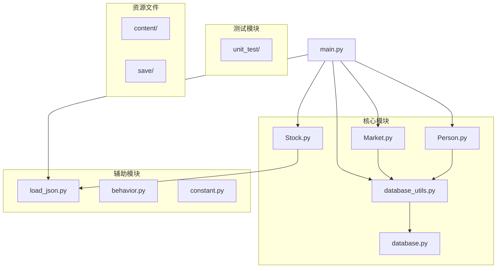
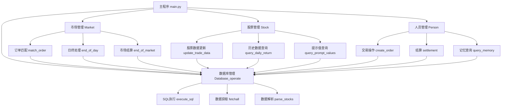
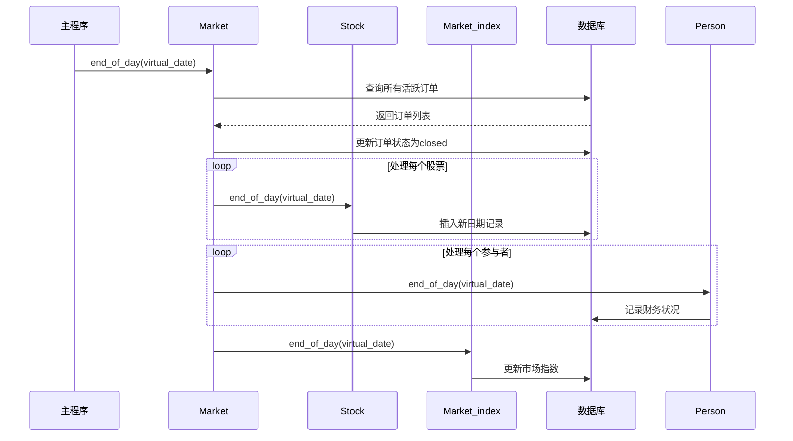
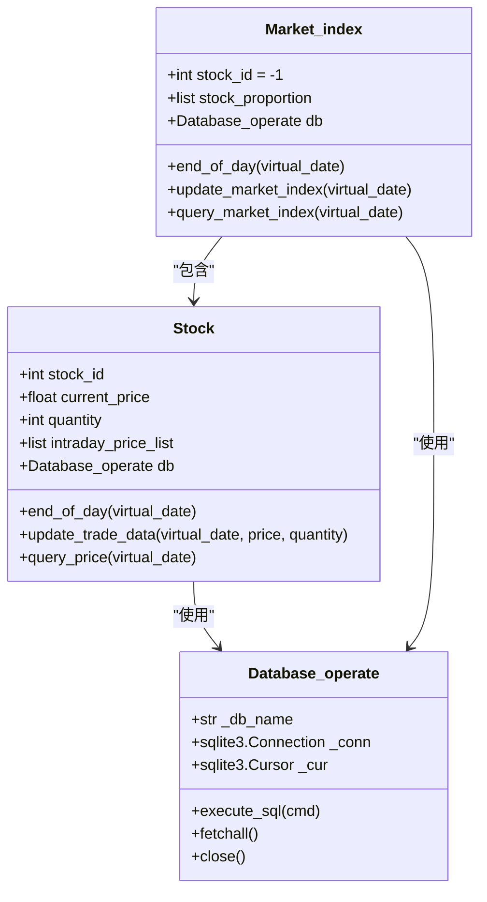
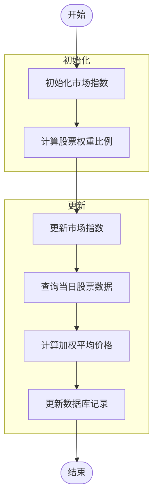
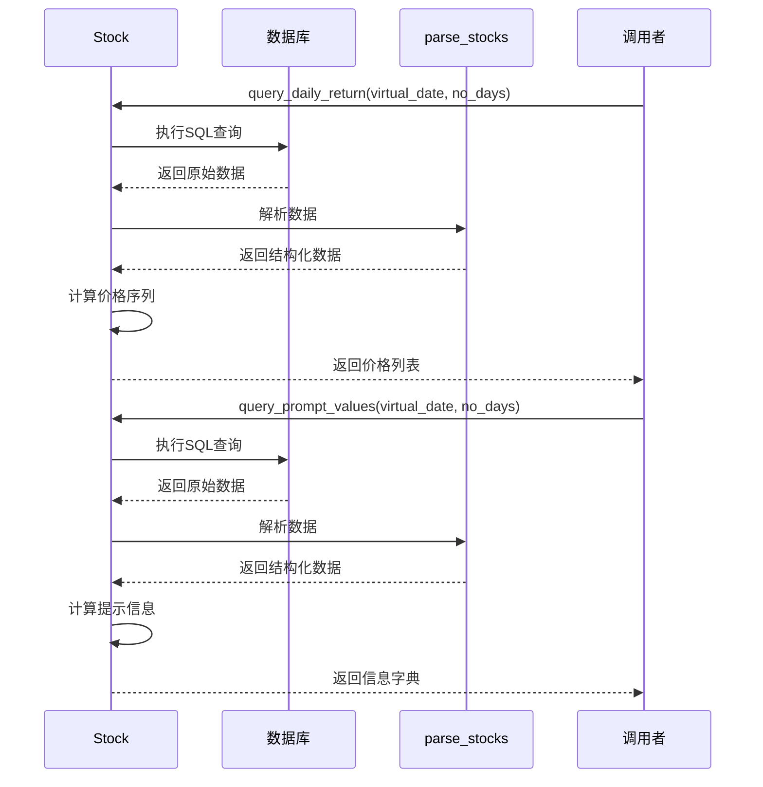
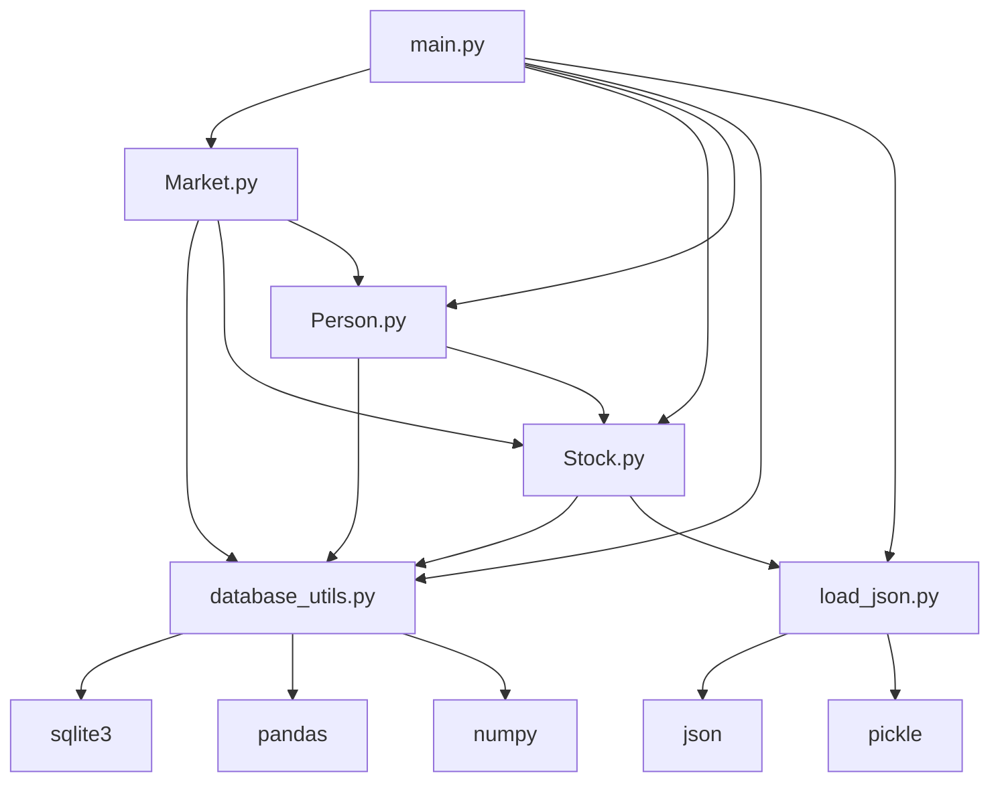

# 历史数据与周期管理

<cite>
**本文档引用的文件**   
- [Market.py](file://Agent-Trading-Arena/Stock_Main/Market.py)
- [database.py](file://Agent-Trading-Arena/Stock_Main/database.py)
- [database_utils.py](file://Agent-Trading-Arena/Stock_Main/database_utils.py)
- [Stock.py](file://Agent-Trading-Arena/Stock_Main/Stock.py)
- [main.py](file://Agent-Trading-Arena/Stock_Main/main.py)
- [load_json.py](file://Agent-Trading-Arena/Stock_Main/load_json.py)
- [Person.py](file://Agent-Trading-Arena/Stock_Main/Person.py)
</cite>

## 目录
1. [引言](#引言)
2. [项目结构](#项目结构)
3. [核心组件](#核心组件)
4. [架构概述](#架构概述)
5. [详细组件分析](#详细组件分析)
6. [依赖分析](#依赖分析)
7. [性能考虑](#性能考虑)
8. [故障排除指南](#故障排除指南)
9. [结论](#结论)

## 引言
本文档详细描述了股票交易模拟系统中的历史数据管理策略，重点分析了虚拟交易日结束时的数据归档机制、市场指数计算方法以及历史数据查询功能。系统通过SQLite数据库持久化存储所有交易数据，并采用虚拟日期机制来模拟连续的交易周期。核心功能包括每日数据归档、市场指数计算、历史价格序列查询等，为交易分析和策略更新提供数据支持。

## 项目结构

**图示来源**
- [main.py](file://Agent-Trading-Arena/Stock_Main/main.py#L1-L151)
- [project_structure](file://project_structure)

## 核心组件

本系统的核心组件包括市场管理（Market）、股票管理（Stock）、人员管理（Person）和数据库操作（Database_operate）。这些组件协同工作，实现了完整的股票交易模拟功能。Market类负责订单匹配和市场结算，Stock类管理单个股票的价格和交易数据，Person类代表交易参与者，Database_operate类提供数据库持久化支持。

**组件来源**
- [Market.py](file://Agent-Trading-Arena/Stock_Main/Market.py#L12-L278)
- [Stock.py](file://Agent-Trading-Arena/Stock_Main/Stock.py#L14-L307)
- [Person.py](file://Agent-Trading-Arena/Stock_Main/Person.py#L1-L628)
- [database_utils.py](file://Agent-Trading-Arena/Stock_Main/database_utils.py#L245-L322)

## 架构概述

**图示来源**
- [main.py](file://Agent-Trading-Arena/Stock_Main/main.py#L98-L150)
- [Market.py](file://Agent-Trading-Arena/Stock_Main/Market.py#L21-L34)
- [Stock.py](file://Agent-Trading-Arena/Stock_Main/Stock.py#L52-L66)
- [database_utils.py](file://Agent-Trading-Arena/Stock_Main/database_utils.py#L302-L317)

## 详细组件分析

### 日终处理机制分析

#### end_of_day方法工作流程

**图示来源**
- [Market.py](file://Agent-Trading-Arena/Stock_Main/Market.py#L21-L28)
- [Stock.py](file://Agent-Trading-Arena/Stock_Main/Stock.py#L52-L66)
- [main.py](file://Agent-Trading-Arena/Stock_Main/main.py#L137-L145)

**组件来源**
- [Market.py](file://Agent-Trading-Arena/Stock_Main/Market.py#L21-L28)
- [Stock.py](file://Agent-Trading-Arena/Stock_Main/Stock.py#L52-L66)
- [main.py](file://Agent-Trading-Arena/Stock_Main/main.py#L137-L145)

### 虚拟日期机制分析

#### virtual_date参数作用

**图示来源**
- [Stock.py](file://Agent-Trading-Arena/Stock_Main/Stock.py#L14-L307)
- [database_utils.py](file://Agent-Trading-Arena/Stock_Main/database_utils.py#L245-L322)

**组件来源**
- [Stock.py](file://Agent-Trading-Arena/Stock_Main/Stock.py#L14-L307)
- [database_utils.py](file://Agent-Trading-Arena/Stock_Main/database_utils.py#L245-L322)

### 市场指数计算分析

#### Market_index类工作流程

**图示来源**
- [Stock.py](file://Agent-Trading-Arena/Stock_Main/Stock.py#L212-L277)
- [main.py](file://Agent-Trading-Arena/Stock_Main/main.py#L88-L89)

**组件来源**
- [Stock.py](file://Agent-Trading-Arena/Stock_Main/Stock.py#L212-L277)
- [main.py](file://Agent-Trading-Arena/Stock_Main/main.py#L88-L89)

### 历史数据查询分析

#### query_daily_return和query_prompt_values方法

**图示来源**
- [Stock.py](file://Agent-Trading-Arena/Stock_Main/Stock.py#L140-L209)
- [database_utils.py](file://Agent-Trading-Arena/Stock_Main/database_utils.py#L52-L70)

**组件来源**
- [Stock.py](file://Agent-Trading-Arena/Stock_Main/Stock.py#L140-L209)
- [database_utils.py](file://Agent-Trading-Arena/Stock_Main/database_utils.py#L52-L70)

## 依赖分析

**图示来源**
- [main.py](file://Agent-Trading-Arena/Stock_Main/main.py#L9-L14)
- [Stock.py](file://Agent-Trading-Arena/Stock_Main/Stock.py#L3-L10)
- [database_utils.py](file://Agent-Trading-Arena/Stock_Main/database_utils.py#L1-L8)
- [load_json.py](file://Agent-Trading-Arena/Stock_Main/load_json.py#L1-L6)

**组件来源**
- [main.py](file://Agent-Trading-Arena/Stock_Main/main.py#L9-L14)
- [Stock.py](file://Agent-Trading-Arena/Stock_Main/Stock.py#L3-L10)
- [database_utils.py](file://Agent-Trading-Arena/Stock_Main/database_utils.py#L1-L8)
- [load_json.py](file://Agent-Trading-Arena/Stock_Main/load_json.py#L1-L6)

## 性能考虑
系统在处理历史数据时采用了多项优化策略。首先，使用SQLite作为轻量级数据库，避免了复杂的数据库配置和维护。其次，通过虚拟日期机制减少了实际时间的依赖，提高了模拟效率。再者，数据查询采用了参数化SQL语句，防止了SQL注入并提高了查询效率。最后，数据解析函数（如parse_stocks）将原始数据库结果转换为结构化的Python字典列表，便于上层逻辑使用。

## 故障排除指南
当遇到历史数据管理相关问题时，可以按照以下步骤进行排查：
1. 检查数据库文件是否存在且可访问
2. 验证virtual_date参数是否正确传递
3. 确认SQL查询语句是否正确构建
4. 检查数据解析函数是否正确处理空结果
5. 验证市场指数计算的权重比例是否正确
6. 确保日终处理流程完整执行

**组件来源**
- [database_utils.py](file://Agent-Trading-Arena/Stock_Main/database_utils.py#L302-L317)
- [Stock.py](file://Agent-Trading-Arena/Stock_Main/Stock.py#L114-L126)
- [Market.py](file://Agent-Trading-Arena/Stock_Main/Market.py#L21-L28)

## 结论
本文档详细分析了股票交易模拟系统的历史数据管理策略。系统通过精心设计的数据库模式和虚拟日期机制，实现了高效的交易数据持久化和周期管理。end_of_day方法确保了每个交易日结束时的数据完整性和一致性，为新交易日做好准备。Market_index类利用历史数据计算市场指数，反映了整体市场趋势。query_daily_return和query_prompt_values等方法提供了灵活的历史数据查询功能，支持交易分析和策略更新。parse_stocks等解析函数将原始数据库结果转换为结构化数据，简化了上层逻辑的开发。整体架构清晰，组件职责明确，为构建复杂的交易模拟系统提供了坚实的基础。