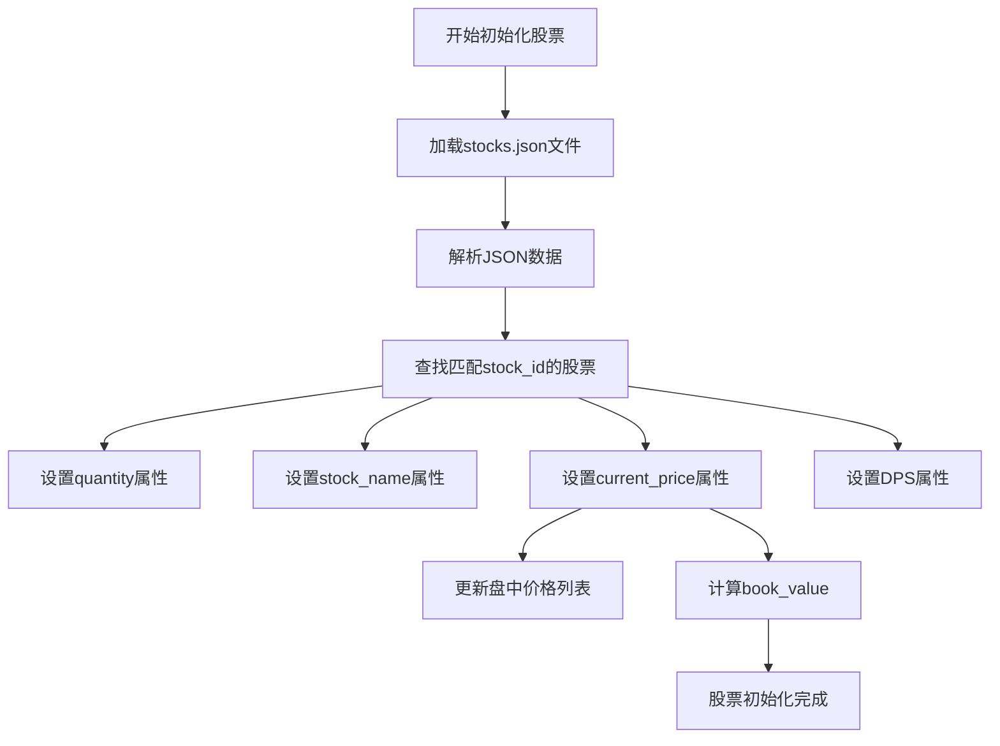
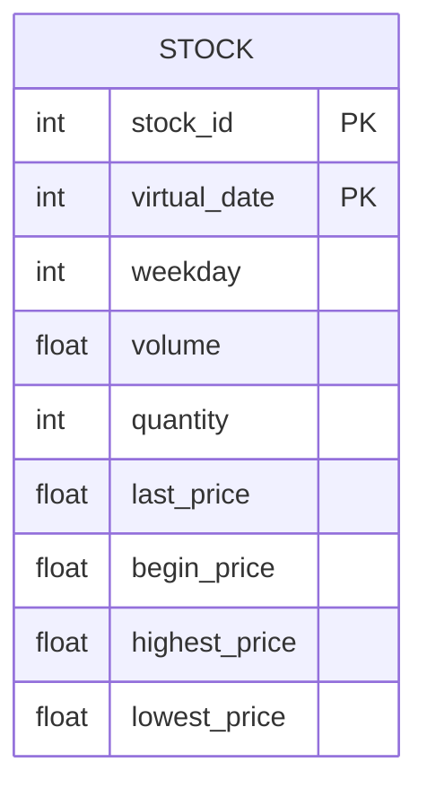
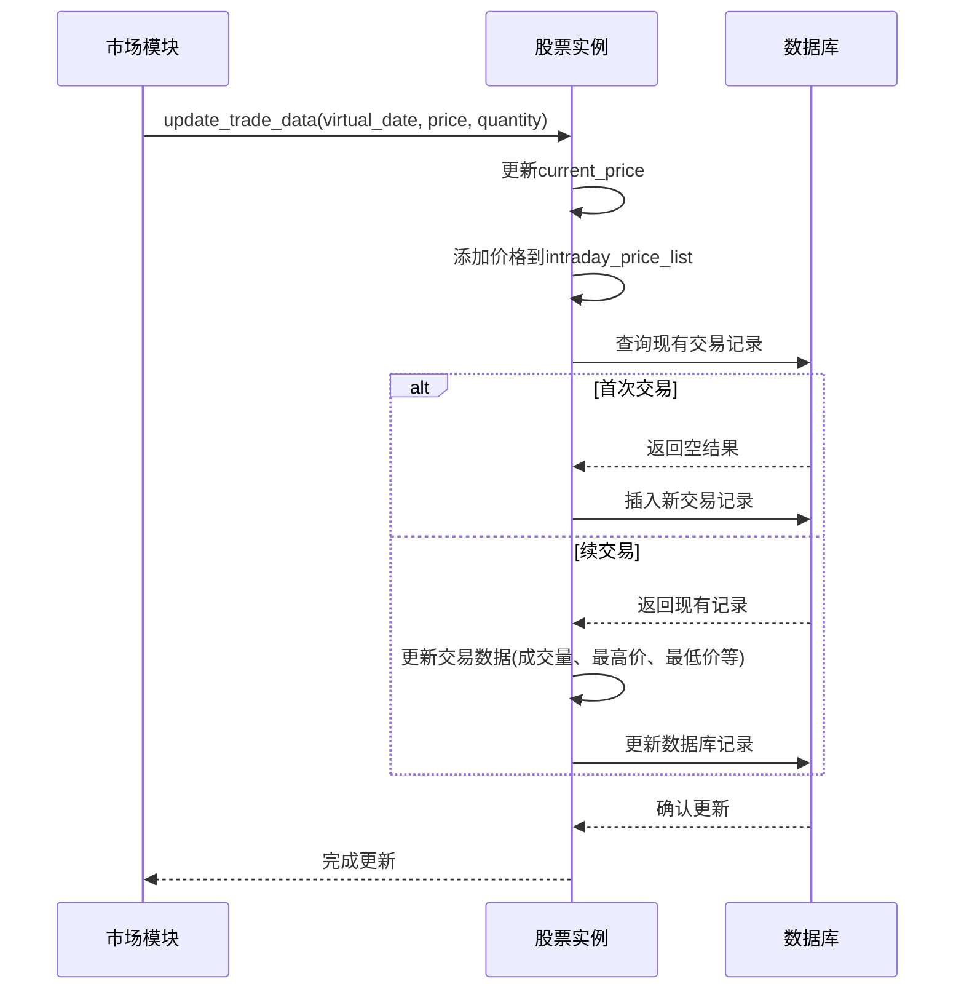

# 股票属性与字段

<cite>
**本文档引用的文件**   
- [Stock.py](file://Agent-Trading-Arena/Stock_Main/Stock.py)
- [database_utils.py](file://Agent-Trading-Arena/Stock_Main/database_utils.py)
- [stocks.json](file://Agent-Trading-Arena/Stock_Main/save/init/stocks.json)
- [load_json.py](file://Agent-Trading-Arena/Stock_Main/load_json.py)
</cite>

## 目录
1. [Stock类核心属性说明](#stock类核心属性说明)
2. [属性业务含义与初始化流程](#属性业务含义与初始化流程)
3. [数据库表结构与字段映射关系](#数据库表结构与字段映射关系)
4. [JSON配置文件示例与数据组织](#json配置文件示例与数据组织)
5. [模拟运行期间属性动态变化过程](#模拟运行期间属性动态变化过程)

## Stock类核心属性说明

Stock类是股票交易模拟系统中的核心数据模型，封装了股票的各项关键属性。这些属性在`__init__`方法中被初始化，并通过`initialize_stock`方法从外部JSON配置文件加载具体值。

**Section sources**
- [Stock.py](file://Agent-Trading-Arena/Stock_Main/Stock.py#L16-L23)

## 属性业务含义与初始化流程

Stock类的每个属性都具有明确的金融业务含义：

- **stock_id**: 股票的唯一标识符，用于区分不同的股票
- **stock_name**: 股票的名称，便于人类识别和引用
- **current_price**: 当前市场价格，反映股票的实时价值
- **DPS (Dividend Per Share)**: 每股股息，表示每股股票可获得的分红金额
- **quantity**: 流通量，表示市场上可交易的股票总数
- **book_value**: 账面价值，等于当前价格乘以流通量，代表股票的总市值

这些属性通过`initialize_stock`方法从JSON文件初始化。该方法调用`load_stocks`函数读取配置文件，根据stock_id匹配对应的股票数据，并将JSON中的值赋给相应的属性。



**Diagram sources**
- [Stock.py](file://Agent-Trading-Arena/Stock_Main/Stock.py#L28-L37)

**Section sources**
- [Stock.py](file://Agent-Trading-Arena/Stock_Main/Stock.py#L28-L37)
- [load_json.py](file://Agent-Trading-Arena/Stock_Main/load_json.py#L17-L22)

## 数据库表结构与字段映射关系

股票属性与数据库中的stock表存在明确的映射关系。通过分析`database_utils.py`中的表创建语句和`parse_stocks`函数，可以确定以下映射：



具体映射关系如下：

- **stock_id**: 直接对应数据库的stock_id字段，作为主键之一
- **current_price**: 对应数据库的last_price字段，表示当日最新成交价
- **quantity**: 对应数据库的quantity字段，记录当日累计成交量
- **book_value**: 虽然不是直接存储的字段，但可以通过last_price × quantity计算得出
- **DPS**: 作为静态属性存储在JSON配置中，不直接写入stock表

**Diagram sources**
- [database_utils.py](file://Agent-Trading-Arena/Stock_Main/database_utils.py#L266-L269)
- [database_utils.py](file://Agent-Trading-Arena/Stock_Main/database_utils.py#L52-L64)

**Section sources**
- [database_utils.py](file://Agent-Trading-Arena/Stock_Main/database_utils.py#L266-L269)
- [database_utils.py](file://Agent-Trading-Arena/Stock_Main/database_utils.py#L52-L64)

## JSON配置文件示例与数据组织

初始股票数据以JSON格式组织，存储在`stocks.json`文件中。以下是文件的示例片段：

```json
[
  {
    "stock_id": 0,
    "stock_name": "A",
    "DPS": 22,
    "past_stock_last_prices": [454.17, 446.64, 425.54, 423.88, 408.55, 437.53, 439.40, 441.20, 437.80, 445.60],
    "quantity": 300
  },
  {
    "stock_id": 1,
    "stock_name": "B",
    "DPS": 23,
    "past_stock_last_prices": [354.17, 426.64, 411.54, 436.38, 444.51, 453.11, 468.12, 470.30, 460.75, 465.80],
    "quantity": 500
  }
]
```

该文件组织方式具有以下特点：
- 使用数组结构存储多只股票
- 每只股票包含完整的属性信息
- `past_stock_last_prices`数组存储历史价格，用于初始化current_price
- 所有数值类型的数据都以原生JSON格式存储

**Section sources**
- [stocks.json](file://Agent-Trading-Arena/Stock_Main/save/init/stocks.json)

## 模拟运行期间属性动态变化过程

在模拟运行期间，Stock类的属性会随着交易活动而动态变化：



关键动态变化包括：
- `current_price`会根据最新成交价实时更新
- `intraday_price_list`会持续添加新的价格点
- `book_value`会随着current_price的变化而重新计算
- 数据库中的相关字段（如last_price、volume、quantity等）会同步更新

这种设计确保了股票状态的实时性和一致性，为交易决策提供了准确的数据支持。

**Diagram sources**
- [Stock.py](file://Agent-Trading-Arena/Stock_Main/Stock.py#L67-L112)

**Section sources**
- [Stock.py](file://Agent-Trading-Arena/Stock_Main/Stock.py#L67-L112)