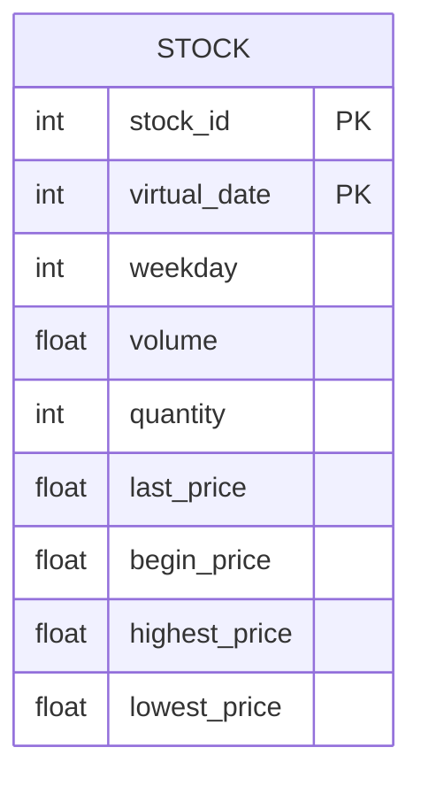
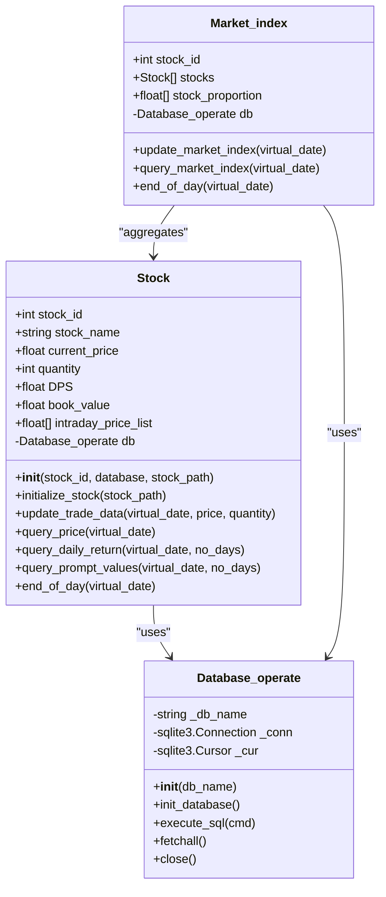

# 股票数据模型

<cite>
**本文档引用的文件**
- [Stock.py](file://Agent-Trading-Arena/Stock_Main/Stock.py)
- [database_utils.py](file://Agent-Trading-Arena/Stock_Main/database_utils.py)
- [stocks.json](file://Agent-Trading-Arena/Stock_Main/save/init/stocks.json)
- [test_stock.py](file://Agent-Trading-Arena/Stock_Main/unit_test/test_stock.py)
</cite>

## 目录
1. [引言](#引言)
2. [核心属性与字段说明](#核心属性与字段说明)
3. [内部数据结构与计算逻辑](#内部数据结构与计算逻辑)
4. [数据库映射关系](#数据库映射关系)
5. [关键方法解析](#关键方法解析)
6. [JSON数据示例](#json数据示例)
7. [类图与架构](#类图与架构)

## 引言
本文档详细说明了股票数据模型的设计与实现，重点分析`Stock`类的属性、方法及其与数据库的交互机制。该模型用于模拟股票市场中的价格动态、交易行为和历史数据维护，支持多日交易模拟和实时价格更新。

## 核心属性与字段说明
`Stock`类封装了股票的核心市场数据，各属性含义如下：

- **stock_id**: 股票唯一标识符，整数类型，用于区分不同股票
- **stock_name**: 股票名称，字符串类型，如"A"、"B"等
- **current_price**: 当前价格，浮点数，表示最新成交价
- **quantity**: 股票总发行量，整数，影响价格波动计算
- **DPS**: 每股股息（Dividend Per Share），浮点数，表示每股分红金额
- **book_value**: 账面价值，当前价格与数量的乘积
- **intraday_price_list**: 盘中价格列表，记录当日所有价格变动

这些属性在初始化时从`stocks.json`配置文件加载，并通过交易活动动态更新。

**Section sources**
- [Stock.py](file://Agent-Trading-Arena/Stock_Main/Stock.py#L14-L25)
- [stocks.json](file://Agent-Trading-Arena/Stock_Main/save/init/stocks.json#L1-L31)

## 内部数据结构与计算逻辑
模型使用特定数据结构维护价格动态和历史信息：

- **intraday_price_list**: 列表结构，存储当日所有价格点，用于计算盘中均价、最高/最低价等指标
- **daily_return**: 通过`query_daily_return`方法计算过去N日的收益率序列，反映价格趋势
- **price history**: 历史价格以OHLCV（开盘价、最高价、最低价、收盘价、成交量）格式存储在数据库中

盘中价格变化通过`update_trade_data`方法实时更新，每次交易都会修改当前价格并记录到盘中价格列表。

**Section sources**
- [Stock.py](file://Agent-Trading-Arena/Stock_Main/Stock.py#L23-L24)
- [Stock.py](file://Agent-Trading-Arena/Stock_Main/Stock.py#L140-L170)

## 数据库映射关系
`Stock`类与SQLite数据库中的`stock`表存在直接映射关系，具体字段对应如下：

| 对象属性 | 数据库字段 | 数据类型 | 说明 |
|---------|----------|--------|------|
| stock_id | stock_id | Integer | 股票ID |
| virtual_date | virtual_date | Integer | 虚拟交易日期 |
| weekday | weekday | Integer | 星期几 |
| volume | volume | Numeric | 成交额 |
| quantity | quantity | Integer | 成交量 |
| current_price | last_price | Numeric | 最新价 |
| begin_price | begin_price | Numeric | 开盘价 |
| highest_price | highest_price | Numeric | 最高价 |
| lowest_price | lowest_price | Numeric | 最低价 |

数据库操作通过`Database_operate`类封装，使用`execute_sql`方法执行INSERT和UPDATE语句来维护数据一致性。



**Diagram sources**
- [database_utils.py](file://Agent-Trading-Arena/Stock_Main/database_utils.py#L266-L270)
- [Stock.py](file://Agent-Trading-Arena/Stock_Main/Stock.py#L39-L49)

## 关键方法解析
### update_trade_data 方法
该方法处理交易数据更新，核心逻辑包括：
1. 查询当日股票状态
2. 若为新日期则插入新记录
3. 若为当日交易则更新最高价、最低价、成交量等字段
4. 维护盘中价格列表

此方法确保价格变动的原子性和数据完整性。

### query_daily_return 方法
计算过去N日的收益率，用于趋势分析：
1. 查询指定日期范围的历史数据
2. 计算每日收益率：(当日收盘价 - 前日收盘价) / 前日收盘价
3. 返回格式化后的价格序列和收益率序列

该方法为投资决策提供历史数据支持。

**Section sources**
- [Stock.py](file://Agent-Trading-Arena/Stock_Main/Stock.py#L67-L112)
- [Stock.py](file://Agent-Trading-Arena/Stock_Main/Stock.py#L140-L170)

## JSON数据示例
以下是`stocks.json`中的股票数据示例：

```json
[
  {
    "stock_id": 0,
    "stock_name": "A",
    "DPS": 22,
    "past_stock_last_prices": [454.17, 446.64, 425.54, 423.88, 408.55, 437.53, 439.40, 441.20, 437.80, 445.60],
    "quantity": 300
  },
  {
    "stock_id": 1,
    "stock_name": "B",
    "DPS": 23,
    "past_stock_last_prices": [354.17, 426.64, 411.54, 436.38, 444.51, 453.11, 468.12, 470.30, 460.75, 465.80],
    "quantity": 500
  }
]
```

该配置文件定义了股票的初始状态，包括历史价格序列、股息和发行量，用于模拟开始时的市场环境。

**Section sources**
- [stocks.json](file://Agent-Trading-Arena/Stock_Main/save/init/stocks.json#L1-L31)
- [Stock.py](file://Agent-Trading-Arena/Stock_Main/Stock.py#L28-L38)

## 类图与架构


**Diagram sources**
- [Stock.py](file://Agent-Trading-Arena/Stock_Main/Stock.py#L14-L219)
- [database_utils.py](file://Agent-Trading-Arena/Stock_Main/database_utils.py#L245-L322)