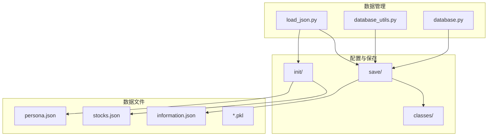
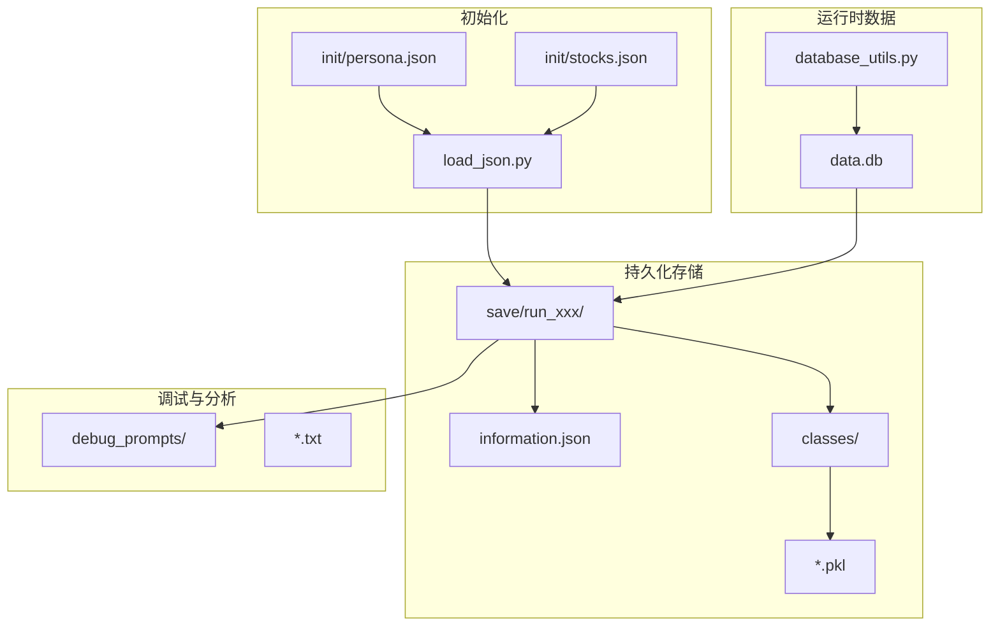
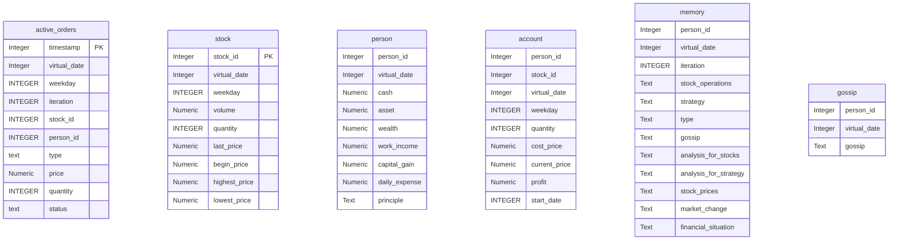
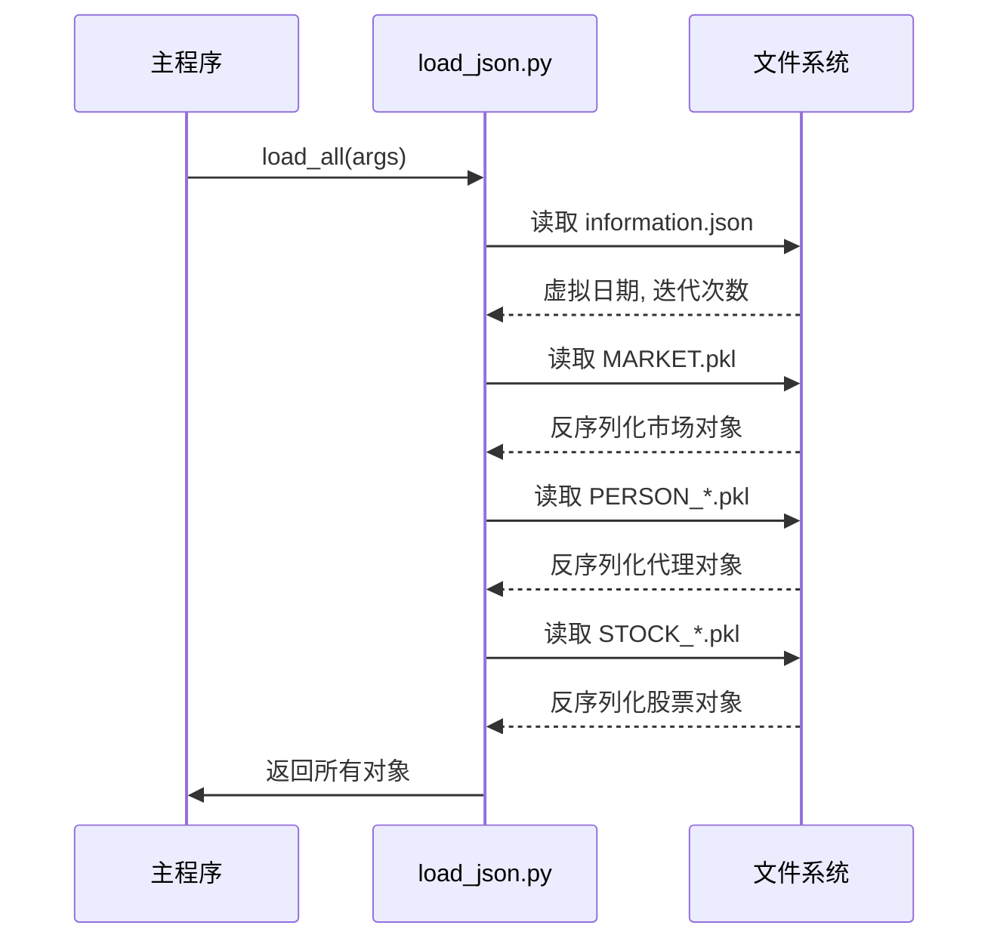
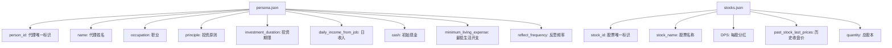
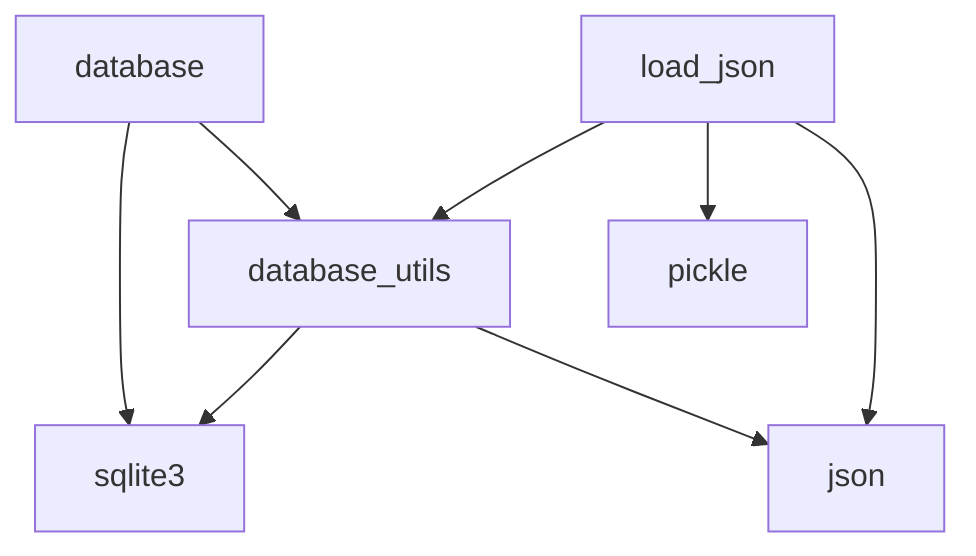

# 数据管理与持久化

<cite>
**本文档引用的文件**   
- [database.py](file://Agent-Trading-Arena/Stock_Main/database.py)
- [database_utils.py](file://Agent-Trading-Arena/Stock_Main/database_utils.py)
- [load_json.py](file://Agent-Trading-Arena/Stock_Main/load_json.py)
- [persona.json](file://Agent-Trading-Arena/Stock_Main/save/init/persona.json)
- [stocks.json](file://Agent-Trading-Arena/Stock_Main/save/init/stocks.json)
- [information.json](file://Agent-Trading-Arena/Stock_Main/save/sim_test01/information.json)
</cite>

## 目录
1. [简介](#简介)
2. [项目结构](#项目结构)
3. [核心组件](#核心组件)
4. [架构概述](#架构概述)
5. [详细组件分析](#详细组件分析)
6. [依赖分析](#依赖分析)
7. [性能考虑](#性能考虑)
8. [故障排除指南](#故障排除指南)
9. [结论](#结论)

## 简介
本项目采用混合持久化策略，结合SQLite数据库与JSON文件存储，实现交易代理系统的状态管理。系统通过`database.py`和`database_utils.py`管理运行时操作数据，使用`load_json.py`加载初始配置，并将模拟状态序列化到`save/`目录下的独立运行子目录中。该设计支持模拟的保存、恢复、调试和分析功能。

## 项目结构

**图示来源**
- [database.py](file://Agent-Trading-Arena/Stock_Main/database.py#L1-L133)
- [database_utils.py](file://Agent-Trading-Arena/Stock_Main/database_utils.py#L1-L322)
- [load_json.py](file://Agent-Trading-Arena/Stock_Main/load_json.py#L1-L134)

**本节来源**
- [database.py](file://Agent-Trading-Arena/Stock_Main/database.py#L1-L133)
- [database_utils.py](file://Agent-Trading-Arena/Stock_Main/database_utils.py#L1-L322)
- [load_json.py](file://Agent-Trading-Arena/Stock_Main/load_json.py#L1-L134)

## 核心组件

系统通过`database.py`和`database_utils.py`实现SQLite数据库操作，`load_json.py`负责JSON配置的加载与对象序列化。`database_utils.py`定义了主要的数据库模式，包括`active_orders`、`stock`、`person`、`account`、`memory`和`gossip`等表，用于持久化交易、账户和代理状态。

**本节来源**
- [database.py](file://Agent-Trading-Arena/Stock_Main/database.py#L1-L133)
- [database_utils.py](file://Agent-Trading-Arena/Stock_Main/database_utils.py#L1-L322)
- [load_json.py](file://Agent-Trading-Arena/Stock_Main/load_json.py#L1-L134)

## 架构概述

**图示来源**
- [database_utils.py](file://Agent-Trading-Arena/Stock_Main/database_utils.py#L245-L322)
- [load_json.py](file://Agent-Trading-Arena/Stock_Main/load_json.py#L25-L77)
- [save/](file://Agent-Trading-Arena/Stock_Main/save/)

## 详细组件分析

### 数据库管理分析

系统使用SQLite数据库存储结构化运行时数据。`database_utils.py`中的`Database_operate`类负责初始化数据库并创建多个表。

**图示来源**
- [database_utils.py](file://Agent-Trading-Arena/Stock_Main/database_utils.py#L253-L300)

**本节来源**
- [database_utils.py](file://Agent-Trading-Arena/Stock_Main/database_utils.py#L1-L322)

### JSON配置加载分析

`load_json.py`模块负责加载初始配置和序列化/反序列化运行时对象。

**图示来源**
- [load_json.py](file://Agent-Trading-Arena/Stock_Main/load_json.py#L81-L122)

**本节来源**
- [load_json.py](file://Agent-Trading-Arena/Stock_Main/load_json.py#L1-L134)

### 初始配置文件分析

`init/`目录包含系统启动所需的初始配置文件。

**图示来源**
- [init/persona.json](file://Agent-Trading-Arena/Stock_Main/save/init/persona.json)
- [init/stocks.json](file://Agent-Trading-Arena/Stock_Main/save/init/stocks.json)

**本节来源**
- [init/persona.json](file://Agent-Trading-Arena/Stock_Main/save/init/persona.json)
- [init/stocks.json](file://Agent-Trading-Arena/Stock_Main/save/init/stocks.json)

## 依赖分析

**图示来源**
- [load_json.py](file://Agent-Trading-Arena/Stock_Main/load_json.py#L6)
- [database_utils.py](file://Agent-Trading-Arena/Stock_Main/database_utils.py#L1)
- [database.py](file://Agent-Trading-Arena/Stock_Main/database.py#L1)

**本节来源**
- [load_json.py](file://Agent-Trading-Arena/Stock_Main/load_json.py#L1-L134)
- [database_utils.py](file://Agent-Trading-Arena/Stock_Main/database_utils.py#L1-L322)
- [database.py](file://Agent-Trading-Arena/Stock_Main/database.py#L1-L133)

## 性能考虑
系统采用混合持久化策略，在性能和可调试性之间取得平衡。SQLite数据库提供高效的结构化数据查询，而Pickle序列化确保复杂对象状态的完整保存。JSON文件用于轻量级配置，便于人工编辑和版本控制。对于大规模模拟，建议定期备份`save/`目录以防止数据丢失。

## 故障排除指南

当遇到数据管理问题时，请检查以下方面：
1. 确认`save/`目录有写入权限
2. 验证`init/`目录中的JSON文件格式正确
3. 检查`data.db`数据库文件是否被正确创建
4. 确保`classes/`目录存在且可写
5. 查看`debug_prompts/`中的日志文件以获取调试信息

**本节来源**
- [save/](file://Agent-Trading-Arena/Stock_Main/save/)
- [init/](file://Agent-Trading-Arena/Stock_Main/save/init/)

## 结论
本系统实现了完整的数据管理与持久化机制，支持模拟的保存、恢复和分析。通过SQLite、JSON和Pickle的组合使用，系统在数据完整性、查询效率和可调试性方面达到了良好平衡。建议定期备份`save/`目录中的运行数据，并利用`debug_prompts/`中的日志进行问题诊断。