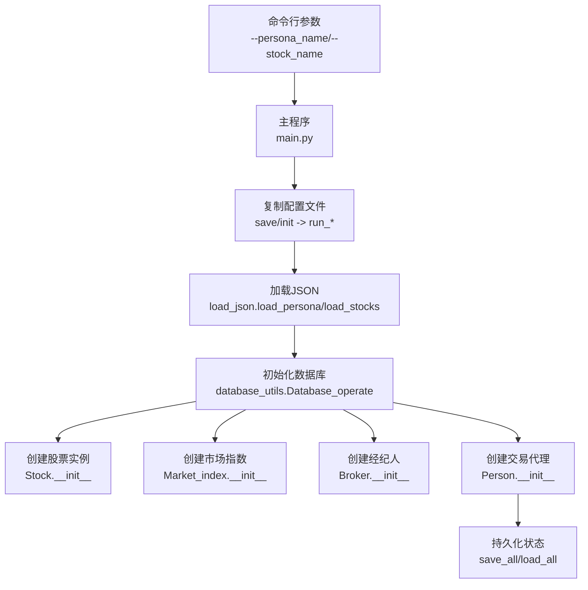
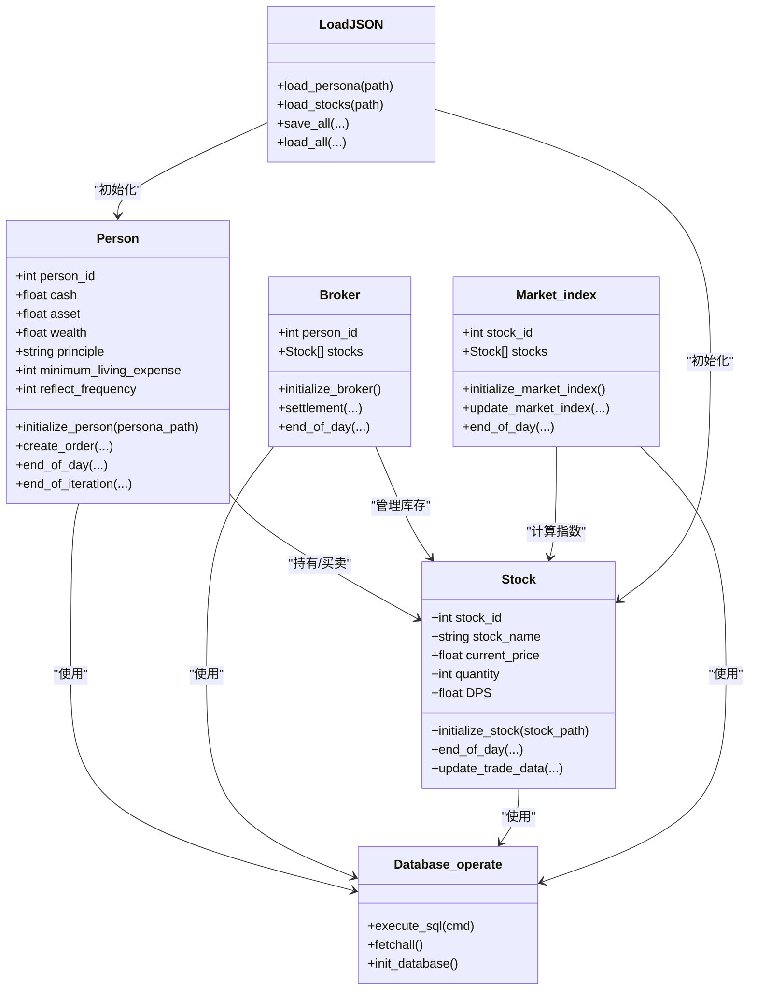
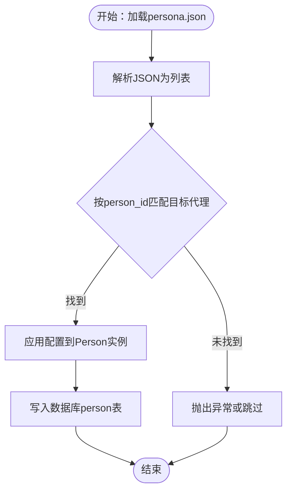
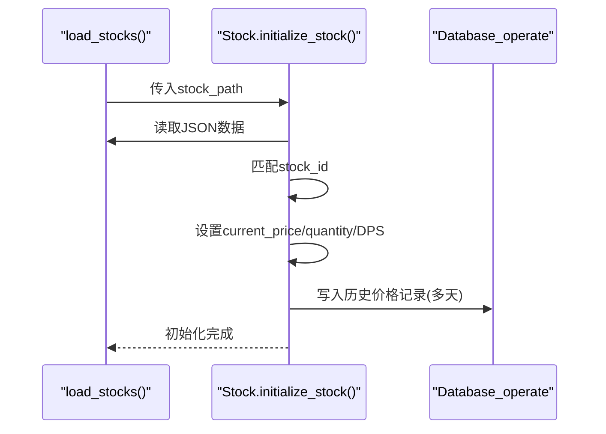
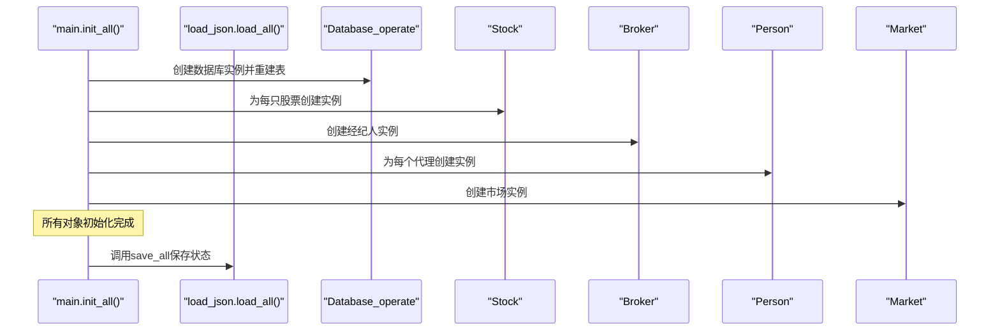
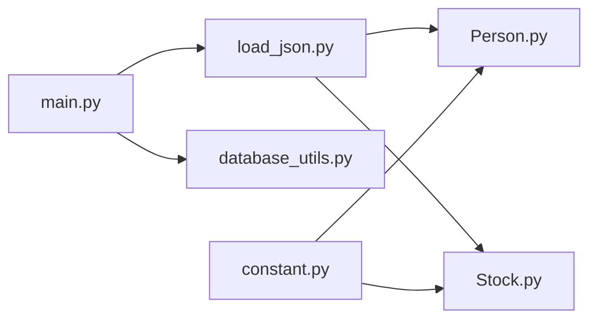

# 配置文件结构

<cite>
**本文档引用的文件**
- [persona.json](file://Agent-Trading-Arena/Stock_Main/save/init/persona.json)
- [stocks.json](file://Agent-Trading-Arena/Stock_Main/save/init/stocks.json)
- [load_json.py](file://Agent-Trading-Arena/Stock_Main/load_json.py)
- [Person.py](file://Agent-Trading-Arena/Stock_Main/Person.py)
- [Stock.py](file://Agent-Trading-Arena/Stock_Main/Stock.py)
- [main.py](file://Agent-Trading-Arena/Stock_Main/main.py)
- [database_utils.py](file://Agent-Trading-Arena/Stock_Main/database_utils.py)
- [constant.py](file://Agent-Trading-Arena/Stock_Main/constant.py)
- [test_load_json.py](file://Agent-Trading-Arena/Stock_Main/unit_test/test_load_json.py)
</cite>

## 目录
1. [简介](#简介)
2. [项目结构概览](#项目结构概览)
3. [核心组件](#核心组件)
4. [架构总览](#架构总览)
5. [详细组件分析](#详细组件分析)
6. [依赖关系分析](#依赖关系分析)
7. [性能考虑](#性能考虑)
8. [故障排除指南](#故障排除指南)
9. [结论](#结论)

## 简介
本文件系统性解析Agent-Trading-Arena项目中的配置文件结构，重点覆盖初始配置文件persona.json和stocks.json的格式规范与业务含义，并结合load_json.py中的加载函数，阐述配置文件如何被解析并初始化为运行时对象，以及如何支持自定义模拟场景的扩展。同时，详细说明persona.json中每个交易代理的person_id、职业、投资原则、现金流等字段的作用及其对行为决策的影响，解释stocks.json中股票ID、名称、每股股息(DPS)、历史价格序列和初始数量的配置逻辑。

## 项目结构概览
项目采用模块化设计，配置文件位于保存目录下的init模板中，通过主程序复制到每次运行的独立保存目录中。核心流程如下：
- 主程序读取命令行参数，确定保存路径和文件名
- 复制init模板中的persona.json和stocks.json到运行目录
- 加载JSON配置，初始化数据库表结构
- 基于配置创建股票、市场指数、经纪人和交易代理实例
- 运行模拟迭代，按日结算并持久化状态

**图表来源**
- [main.py](file://Agent-Trading-Arena/Stock_Main/main.py#L17-L63)
- [load_json.py](file://Agent-Trading-Arena/Stock_Main/load_json.py#L81-L122)
- [database_utils.py](file://Agent-Trading-Arena/Stock_Main/database_utils.py#L245-L301)

**章节来源**
- [main.py](file://Agent-Trading-Arena/Stock_Main/main.py#L17-L63)

## 核心组件
本节概述配置文件在系统中的作用及与核心类的关系：
- 配置文件提供初始状态：交易代理的个人属性、资金状况、投资原则；股票的基本信息、历史价格序列和初始发行数量。
- 加载器负责将JSON解析为字典列表，供其他模块使用。
- 初始化流程根据配置创建运行时对象（股票、市场指数、经纪人、交易代理），并写入数据库表结构。
- 持久化机制支持断点续跑：将对象序列化为pickle文件，配合JSON记录当前日期和迭代轮次。

**章节来源**
- [load_json.py](file://Agent-Trading-Arena/Stock_Main/load_json.py#L9-L22)
- [database_utils.py](file://Agent-Trading-Arena/Stock_Main/database_utils.py#L245-L301)

## 架构总览
下图展示配置文件在整体架构中的位置与交互关系，以及从JSON到运行时对象的转换过程。

**图表来源**
- [Person.py](file://Agent-Trading-Arena/Stock_Main/Person.py#L143-L200)
- [Stock.py](file://Agent-Trading-Arena/Stock_Main/Stock.py#L14-L51)
- [database_utils.py](file://Agent-Trading-Arena/Stock_Main/database_utils.py#L245-L301)
- [load_json.py](file://Agent-Trading-Arena/Stock_Main/load_json.py#L81-L122)

## 详细组件分析

### persona.json 配置规范与业务含义
persona.json用于定义交易代理的初始属性，每个代理对应一个JSON对象，包含以下字段：

- person_id：整数，唯一标识交易代理。在初始化时，Person类会根据该ID匹配对应的配置项。
- name：字符串，代理名称。
- occupation：字符串，职业描述（影响策略或行为的上下文）。
- principle：字符串，投资原则或策略声明，作为数据库存储的文本字段。
- investment_duration：字符串，投资期限描述（用于记录和展示）。
- daily_income_from_job：字符串，每日工作收入，初始化时转换为浮点数。
- cash：整数，初始现金余额，决定可购买股票的上限。
- minimum_living_expense：整数，最低生活支出，每日结算时用于扣减。
- reflect_frequency：整数，反思频率（影响行为模块的反思触发周期）。

这些字段在Person类的初始化过程中被读取并写入数据库person表，随后在每日结算时根据策略和市场情况动态调整资产与财富。

**图表来源**
- [Person.py](file://Agent-Trading-Arena/Stock_Main/Person.py#L173-L199)
- [load_json.py](file://Agent-Trading-Arena/Stock_Main/load_json.py#L9-L14)

**章节来源**
- [persona.json](file://Agent-Trading-Arena/Stock_Main/save/init/persona.json#L1-L131)
- [Person.py](file://Agent-Trading-Arena/Stock_Main/Person.py#L173-L199)

### stocks.json 配置规范与业务含义
stocks.json用于定义股票市场的基础信息，每个股票对应一个JSON对象，包含以下字段：

- stock_id：整数，股票唯一标识，与Stock类的stock_id一致。
- stock_name：字符串，股票名称（如"A"、"B"等），用于显示和索引。
- DPS：整数，每股年度股息（Dividends Per Share），用于每日结算时的股息收入计算。
- past_stock_last_prices：数组，历史收盘价序列，长度应与内部初始化逻辑兼容。
- quantity：整数，初始发行数量，决定Broker的初始库存和市场总股本。

Stock类在初始化时会读取这些配置，设置当前价格、账面价值、DPS，并将历史价格写入数据库stock表的前若干天记录，以便后续查询和展示。

**图表来源**
- [Stock.py](file://Agent-Trading-Arena/Stock_Main/Stock.py#L28-L51)
- [load_json.py](file://Agent-Trading-Arena/Stock_Main/load_json.py#L17-L22)

**章节来源**
- [stocks.json](file://Agent-Trading-Arena/Stock_Main/save/init/stocks.json#L1-L31)
- [Stock.py](file://Agent-Trading-Arena/Stock_Main/Stock.py#L28-L51)

### 配置文件加载与初始化流程
配置文件的加载与初始化由多个模块协作完成：

- 加载函数：load_json.py提供load_persona和load_stocks两个函数，分别读取persona.json和stocks.json，返回字典列表。
- 初始化流程：main.py的init_all函数在非加载模式下，先创建数据库实例并重建表结构，然后基于配置创建Stock、Market_index、Broker、Person等对象。
- 数据库写入：Person和Stock的初始化方法会将代理和股票的状态写入数据库表，确保后续查询和结算的准确性。
- 持久化与恢复：save_all将对象序列化为pickle文件，配合information.json记录当前虚拟日期和迭代轮次；load_all则反向恢复运行时对象。

**图表来源**
- [main.py](file://Agent-Trading-Arena/Stock_Main/main.py#L66-L96)
- [load_json.py](file://Agent-Trading-Arena/Stock_Main/load_json.py#L45-L77)

**章节来源**
- [main.py](file://Agent-Trading-Arena/Stock_Main/main.py#L66-L96)
- [load_json.py](file://Agent-Trading-Arena/Stock_Main/load_json.py#L45-L77)

### 字段对行为决策的影响
- 投资原则(principle)：存储在数据库person表中，作为行为模块生成提示词和反思内容的依据，影响代理的策略选择和交易行为。
- 现金(cash)与最低生活支出(minimum_living_expense)：直接影响购买力和每日消费预算，决定是否能执行买入操作以及每日结算后的剩余资金。
- 反思频率(reflect_frequency)：控制行为模块中反思环节的触发频率，影响代理对市场变化的总结与策略调整。
- 每日工作收入(daily_income_from_job)：在每日结算时增加现金，提升长期资金积累能力。
- 股票DPS：每日结算时根据持有数量计算并发放股息，增加代理现金，影响总资产与财富的增长。

**章节来源**
- [Person.py](file://Agent-Trading-Arena/Stock_Main/Person.py#L173-L199)
- [Stock.py](file://Agent-Trading-Arena/Stock_Main/Stock.py#L38-L50)

## 依赖关系分析
配置文件与核心模块之间的依赖关系如下：
- load_json.py依赖json标准库，提供配置文件的读取接口。
- Person.py和Stock.py分别在初始化阶段调用load_json的加载函数，读取配置并写入数据库。
- main.py协调配置文件的复制、加载与对象初始化，是配置到运行时对象的桥梁。
- database_utils.py定义数据库表结构与查询解析工具，为配置的持久化提供基础设施。
- constant.py提供股票名称常量，辅助显示与索引。

**图表来源**
- [load_json.py](file://Agent-Trading-Arena/Stock_Main/load_json.py#L1-L7)
- [Person.py](file://Agent-Trading-Arena/Stock_Main/Person.py#L13-L15)
- [Stock.py](file://Agent-Trading-Arena/Stock_Main/Stock.py#L3-L10)
- [main.py](file://Agent-Trading-Arena/Stock_Main/main.py#L1-L14)
- [constant.py](file://Agent-Trading-Arena/Stock_Main/constant.py#L1-L2)

**章节来源**
- [load_json.py](file://Agent-Trading-Arena/Stock_Main/load_json.py#L1-L7)
- [Person.py](file://Agent-Trading-Arena/Stock_Main/Person.py#L13-L15)
- [Stock.py](file://Agent-Trading-Arena/Stock_Main/Stock.py#L3-L10)
- [main.py](file://Agent-Trading-Arena/Stock_Main/main.py#L1-L14)
- [constant.py](file://Agent-Trading-Arena/Stock_Main/constant.py#L1-L2)

## 性能考虑
- JSON解析复杂度：加载persona.json和stocks.json的时间复杂度主要取决于文件大小和条目数量，通常为O(n)，其中n为条目数。
- 数据库写入：初始化时对数据库进行多次插入操作，建议批量写入或事务封装以减少IO开销。
- 对象序列化：save_all使用pickle序列化对象，注意版本兼容性和安全性；load_all反序列化时需确保配置文件与对象结构一致。
- 内存占用：大量代理和股票实例会增加内存占用，可通过分批处理或延迟初始化优化。

[本节为通用性能讨论，不直接分析具体文件]

## 故障排除指南
- 配置文件缺失或路径错误：检查主程序参数中的--persona_name和--stock_name，确认保存目录中存在对应文件。
- JSON格式错误：使用单元测试中的示例格式，确保字段类型正确（如cash、DPS为数值，past_stock_last_prices为数值数组）。
- person_id重复或不存在：确保每个代理的person_id唯一且与Person初始化逻辑匹配。
- stock_id不连续或冲突：stock_id应与Stock类的初始化顺序一致，避免跨股票引用错误。
- 数据库表结构不匹配：若修改配置字段，需同步更新database_utils.py中的表结构定义。

**章节来源**
- [test_load_json.py](file://Agent-Trading-Arena/Stock_Main/unit_test/test_load_json.py#L26-L91)
- [database_utils.py](file://Agent-Trading-Arena/Stock_Main/database_utils.py#L256-L300)

## 结论
配置文件persona.json和stocks.json为Agent-Trading-Arena提供了可定制的初始场景基础。通过load_json.py的加载函数，配置被解析并初始化为运行时对象，进而驱动整个模拟系统的运行。合理设计配置字段能够有效影响代理的行为决策与市场表现。建议在扩展新场景时遵循现有字段规范，保持配置与数据库结构的一致性，并利用持久化机制实现断点续跑与结果复现。