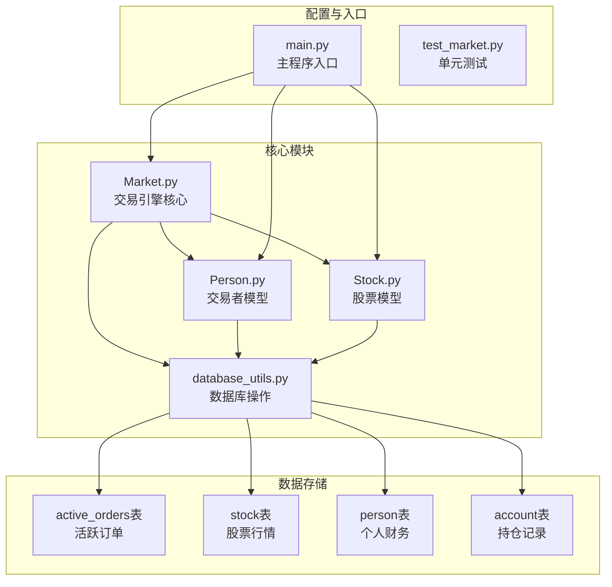
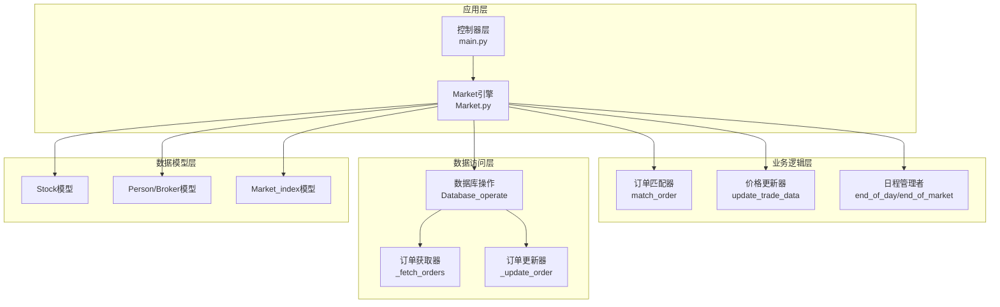
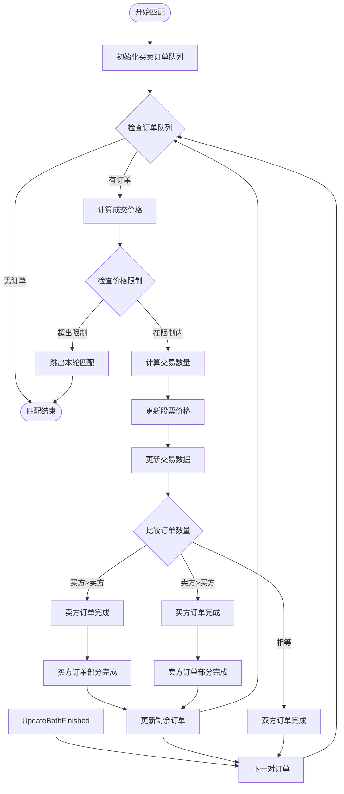
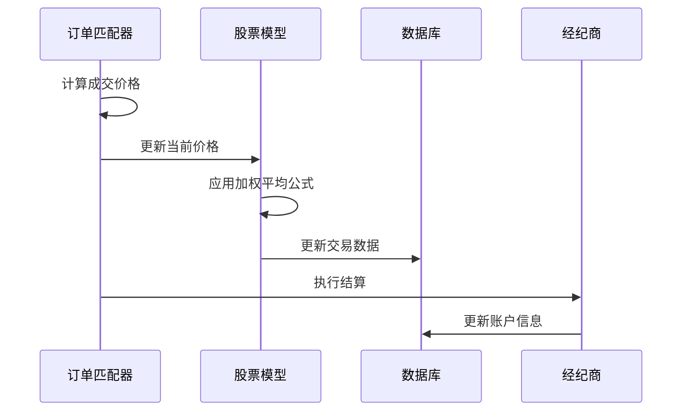
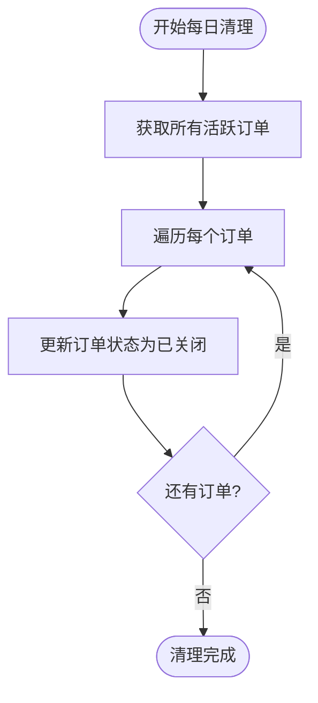
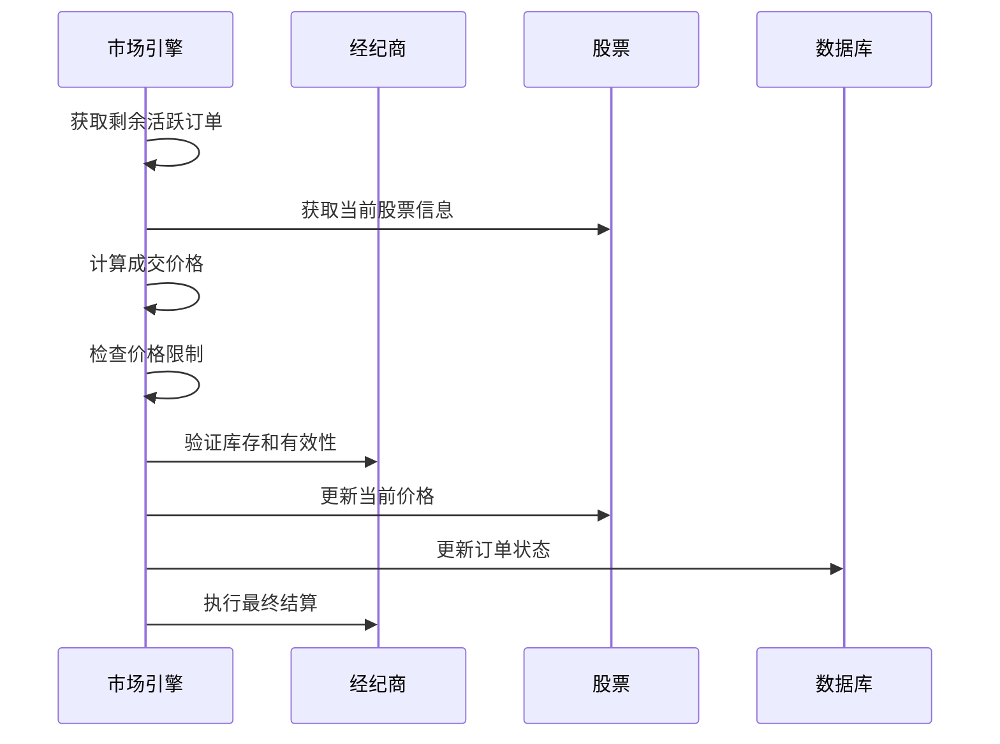
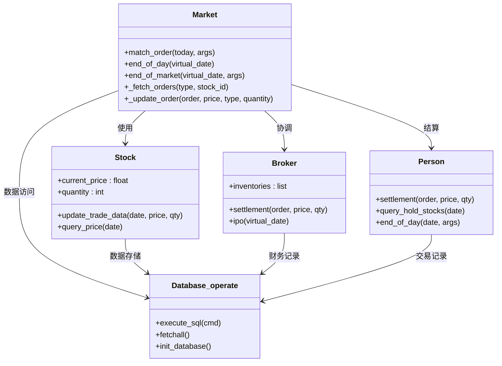
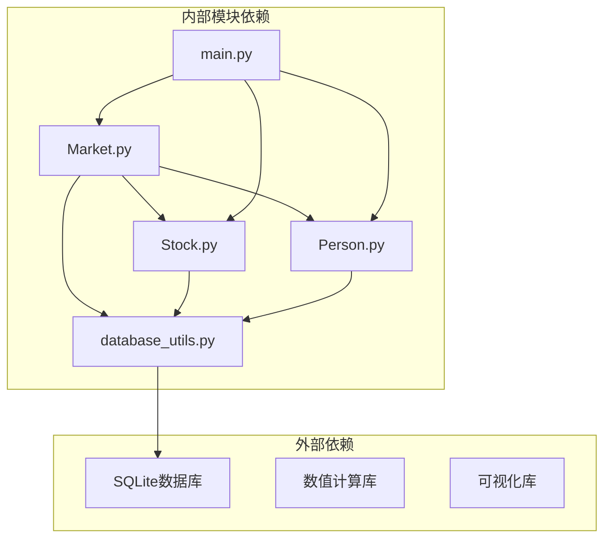

# 市场系统

<cite>
**本文档引用的文件**
- [Market.py](file://Agent-Trading-Arena/Stock_Main/Market.py)
- [database_utils.py](file://Agent-Trading-Arena/Stock_Main/database_utils.py)
- [Stock.py](file://Agent-Trading-Arena/Stock_Main/Stock.py)
- [Person.py](file://Agent-Trading-Arena/Stock_Main/Person.py)
- [main.py](file://Agent-Trading-Arena/Stock_Main/main.py)
- [test_market.py](file://Agent-Trading-Arena/Stock_Main/unit_test/test_market.py)
</cite>

## 目录
1. [简介](#简介)
2. [项目结构](#项目结构)
3. [核心组件](#核心组件)
4. [架构概览](#架构概览)
5. [详细组件分析](#详细组件分析)
6. [依赖关系分析](#依赖关系分析)
7. [性能考虑](#性能考虑)
8. [故障排除指南](#故障排除指南)
9. [结论](#结论)

## 简介

Market系统是Agent-Trading-Arena项目中的核心交易引擎，负责管理股票市场的日常运营。该系统实现了完整的订单匹配算法、价格更新机制和每日市场周期管理功能。Market类作为整个系统的核心，协调着买卖订单的撮合、价格波动控制、未成交订单处理等关键业务逻辑。

## 项目结构

该项目采用模块化设计，主要包含以下核心模块：



**图表来源**
- [Market.py](file://Agent-Trading-Arena/Stock_Main/Market.py#L12-L278)
- [database_utils.py](file://Agent-Trading-Arena/Stock_Main/database_utils.py#L245-L322)

**章节来源**
- [main.py](file://Agent-Trading-Arena/Stock_Main/main.py#L1-L151)

## 核心组件

Market系统由多个相互协作的组件构成，每个组件都有明确的职责分工：

### Market类（核心引擎）
- 负责订单匹配和价格计算
- 管理每日市场周期
- 处理未成交订单清理
- 协调Broker和Person之间的交互

### 数据库层
- 提供统一的数据库访问接口
- 维护活跃订单、股票行情、个人财务等核心数据
- 支持复杂的SQL查询和事务处理

### 模型层
- **Stock模型**：管理单个股票的实时价格、成交量、历史数据
- **Person/Broker模型**：处理交易者的财务结算和持仓管理
- **Market_index模型**：维护市场指数计算

**章节来源**
- [Market.py](file://Agent-Trading-Arena/Stock_Main/Market.py#L12-L278)
- [database_utils.py](file://Agent-Trading-Arena/Stock_Main/database_utils.py#L245-L322)

## 架构概览

Market系统采用分层架构设计，确保了良好的可维护性和扩展性：



**图表来源**
- [main.py](file://Agent-Trading-Arena/Stock_Main/main.py#L99-L146)
- [Market.py](file://Agent-Trading-Arena/Stock_Main/Market.py#L96-L278)

## 详细组件分析

### 订单匹配算法（match_order方法）

Market类的核心功能是实现高效的订单匹配算法，该算法基于价格优先和时间优先的原则：

#### 匹配流程图



**图表来源**
- [Market.py](file://Agent-Trading-Arena/Stock_Main/Market.py#L96-L199)

#### 价格更新机制

系统使用加权平均公式来更新股票价格：

```
新价格 = (成交价 × 成交量 × 波动常数 + 当前价格 × 总量) / (成交量 × 波动常数 + 总量)
```

其中：
- **成交价** = (买方报价 + 卖方报价) / 2
- **波动常数** 由 `Fluctuation_Constant` 参数控制
- **价格限制** 由 `Daily_Price_Limit` 参数控制

#### SQL查询排序规则

系统通过精心设计的SQL查询实现订单排序：

**买单查询**（价格升序，时间升序）
```sql
SELECT * FROM active_orders 
WHERE type='buy' AND stock_id=? AND status='active' 
ORDER BY price ASC, timestamp ASC
```

**卖单查询**（价格降序，时间升序）
```sql
SELECT * FROM (
    SELECT * FROM active_orders 
    WHERE type='sell' AND stock_id=? AND status='active' 
    AND person_id=-1 ORDER BY price DESC, timestamp ASC
) UNION ALL 
SELECT * FROM (
    SELECT * FROM active_orders 
    WHERE type='sell' AND stock_id=? AND status='active' 
    AND person_id>=0 ORDER BY price DESC, timestamp ASC
)
```

**章节来源**
- [Market.py](file://Agent-Trading-Arena/Stock_Main/Market.py#L96-L199)
- [Market.py](file://Agent-Trading-Arena/Stock_Main/Market.py#L202-L228)

### 价格更新机制详解

#### 加权平均公式实现

系统采用先进的加权平均算法来平滑价格波动：



**图表来源**
- [Market.py](file://Agent-Trading-Arena/Stock_Main/Market.py#L124-L132)
- [Stock.py](file://Agent-Trading-Arena/Stock_Main/Stock.py#L67-L112)

#### 价格波动控制

系统通过 `Daily_Price_Limit` 参数防止过度的价格波动：

- **限制机制**：当成交价格与当前价格的百分比变化超过限制时，跳过该笔交易
- **默认值**：0.7（70%）
- **保护作用**：防止市场出现极端波动

**章节来源**
- [Market.py](file://Agent-Trading-Arena/Stock_Main/Market.py#L113-L117)
- [Market.py](file://Agent-Trading-Arena/Stock_Main/Market.py#L44-L47)

### 日常市场周期管理

#### end_of_day方法

负责每日收盘时的订单清理工作：



**图表来源**
- [Market.py](file://Agent-Trading-Arena/Stock_Main/Market.py#L21-L29)

#### end_of_market方法

处理市场收盘后的剩余订单，通过经纪商进行最后撮合：



**图表来源**
- [Market.py](file://Agent-Trading-Arena/Stock_Main/Market.py#L30-L95)

#### 辅助方法实现

**_fetch_orders方法**：获取指定类型的订单
- 支持"buy"、"sell"、"all"三种查询模式
- 实现精确的排序规则控制
- 返回预处理的订单数据结构

**_update_order方法**：更新订单状态
- 支持"finished"、"partially fulfilled"、"update"三种状态
- 处理部分成交订单的拆分逻辑
- 触发个人交易者的结算流程

**章节来源**
- [Market.py](file://Agent-Trading-Arena/Stock_Main/Market.py#L202-L265)

### 数据模型关系



**图表来源**
- [Market.py](file://Agent-Trading-Arena/Stock_Main/Market.py#L12-L278)
- [Stock.py](file://Agent-Trading-Arena/Stock_Main/Stock.py#L14-L307)
- [Person.py](file://Agent-Trading-Arena/Stock_Main/Person.py#L18-L629)

**章节来源**
- [Stock.py](file://Agent-Trading-Arena/Stock_Main/Stock.py#L14-L307)
- [Person.py](file://Agent-Trading-Arena/Stock_Main/Person.py#L18-L629)

## 依赖关系分析

Market系统具有清晰的依赖层次结构：



**图表来源**
- [Market.py](file://Agent-Trading-Arena/Stock_Main/Market.py#L1-L10)
- [database_utils.py](file://Agent-Trading-Arena/Stock_Main/database_utils.py#L1-L10)

### 关键依赖关系

1. **Market ↔ Stock**：价格更新和交易数据同步
2. **Market ↔ Broker/Person**：订单执行和财务结算
3. **Database_operate**：统一的数据访问接口
4. **main.py**：系统入口和调度控制

**章节来源**
- [main.py](file://Agent-Trading-Arena/Stock_Main/main.py#L99-L146)

## 性能考虑

### 时间复杂度分析

- **订单匹配**：O(n log n)，其中n为活跃订单数量
- **价格更新**：O(1)，常数时间复杂度
- **数据库操作**：O(m)，m为查询结果数量

### 内存优化策略

1. **延迟加载**：只在需要时加载股票数据
2. **批量操作**：减少数据库往返次数
3. **缓存机制**：缓存常用查询结果

### 并发处理

系统支持多线程环境下的安全操作，通过数据库事务保证数据一致性。

## 故障排除指南

### 常见问题及解决方案

**问题1：订单无法匹配**
- 检查价格限制设置是否过于严格
- 验证买卖订单的报价是否合理
- 确认市场流动性是否充足

**问题2：价格异常波动**
- 调整 `Daily_Price_Limit` 参数
- 检查 `Fluctuation_Constant` 设置
- 监控市场供需平衡

**问题3：数据库连接问题**
- 确认数据库文件权限
- 检查数据库连接字符串
- 验证表结构完整性

**章节来源**
- [test_market.py](file://Agent-Trading-Arena/Stock_Main/unit_test/test_market.py#L113-L145)

## 结论

Market系统是一个功能完整、设计合理的交易引擎，具备以下特点：

1. **高效性**：采用优化的订单匹配算法，支持大规模并发交易
2. **稳定性**：完善的错误处理和数据验证机制
3. **可扩展性**：模块化设计便于功能扩展和维护
4. **准确性**：精确的价格计算和财务结算逻辑

该系统为Agent-Trading-Arena项目提供了坚实的技术基础，能够支持复杂的金融模拟和交易行为研究。