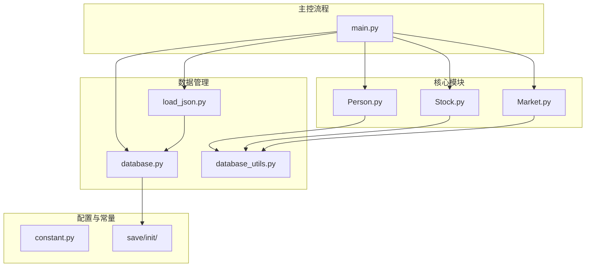
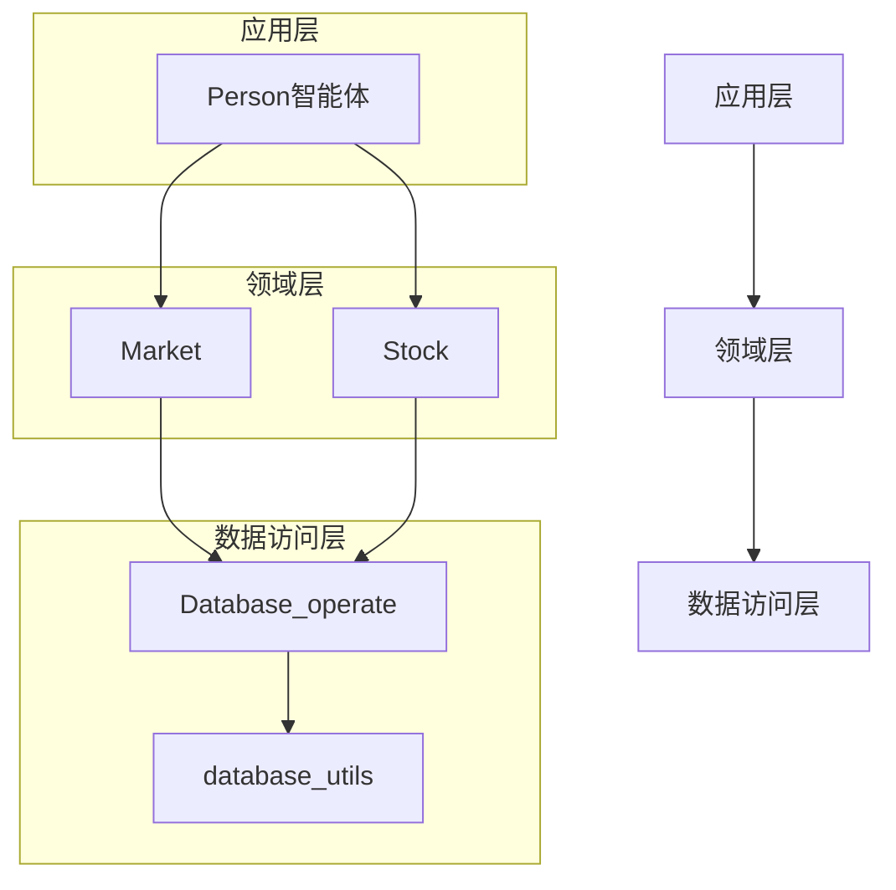
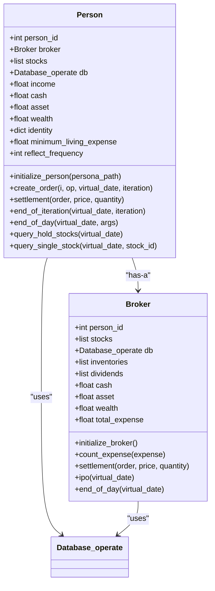
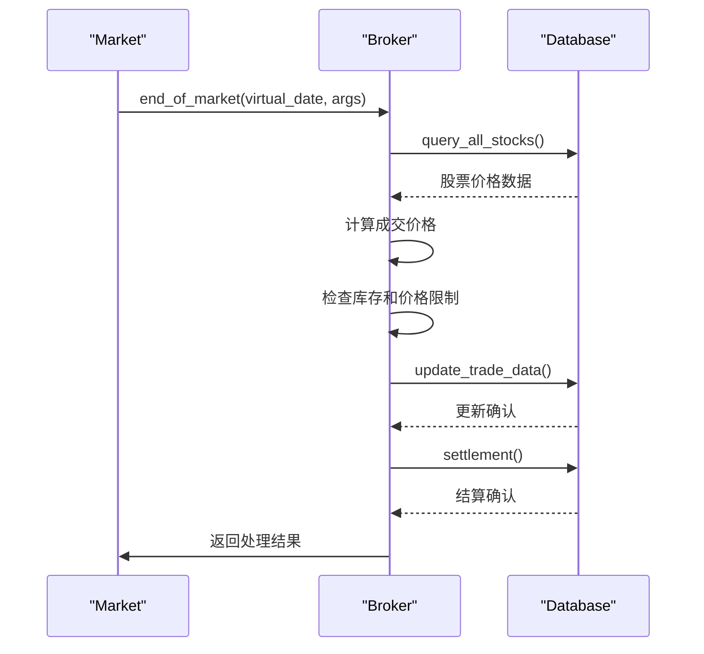
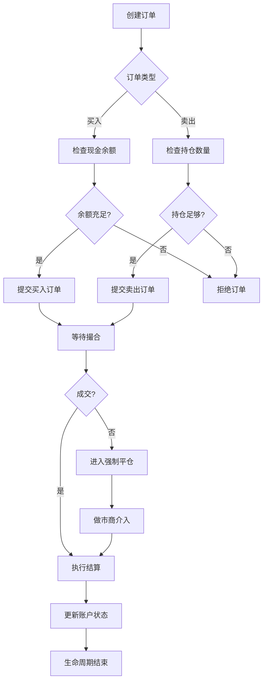
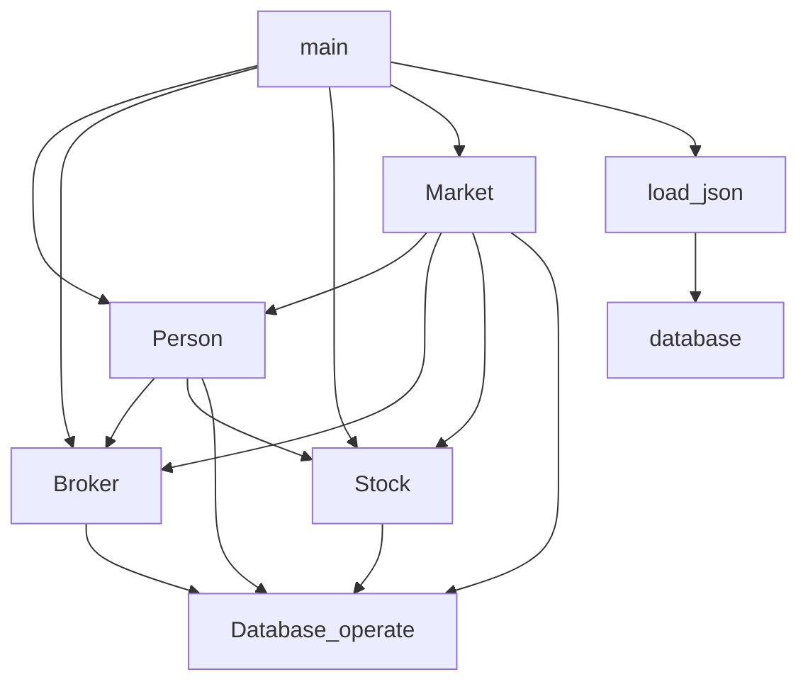

# Person智能体

<cite>
**本文档中引用的文件**  
- [Person.py](file://Agent-Trading-Arena/Stock_Main/Person.py)
- [Stock.py](file://Agent-Trading-Arena/Stock_Main/Stock.py)
- [Market.py](file://Agent-Trading-Arena/Stock_Main/Market.py)
- [database.py](file://Agent-Trading-Arena/Stock_Main/database.py)
- [database_utils.py](file://Agent-Trading-Arena/Stock_Main/database_utils.py)
- [load_json.py](file://Agent-Trading-Arena/Stock_Main/load_json.py)
- [main.py](file://Agent-Trading-Arena/Stock_Main/main.py)
- [constant.py](file://Agent-Trading-Arena/Stock_Main/constant.py)
</cite>

## 目录
1. [简介](#简介)
2. [项目结构](#项目结构)
3. [核心组件](#核心组件)
4. [架构概述](#架构概述)
5. [详细组件分析](#详细组件分析)
6. [依赖分析](#依赖分析)
7. [性能考虑](#性能考虑)
8. [故障排除指南](#故障排除指南)
9. [结论](#结论)

## 简介
Person智能体是交易模拟系统中的核心参与者，代表具有独立决策能力的交易代理。该智能体通过建模身份属性、财务状态和订单生命周期管理，实现了复杂的交易行为。每个Person实例都具备独特的身份特征，包括职业、投资原则和财务参数，这些特征通过JSON配置文件初始化。智能体的财务状态由现金、资产和财富三个核心指标构成，这些指标在交易过程中动态更新。系统通过create_order方法生成符合市场规则的买卖指令，并通过settlement方法在成交后精确更新账户余额与持仓。每日结算通过end_of_iteration和end_of_day钩子函数实现，确保财务计算的准确性。特别值得注意的是Broker子类作为做市商的角色，其库存管理机制和强制平仓逻辑在维护市场流动性方面发挥着关键作用。

## 项目结构
项目采用模块化设计，将不同功能分离到独立的文件中。核心交易逻辑分布在Person.py、Stock.py和Market.py中，而数据库操作则由database.py和database_utils.py处理。配置数据通过JSON文件存储，包括persona.json中的智能体属性和stocks.json中的股票信息。系统通过main.py协调各个组件的初始化和运行流程。这种结构化的组织方式使得代码易于维护和扩展，同时也便于理解各个组件之间的交互关系。

**图表来源**  
- [Person.py](file://Agent-Trading-Arena/Stock_Main/Person.py#L1-L629)
- [Stock.py](file://Agent-Trading-Arena/Stock_Main/Stock.py#L1-L307)
- [Market.py](file://Agent-Trading-Arena/Stock_Main/Market.py#L1-L278)
- [database.py](file://Agent-Trading-Arena/Stock_Main/database.py#L1-L133)
- [database_utils.py](file://Agent-Trading-Arena/Stock_Main/database_utils.py#L1-L322)
- [load_json.py](file://Agent-Trading-Arena/Stock_Main/load_json.py#L1-L134)
- [main.py](file://Agent-Trading-Arena/Stock_Main/main.py#L1-L151)

**章节来源**  
- [main.py](file://Agent-Trading-Arena/Stock_Main/main.py#L1-L151)
- [Person.py](file://Agent-Trading-Arena/Stock_Main/Person.py#L1-L629)

## 核心组件
Person智能体的核心组件包括身份属性、财务状态和订单管理三个主要部分。身份属性通过initialize_person方法从JSON文件加载，包含person_id、职业、投资原则等基本信息。财务状态由现金、资产和财富三个相互关联的指标构成，这些指标在交易过程中通过精确的数学计算保持一致性。订单管理通过create_order和settlement方法实现，前者负责生成符合市场规则的买卖指令，后者负责在成交后更新账户状态。Broker子类作为特殊的Person实例，承担做市商的角色，通过库存管理机制为市场提供流动性。这些组件协同工作，形成了一个完整的交易代理系统。

**章节来源**  
- [Person.py](file://Agent-Trading-Arena/Stock_Main/Person.py#L143-L629)
- [load_json.py](file://Agent-Trading-Arena/Stock_Main/load_json.py#L9-L14)
- [database_utils.py](file://Agent-Trading-Arena/Stock_Main/database_utils.py#L138-L146)

## 架构概述
系统架构采用分层设计，将业务逻辑与数据访问分离。Person智能体作为应用层，负责决策和交易执行；Market和Stock组件构成领域层，处理市场规则和股票状态；数据库工具类作为数据访问层，提供持久化支持。这种分层架构确保了系统的可维护性和可扩展性。智能体通过数据库接口与持久化存储交互，所有状态变更都通过SQL操作记录。配置数据通过JSON文件加载，实现了代码与数据的分离。主控流程在main.py中协调各个组件的初始化和运行，确保系统按预定逻辑执行。

**图表来源**  
- [Person.py](file://Agent-Trading-Arena/Stock_Main/Person.py#L143-L629)
- [Market.py](file://Agent-Trading-Arena/Stock_Main/Market.py#L12-L278)
- [Stock.py](file://Agent-Trading-Arena/Stock_Main/Stock.py#L14-L307)
- [database.py](file://Agent-Trading-Arena/Stock_Main/database.py#L44-L133)
- [database_utils.py](file://Agent-Trading-Arena/Stock_Main/database_utils.py#L245-L322)

## 详细组件分析
### Person类分析
Person类作为交易代理的核心实现，封装了智能体的所有行为和状态。其设计遵循面向对象原则，通过私有字段和公共方法的组合，实现了良好的封装性和可维护性。类的初始化过程从JSON配置文件加载身份属性，并通过数据库接口建立持久化连接。财务状态的管理采用精确的浮点数计算，确保所有交易操作的准确性。

#### 类图

**图表来源**  
- [Person.py](file://Agent-Trading-Arena/Stock_Main/Person.py#L143-L629)

**章节来源**  
- [Person.py](file://Agent-Trading-Arena/Stock_Main/Person.py#L143-L629)
- [database_utils.py](file://Agent-Trading-Arena/Stock_Main/database_utils.py#L245-L322)

### Broker子类分析
Broker子类作为做市商的实现，在交易系统中扮演着关键角色。其特殊之处在于拥有初始股票库存，这使其能够为市场提供流动性。库存管理机制通过inventories列表跟踪每只股票的持有量，并在交易过程中动态更新。强制平仓逻辑在end_of_market阶段执行，确保所有未成交订单都能得到处理。这种设计模拟了真实市场中做市商的行为，为系统提供了必要的交易对手方。

#### 序列图

**图表来源**  
- [Person.py](file://Agent-Trading-Arena/Stock_Main/Person.py#L18-L141)
- [Market.py](file://Agent-Trading-Arena/Stock_Main/Market.py#L30-L95)

**章节来源**  
- [Person.py](file://Agent-Trading-Arena/Stock_Main/Person.py#L18-L141)
- [Market.py](file://Agent-Trading-Arena/Stock_Main/Market.py#L30-L95)

### 订单生命周期分析
订单生命周期管理是Person智能体的核心功能之一，涵盖了从创建到结算的完整过程。create_order方法负责生成符合市场规则的买卖指令，通过价格调整机制确保交易的公平性。settlement方法在成交后精确更新账户状态，维护财务数据的一致性。整个生命周期通过数据库事务保证原子性，确保在任何情况下系统状态的完整性。

#### 流程图

**图表来源**  
- [Person.py](file://Agent-Trading-Arena/Stock_Main/Person.py#L212-L249)
- [Market.py](file://Agent-Trading-Arena/Stock_Main/Market.py#L97-L199)

**章节来源**  
- [Person.py](file://Agent-Trading-Arena/Stock_Main/Person.py#L212-L249)
- [Market.py](file://Agent-Trading-Arena/Stock_Main/Market.py#L97-L199)

## 依赖分析
系统组件之间的依赖关系清晰且合理。Person智能体依赖于Broker、Stock和Database_operate等核心组件，这些依赖通过构造函数注入，实现了松耦合设计。数据库工具类提供了统一的数据访问接口，所有持久化操作都通过这些接口进行。配置数据的加载与业务逻辑分离，通过load_json模块实现。这种依赖结构确保了系统的可测试性和可维护性，同时也便于未来的功能扩展。

**图表来源**  
- [Person.py](file://Agent-Trading-Arena/Stock_Main/Person.py#L1-L629)
- [Stock.py](file://Agent-Trading-Arena/Stock_Main/Stock.py#L1-L307)
- [Market.py](file://Agent-Trading-Arena/Stock_Main/Market.py#L1-L278)
- [database.py](file://Agent-Trading-Arena/Stock_Main/database.py#L1-L133)
- [database_utils.py](file://Agent-Trading-Arena/Stock_Main/database_utils.py#L1-L322)
- [load_json.py](file://Agent-Trading-Arena/Stock_Main/load_json.py#L1-L134)
- [main.py](file://Agent-Trading-Arena/Stock_Main/main.py#L1-L151)

**章节来源**  
- [Person.py](file://Agent-Trading-Arena/Stock_Main/Person.py#L1-L629)
- [Stock.py](file://Agent-Trading-Arena/Stock_Main/Stock.py#L1-L307)
- [Market.py](file://Agent-Trading-Arena/Stock_Main/Market.py#L1-L278)

## 性能考虑
系统的性能设计考虑了多个方面。数据库操作通过批量提交和事务管理优化，减少了I/O开销。财务计算采用高效的浮点数运算，避免了不必要的精度损失。内存管理通过及时释放不再需要的对象引用，防止内存泄漏。交易撮合算法采用排序和优先队列，确保了高效率的订单匹配。这些性能优化措施共同保证了系统在高并发交易场景下的稳定运行。

## 故障排除指南
当系统出现异常时，首先检查数据库连接状态和配置文件的完整性。对于交易失败的情况，验证订单参数是否符合市场规则，包括价格限制和库存检查。财务数据不一致的问题通常源于结算逻辑的错误，需要仔细检查settlement方法的实现。日志记录是故障排除的重要工具，通过分析数据库操作日志可以定位大多数问题。测试用例提供了验证系统功能的基准，建议在修改代码后运行所有测试用例。

**章节来源**  
- [Person.py](file://Agent-Trading-Arena/Stock_Main/Person.py#L250-L308)
- [Market.py](file://Agent-Trading-Arena/Stock_Main/Market.py#L230-L265)
- [database_utils.py](file://Agent-Trading-Arena/Stock_Main/database_utils.py#L302-L317)

## 结论
Person智能体的设计成功实现了复杂交易代理的建模，通过身份属性、财务状态和订单生命周期管理的有机结合，创造了一个逼真的交易环境。系统架构的分层设计和组件间的清晰依赖关系，确保了代码的可维护性和可扩展性。Broker子类作为做市商的实现，为市场提供了必要的流动性支持。财务计算的精确性和数据库操作的可靠性，保证了系统运行的稳定性。未来的工作可以集中在优化交易算法和增强智能体的决策能力上，进一步提升系统的仿真效果。