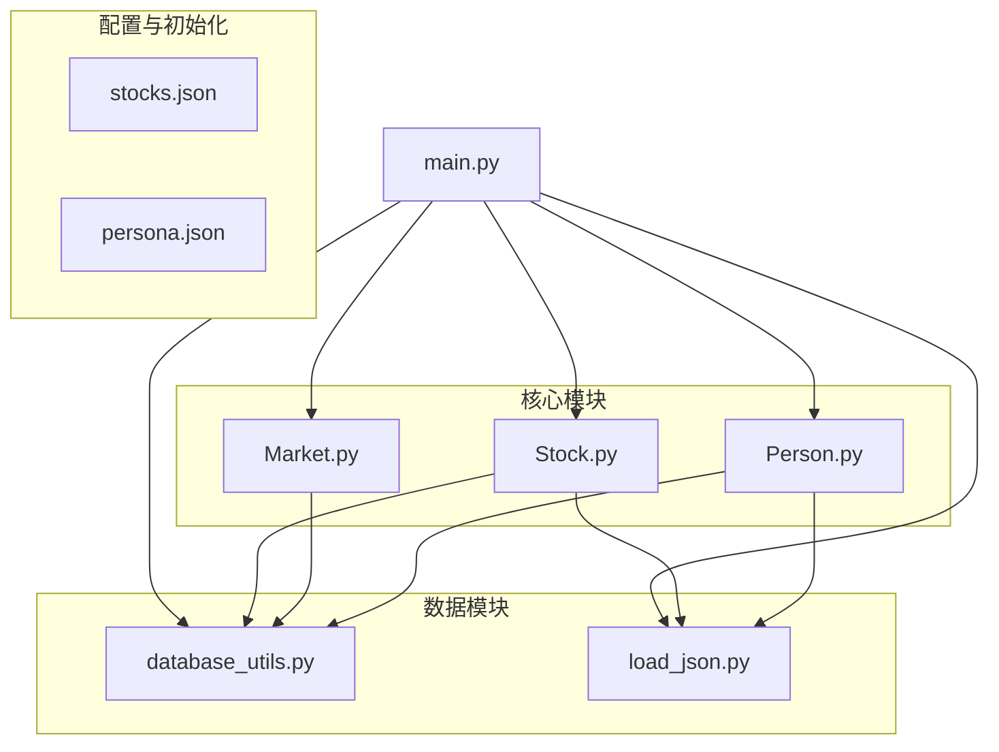
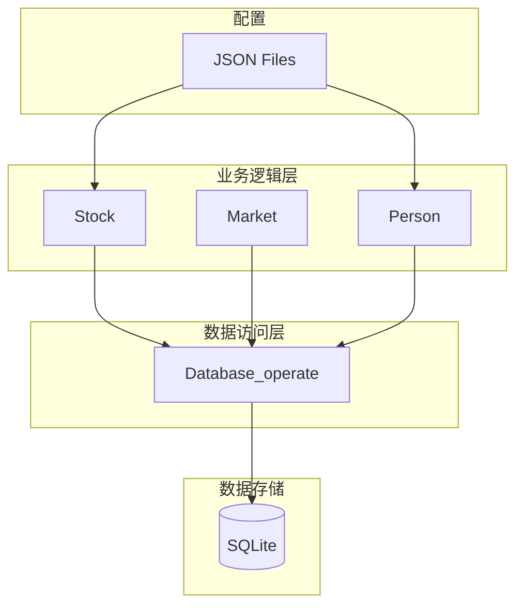
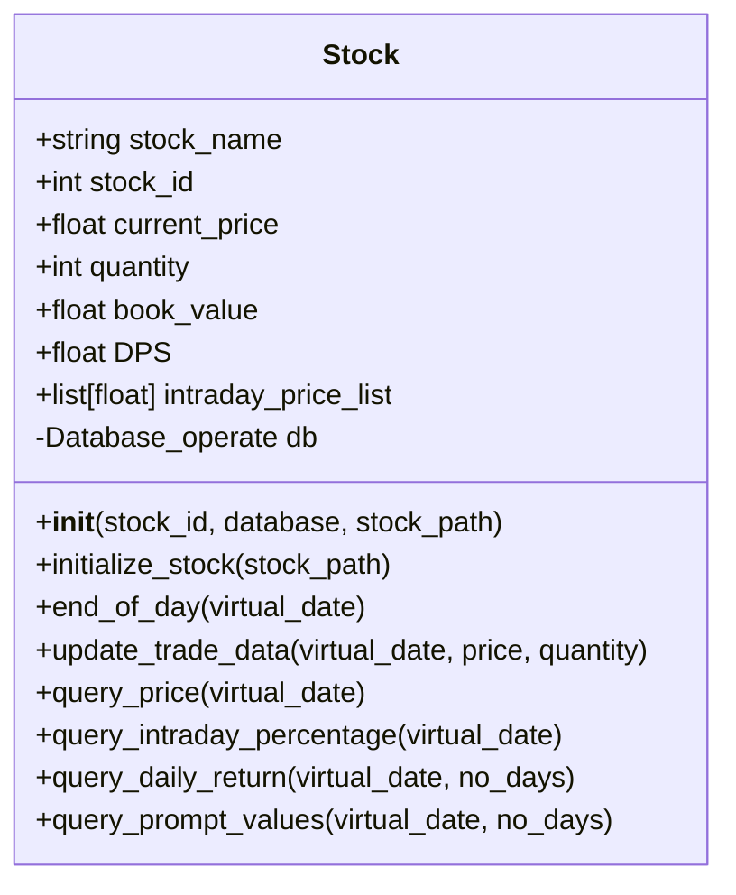
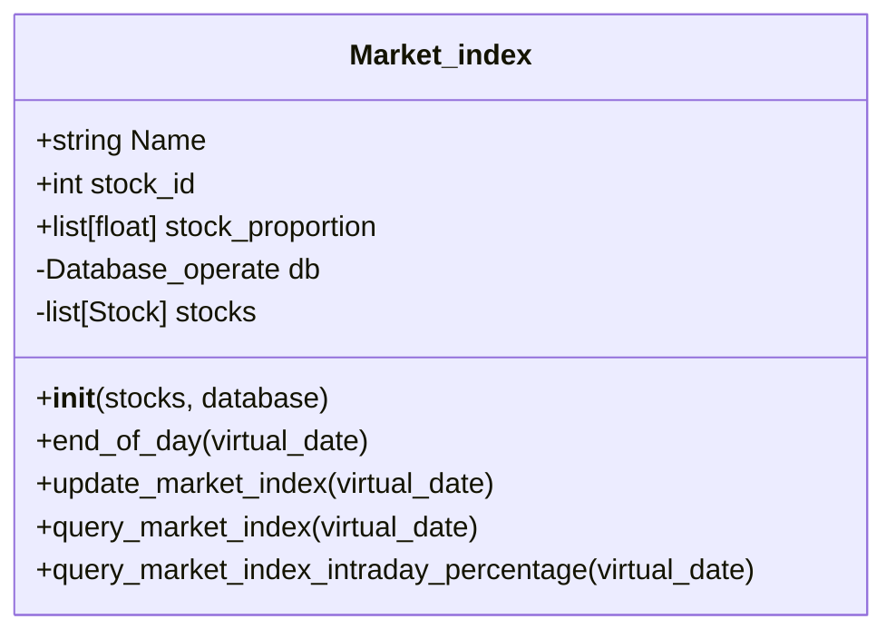
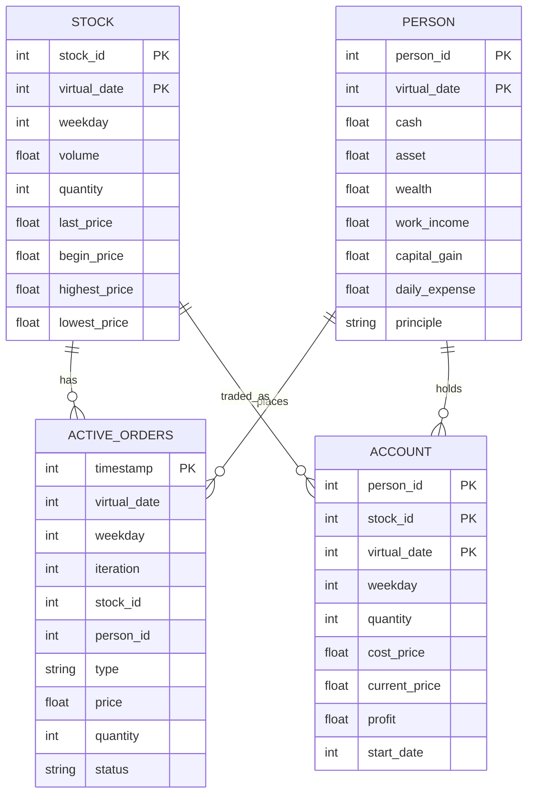

# Stock资产

<cite>
**本文档引用文件**  
- [Stock.py](file://Agent-Trading-Arena/Stock_Main/Stock.py)
- [Market.py](file://Agent-Trading-Arena/Stock_Main/Market.py)
- [main.py](file://Agent-Trading-Arena/Stock_Main/main.py)
- [Person.py](file://Agent-Trading-Arena/Stock_Main/Person.py)
- [database_utils.py](file://Agent-Trading-Arena/Stock_Main/database_utils.py)
- [load_json.py](file://Agent-Trading-Arena/Stock_Main/load_json.py)
- [stocks.json](file://Agent-Trading-Arena/Stock_Main/save/init/stocks.json)
</cite>

## 目录
1. [简介](#简介)
2. [项目结构](#项目结构)
3. [核心组件](#核心组件)
4. [架构概述](#架构概述)
5. [详细组件分析](#详细组件分析)
6. [依赖分析](#依赖分析)
7. [性能考虑](#性能考虑)
8. [故障排除指南](#故障排除指南)
9. [结论](#结论)

## 简介
本项目是一个基于智能体的股票交易模拟系统，核心是`Stock`类对单个股票资产的管理。系统通过`Stock`类实现股票的初始化、价格更新、交易数据维护和市场数据查询功能。`Market_index`类基于各股票账面价值比例计算加权市场指数，反映整体市场动态。系统使用SQLite数据库持久化资产状态和历史数据，确保数据准确性和可追溯性。智能体（Person）基于市场数据进行决策，形成完整的交易闭环。

## 项目结构
项目采用模块化设计，主要包含股票管理、市场模拟、智能体行为和数据持久化四大模块。核心类分布在`Stock.py`、`Market.py`和`Person.py`中，通过`main.py`协调运行。数据通过JSON文件初始化，并在SQLite数据库中持久化存储。



**图示来源**
- [Stock.py](file://Agent-Trading-Arena/Stock_Main/Stock.py)
- [Market.py](file://Agent-Trading-Arena/Stock_Main/Market.py)
- [Person.py](file://Agent-Trading-Arena/Stock_Main/Person.py)
- [main.py](file://Agent-Trading-Arena/Stock_Main/main.py)
- [database_utils.py](file://Agent-Trading-Arena/Stock_Main/database_utils.py)
- [load_json.py](file://Agent-Trading-Arena/Stock_Main/load_json.py)

**本节来源**
- [Stock.py](file://Agent-Trading-Arena/Stock_Main/Stock.py)
- [Market.py](file://Agent-Trading-Arena/Stock_Main/Market.py)
- [Person.py](file://Agent-Trading-Arena/Stock_Main/Person.py)
- [main.py](file://Agent-Trading-Arena/Stock_Main/main.py)

## 核心组件
`Stock`类负责管理单个股票资产，包括初始数量、名称、当前价格和账面价值的初始化。`Market_index`类计算加权市场指数，反映整体市场动态。`Person`类代表智能体，基于市场数据进行交易决策。这些组件通过`Database_operate`类与SQLite数据库交互，实现数据持久化。

**本节来源**
- [Stock.py](file://Agent-Trading-Arena/Stock_Main/Stock.py#L14-L307)
- [Person.py](file://Agent-Trading-Arena/Stock_Main/Person.py#L143-L629)
- [database_utils.py](file://Agent-Trading-Arena/Stock_Main/database_utils.py#L245-L322)

## 架构概述
系统采用分层架构，上层为业务逻辑层（Stock、Market、Person），下层为数据访问层（Database_operate）。`main.py`作为协调器，初始化所有组件并驱动模拟循环。数据流从JSON配置文件加载，经由业务逻辑处理，最终持久化到SQLite数据库。



**图示来源**
- [Stock.py](file://Agent-Trading-Arena/Stock_Main/Stock.py)
- [Market.py](file://Agent-Trading-Arena/Stock_Main/Market.py)
- [Person.py](file://Agent-Trading-Arena/Stock_Main/Person.py)
- [database_utils.py](file://Agent-Trading-Arena/Stock_Main/database_utils.py)

## 详细组件分析

### Stock类分析
`Stock`类是股票资产管理的核心，负责维护股票的完整生命周期数据。

#### 初始化过程
`Stock`类通过`initialize_stock`方法从`stocks.json`文件中加载初始数据，包括股票ID、名称、初始数量、历史价格和每股股息（DPS）。当前价格设置为历史价格的最后一个值，账面价值通过当前价格乘以数量计算得出。



**图示来源**
- [Stock.py](file://Agent-Trading-Arena/Stock_Main/Stock.py#L14-L307)

#### 交易数据更新
`update_trade_data`方法是日内价格管理的核心。当收到新的交易数据时，该方法会：
1. 查询当日股票状态
2. 若为新交易日，则插入初始记录
3. 若为当前交易日，则更新最高价、最低价、最后价和成交量
4. 将当前价格添加到`intraday_price_list`中

该方法确保了OHLCV（开盘价、最高价、最低价、收盘价、成交量）数据的准确聚合。

**本节来源**
- [Stock.py](file://Agent-Trading-Arena/Stock_Main/Stock.py#L67-L112)

#### 市场数据查询
`Stock`类提供多个查询接口，为智能体决策提供支持：
- `query_price`: 查询指定日期的股票价格信息
- `query_intraday_percentage`: 计算日内价格变化百分比
- `query_daily_return`: 返回过去N天的每日回报率
- `query_prompt_values`: 为智能体生成包含价格、股息、价格变化等信息的综合数据包

这些接口使智能体能够基于准确的市场数据做出交易决策。

**本节来源**
- [Stock.py](file://Agent-Trading-Arena/Stock_Main/Stock.py#L114-L209)

### Market_index类分析
`Market_index`类负责计算和维护加权市场指数，反映整体市场动态。

#### 指数计算
`Market_index`在初始化时计算各股票的账面价值比例，作为权重。`update_market_index`方法根据当前股票价格和权重计算市场指数，实现与个股价格变动的联动。



**图示来源**
- [Stock.py](file://Agent-Trading-Arena/Stock_Main/Stock.py#L212-L295)

#### 市场联动
市场指数与个股价格变动紧密联动。当个股价格更新时，`Market_index`会在每个交易周期结束时调用`update_market_index`方法，重新计算市场指数。这种设计确保了市场指数能够实时反映个股价格变动的综合影响。

**本节来源**
- [Stock.py](file://Agent-Trading-Arena/Stock_Main/Stock.py#L227-L276)
- [main.py](file://Agent-Trading-Arena/Stock_Main/main.py#L127-L145)

### 资产状态持久化
系统通过SQLite数据库实现资产状态的持久化，确保历史数据的准确性。

#### 数据库设计
系统使用SQLite数据库存储股票、交易、账户和市场数据。`Database_operate`类封装了数据库操作，提供执行SQL命令和获取结果的接口。



**图示来源**
- [database_utils.py](file://Agent-Trading-Arena/Stock_Main/database_utils.py#L254-L300)

#### 持久化机制
系统在每个交易周期结束时，通过`end_of_day`方法将资产状态写入数据库。`save_all`函数将`Stock`、`Person`、`Market_index`等对象序列化保存，确保模拟状态可恢复。

**本节来源**
- [database_utils.py](file://Agent-Trading-Arena/Stock_Main/database_utils.py#L245-L322)
- [load_json.py](file://Agent-Trading-Arena/Stock_Main/load_json.py#L45-L77)

## 依赖分析
系统各组件之间存在明确的依赖关系，形成清晰的调用链。

```mermaid
graph TD
Main[main.py] --> Stock[Stock.py]
Main --> Market[Market.py]
Main --> Person[Person.py]
Main --> DB[database_utils.py]
Main --> JSON[load_json.py]
Stock --> DB
Stock --> JSON
Market --> DB
Market --> Stock
Person --> DB
Person --> JSON
Person --> Stock
DB -.-> SQLite[(SQLite)]
class Main,Stock,Market,Person,JSON,DB class;
```

**图示来源**
- [main.py](file://Agent-Trading-Arena/Stock_Main/main.py)
- [Stock.py](file://Agent-Trading-Arena/Stock_Main/Stock.py)
- [Market.py](file://Agent-Trading-Arena/Stock_Main/Market.py)
- [Person.py](file://Agent-Trading-Arena/Stock_Main/Person.py)
- [database_utils.py](file://Agent-Trading-Arena/Stock_Main/database_utils.py)
- [load_json.py](file://Agent-Trading-Arena/Stock_Main/load_json.py)

**本节来源**
- [main.py](file://Agent-Trading-Arena/Stock_Main/main.py#L11-L12)
- [Stock.py](file://Agent-Trading-Arena/Stock_Main/Stock.py#L3-L8)
- [Market.py](file://Agent-Trading-Arena/Stock_Main/Market.py#L7-L8)
- [Person.py](file://Agent-Trading-Arena/Stock_Main/Person.py#L2-L8)
- [database_utils.py](file://Agent-Trading-Arena/Stock_Main/database_utils.py)

## 性能考虑
系统在设计时考虑了性能因素，通过批量数据库操作和内存缓存提高效率。`intraday_price_list`在内存中维护日内价格，避免频繁数据库查询。批量更新和事务处理确保数据一致性，同时减少I/O开销。

## 故障排除指南
常见问题包括数据库连接失败、JSON文件格式错误和对象序列化问题。确保`stocks.json`和`persona.json`格式正确，数据库文件路径可写，对象属性在序列化前正确设置。

**本节来源**
- [database_utils.py](file://Agent-Trading-Arena/Stock_Main/database_utils.py#L302-L310)
- [load_json.py](file://Agent-Trading-Arena/Stock_Main/load_json.py#L9-L22)

## 结论
`Stock`类成功实现了对单个股票资产的全面管理，从初始化到交易数据维护，再到市场数据查询，形成了完整的资产管理闭环。`Market_index`类通过加权计算，准确反映了市场整体动态。系统通过SQLite数据库实现了资产状态的可靠持久化，确保了历史数据的准确性。整体架构清晰，组件职责明确，为智能体交易模拟提供了坚实的基础。