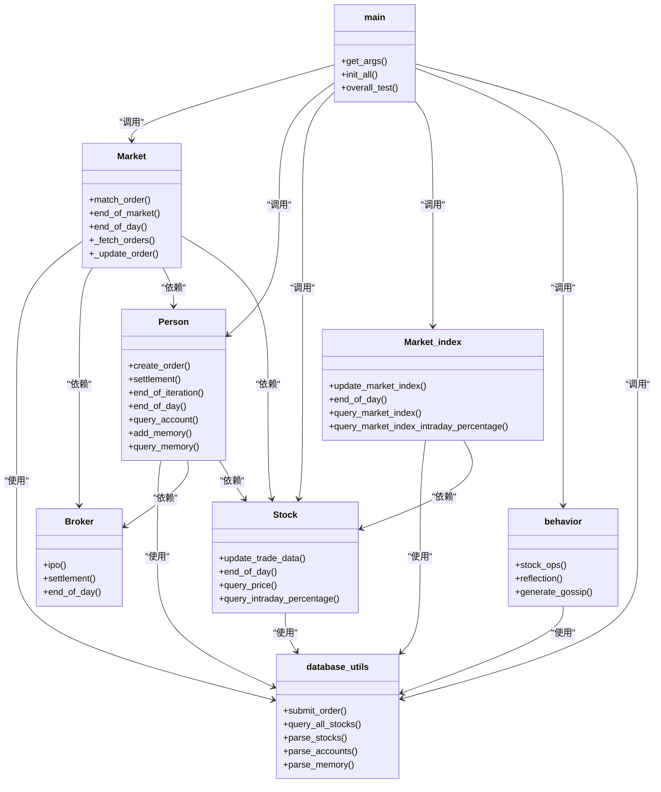

# 主控流程

<cite>
**本文档中引用的文件**  
- [main.py](file://Agent-Trading-Arena/Stock_Main/main.py)
- [Market.py](file://Agent-Trading-Arena/Stock_Main/Market.py)
- [Person.py](file://Agent-Trading-Arena/Stock_Main/Person.py)
- [Stock.py](file://Agent-Trading-Arena/Stock_Main/Stock.py)
- [database.py](file://Agent-Trading-Arena/Stock_Main/database.py)
- [behavior.py](file://Agent-Trading-Arena/Stock_Main/behavior.py)
- [load_json.py](file://Agent-Trading-Arena/Stock_Main/load_json.py)
- [database_utils.py](file://Agent-Trading-Arena/Stock_Main/database_utils.py)
</cite>

## 目录
1. [项目结构](#项目结构)
2. [主控流程概述](#主控流程概述)
3. [命令行参数配置](#命令行参数配置)
4. [系统初始化](#系统初始化)
5. [模拟主循环](#模拟主循环)
6. [每日迭代流程](#每日迭代流程)
7. [数据保存与恢复](#数据保存与恢复)
8. [核心组件交互](#核心组件交互)

## 项目结构

该Agent Trading Arena项目是一个基于代理的股票市场模拟系统，其核心主控逻辑位于`main.py`文件中。系统通过初始化Market、Person、Stock等核心组件，并驱动一个嵌套的模拟周期来实现市场行为的模拟。

**图源**  
- [main.py](file://Agent-Trading-Arena/Stock_Main/main.py)
- [Market.py](file://Agent-Trading-Arena/Stock_Main/Market.py)
- [Person.py](file://Agent-Trading-Arena/Stock_Main/Person.py)
- [Stock.py](file://Agent-Trading-Arena/Stock_Main/Stock.py)
- [database.py](file://Agent-Trading-Arena/Stock_Main/database.py)
- [behavior.py](file://Agent-Trading-Arena/Stock_Main/behavior.py)
- [load_json.py](file://Agent-Trading-Arena/Stock_Main/load_json.py)
- [database_utils.py](file://Agent-Trading-Arena/Stock_Main/database_utils.py)

## 主控流程概述

`main.py`作为模拟系统的总协调者，负责整个模拟周期的启动、执行和终止。其主控流程从`__main__`入口开始，通过`get_args()`解析命令行参数，然后调用`overall_test()`函数启动模拟。该函数内部包含一个双重嵌套循环：外层循环按虚拟交易日（virtual_date）迭代，内层循环按日内迭代次数（iteration）执行。

**图源**  
- [main.py](file://Agent-Trading-Arena/Stock_Main/main.py#L148-L150)

## 命令行参数配置

系统通过`argparse`模块提供灵活的命令行参数配置，允许用户自定义模拟的关键参数。这些参数在`get_args()`函数中定义，为模拟提供了高度的可配置性。

**图源**  
- [main.py](file://Agent-Trading-Arena/Stock_Main/main.py#L17-L39)

## 系统初始化

系统初始化由`init_all()`函数完成，该函数根据`load`参数决定是加载现有状态还是创建新状态。当`load=False`时，系统会清除现有数据库表并重新初始化所有核心组件。

**图源**  
- [main.py](file://Agent-Trading-Arena/Stock_Main/main.py#L66-L96)

## 模拟主循环

模拟主循环是系统的核心执行逻辑，位于`overall_test()`函数中。它实现了双重嵌套结构：外层`virtual_date`循环代表交易日，内层`iter`循环代表日内迭代。

**图源**  
- [main.py](file://Agent-Trading-Arena/Stock_Main/main.py#L99-L147)

## 每日迭代流程

每日迭代流程详细描述了在每个交易日内，系统如何通过多次迭代来模拟市场动态。每次迭代都包含完整的交易生命周期：从生成操作建议到订单撮合，再到状态更新。

**图源**  
- [main.py](file://Agent-Trading-Arena/Stock_Main/main.py#L117-L134)
- [behavior.py](file://Agent-Trading-Arena/Stock_Main/behavior.py#L82-L171)
- [Person.py](file://Agent-Trading-Arena/Stock_Main/Person.py#L212-L249)
- [Market.py](file://Agent-Trading-Arena/Stock_Main/Market.py#L96-L198)
- [Person.py](file://Agent-Trading-Arena/Stock_Main/Person.py#L309-L363)
- [behavior.py](file://Agent-Trading-Arena/Stock_Main/behavior.py#L174-L198)
- [load_json.py](file://Agent-Trading-Arena/Stock_Main/load_json.py#L45-L77)

## 数据保存与恢复

系统通过`load_json.py`模块提供数据保存与恢复功能，允许在模拟中断后从上次状态继续。`save_all()`和`load_all()`函数实现了组件状态的序列化和反序列化。

**图源**  
- [load_json.py](file://Agent-Trading-Arena/Stock_Main/load_json.py#L45-L77)
- [load_json.py](file://Agent-Trading-Arena/Stock_Main/load_json.py#L81-L122)

## 核心组件交互

系统中的核心组件通过明确定义的接口进行交互，形成了一个完整的模拟生态系统。`main.py`作为协调者，调用各组件的方法来驱动整个模拟过程。

**图源**  
- [main.py](file://Agent-Trading-Arena/Stock_Main/main.py)
- [Market.py](file://Agent-Trading-Arena/Stock_Main/Market.py)
- [Person.py](file://Agent-Trading-Arena/Stock_Main/Person.py)
- [Stock.py](file://Agent-Trading-Arena/Stock_Main/Stock.py)
- [behavior.py](file://Agent-Trading-Arena/Stock_Main/behavior.py)
- [database_utils.py](file://Agent-Trading-Arena/Stock_Main/database_utils.py)