# 核心模块架构

<cite>
**本文档引用的文件**
- [Market.py](file://Agent-Trading-Arena/Stock_Main/Market.py)
- [Person.py](file://Agent-Trading-Arena/Stock_Main/Person.py)
- [Stock.py](file://Agent-Trading-Arena/Stock_Main/Stock.py)
- [behavior.py](file://Agent-Trading-Arena/Stock_Main/behavior.py)
- [main.py](file://Agent-Trading-Arena/Stock_Main/main.py)
- [database_utils.py](file://Agent-Trading-Arena/Stock_Main/database_utils.py)
- [load_json.py](file://Agent-Trading-Arena/Stock_Main/load_json.py)
- [our_run_gpt_prompt.py](file://Agent-Trading-Arena/Stock_Main/content/our_run_gpt_prompt.py)
- [constant.py](file://Agent-Trading-Arena/Stock_Main/constant.py)
</cite>

## 目录
1. [引言](#引言)
2. [项目结构](#项目结构)
3. [核心组件](#核心组件)
4. [架构概览](#架构概览)
5. [详细组件分析](#详细组件分析)
6. [依赖关系分析](#依赖关系分析)
7. [性能考虑](#性能考虑)
8. [故障排除指南](#故障排除指南)
9. [结论](#结论)

## 引言

Agent-Trading-Arena是一个基于人工智能的股票交易模拟平台，通过五大核心组件实现了完整的交易生态系统。该系统采用模块化设计，每个组件都有明确的职责分工：Market作为交易引擎负责订单匹配和价格更新，Person管理智能体行为和财务状态，Stock维护资产状态和市场数据，behavior驱动基于LLM的决策逻辑，main.py协调整个模拟流程。

系统的核心创新在于将传统金融模拟与现代大语言模型相结合，通过观察者模式和策略模式等设计模式，实现了高度可扩展和可配置的交易环境。

## 项目结构

项目采用清晰的分层架构，主要目录结构如下：

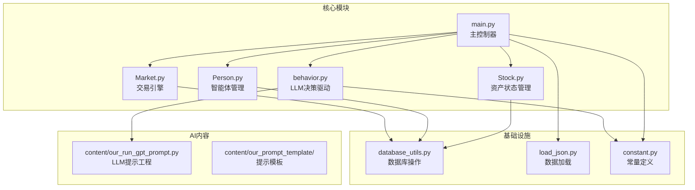

**图表来源**
- [main.py](file://Agent-Trading-Arena/Stock_Main/main.py#L1-L151)
- [Market.py](file://Agent-Trading-Arena/Stock_Main/Market.py#L1-L278)
- [Person.py](file://Agent-Trading-Arena/Stock_Main/Person.py#L1-L629)
- [Stock.py](file://Agent-Trading-Arena/Stock_Main/Stock.py#L1-L307)

**章节来源**
- [main.py](file://Agent-Trading-Arena/Stock_Main/main.py#L1-L151)
- [database_utils.py](file://Agent-Trading-Arena/Stock_Main/database_utils.py#L1-L322)

## 核心组件

### Market - 交易引擎

Market类是整个系统的核心，负责处理所有交易相关的业务逻辑。其主要职责包括：

- **订单匹配算法**：实现买方和卖方订单的自动匹配
- **价格更新机制**：根据交易结果动态调整股票价格
- **市场状态管理**：维护市场开放和关闭状态
- **结算处理**：完成交易后的资金和股份结算

### Person - 智能体管理

Person类代表系统中的智能体（投资者），包含完整的个人财务管理和交易行为：

- **财务状态跟踪**：现金、资产、财富、收益等指标
- **交易执行**：根据决策生成买卖订单
- **历史记录**：保存交易记忆和反思记录
- **日常结算**：每日收入、支出和分红处理

### Stock - 资产状态管理

Stock类管理单个股票的完整生命周期：

- **价格数据维护**：开盘价、收盘价、最高价、最低价
- **交易量统计**：成交量和交易数量记录
- **市场指数计算**：基于权重的市场综合指数
- **历史数据查询**：支持多日价格趋势分析

### behavior - LLM决策驱动

behavior模块集成了大语言模型的决策能力：

- **市场分析**：基于当前市场状况生成分析报告
- **买卖决策**：根据分析结果制定买卖策略
- **反思机制**：定期评估和调整投资原则
- **消息传播**：模拟市场信息的传播和影响

### main - 流程协调器

main.py作为系统的入口点，协调各个组件的运行：

- **参数配置**：解析和验证系统运行参数
- **初始化流程**：创建和配置所有核心组件
- **模拟循环**：控制交易日、迭代周期和数据保存
- **状态持久化**：支持模拟过程的中断和恢复

**章节来源**
- [Market.py](file://Agent-Trading-Arena/Stock_Main/Market.py#L12-L278)
- [Person.py](file://Agent-Trading-Arena/Stock_Main/Person.py#L143-L629)
- [Stock.py](file://Agent-Trading-Arena/Stock_Main/Stock.py#L14-L307)
- [behavior.py](file://Agent-Trading-Arena/Stock_Main/behavior.py#L1-L210)
- [main.py](file://Agent-Trading-Arena/Stock_Main/main.py#L66-L151)

## 架构概览

系统采用事件驱动的架构模式，通过观察者模式实现组件间的松耦合通信：

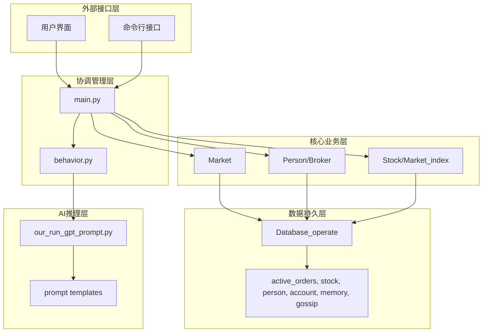

**图表来源**
- [main.py](file://Agent-Trading-Arena/Stock_Main/main.py#L99-L146)
- [behavior.py](file://Agent-Trading-Arena/Stock_Main/behavior.py#L82-L210)
- [database_utils.py](file://Agent-Trading-Arena/Stock_Main/database_utils.py#L245-L322)

## 详细组件分析

### Market类详细分析

Market类实现了复杂的订单匹配算法，采用优先队列的方式处理买卖订单：

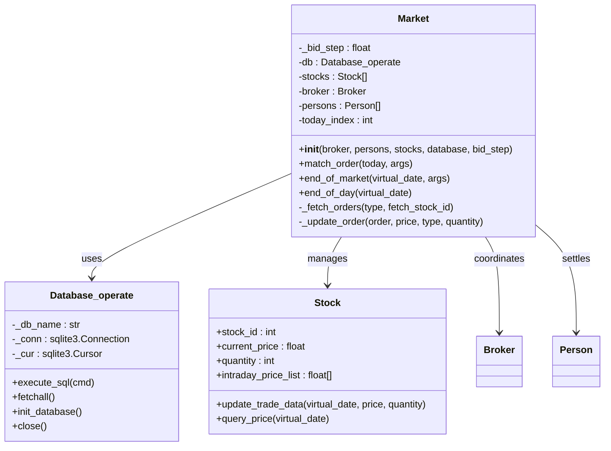

**图表来源**
- [Market.py](file://Agent-Trading-Arena/Stock_Main/Market.py#L12-L278)
- [database_utils.py](file://Agent-Trading-Arena/Stock_Main/database_utils.py#L245-L322)
- [Stock.py](file://Agent-Trading-Arena/Stock_Main/Stock.py#L14-L112)

#### 订单匹配算法流程

Market的订单匹配采用先进先出的优先级排序：

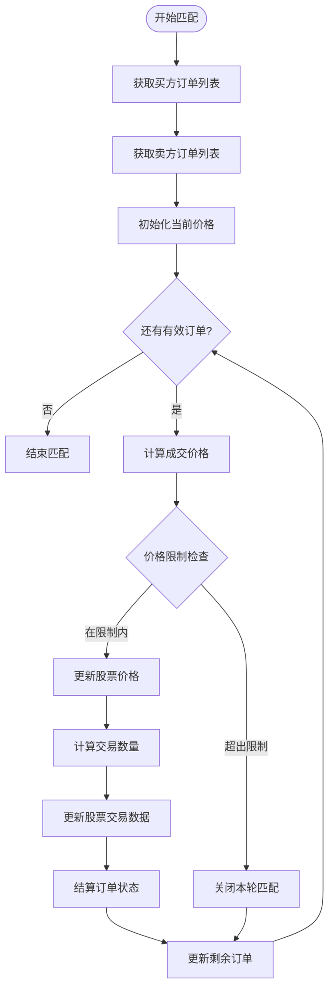

**图表来源**
- [Market.py](file://Agent-Trading-Arena/Stock_Main/Market.py#L96-L198)

**章节来源**
- [Market.py](file://Agent-Trading-Arena/Stock_Main/Market.py#L96-L198)

### Person类详细分析

Person类实现了完整的个人财务管理系统，包含Broker子类：

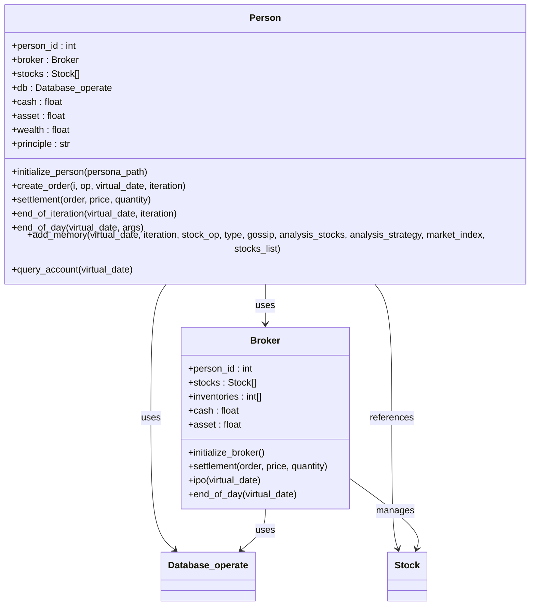

**图表来源**
- [Person.py](file://Agent-Trading-Arena/Stock_Main/Person.py#L143-L629)
- [database_utils.py](file://Agent-Trading-Arena/Stock_Main/database_utils.py#L245-L322)

#### 个人财务结算流程

Person的结算逻辑遵循严格的会计准则：

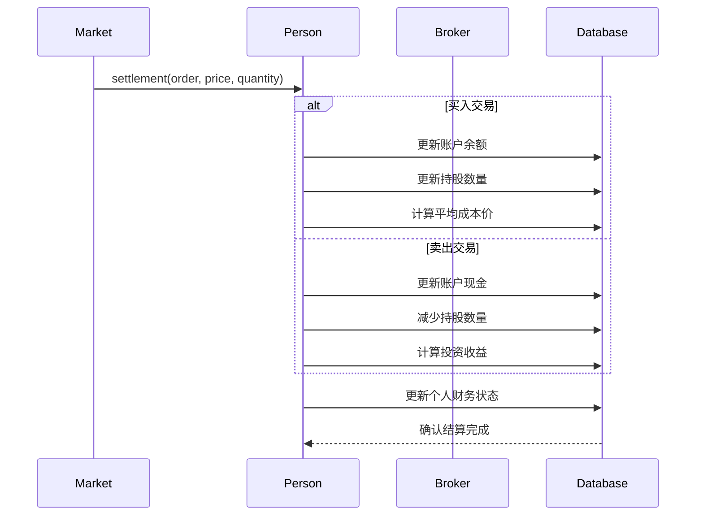

**图表来源**
- [Person.py](file://Agent-Trading-Arena/Stock_Main/Person.py#L250-L308)

**章节来源**
- [Person.py](file://Agent-Trading-Arena/Stock_Main/Person.py#L250-L308)

### Stock类详细分析

Stock类提供了完整的股票数据管理功能：

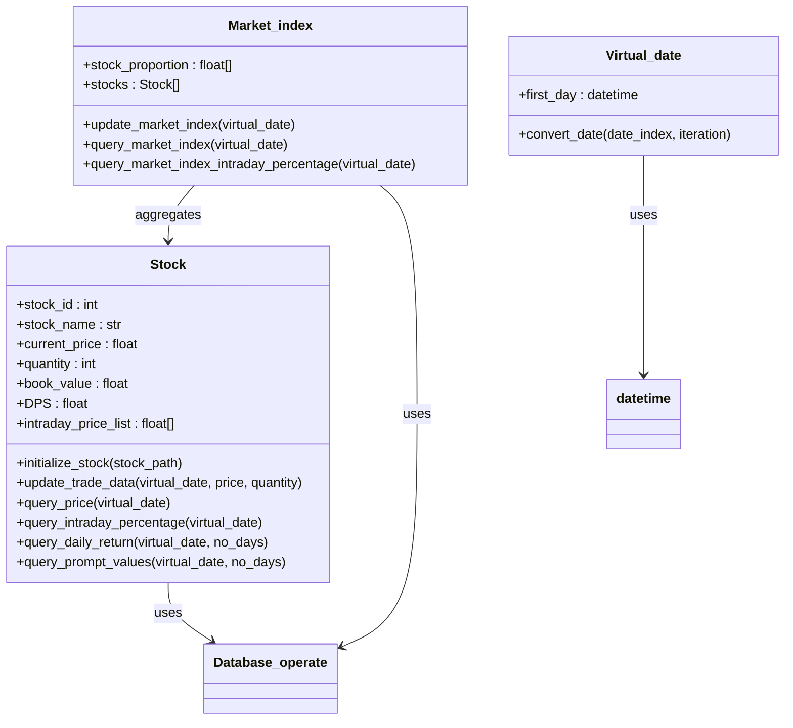

**图表来源**
- [Stock.py](file://Agent-Trading-Arena/Stock_Main/Stock.py#L14-L307)
- [database_utils.py](file://Agent-Trading-Arena/Stock_Main/database_utils.py#L245-L322)

#### 市场指数计算机制

Market_index实现了基于加权平均的市场综合指数计算：

**章节来源**
- [Stock.py](file://Agent-Trading-Arena/Stock_Main/Stock.py#L212-L296)

### behavior模块详细分析

behavior模块集成了完整的LLM决策流程：

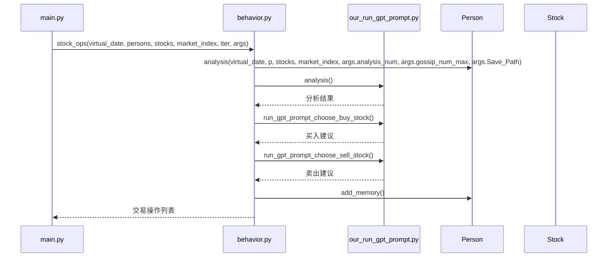

**图表来源**
- [behavior.py](file://Agent-Trading-Arena/Stock_Main/behavior.py#L82-L171)
- [our_run_gpt_prompt.py](file://Agent-Trading-Arena/Stock_Main/content/our_run_gpt_prompt.py#L414-L483)

#### LLM决策提取流程

behavior模块实现了从LLM输出中提取结构化交易指令的算法：

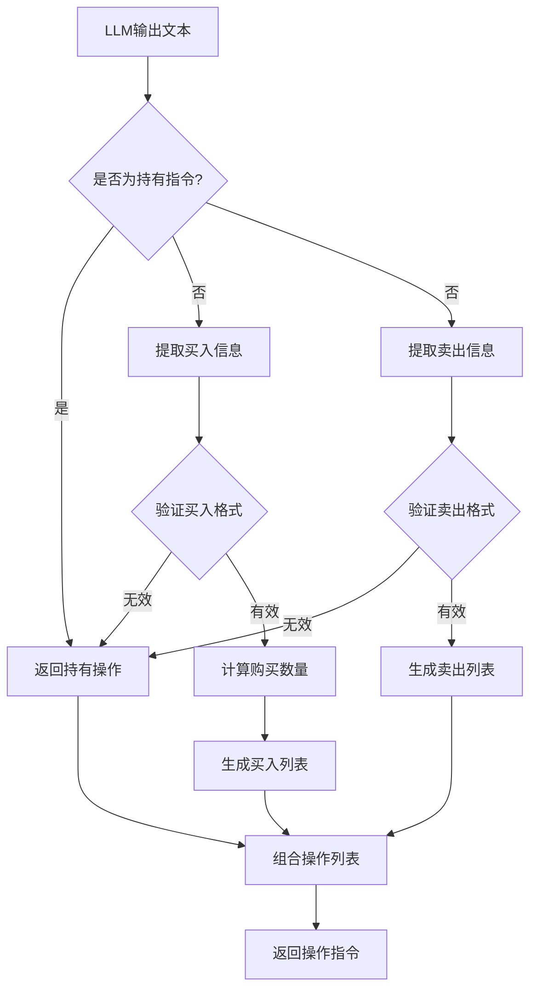

**图表来源**
- [behavior.py](file://Agent-Trading-Arena/Stock_Main/behavior.py#L15-L56)

**章节来源**
- [behavior.py](file://Agent-Trading-Arena/Stock_Main/behavior.py#L15-L56)

### main.py协调流程

main.py实现了完整的模拟生命周期管理：

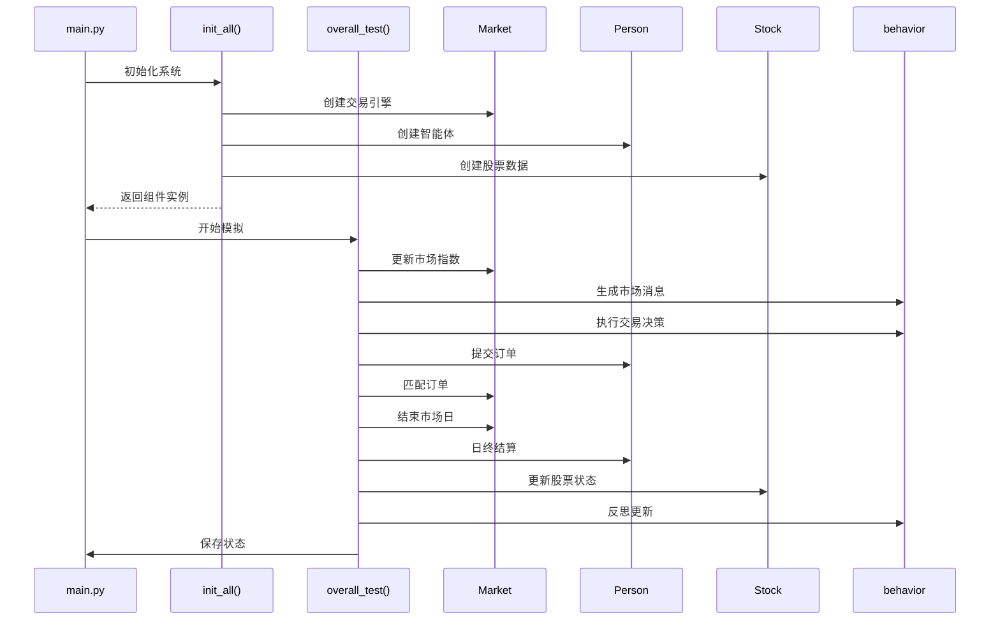

**图表来源**
- [main.py](file://Agent-Trading-Arena/Stock_Main/main.py#L99-L146)

**章节来源**
- [main.py](file://Agent-Trading-Arena/Stock_Main/main.py#L99-L146)

## 依赖关系分析

系统采用了清晰的依赖层次结构，确保模块间的低耦合高内聚：

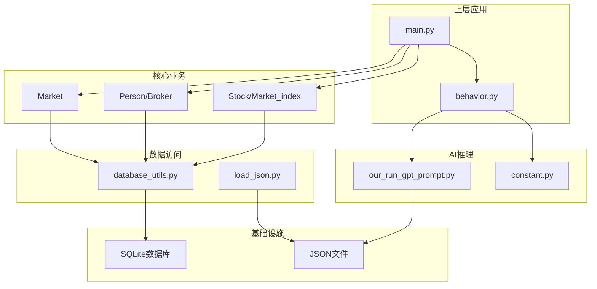

**图表来源**
- [main.py](file://Agent-Trading-Arena/Stock_Main/main.py#L9-L14)
- [database_utils.py](file://Agent-Trading-Arena/Stock_Main/database_utils.py#L245-L322)

### 关键依赖关系

1. **数据库抽象层**：所有核心组件都依赖Database_operate进行数据持久化
2. **LLM集成层**：behavior模块通过our_run_gpt_prompt.py与AI系统交互
3. **配置管理**：constant.py提供全局配置常量
4. **数据加载**：load_json.py负责初始数据的加载和保存

**章节来源**
- [database_utils.py](file://Agent-Trading-Arena/Stock_Main/database_utils.py#L245-L322)
- [load_json.py](file://Agent-Trading-Arena/Stock_Main/load_json.py#L45-L122)

## 性能考虑

系统在设计时充分考虑了性能优化：

### 数据库优化策略
- **批量操作**：使用事务批量提交数据库操作
- **索引设计**：为常用查询字段建立索引
- **连接池管理**：复用数据库连接减少开销

### 内存管理
- **对象序列化**：支持模拟过程的保存和恢复
- **增量更新**：只更新发生变化的数据
- **缓存机制**：缓存常用的查询结果

### 并发处理
- **异步I/O**：数据库操作采用异步方式
- **批处理**：多个订单同时处理提高效率
- **资源池**：共享LLM调用资源

## 故障排除指南

### 常见问题及解决方案

**订单匹配异常**
- 检查订单价格是否超出当日价格限制
- 验证买卖双方的资金和持股是否充足
- 确认订单状态是否正确更新

**数据库连接问题**
- 检查数据库文件权限
- 验证数据库表结构完整性
- 确认SQL语句语法正确性

**LLM响应异常**
- 检查提示模板文件是否存在
- 验证LLM API密钥配置
- 确认网络连接正常

**内存泄漏排查**
- 监控对象实例数量
- 检查循环引用情况
- 验证垃圾回收机制

**章节来源**
- [database_utils.py](file://Agent-Trading-Arena/Stock_Main/database_utils.py#L302-L310)
- [Market.py](file://Agent-Trading-Arena/Stock_Main/Market.py#L230-L265)

## 结论

Agent-Trading-Arena通过精心设计的五大核心组件，成功构建了一个功能完整、可扩展性强的AI驱动交易模拟平台。系统的主要优势包括：

1. **模块化设计**：每个组件职责明确，便于维护和扩展
2. **LLM集成**：将大语言模型的决策能力与传统金融模拟相结合
3. **事件驱动**：采用观察者模式实现松耦合的组件通信
4. **数据持久化**：完整的状态保存和恢复机制
5. **性能优化**：针对大规模模拟场景的性能考量

该架构为未来的功能扩展奠定了坚实基础，可以轻松添加新的交易策略、风险管理模块和可视化功能。