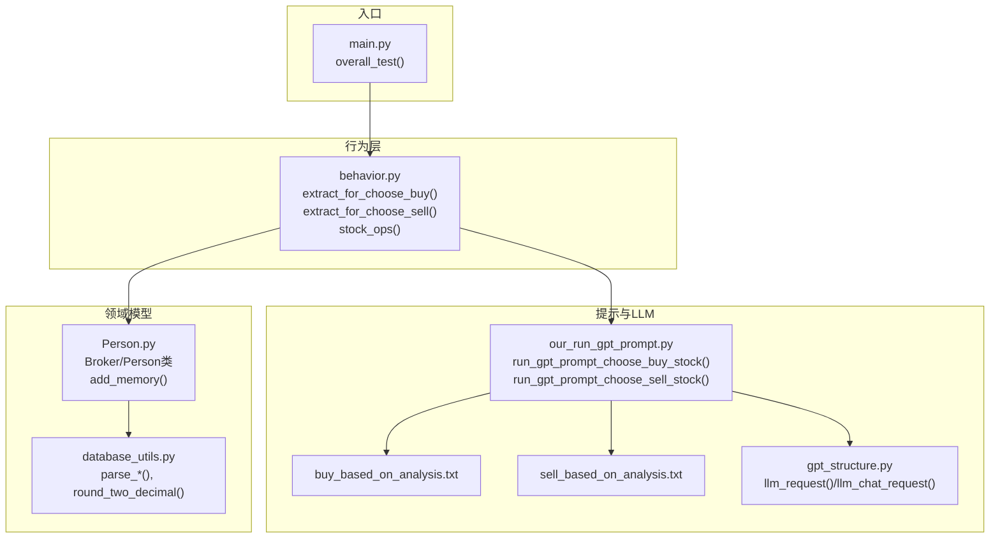
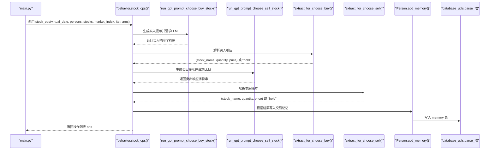
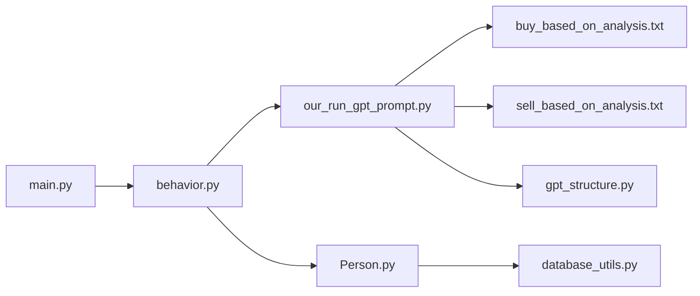

# 交易决策

<cite>
**本文引用的文件**
- [behavior.py](file://Agent-Trading-Arena/Stock_Main/behavior.py)
- [our_run_gpt_prompt.py](file://Agent-Trading-Arena/Stock_Main/content/our_run_gpt_prompt.py)
- [gpt_structure.py](file://Agent-Trading-Arena/Stock_Main/content/gpt_structure.py)
- [buy_based_on_analysis.txt](file://Agent-Trading-Arena/Stock_Main/content/our_prompt_template/buy_based_on_analysis.txt)
- [sell_based_on_analysis.txt](file://Agent-Trading-Arena/Stock_Main/content/our_prompt_template/sell_based_on_analysis.txt)
- [Person.py](file://Agent-Trading-Arena/Stock_Main/Person.py)
- [database_utils.py](file://Agent-Trading-Arena/Stock_Main/database_utils.py)
- [main.py](file://Agent-Trading-Arena/Stock_Main/main.py)
- [test_behavior.py](file://Agent-Trading-Arena/Stock_Main/unit_test/test_behavior.py)
</cite>

## 目录
1. [简介](#简介)
2. [项目结构](#项目结构)
3. [核心组件](#核心组件)
4. [架构总览](#架构总览)
5. [详细组件分析](#详细组件分析)
6. [依赖关系分析](#依赖关系分析)
7. [性能考量](#性能考量)
8. [故障排查指南](#故障排查指南)
9. [结论](#结论)

## 简介
本文件深入解析交易决策在该系统中的实现机制，重点聚焦于以下目标：
- 解释 extract_for_choose_buy 与 extract_for_choose_sell 如何从 LLM 生成的非结构化文本中提取有效的买卖指令；
- 说明正则表达式如何匹配“Operation: buy/sell”格式的输出，并提取股票名称、交易数量和价格等关键字段；
- 结合 stock_ops 函数说明买入与卖出决策的协调流程，包括 hold 状态的处理逻辑、交易记忆的记录（add_memory）以及最终操作列表的构建；
- 通过具体代码示例展示异常处理机制与边界条件（如零值检测）；
- 解释投资金额到股数的转换算法（math.ceil(volume / price_buy)）。

## 项目结构
该项目围绕“行为-提示-执行”的闭环展开：行为模块负责解析 LLM 输出并组织交易操作；提示模板提供给 LLM 的上下文；数据库工具负责数据持久化与解析；主程序驱动每日迭代与市场匹配。

图表来源
- [behavior.py](file://Agent-Trading-Arena/Stock_Main/behavior.py#L15-L56)
- [our_run_gpt_prompt.py](file://Agent-Trading-Arena/Stock_Main/content/our_run_gpt_prompt.py#L486-L618)
- [gpt_structure.py](file://Agent-Trading-Arena/Stock_Main/content/gpt_structure.py#L25-L91)
- [buy_based_on_analysis.txt](file://Agent-Trading-Arena/Stock_Main/content/our_prompt_template/buy_based_on_analysis.txt#L1-L33)
- [sell_based_on_analysis.txt](file://Agent-Trading-Arena/Stock_Main/content/our_prompt_template/sell_based_on_analysis.txt#L1-L31)
- [Person.py](file://Agent-Trading-Arena/Stock_Main/Person.py#L514-L545)
- [database_utils.py](file://Agent-Trading-Arena/Stock_Main/database_utils.py#L27-L49)
- [main.py](file://Agent-Trading-Arena/Stock_Main/main.py#L99-L146)

章节来源
- [main.py](file://Agent-Trading-Arena/Stock_Main/main.py#L99-L146)

## 核心组件
- 行为解析器：从 LLM 输出中提取买卖指令，进行边界校验与转换。
- 提示与LLM调用：构造买入/卖出提示，调用LLM并安全地解析响应。
- 记忆与数据库：将每次操作写入内存表，供后续反思与策略更新使用。
- 主循环：驱动每日迭代、订单撮合、日终结算与反思。

章节来源
- [behavior.py](file://Agent-Trading-Arena/Stock_Main/behavior.py#L15-L56)
- [our_run_gpt_prompt.py](file://Agent-Trading-Arena/Stock_Main/content/our_run_gpt_prompt.py#L486-L618)
- [Person.py](file://Agent-Trading-Arena/Stock_Main/Person.py#L514-L545)
- [database_utils.py](file://Agent-Trading-Arena/Stock_Main/database_utils.py#L27-L49)

## 架构总览
下图展示了从“每日迭代”到“交易执行”的端到端流程，强调了行为解析与LLM交互的关键节点。

图表来源
- [main.py](file://Agent-Trading-Arena/Stock_Main/main.py#L117-L124)
- [behavior.py](file://Agent-Trading-Arena/Stock_Main/behavior.py#L82-L171)
- [our_run_gpt_prompt.py](file://Agent-Trading-Arena/Stock_Main/content/our_run_gpt_prompt.py#L486-L618)
- [Person.py](file://Agent-Trading-Arena/Stock_Main/Person.py#L514-L545)
- [database_utils.py](file://Agent-Trading-Arena/Stock_Main/database_utils.py#L27-L49)

## 详细组件分析

### 正则表达式与字段提取
- 买入解析函数 extract_for_choose_buy 使用正则表达式匹配“Operation: buy”格式，捕获：
  - 股票名称（大写字母）
  - 投资金额（数字或小数）
  - 最佳买入价（数字或小数）
- 卖出解析函数 extract_for_choose_sell 使用正则表达式匹配“Operation: sell”格式，捕获：
  - 股票名称（大写字母）
  - 股份数量（整数）
  - 最佳卖出价（数字或小数）

边界条件与异常处理：
- 若响应包含“hold/Hold”，直接返回“hold”状态；
- 若捕获到的金额或价格为0，则视为无效，返回“hold”；
- 捕获失败时返回 False，便于上层统一处理。

投资金额到股数的转换：
- 使用数学向上取整：math.ceil(volume / price_buy)，确保购买数量满足最小整数要求。

章节来源
- [behavior.py](file://Agent-Trading-Arena/Stock_Main/behavior.py#L15-L35)
- [behavior.py](file://Agent-Trading-Arena/Stock_Main/behavior.py#L37-L56)

### LLM提示与调用
- 买入提示模板 buy_based_on_analysis.txt 明确要求 LLM 输出“Operation: buy, Stock name, Investment Amount, Best Buying Price”或“hold”。
- 卖出提示模板 sell_based_on_analysis.txt 明确要求 LLM 输出“Operation: sell, Stock name, The number of shares, Best Selling Price”或“hold”。

提示构造与验证：
- run_gpt_prompt_choose_buy_stock/run_gpt_prompt_choose_sell_stock 负责拼装输入变量（现金、最低生活费、股票信息、分析结果、策略），调用 LLM 并对响应进行正则验证，清洗后返回标准化字符串。

章节来源
- [buy_based_on_analysis.txt](file://Agent-Trading-Arena/Stock_Main/content/our_prompt_template/buy_based_on_analysis.txt#L1-L33)
- [sell_based_on_analysis.txt](file://Agent-Trading-Arena/Stock_Main/content/our_prompt_template/sell_based_on_analysis.txt#L1-L31)
- [our_run_gpt_prompt.py](file://Agent-Trading-Arena/Stock_Main/content/our_run_gpt_prompt.py#L486-L549)
- [our_run_gpt_prompt.py](file://Agent-Trading-Arena/Stock_Main/content/our_run_gpt_prompt.py#L551-L618)

### 买入与卖出决策的协调流程（stock_ops）
stock_ops 的核心流程如下：
- 对每个参与者：
  - 先调用 analysis 获取分析结果与闲话；
  - 调用 run_gpt_prompt_choose_buy_stock 获取买入建议；
  - 调用 run_gpt_prompt_choose_sell_stock 获取卖出建议；
  - 分别调用 extract_for_choose_buy/extract_for_choose_sell 进行解析与边界检查；
  - 根据解析结果构建 buy_list/sell_list；
  - 将“hold”或实际操作写入交易记忆（add_memory）；
  - 收集所有人的操作，返回 ops 列表。

持有状态处理：
- 当解析结果为“hold”时，不创建订单，仅记录“hold”到内存；
- 当解析结果为“buy/sell”时，按格式写入内存，包含操作摘要、类型、分析结果、市场指数等。

最终操作列表构建：
- ops 是一个二维列表，每个元素为 [buy_list, sell_list]，其中 buy_list/sell_list 为 [type, stock_name, price, quantity] 或 [“hold”, None, None, None]。

章节来源
- [behavior.py](file://Agent-Trading-Arena/Stock_Main/behavior.py#L82-L171)

### 交易记忆记录（add_memory）
- add_memory 将每次迭代的操作、分析、闲话、市场指数、持仓情况等写入 memory 表；
- 数据库解析函数 parse_memory 将数据库记录还原为字典列表，便于后续反思与策略更新。

章节来源
- [Person.py](file://Agent-Trading-Arena/Stock_Main/Person.py#L514-L545)
- [database_utils.py](file://Agent-Trading-Arena/Stock_Main/database_utils.py#L27-L49)

### 异常处理与边界条件
- 正则匹配失败或解析异常时，返回 False，避免后续流程崩溃；
- 零值检测：当投资金额或买入价为0，或卖出数量为0或卖出价为0时，统一转为“hold”，防止无效交易；
- 现金不足保护：买入前若现金低于最低生活费的阈值，直接返回“hold”，避免透支。

章节来源
- [behavior.py](file://Agent-Trading-Arena/Stock_Main/behavior.py#L15-L35)
- [behavior.py](file://Agent-Trading-Arena/Stock_Main/behavior.py#L37-L56)
- [our_run_gpt_prompt.py](file://Agent-Trading-Arena/Stock_Main/content/our_run_gpt_prompt.py#L519-L521)

### 投资金额到股数的转换算法
- 数学向上取整：math.ceil(volume / price_buy)，确保以当前价格能购买到至少所需的整数股数；
- 该算法保证不会因价格波动导致购买数量不足，同时避免浪费小额资金。

章节来源
- [behavior.py](file://Agent-Trading-Arena/Stock_Main/behavior.py#L29-L31)

## 依赖关系分析

图表来源
- [behavior.py](file://Agent-Trading-Arena/Stock_Main/behavior.py#L1-L12)
- [our_run_gpt_prompt.py](file://Agent-Trading-Arena/Stock_Main/content/our_run_gpt_prompt.py#L1-L11)
- [gpt_structure.py](file://Agent-Trading-Arena/Stock_Main/content/gpt_structure.py#L1-L11)
- [Person.py](file://Agent-Trading-Arena/Stock_Main/Person.py#L1-L16)
- [database_utils.py](file://Agent-Trading-Arena/Stock_Main/database_utils.py#L1-L10)
- [main.py](file://Agent-Trading-Arena/Stock_Main/main.py#L9-L14)

## 性能考量
- LLM 请求次数：每日迭代中，每人会进行一次买入与一次卖出请求，整体为 2 × Num_Person × Iterations_Daily 次请求；
- 正则匹配与浮点转换开销较小，主要瓶颈在 LLM 延迟与网络；
- 建议：
  - 合理设置 Iterations_Daily 与 Num_Person，避免 LLM 调用过多；
  - 在本地或边缘部署以降低网络延迟；
  - 对 LLM 响应进行缓存（若业务允许）以减少重复调用。

## 故障排查指南
- LLM 返回格式不符合预期：
  - 检查提示模板是否完整，确认示例输出与特殊指令一致；
  - 查看验证函数的正则表达式是否覆盖所有可能格式；
  - 参考单元测试用例，定位问题响应样例。
- 解析失败或返回 False：
  - 检查正则表达式是否与 LLM 输出严格一致（大小写、空格、标点）；
  - 确认输入参数（如分析结果、闲话）是否为空或格式错误。
- 零值导致“hold”：
  - 检查 LLM 是否正确输出金额/价格；
  - 确认提示模板中是否提供了足够的上下文（如最低生活费、现有资产）。
- 记忆未写入：
  - 检查 add_memory 的 SQL 插入语句与数据库连接；
  - 确认 parse_memory 能正确解析 memory 表字段。

章节来源
- [test_behavior.py](file://Agent-Trading-Arena/Stock_Main/unit_test/test_behavior.py#L20-L46)
- [test_behavior.py](file://Agent-Trading-Arena/Stock_Main/unit_test/test_behavior.py#L48-L66)

## 结论
该系统通过明确的提示模板与严格的正则解析，将 LLM 的非结构化输出转化为可执行的交易指令。行为模块在解析阶段完成边界校验与金额到股数的转换，主循环负责协调多参与者的买卖决策并将每一步操作记录到内存中，形成可回溯、可反思的数据基础。通过合理的异常处理与边界条件控制，系统在保证稳健性的同时，具备良好的扩展性与可维护性。