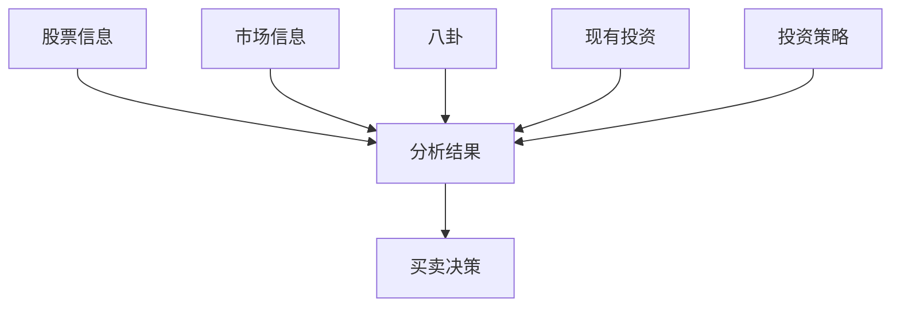
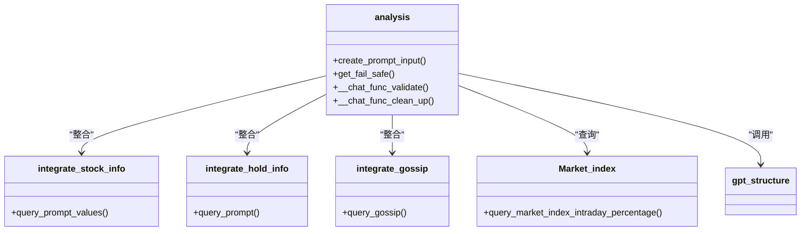

# 市场分析

<cite>
**本文档中引用的文件**  
- [behavior.py](file://Agent-Trading-Arena/Stock_Main/behavior.py)
- [our_run_gpt_prompt.py](file://Agent-Trading-Arena/Stock_Main/content/our_run_gpt_prompt.py)
- [gpt_structure.py](file://Agent-Trading-Arena/Stock_Main/content/gpt_structure.py)
- [analysis.txt](file://Agent-Trading-Arena/Stock_Main/content/our_prompt_template/analysis.txt)
- [stock_information.txt](file://Agent-Trading-Arena/Stock_Main/content/our_prompt_template/stock_information.txt)
- [hold_information.txt](file://Agent-Trading-Arena/Stock_Main/content/our_prompt_template/hold_information.txt)
- [Person.py](file://Agent-Trading-Arena/Stock_Main/Person.py)
- [Stock.py](file://Agent-Trading-Arena/Stock_Main/Stock.py)
- [Market.py](file://Agent-Trading-Arena/Stock_Main/Market.py)
</cite>

## 目录
1. [引言](#引言)
2. [核心流程概述](#核心流程概述)
3. [多源数据整合机制](#多源数据整合机制)
4. [提示模板与GPT调用机制](#提示模板与gpt调用机制)
5. [输出验证与清理逻辑](#输出验证与清理逻辑)
6. [分析结果结构与交易决策](#分析结果结构与交易决策)
7. [调试日志生成机制](#调试日志生成机制)
8. [系统架构与组件关系](#系统架构与组件关系)

## 引言
本文件详细阐述了`behavior`模块中的`analysis`函数如何驱动市场分析流程。该函数作为交易决策的核心引擎，负责整合股票信息、代理持仓情况和市场八卦等多源数据，并结合市场指数变化构建完整的上下文输入。通过调用GPT提示模板（analysis.txt），该函数生成战略分析结果，为后续的买卖决策提供依据。本文将深入分析其数据整合机制、提示工程设计、输出验证与清理逻辑，以及调试日志的生成过程。

## 核心流程概述
`analysis`函数是市场分析流程的核心，它被`stock_ops`函数调用以生成每个代理的市场分析结果。该函数接收虚拟日期、代理对象、股票列表、市场指数、分析数量、八卦最大数量和保存路径等参数。其主要任务是整合多源信息，构建一个全面的市场分析上下文，并通过调用GPT模型生成结构化的分析结果。生成的分析结果随后被用于`run_gpt_prompt_choose_buy_stock`和`run_gpt_prompt_choose_sell_stock`函数，以做出具体的买卖决策。

**Section sources**
- [behavior.py](file://Agent-Trading-Arena/Stock_Main/behavior.py#L82-L171)

## 多源数据整合机制
`analysis`函数通过调用多个辅助函数来整合不同来源的数据，构建完整的分析上下文。

### 股票信息整合
`integrate_stock_info`函数负责整合所有股票的详细信息。它遍历股票列表，为每只股票加载预定义的提示模板（stock_information.txt），并用实际的股票数据填充模板中的占位符。这些数据包括股票名称、过去5天的收盘价、每股股息、当前价格变动、当前价格、盘中最高价、盘中最低价和盘中均价。整合后的信息以结构化格式呈现，便于GPT模型理解。

**Section sources**
- [our_run_gpt_prompt.py](file://Agent-Trading-Arena/Stock_Main/content/our_run_gpt_prompt.py#L54-L78)
- [stock_information.txt](file://Agent-Trading-Arena/Stock_Main/content/our_prompt_template/stock_information.txt)

### 代理持仓情况整合
`integrate_hold_info`函数负责整合代理的持仓信息。它查询代理在当前虚拟日期的持仓列表，计算总价值，并为每只持有的股票生成详细信息。这些信息包括持股数量、总价值、资本收益、过去5天的价格、当前价格变动、当前价格和成本价。如果代理没有持有任何股票，则返回相应的提示。整合后的信息以“您持有以下股票”的格式呈现，为GPT模型提供代理的财务状况。

**Section sources**
- [our_run_gpt_prompt.py](file://Agent-Trading-Arena/Stock_Main/content/our_run_gpt_prompt.py#L81-L111)
- [hold_information.txt](file://Agent-Trading-Arena/Stock_Main/content/our_prompt_template/hold_information.txt)

### 市场八卦整合
`integrate_gossip`函数负责整合市场八卦信息。它从代理的记忆中查询其他代理在当前虚拟日期的八卦，并随机选择一定数量的八卦（数量在0到gossip_num_max之间）进行整合。这些八卦可能包含真实的或虚假的市场信息，旨在影响其他代理的决策。整合后的信息以列表形式呈现，每条八卦前加“-”符号。

**Section sources**
- [our_run_gpt_prompt.py](file://Agent-Trading-Arena/Stock_Main/content/our_run_gpt_prompt.py#L9-L19)

### 市场指数变化
`analysis`函数还直接获取市场指数的日内变化百分比，并将其格式化为“当前市场指数变化：X.XX%”的字符串。这一信息为GPT模型提供了整体市场的宏观视角，帮助其判断市场是处于上涨、下跌还是盘整状态。

**Section sources**
- [behavior.py](file://Agent-Trading-Arena/Stock_Main/behavior.py#L417-L419)
- [Stock.py](file://Agent-Trading-Arena/Stock_Main/Stock.py#L291-L295)

## 提示模板与GPT调用机制
`analysis`函数使用预定义的提示模板（analysis.txt）来指导GPT模型生成分析结果。

### 提示模板设计
`analysis.txt`模板定义了五个输入变量：股票信息、市场信息、八卦、现有投资和投资策略。模板的指令部分明确了GPT模型的角色——一个参与模拟股票交易挑战的玩家，其目标是最大化利润。任务要求GPT模型基于提供的信息，总结出最核心和有价值的分析结果，且每个结果都必须与投资策略相关联。这种设计确保了分析结果的聚焦性和实用性。

**Diagram sources**
- [analysis.txt](file://Agent-Trading-Arena/Stock_Main/content/our_prompt_template/analysis.txt)

### GPT调用流程
`analysis`函数首先调用`create_prompt_input`函数生成包含所有整合数据的输入列表。然后，它使用`generate_prompt`函数将这些数据填充到`analysis.txt`模板中，生成最终的提示文本。接着，该函数调用`llm_safe_generate_response_structured`函数，将提示文本发送给GPT模型。该函数会进行多次尝试（最多50次），并使用验证和清理函数确保输出的正确性。

**Section sources**
- [our_run_gpt_prompt.py](file://Agent-Trading-Arena/Stock_Main/content/our_run_gpt_prompt.py#L414-L484)
- [gpt_structure.py](file://Agent-Trading-Arena/Stock_Main/content/gpt_structure.py#L169-L224)

## 输出验证与清理逻辑
为了确保GPT模型输出的分析结果符合预期格式，`analysis`函数实现了严格的验证和清理机制。

### 输出格式验证
`__chat_func_validate`函数负责验证GPT模型的输出。它使用正则表达式检查输出是否以“The analysis results:”开头，并且每个分析结果是否以“-”开头。此外，它还验证分析结果的数量是否与`analysis_num`参数指定的数量一致。只有通过验证的输出才会被接受，否则函数会进行下一次尝试。

**Section sources**
- [our_run_gpt_prompt.py](file://Agent-Trading-Arena/Stock_Main/content/our_run_gpt_prompt.py#L440-L453)

### 输出清理逻辑
`__chat_func_clean_up`函数负责清理GPT模型的输出。它移除输出中可能存在的“The analysis results:”前缀，确保返回的分析结果是纯净的列表形式。这种清理逻辑简化了后续对分析结果的处理，使其可以直接用于买卖决策函数。

**Section sources**
- [our_run_gpt_prompt.py](file://Agent-Trading-Arena/Stock_Main/content/our_run_gpt_prompt.py#L435-L438)

## 分析结果结构与交易决策
`analysis`函数生成的分析结果是一个结构化的字符串列表，每个条目都以“-”开头，描述一个具体的市场洞察。

### 分析结果结构
分析结果的结构严格遵循提示模板的要求。每个条目都应包含对股票信息、市场信息、现有投资、投资策略和八卦的综合分析。例如，一个典型的分析结果可能是：“- 股票A的股价在过去5天持续上涨，且市场指数也呈上升趋势，结合我的投资策略‘尝试最大化利润’，建议买入股票A。” 这种结构化的输出确保了信息的清晰和可操作性。

### 在交易决策中的作用
生成的分析结果直接作为`run_gpt_prompt_choose_buy_stock`和`run_gpt_prompt_choose_sell_stock`函数的输入。这些函数使用各自的提示模板（buy_based_on_analysis.txt和sell_based_on_analysis.txt），结合分析结果、代理的现金状况和投资策略，生成具体的买卖操作指令。因此，`analysis`函数的质量直接决定了整个交易系统的性能。

**Section sources**
- [behavior.py](file://Agent-Trading-Arena/Stock_Main/behavior.py#L87-L125)
- [our_run_gpt_prompt.py](file://Agent-Trading-Arena/Stock_Main/content/our_run_gpt_prompt.py#L486-L548)

## 调试日志生成机制
为了便于调试和分析，系统在运行过程中会生成详细的日志文件。

### 日志文件生成
当`analysis`函数被调用时，如果提供了`save_path`参数，它会将生成的完整提示文本写入`debug_prompts`目录下的日志文件中。文件名遵循`day{virtual_date}_iter{person_id}_market_analysis_prompt.txt`的命名规则。例如，`day0_iter0_market_analysis_prompt.txt`记录了在第0天、第0个代理的市场分析提示。

### 调试价值
这些日志文件具有极高的调试价值。开发者可以通过检查日志文件，验证输入数据是否正确整合，提示模板是否被正确填充，以及GPT模型接收到的完整上下文。这有助于诊断分析结果不理想的原因，例如是数据整合问题、提示工程问题，还是GPT模型本身的问题。通过对比不同代理或不同时间点的日志，可以深入理解系统的决策过程。

**Section sources**
- [our_run_gpt_prompt.py](file://Agent-Trading-Arena/Stock_Main/content/our_run_gpt_prompt.py#L459-L464)

## 系统架构与组件关系
整个系统由多个相互协作的组件构成，`analysis`函数位于决策流程的核心。

**Diagram sources**
- [behavior.py](file://Agent-Trading-Arena/Stock_Main/behavior.py)
- [our_run_gpt_prompt.py](file://Agent-Trading-Arena/Stock_Main/content/our_run_gpt_prompt.py)
- [Stock.py](file://Agent-Trading-Arena/Stock_Main/Stock.py)
- [Person.py](file://Agent-Trading-Arena/Stock_Main/Person.py)