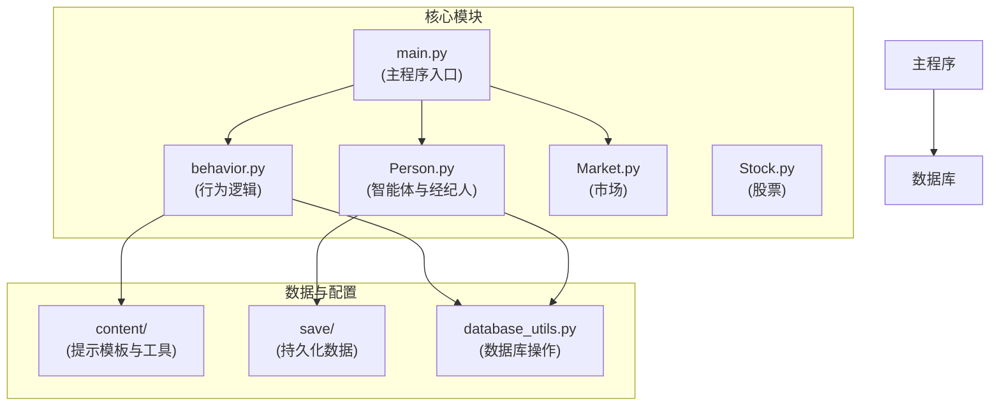
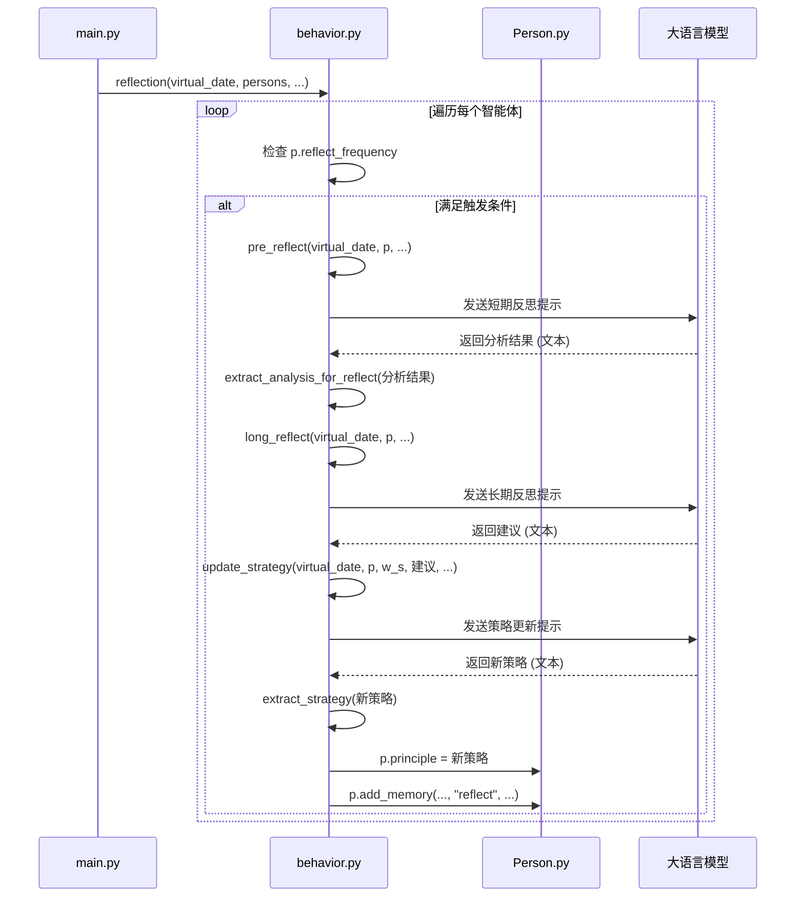
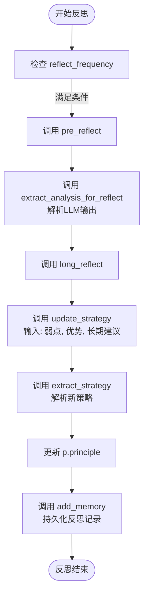
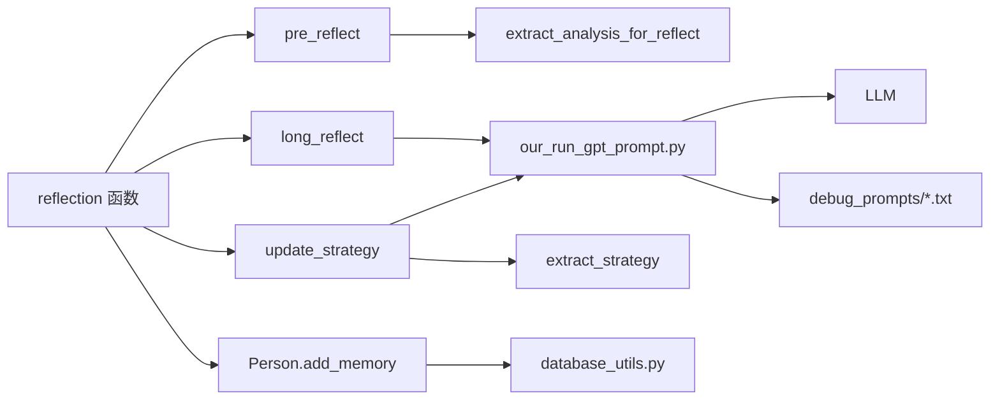

# 自我反思

<cite>
**本文档中引用的文件**  
- [main.py](file://Agent-Trading-Arena/Stock_Main/main.py)
- [Person.py](file://Agent-Trading-Arena/Stock_Main/Person.py)
- [behavior.py](file://Agent-Trading-Arena/Stock_Main/behavior.py)
- [reflect.txt](file://Agent-Trading-Arena/Stock_Main/content/our_prompt_template/reflect.txt)
- [pre_reflect.txt](file://Agent-Trading-Arena/Stock_Main/content/our_prompt_template/pre_reflect.txt)
- [long_reflect_infor.txt](file://Agent-Trading-Arena/Stock_Main/content/our_prompt_template/long_reflect_infor.txt)
- [persona.json](file://Agent-Trading-Arena/Stock_Main/save/sim_test01/persona.json)
- [day0_long_reflection_prompt.txt](file://Agent-Trading-Arena/Stock_Main/save/sim_test01/debug_prompts/day0_long_reflection_prompt.txt)
- [day0_short_reflection_prompt.txt](file://Agent-Trading-Arena/Stock_Main/save/sim_test01/debug_prompts/day0_short_reflection_prompt.txt)
- [day0_strategy_update_prompt.txt](file://Agent-Trading-Arena/Stock_Main/save/sim_test01/debug_prompts/day0_strategy_update_prompt.txt)
</cite>

## 目录
1. [引言](#引言)
2. [项目结构](#项目结构)
3. [核心组件](#核心组件)
4. [架构概述](#架构概述)
5. [详细组件分析](#详细组件分析)
6. [依赖分析](#依赖分析)
7. [性能考虑](#性能考虑)
8. [故障排除指南](#故障排除指南)
9. [结论](#结论)

## 引言
本文档全面介绍智能体在交易模拟系统中的自我反思机制。该机制允许智能体根据其`reflect_frequency`参数周期性地评估和更新其投资策略，从而实现长期行为演化。通过分析`pre_reflect`、`long_reflect`和`update_strategy`函数的调用链路，以及`extract_analysis_for_reflect`和`extract_strategy`函数在解析大语言模型（LLM）输出中的作用，本文将阐明智能体如何生成短期分析输入、获得长期反思建议，并最终更新其交易原则（principle）。此外，文档还将结合调试文件（如`long_reflection_prompt.txt`）说明该机制的可追溯性和调试方法。

## 项目结构
该项目是一个基于大语言模型的智能体交易模拟环境，其核心功能围绕智能体的决策、交易和自我反思展开。项目结构清晰地分离了不同职责的模块：`main.py`作为主入口负责整体流程控制；`Person.py`定义了智能体（Person）和经纪人（Broker）的核心行为；`behavior.py`包含了所有与智能体行为相关的函数，特别是反思机制；`content/our_prompt_template/`目录下存放了用于与LLM交互的提示模板；`save/`目录用于存储每次运行的持久化数据，包括智能体的个人档案（persona.json）和调试信息。

**图源**
- [main.py](file://Agent-Trading-Arena/Stock_Main/main.py#L1-L151)
- [Person.py](file://Agent-Trading-Arena/Stock_Main/Person.py#L1-L629)
- [behavior.py](file://Agent-Trading-Arena/Stock_Main/behavior.py#L1-L210)

**节源**
- [main.py](file://Agent-Trading-Arena/Stock_Main/main.py#L1-L151)
- [Person.py](file://Agent-Trading-Arena/Stock_Main/Person.py#L1-L629)
- [behavior.py](file://Agent-Trading-Arena/Stock_Main/behavior.py#L1-L210)

## 核心组件
本系统的核心组件是`Person`类，它代表了参与交易的智能体。每个智能体都拥有一个`principle`（交易原则）和一个`reflect_frequency`（反思频率）参数。`behavior.py`模块中的`reflection`函数是整个反思机制的驱动者，它在每个交易日的特定迭代中被调用。该函数根据`reflect_frequency`决定是否触发反思流程，并依次调用`pre_reflect`、`long_reflect`和`update_strategy`函数，形成一个完整的策略更新闭环。`extract_analysis_for_reflect`和`extract_strategy`函数则作为解析器，负责从LLM的文本输出中提取结构化信息。

**节源**
- [Person.py](file://Agent-Trading-Arena/Stock_Main/Person.py#L143-L629)
- [behavior.py](file://Agent-Trading-Arena/Stock_Main/behavior.py#L174-L210)

## 架构概述
系统的整体架构遵循一个清晰的循环流程：初始化 -> 每日循环 -> 每日内迭代循环 -> 交易操作 -> 反思 -> 持久化。在每次迭代的末尾，`main.py`中的`overall_test`函数会调用`behavior.py`中的`reflection`函数。该函数遍历所有智能体，检查其`reflect_frequency`。如果满足触发条件，智能体将启动三阶段反思流程：首先，`pre_reflect`生成短期分析，评估当前策略的优缺点；其次，`long_reflect`生成长期反思建议；最后，`update_strategy`综合前两者的输出，生成新的交易原则。整个过程通过`add_memory`函数将关键信息持久化到数据库中，确保了行为的可追溯性。

**图源**
- [main.py](file://Agent-Trading-Arena/Stock_Main/main.py#L117-L134)
- [behavior.py](file://Agent-Trading-Arena/Stock_Main/behavior.py#L174-L197)
- [Person.py](file://Agent-Trading-Arena/Stock_Main/Person.py#L514-L546)

## 详细组件分析
### 反思机制分析
智能体的自我反思机制是一个周期性的策略优化过程，其核心在于`reflect_frequency`参数的控制和三个关键函数的协同工作。

#### 反思触发与调用链路
反思的触发由`behavior.py`中的`reflection`函数控制。该函数在`main.py`的每日迭代循环末尾被调用。对于每个智能体，它检查`p.reflect_frequency`的值：
- 如果值为0，则跳过反思。
- 否则，检查当前迭代次数`(iter + 1)`是否为`reflect_frequency`的倍数。如果是，则触发反思流程。

触发后，调用链路如下：
1.  **`pre_reflect`**: 生成短期分析输入。此函数收集智能体在最近几次迭代中的交易操作、财务状况、市场信息等，形成一个综合报告，并将其发送给LLM。LLM根据`pre_reflect.txt`模板的指令，分析当前策略的“弱点”和“优势”。
2.  **`long_reflect`**: 生成长期反思建议。此函数提供更宏观的视角，包括智能体的现金、财富、持仓、市场信息和当前策略，发送给LLM。LLM根据`long_reflect_infor.txt`模板，提供关于如何改进策略的建议。
3.  **`update_strategy`**: 更新交易原则。此函数将`pre_reflect`的分析结果（弱点和优势）和`long_reflect`的建议作为输入，发送给LLM。LLM根据`reflect.txt`模板，综合这些信息，生成一句宏观的、指导性的新投资策略。

**图源**
- [behavior.py](file://Agent-Trading-Arena/Stock_Main/behavior.py#L174-L197)
- [behavior.py](file://Agent-Trading-Arena/Stock_Main/behavior.py#L58-L79)
- [behavior.py](file://Agent-Trading-Arena/Stock_Main/behavior.py#L72-L79)

**节源**
- [behavior.py](file://Agent-Trading-Arena/Stock_Main/behavior.py#L174-L197)

### LLM输出解析与持久化
在反思流程中，从LLM返回的输出是自然语言文本，系统需要从中提取关键信息。这由两个专门的解析函数完成：
- **`extract_analysis_for_reflect`**: 该函数使用正则表达式从`pre_reflect`的LLM输出中提取“弱点”和“优势”部分。它确保了非结构化文本能被转化为结构化的数据，供`update_strategy`使用。
- **`extract_strategy`**: 该函数使用正则表达式从`update_strategy`的LLM输出中提取以“New investment strategy:”开头的新策略文本。这是更新智能体`principle`的直接来源。

反思的结果通过`Person`类的`add_memory`函数被持久化。该函数将反思类型（"reflect"）、分析结果、策略更新等信息写入数据库的`memory`表。这不仅记录了智能体的决策历史，也为未来的分析和调试提供了宝贵的数据。

**节源**
- [behavior.py](file://Agent-Trading-Arena/Stock_Main/behavior.py#L58-L79)
- [Person.py](file://Agent-Trading-Arena/Stock_Main/Person.py#L514-L546)

## 依赖分析
该反思机制依赖于多个模块和文件的协同工作。`behavior.py`是核心，它依赖于`Person.py`中的智能体状态和`database_utils.py`进行数据读写。`content/our_run_gpt_prompt.py`模块提供了与LLM通信的接口，而具体的提示模板（如`reflect.txt`）则定义了与LLM交互的规则和期望的输出格式。`save/`目录下的调试文件（如`day0_long_reflection_prompt.txt`）是`our_run_gpt_prompt.py`在运行时生成的，用于记录发送给LLM的实际提示，这对于调试和验证LLM的输入至关重要。

**图源**
- [behavior.py](file://Agent-Trading-Arena/Stock_Main/behavior.py#L1-L210)
- [Person.py](file://Agent-Trading-Arena/Stock_Main/Person.py#L514-L546)
- [day0_long_reflection_prompt.txt](file://Agent-Trading-Arena/Stock_Main/save/sim_test01/debug_prompts/day0_long_reflection_prompt.txt)

**节源**
- [behavior.py](file://Agent-Trading-Arena/Stock_Main/behavior.py#L1-L210)
- [Person.py](file://Agent-Trading-Arena/Stock_Main/Person.py#L514-L546)

## 性能考虑
该反思机制的性能开销主要来自与大语言模型（LLM）的API调用。每次反思都会产生三次独立的LLM调用（`pre_reflect`、`long_reflect`、`update_strategy`），这会显著增加运行时间和成本。`reflect_frequency`参数是控制此开销的关键：频率越高，智能体越能适应市场变化，但计算成本也越高。在`persona.json`中，不同智能体被配置了不同的`reflect_frequency`（如2、4、6），这允许研究不同反思频率对智能体长期行为和整体市场动态的影响。

## 故障排除指南
当反思机制未按预期工作时，应遵循以下步骤进行排查：
1.  **检查 `reflect_frequency`**: 确认智能体的`reflect_frequency`不为0，且当前迭代次数满足触发条件。
2.  **检查调试文件**: 查看`save/[run_name]/debug_prompts/`目录下的`*_reflection_prompt.txt`和`*_result.txt`文件。这些文件记录了发送给LLM的完整提示和收到的响应，可用于验证输入数据是否正确，以及LLM的输出是否符合预期格式。
3.  **检查解析函数**: 如果LLM的响应格式与提示模板的要求有偏差，`extract_analysis_for_reflect`或`extract_strategy`可能会解析失败。检查`behavior.py`中的正则表达式是否能匹配实际的LLM输出。
4.  **检查数据库**: 使用数据库工具查询`memory`表，确认`add_memory`函数是否成功记录了反思事件。

**节源**
- [behavior.py](file://Agent-Trading-Arena/Stock_Main/behavior.py#L174-L197)
- [day0_long_reflection_prompt.txt](file://Agent-Trading-Arena/Stock_Main/save/sim_test01/debug_prompts/day0_long_reflection_prompt.txt)
- [Person.py](file://Agent-Trading-Arena/Stock_Main/Person.py#L514-L546)

## 结论
智能体的自我反思机制是该交易模拟系统的核心创新之一。它通过`reflect_frequency`参数实现了策略更新的周期性控制，并通过`pre_reflect`、`long_reflect`和`update_strategy`的调用链路，构建了一个从短期评估到长期规划再到策略更新的完整闭环。`extract_analysis_for_reflect`和`extract_strategy`函数确保了与LLM交互的可靠性，而`add_memory`函数则保证了所有决策过程的可追溯性。这一机制不仅使智能体能够适应动态的市场环境，也为研究智能体的长期行为演化和市场宏观动态提供了强大的工具。通过调整`reflect_frequency`和分析调试日志，可以深入理解不同反思策略对投资回报的影响。