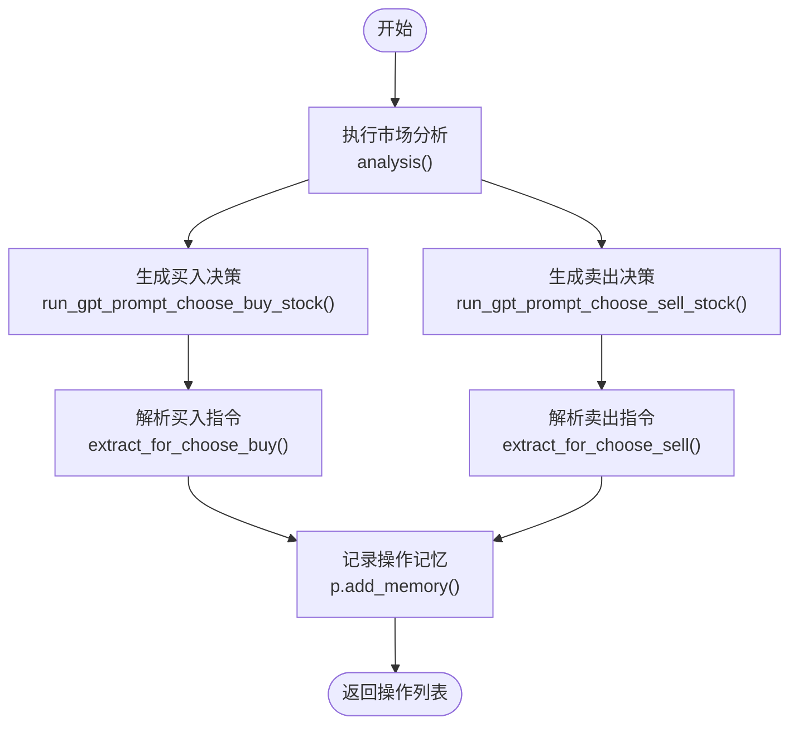
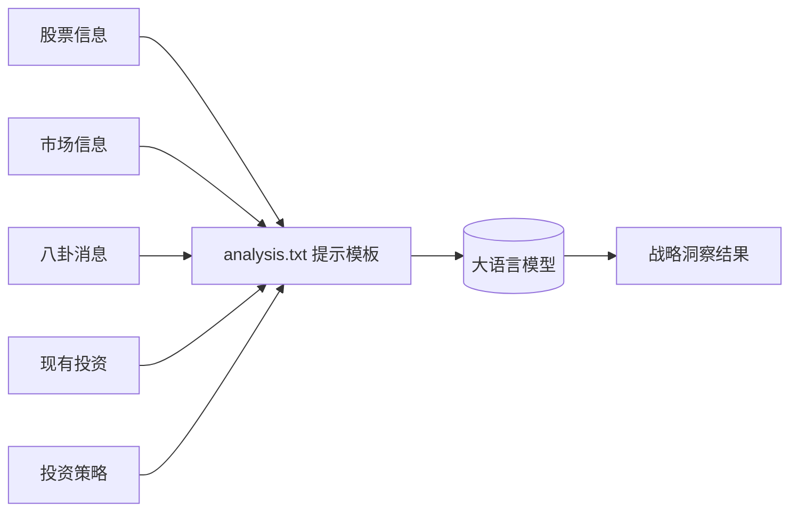
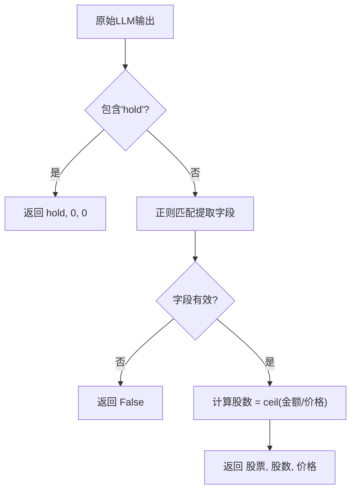
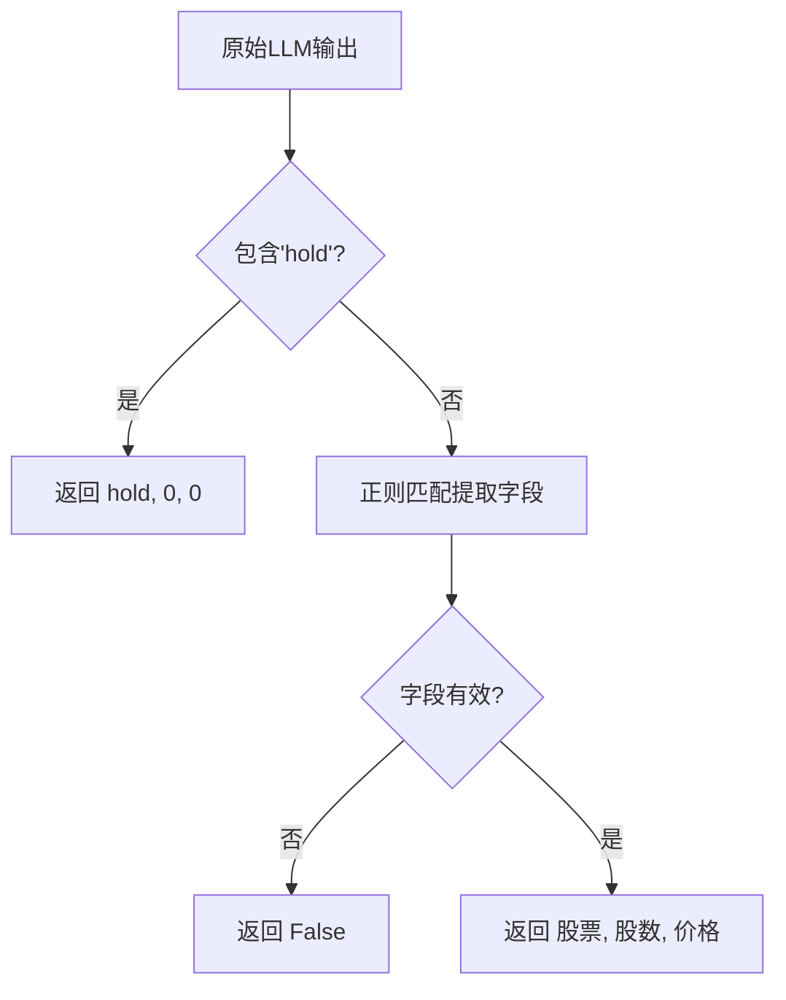
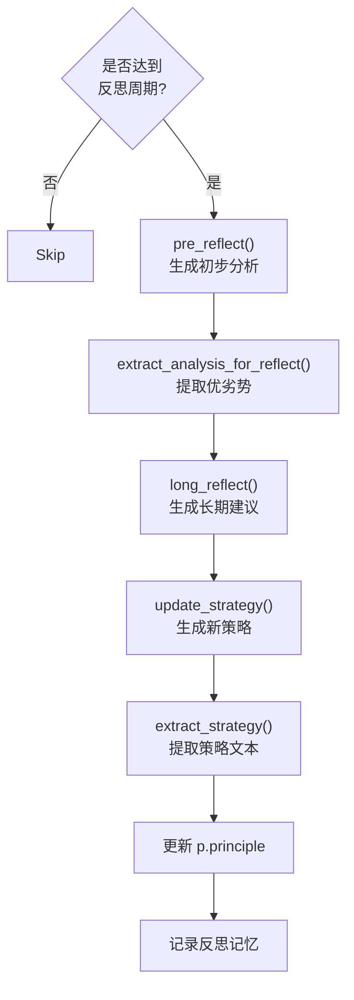
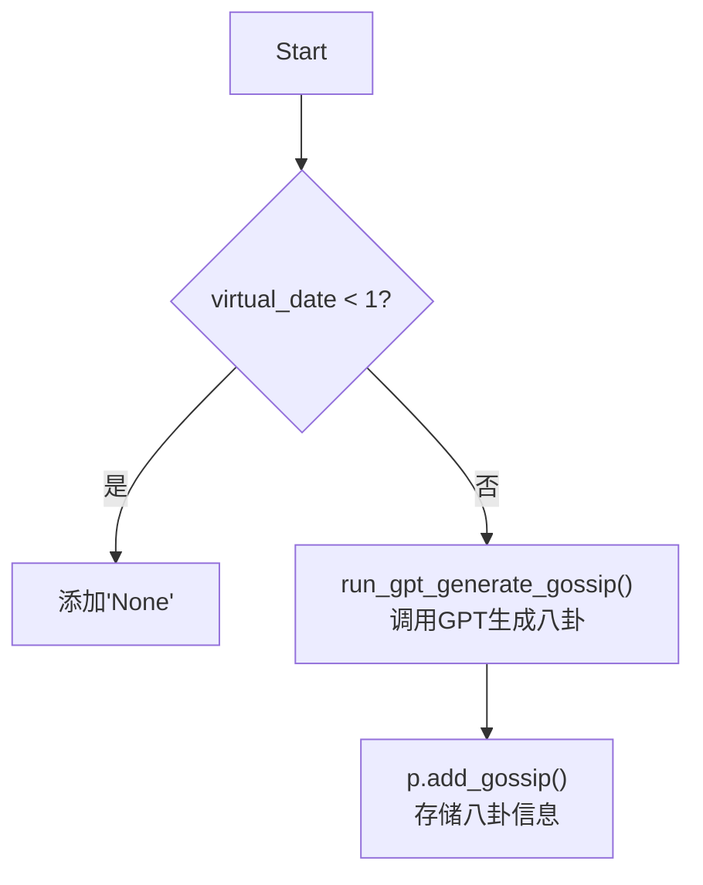

# 行为决策引擎

<cite>
**本文档引用文件**  
- [behavior.py](file://Agent-Trading-Arena/Stock_Main/behavior.py)
- [analysis.txt](file://Agent-Trading-Arena/Stock_Main/content/our_prompt_template/analysis.txt)
- [buy_based_on_analysis.txt](file://Agent-Trading-Arena/Stock_Main/content/our_prompt_template/buy_based_on_analysis.txt)
- [sell_based_on_analysis.txt](file://Agent-Trading-Arena/Stock_Main/content/our_prompt_template/sell_based_on_analysis.txt)
- [gossip.txt](file://Agent-Trading-Arena/Stock_Main/content/our_prompt_template/gossip.txt)
- [gossip_info.txt](file://Agent-Trading-Arena/Stock_Main/content/our_prompt_template/gossip_info.txt)
- [reflect.txt](file://Agent-Trading-Arena/Stock_Main/content/our_prompt_template/reflect.txt)
- [long_reflect_infor.txt](file://Agent-Trading-Arena/Stock_Main/content/our_prompt_template/long_reflect_infor.txt)
</cite>

## 目录
1. [简介](#简介)
2. [核心决策流程](#核心决策流程)
3. [市场分析与战略洞察生成](#市场分析与战略洞察生成)
4. [买卖指令提取机制](#买卖指令提取机制)
5. [自我反思与策略更新](#自我反思与策略更新)
6. [八卦信息生成逻辑](#八卦信息生成逻辑)
7. [总结](#总结)

## 简介
本系统构建了一个基于大语言模型（LLM）的智能体行为决策引擎，用于在模拟股票交易环境中驱动智能体进行投资决策。该引擎通过`behavior`模块协调市场分析、交易决策、八卦信息生成和策略反思等关键功能，形成完整的决策闭环。每个智能体根据其个性、持仓、市场动态和投资策略，自主生成交易行为。

## 核心决策流程

`stock_ops`函数是整个行为决策引擎的核心，负责协调市场分析、买卖决策和记忆记录的完整流程。该函数在每个迭代周期中为每位参与者生成买入和卖出操作指令。



**图示来源**  
- [behavior.py](file://Agent-Trading-Arena/Stock_Main/behavior.py#L82-L171)

**本节来源**  
- [behavior.py](file://Agent-Trading-Arena/Stock_Main/behavior.py#L82-L171)

## 市场分析与战略洞察生成

`analysis`函数整合多源信息，通过预设的GPT提示模板生成战略洞察，为后续的买卖决策提供依据。该函数接收虚拟日期、参与者对象、股票列表、市场指数等参数，并调用外部GPT提示系统生成分析结果。

输入信息包括：
- **股票信息**：各股票的当前价格、波动性等基本数据
- **市场信息**：整体市场趋势与指数变化
- **八卦消息**：来自其他参与者的传闻信息（可能为真或假）
- **现有投资**：参与者当前的持仓情况
- **投资策略**：参与者的个性化投资原则



**图示来源**  
- [analysis.txt](file://Agent-Trading-Arena/Stock_Main/content/our_prompt_template/analysis.txt)

**本节来源**  
- [behavior.py](file://Agent-Trading-Arena/Stock_Main/behavior.py#L87-L88)
- [analysis.txt](file://Agent-Trading-Arena/Stock_Main/content/our_prompt_template/analysis.txt)

## 买卖指令提取机制

系统通过正则表达式从非结构化的LLM输出中精确提取有效的交易指令，确保决策结果可被程序化执行。

### 买入指令解析
`extract_for_choose_buy`函数解析LLM生成的买入建议，提取股票名称、投资金额和最佳买入价格，并计算应购买的股数。

输入格式要求：
```
Operation: buy, Stock name: A, Investment Amount: $1000, Best Buying Price: $50
```



**图示来源**  
- [behavior.py](file://Agent-Trading-Arena/Stock_Main/behavior.py#L15-L34)
- [buy_based_on_analysis.txt](file://Agent-Trading-Arena/Stock_Main/content/our_prompt_template/buy_based_on_analysis.txt)

### 卖出指令解析
`extract_for_choose_sell`函数解析LLM生成的卖出建议，提取股票名称、卖出股数和最佳卖出价格。

输入格式要求：
```
Operation: sell, Stock name: A, The number of shares: 20, Best Selling Price: $55
```



**图示来源**  
- [behavior.py](file://Agent-Trading-Arena/Stock_Main/behavior.py#L37-L55)
- [sell_based_on_analysis.txt](file://Agent-Trading-Arena/Stock_Main/content/our_prompt_template/sell_based_on_analysis.txt)

**本节来源**  
- [behavior.py](file://Agent-Trading-Arena/Stock_Main/behavior.py#L15-L55)

## 自我反思与策略更新

`reflection`函数实现智能体的周期性自我反思机制，支持短期和长期反思，动态更新投资策略以适应市场变化。

### 反思触发机制
- **频率控制**：由`p.reflect_frequency`参数控制，若为0则不进行反思
- **周期触发**：当`(iter + 1) % p.reflect_frequency == 0`时触发反思

### 反思执行流程


**图示来源**  
- [behavior.py](file://Agent-Trading-Arena/Stock_Main/behavior.py#L174-L198)
- [reflect.txt](file://Agent-Trading-Arena/Stock_Main/content/our_prompt_template/reflect.txt)

**本节来源**  
- [behavior.py](file://Agent-Trading-Arena/Stock_Main/behavior.py#L174-L198)

## 八卦信息生成逻辑

`generate_gossip`函数允许智能体在每日交易后生成八卦信息，影响其他参与者的决策行为，增加市场博弈的复杂性。

### 信息生成流程


八卦信息基于参与者的历史行为生成，可以是真实信息或故意制造的虚假信息，但不能与已知的股票和市场信息相冲突。

**图示来源**  
- [behavior.py](file://Agent-Trading-Arena/Stock_Main/behavior.py#L201-L209)
- [gossip.txt](file://Agent-Trading-Arena/Stock_Main/content/our_prompt_template/gossip.txt)

**本节来源**  
- [behavior.py](file://Agent-Trading-Arena/Stock_Main/behavior.py#L201-L209)

## 总结
行为决策引擎通过`behavior`模块实现了完整的智能体决策闭环，包括市场分析、交易决策、指令解析、自我反思和信息博弈等核心功能。系统利用大语言模型的强大推理能力，结合结构化提示模板和正则解析技术，将非结构化文本输出转化为可执行的交易指令。同时，通过周期性反思机制，智能体能够持续优化其投资策略，适应动态变化的市场环境。八卦信息生成功能进一步增加了系统博弈的深度，模拟了真实金融市场中的信息传播与操纵现象。