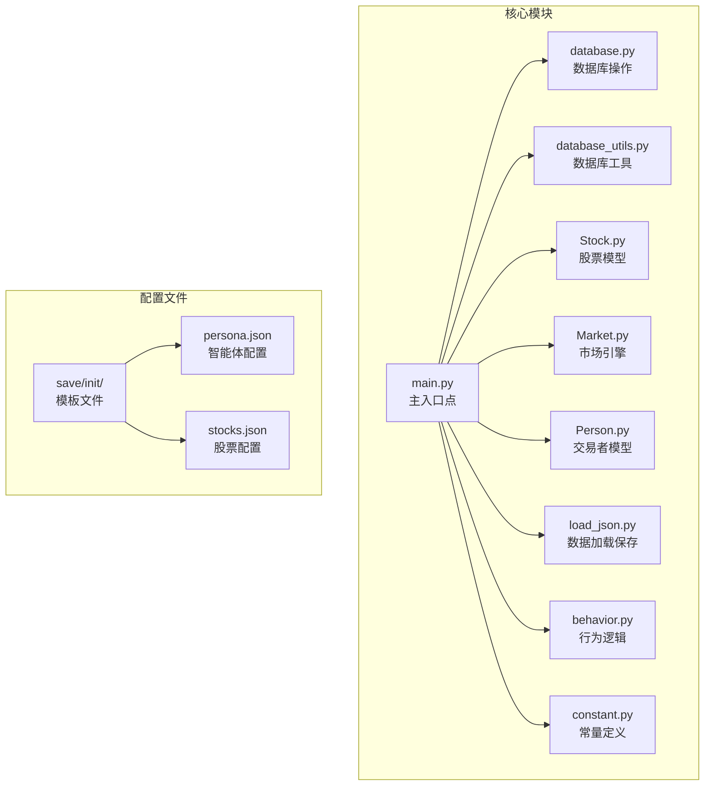
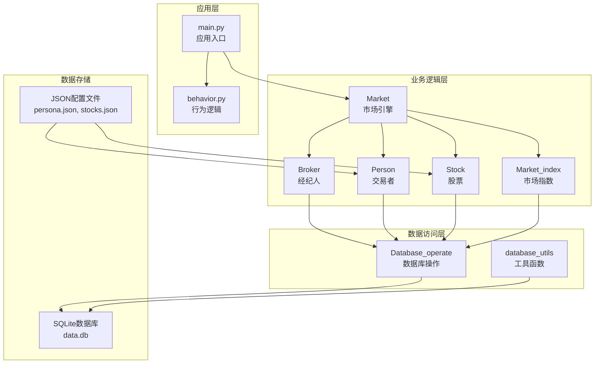
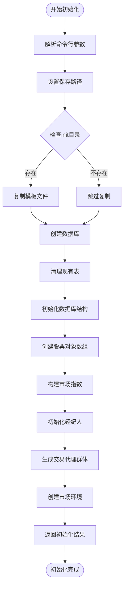
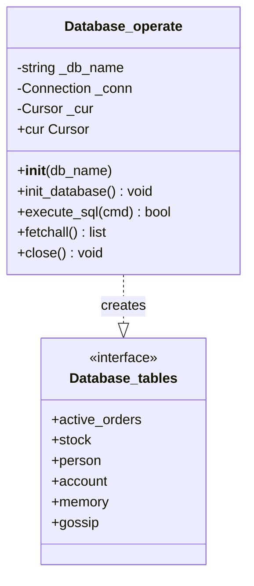
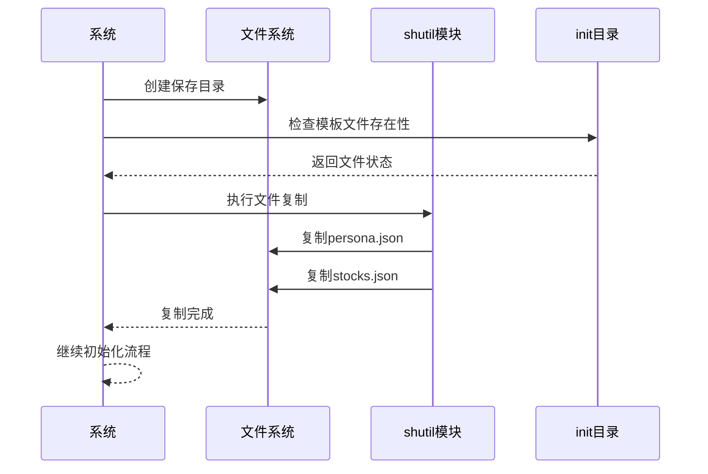
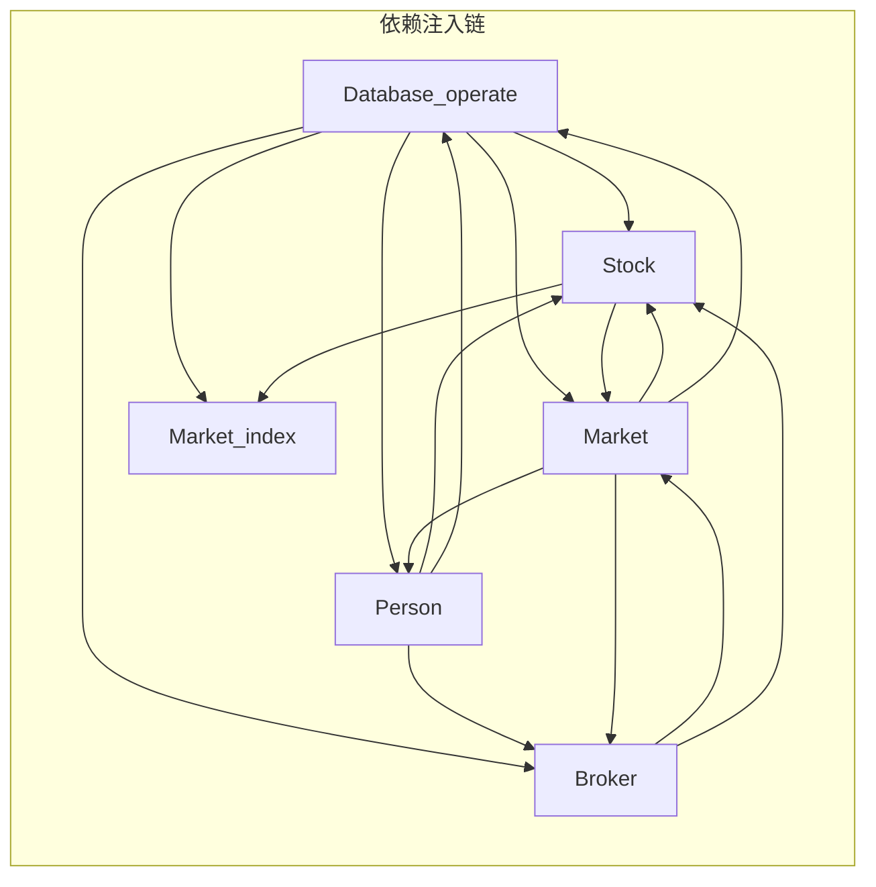
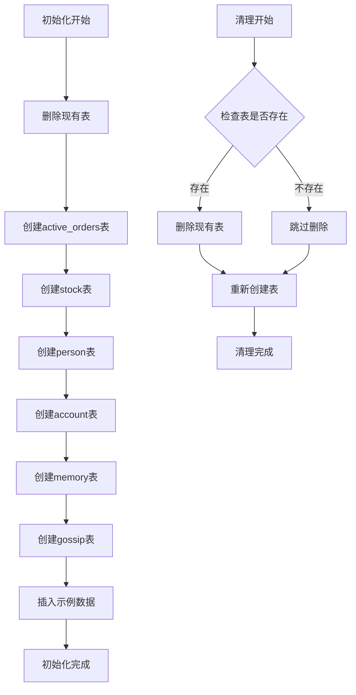
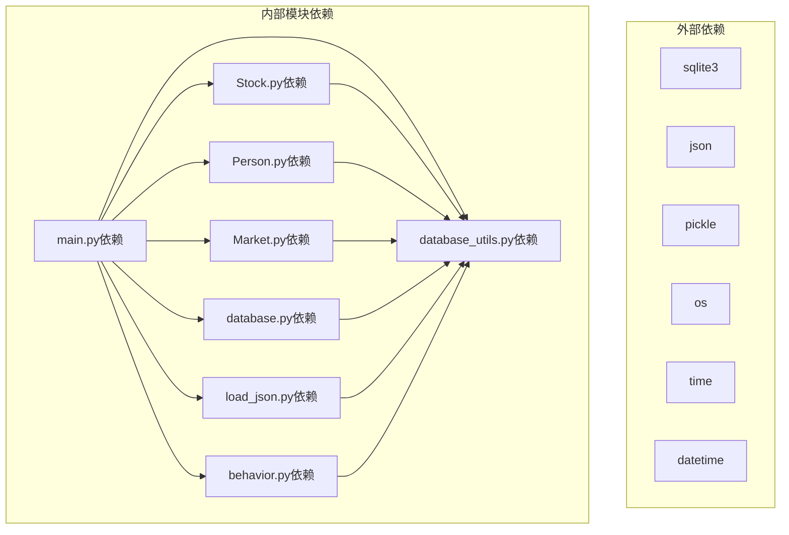

# 初始化流程

<cite>
**本文档引用的文件**
- [main.py](file://Agent-Trading-Arena/Stock_Main/main.py)
- [database.py](file://Agent-Trading-Arena/Stock_Main/database.py)
- [database_utils.py](file://Agent-Trading-Arena/Stock_Main/database_utils.py)
- [Stock.py](file://Agent-Trading-Arena/Stock_Main/Stock.py)
- [Market.py](file://Agent-Trading-Arena/Stock_Main/Market.py)
- [Person.py](file://Agent-Trading-Arena/Stock_Main/Person.py)
- [load_json.py](file://Agent-Trading-Arena/Stock_Main/load_json.py)
- [behavior.py](file://Agent-Trading-Arena/Stock_Main/behavior.py)
- [constant.py](file://Agent-Trading-Arena/Stock_Main/constant.py)
- [persona.json](file://Agent-Trading-Arena/Stock_Main/save/init/persona.json)
- [stocks.json](file://Agent-Trading-Arena/Stock_Main/save/init/stocks.json)
</cite>

## 目录
1. [简介](#简介)
2. [项目结构](#项目结构)
3. [核心组件](#核心组件)
4. [架构概览](#架构概览)
5. [详细组件分析](#详细组件分析)
6. [依赖关系分析](#依赖关系分析)
7. [性能考虑](#性能考虑)
8. [故障排除指南](#故障排除指南)
9. [结论](#结论)

## 简介

本文档详细说明了Agent Trading Arena模拟系统启动时的完整初始化流程。该系统是一个基于Python的股票交易模拟平台，支持多个智能体（交易者）在虚拟市场环境中进行交易活动。初始化流程的核心在于`main.py`中的`init_all`函数，它负责根据命令行参数创建完整的市场环境。

系统的主要特点包括：
- 支持可配置的交易天数和迭代次数
- 可扩展的智能体数量和股票数量
- 基于SQLite的持久化存储
- 完整的交易生命周期管理
- 智能体行为的动态调整机制

## 项目结构

Agent Trading Arena采用模块化的项目结构，主要包含以下核心模块：

**图表来源**
- [main.py](file://Agent-Trading-Arena/Stock_Main/main.py#L1-L151)
- [database.py](file://Agent-Trading-Arena/Stock_Main/database.py#L1-L133)
- [database_utils.py](file://Agent-Trading-Arena/Stock_Main/database_utils.py#L1-L322)

**章节来源**
- [main.py](file://Agent-Trading-Arena/Stock_Main/main.py#L1-L151)
- [database.py](file://Agent-Trading-Arena/Stock_Main/database.py#L1-L133)
- [database_utils.py](file://Agent-Trading-Arena/Stock_Main/database_utils.py#L1-L322)

## 核心组件

系统的核心组件包括五个主要类，它们构成了完整的交易生态系统：

### 数据库层
- **Database_operate**: SQLite数据库连接管理器
- **operations**: 交易操作记录管理

### 市场基础设施
- **Stock**: 股票实体模型
- **Market_index**: 市场指数计算
- **Market**: 交易市场引擎

### 交易参与者
- **Broker**: 经纪人角色（系统参与者）
- **Person**: 交易者智能体

每个组件都通过依赖注入的方式相互关联，形成一个完整的生态系统。

**章节来源**
- [database.py](file://Agent-Trading-Arena/Stock_Main/database.py#L44-L83)
- [Stock.py](file://Agent-Trading-Arena/Stock_Main/Stock.py#L14-L307)
- [Market.py](file://Agent-Trading-Arena/Stock_Main/Market.py#L12-L278)
- [Person.py](file://Agent-Trading-Arena/Stock_Main/Person.py#L18-L629)

## 架构概览

系统采用分层架构设计，从底层的数据存储到上层的业务逻辑都有清晰的职责划分：

**图表来源**
- [main.py](file://Agent-Trading-Arena/Stock_Main/main.py#L66-L96)
- [Market.py](file://Agent-Trading-Arena/Stock_Main/Market.py#L12-L278)
- [Person.py](file://Agent-Trading-Arena/Stock_Main/Person.py#L18-L629)
- [Stock.py](file://Agent-Trading-Arena/Stock_Main/Stock.py#L14-L307)

## 详细组件分析

### 初始化流程详解

#### 命令行参数处理

系统通过`argparse`模块处理各种配置参数，包括交易天数、智能体数量、股票数量等关键配置。

**图表来源**
- [main.py](file://Agent-Trading-Arena/Stock_Main/main.py#L17-L63)
- [main.py](file://Agent-Trading-Arena/Stock_Main/main.py#L66-L96)

#### 数据库初始化机制

数据库初始化是整个系统的基础，涉及多个表的创建和清理：

**图表来源**
- [database_utils.py](file://Agent-Trading-Arena/Stock_Main/database_utils.py#L245-L322)

#### 文件复制机制

当`load=False`时，系统会从`save/init/`目录复制模板文件来构建新的模拟实例：

**图表来源**
- [main.py](file://Agent-Trading-Arena/Stock_Main/main.py#L48-L59)

**章节来源**
- [main.py](file://Agent-Trading-Arena/Stock_Main/main.py#L48-L59)
- [database_utils.py](file://Agent-Trading-Arena/Stock_Main/database_utils.py#L253-L301)

### 依赖注入关系

系统中的依赖注入关系体现了清晰的控制反转原则：

**图表来源**
- [main.py](file://Agent-Trading-Arena/Stock_Main/main.py#L78-L94)
- [Stock.py](file://Agent-Trading-Arena/Stock_Main/Stock.py#L14-L307)
- [Person.py](file://Agent-Trading-Arena/Stock_Main/Person.py#L18-L629)
- [Market.py](file://Agent-Trading-Arena/Stock_Main/Market.py#L12-L278)

**章节来源**
- [main.py](file://Agent-Trading-Arena/Stock_Main/main.py#L78-L94)
- [Stock.py](file://Agent-Trading-Arena/Stock_Main/Stock.py#L14-L307)
- [Person.py](file://Agent-Trading-Arena/Stock_Main/Person.py#L18-L629)
- [Market.py](file://Agent-Trading-Arena/Stock_Main/Market.py#L12-L278)

### 数据表初始化和清理机制

系统实现了完整的数据库表生命周期管理：

**图表来源**
- [database_utils.py](file://Agent-Trading-Arena/Stock_Main/database_utils.py#L253-L301)
- [main.py](file://Agent-Trading-Arena/Stock_Main/main.py#L80-L85)

**章节来源**
- [database_utils.py](file://Agent-Trading-Arena/Stock_Main/database_utils.py#L253-L301)
- [main.py](file://Agent-Trading-Arena/Stock_Main/main.py#L80-L85)

## 依赖关系分析

系统各模块间的依赖关系形成了一个复杂的网络：

**图表来源**
- [main.py](file://Agent-Trading-Arena/Stock_Main/main.py#L9-L14)
- [Stock.py](file://Agent-Trading-Arena/Stock_Main/Stock.py#L1-L10)
- [Person.py](file://Agent-Trading-Arena/Stock_Main/Person.py#L1-L16)
- [Market.py](file://Agent-Trading-Arena/Stock_Main/Market.py#L1-L9)
- [database.py](file://Agent-Trading-Arena/Stock_Main/database.py#L1-L4)
- [database_utils.py](file://Agent-Trading-Arena/Stock_Main/database_utils.py#L1-L8)
- [load_json.py](file://Agent-Trading-Arena/Stock_Main/load_json.py#L1-L6)
- [behavior.py](file://Agent-Trading-Arena/Stock_Main/behavior.py#L1-L12)

**章节来源**
- [main.py](file://Agent-Trading-Arena/Stock_Main/main.py#L9-L14)
- [Stock.py](file://Agent-Trading-Arena/Stock_Main/Stock.py#L1-L10)
- [Person.py](file://Agent-Trading-Arena/Stock_Main/Person.py#L1-L16)
- [Market.py](file://Agent-Trading-Arena/Stock_Main/Market.py#L1-L9)
- [database.py](file://Agent-Trading-Arena/Stock_Main/database.py#L1-L4)
- [database_utils.py](file://Agent-Trading-Arena/Stock_Main/database_utils.py#L1-L8)
- [load_json.py](file://Agent-Trading-Arena/Stock_Main/load_json.py#L1-L6)
- [behavior.py](file://Agent-Trading-Arena/Stock_Main/behavior.py#L1-L12)

## 性能考虑

系统在设计时考虑了多个性能优化方面：

### 数据库性能优化
- 使用SQLite作为轻量级数据库，适合模拟场景
- 批量操作减少数据库往返次数
- 合理的索引策略（基于查询模式）

### 内存管理
- 对象序列化用于保存和恢复状态
- 及时清理不再使用的数据库连接
- 避免内存泄漏的资源管理

### 并发处理
- 当前实现为单线程，适合教学演示
- 可扩展为多线程或异步处理

## 故障排除指南

### 常见问题及解决方案

#### 数据库连接问题
- **症状**: 初始化失败，提示数据库错误
- **原因**: 数据库文件被占用或权限不足
- **解决**: 关闭其他数据库连接，检查文件权限

#### 文件复制失败
- **症状**: 模板文件无法复制到新目录
- **原因**: 权限问题或目标路径不存在
- **解决**: 确保有写入权限，手动创建目标目录

#### 内存溢出
- **症状**: 处理大量数据时内存不足
- **原因**: 对象过多或数据集过大
- **解决**: 减少同时运行的智能体数量，优化数据结构

**章节来源**
- [database_utils.py](file://Agent-Trading-Arena/Stock_Main/database_utils.py#L302-L310)
- [main.py](file://Agent-Trading-Arena/Stock_Main/main.py#L50-L59)

## 结论

Agent Trading Arena的初始化流程展现了现代Python应用程序的良好实践：

1. **模块化设计**: 清晰的职责分离和依赖管理
2. **配置驱动**: 通过命令行参数灵活配置系统行为
3. **持久化机制**: 完整的数据生命周期管理
4. **扩展性**: 易于添加新的功能和组件

该系统为理解复杂交易模拟提供了优秀的参考实现，其初始化流程的设计思路可以应用于类似的金融建模项目中。