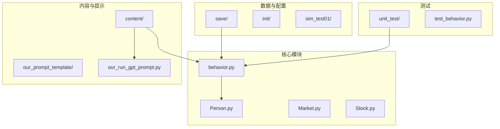
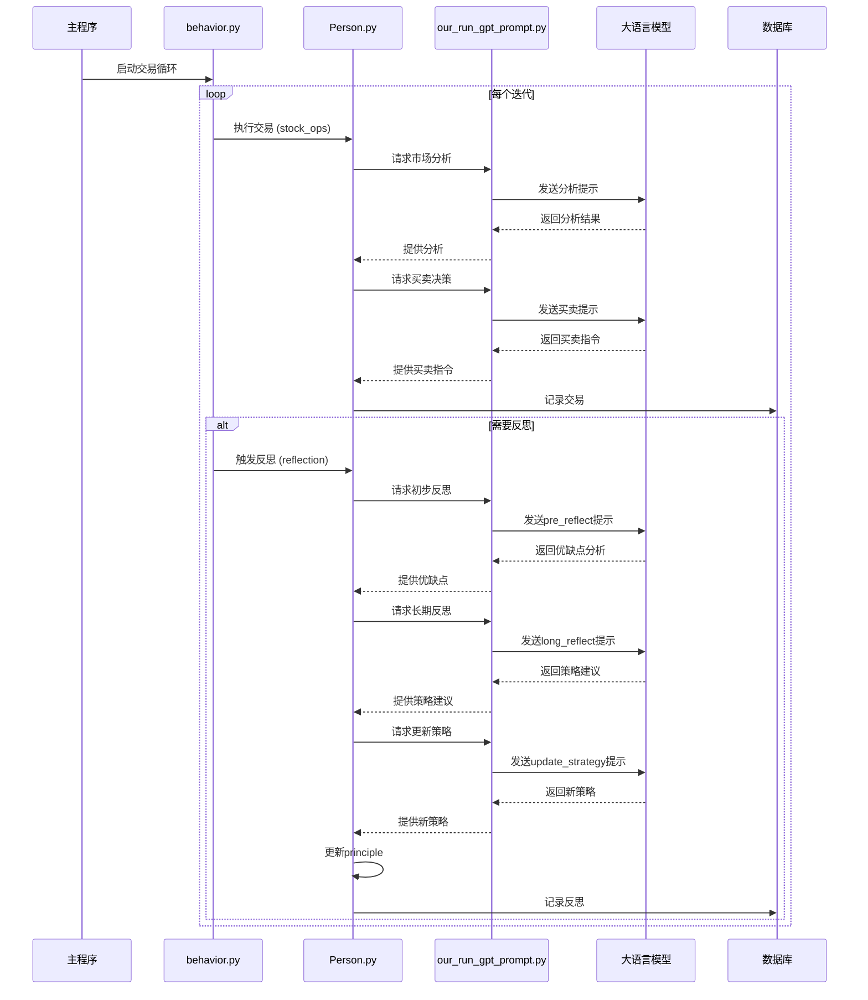
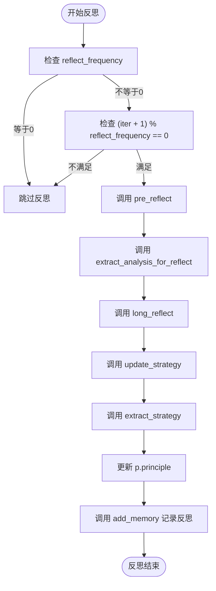
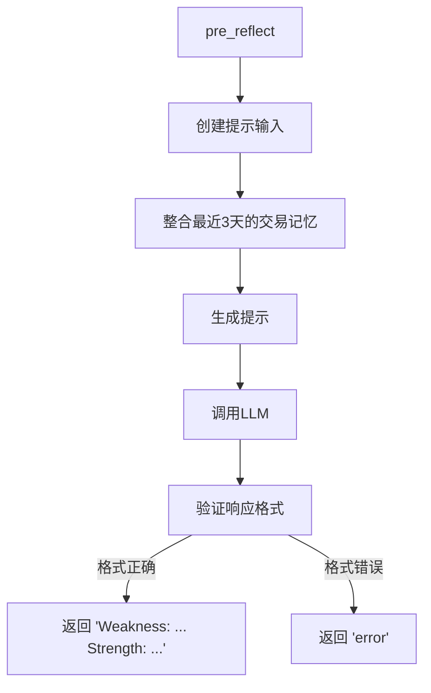
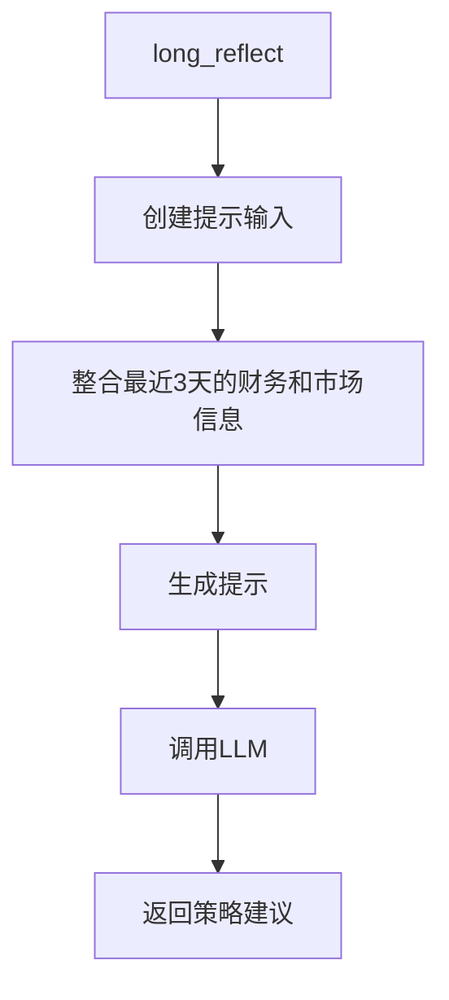
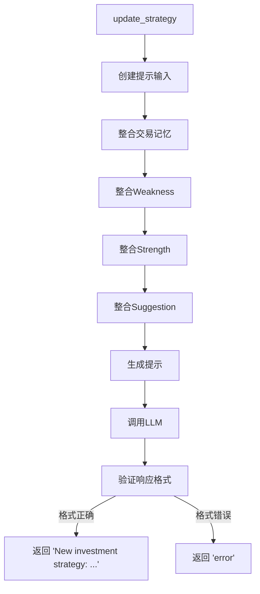
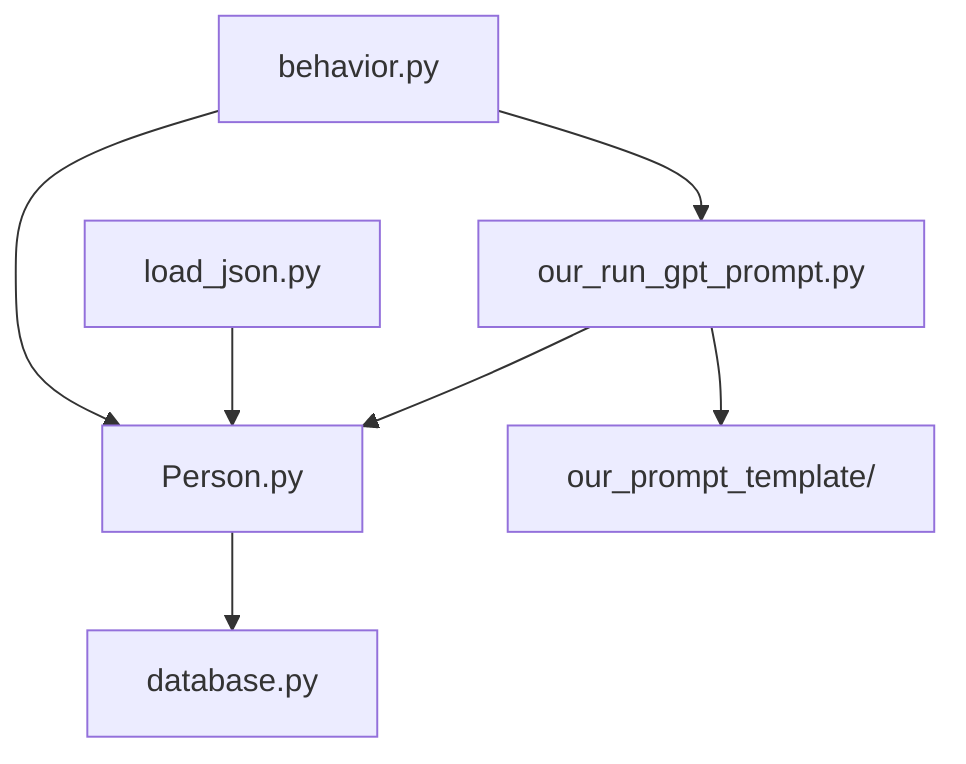

# 反思与更新机制

<cite>
**本文档引用的文件**  
- [behavior.py](file://Agent-Trading-Arena/Stock_Main/behavior.py)
- [our_run_gpt_prompt.py](file://Agent-Trading-Arena/Stock_Main/content/our_run_gpt_prompt.py)
- [Person.py](file://Agent-Trading-Arena/Stock_Main/Person.py)
- [pre_reflect.txt](file://Agent-Trading-Arena/Stock_Main/content/our_prompt_template/pre_reflect.txt)
- [long_reflect_infor.txt](file://Agent-Trading-Arena/Stock_Main/content/our_prompt_template/long_reflect_infor.txt)
- [reflect.txt](file://Agent-Trading-Arena/Stock_Main/content/our_prompt_template/reflect.txt)
- [persona.json](file://Agent-Trading-Arena/Stock_Main/save/sim_test01/persona.json)
- [debug_prompts](file://Agent-Trading-Arena/Stock_Main/save/sim_test01/debug_prompts/)
</cite>

## 目录
1. [引言](#引言)
2. [项目结构](#项目结构)
3. [核心组件](#核心组件)
4. [架构概述](#架构概述)
5. [详细组件分析](#详细组件分析)
6. [依赖分析](#依赖分析)
7. [性能考虑](#性能考虑)
8. [故障排除指南](#故障排除指南)
9. [结论](#结论)

## 引言
本文档深入解析基于LLM的智能体自我优化流程，重点阐述智能体如何通过周期性反思机制来识别投资决策中的优缺点，并动态更新其投资策略。系统通过`behavior.py`中的`reflection`函数，根据每个代理的`reflect_frequency`属性，周期性地触发反思流程。该机制调用一系列GPT提示函数（如`pre_reflect`、`long_reflect`和`update_strategy`）来分析代理的历史交易记忆，生成新的投资原则。正则表达式解析函数`extract_analysis_for_reflect`和`extract_strategy`用于从LLM的非结构化输出中提取结构化数据，最终通过`p.principle = new_strategy`完成策略更新。结合`debug_prompts`目录中的日志文件，可以对整个机制进行调试和验证。

## 项目结构
该系统是一个模拟股票交易挑战平台，其中多个基于LLM的智能体（代理）根据市场信息和自身策略进行交易。项目结构清晰地分离了核心逻辑、提示模板、数据存储和测试模块。

**图示来源**
- [behavior.py](file://Agent-Trading-Arena/Stock_Main/behavior.py#L1-L210)
- [Person.py](file://Agent-Trading-Arena/Stock_Main/Person.py#L1-L629)
- [our_run_gpt_prompt.py](file://Agent-Trading-Arena/Stock_Main/content/our_run_gpt_prompt.py#L1-L628)

**本节来源**
- [behavior.py](file://Agent-Trading-Arena/Stock_Main/behavior.py#L1-L210)
- [Person.py](file://Agent-Trading-Arena/Stock_Main/Person.py#L1-L629)
- [project_structure](file://project_structure)

## 核心组件
核心组件包括`behavior.py`中的`reflection`函数，它是整个自我优化流程的驱动器。该函数根据代理的`reflect_frequency`属性决定何时触发反思。当条件满足时，它会依次调用`pre_reflect`、`long_reflect`和`update_strategy`等GPT提示函数。`Person`类负责管理每个代理的状态，包括其投资原则（`principle`）、财务状况和交易历史。`our_run_gpt_prompt.py`模块提供了与LLM交互的通用框架，包括提示生成、响应验证和结果清理。

**本节来源**
- [behavior.py](file://Agent-Trading-Arena/Stock_Main/behavior.py#L174-L200)
- [Person.py](file://Agent-Trading-Arena/Stock_Main/Person.py#L143-L629)
- [our_run_gpt_prompt.py](file://Agent-Trading-Arena/Stock_Main/content/our_run_gpt_prompt.py#L1-L628)

## 架构概述
该系统的架构是一个基于事件循环的模拟器，每个迭代周期内执行交易操作和反思更新。核心流程由`behavior.py`中的函数驱动，它们利用`Person`类的实例来代表不同的交易代理。LLM通过`our_run_gpt_prompt.py`模块被集成到决策流程中，为每个关键步骤（如市场分析、买卖决策和策略反思）提供智能支持。数据持久化通过SQLite数据库和JSON文件实现，确保状态可以在模拟中断后恢复。

**图示来源**
- [behavior.py](file://Agent-Trading-Arena/Stock_Main/behavior.py#L82-L200)
- [Person.py](file://Agent-Trading-Arena/Stock_Main/Person.py#L143-L629)
- [our_run_gpt_prompt.py](file://Agent-Trading-Arena/Stock_Main/content/our_run_gpt_prompt.py#L1-L628)

## 详细组件分析

### 反思机制分析
`reflection`函数是智能体自我优化的核心。它首先检查代理的`reflect_frequency`属性，如果为0则跳过反思。否则，它会在每经过`reflect_frequency`个迭代后触发一次反思。例如，在`persona.json`中，ID为3的代理`David`的`reflect_frequency`为2，意味着他每两天（或每两个迭代）进行一次反思。

**图示来源**
- [behavior.py](file://Agent-Trading-Arena/Stock_Main/behavior.py#L174-L200)
- [our_run_gpt_prompt.py](file://Agent-Trading-Arena/Stock_Main/content/our_run_gpt_prompt.py#L305-L362)
- [our_run_gpt_prompt.py](file://Agent-Trading-Arena/Stock_Main/content/our_run_gpt_prompt.py#L251-L304)
- [our_run_gpt_prompt.py](file://Agent-Trading-Arena/Stock_Main/content/our_run_gpt_prompt.py#L151-L212)

**本节来源**
- [behavior.py](file://Agent-Trading-Arena/Stock_Main/behavior.py#L174-L200)
- [our_run_gpt_prompt.py](file://Agent-Trading-Arena/Stock_Main/content/our_run_gpt_prompt.py#L305-L362)
- [our_run_gpt_prompt.py](file://Agent-Trading-Arena/Stock_Main/content/our_run_gpt_prompt.py#L251-L304)
- [our_run_gpt_prompt.py](file://Agent-Trading-Arena/Stock_Main/content/our_run_gpt_prompt.py#L151-L212)

### GPT提示函数分析
系统使用三个关键的GPT提示函数来实现反思流程。

#### pre_reflect 函数
`pre_reflect`函数旨在分析代理近期投资策略的优缺点。它使用`pre_reflect.txt`模板，该模板要求LLM基于代理的交易历史、财务状况、市场信息和现有策略，评估其最新投资策略的弱点和优势，并提供具体证据。

**图示来源**
- [our_run_gpt_prompt.py](file://Agent-Trading-Arena/Stock_Main/content/our_run_gpt_prompt.py#L305-L362)
- [pre_reflect.txt](file://Agent-Trading-Arena/Stock_Main/content/our_prompt_template/pre_reflect.txt)

#### long_reflect 函数
`long_reflect`函数生成对新投资策略的建议。它使用`long_reflect_infor.txt`模板，该模板提供了更宏观的财务和市场信息，旨在引导LLM进行更深层次的长期思考。

**图示来源**
- [our_run_gpt_prompt.py](file://Agent-Trading-Arena/Stock_Main/content/our_run_gpt_prompt.py#L251-L304)
- [long_reflect_infor.txt](file://Agent-Trading-Arena/Stock_Main/content/our_prompt_template/long_reflect_infor.txt)

#### update_strategy 函数
`update_strategy`函数是最终的策略生成器。它结合了`pre_reflect`的优缺点分析和`long_reflect`的策略建议，使用`reflect.txt`模板来生成一个全新的、具体的、宏观的投资策略。

**图示来源**
- [our_run_gpt_prompt.py](file://Agent-Trading-Arena/Stock_Main/content/our_run_gpt_prompt.py#L151-L212)
- [reflect.txt](file://Agent-Trading-Arena/Stock_Main/content/our_prompt_template/reflect.txt)

### 正则表达式解析函数分析
为了从LLM的非结构化文本输出中提取结构化数据，系统使用了两个关键的正则表达式解析函数。

#### extract_analysis_for_reflect 函数
此函数从`pre_reflect`的输出中提取“Weakness”和“Strength”部分。它使用正则表达式`r"Weakness:\s*(.*?).\s*Strength:\s*(.*?)$"`来匹配并捕获这两个部分。

**本节来源**
- [behavior.py](file://Agent-Trading-Arena/Stock_Main/behavior.py#L58-L69)

#### extract_strategy 函数
此函数从`update_strategy`的输出中提取新的投资策略。它使用正则表达式`r"New investment strategy:\s*(.*?)$"`来匹配并捕获策略文本。

**本节来源**
- [behavior.py](file://Agent-Trading-Arena/Stock_Main/behavior.py#L72-L79)

## 依赖分析
该系统的组件之间存在明确的依赖关系。`behavior.py`是最高层的协调者，它直接依赖于`Person.py`来访问代理状态，并依赖于`our_run_gpt_prompt.py`来执行LLM调用。`our_run_gpt_prompt.py`模块是LLM交互的核心，它依赖于`Person.py`的查询方法来获取数据，并依赖于`content`目录下的提示模板。`Person.py`类是数据模型的核心，它被`behavior.py`和`our_run_gpt_prompt.py`广泛使用。

**图示来源**
- [behavior.py](file://Agent-Trading-Arena/Stock_Main/behavior.py#L3-L11)
- [our_run_gpt_prompt.py](file://Agent-Trading-Arena/Stock_Main/content/our_run_gpt_prompt.py#L2-L5)
- [Person.py](file://Agent-Trading-Arena/Stock_Main/Person.py#L2-L15)

**本节来源**
- [behavior.py](file://Agent-Trading-Arena/Stock_Main/behavior.py#L3-L11)
- [our_run_gpt_prompt.py](file://Agent-Trading-Arena/Stock_Main/content/our_run_gpt_prompt.py#L2-L5)
- [Person.py](file://Agent-Trading-Arena/Stock_Main/Person.py#L2-L15)

## 性能考虑
该系统的性能主要受LLM调用延迟的影响。由于反思机制是周期性触发的，而不是每个迭代都执行，这有助于控制LLM调用的频率和成本。然而，`pre_reflect`和`long_reflect`函数都整合了多天的历史数据，这可能导致提示文本较长，增加LLM处理时间和成本。此外，`update_strategy`函数需要调用LLM三次（`pre_reflect`、`long_reflect`、`update_strategy`），形成了一个串行的LLM调用链，这可能是性能瓶颈。未来优化可以考虑并行化这些LLM调用，或使用更轻量级的模型进行初步分析。

## 故障排除指南
`debug_prompts`目录是调试和验证反思机制的关键。当`save_path`参数被提供时，`our_run_gpt_prompt.py`中的每个GPT提示函数都会将生成的提示和LLM的响应保存到该目录下。

- **检查提示内容**：如果代理的反思结果不符合预期，首先检查`day{virtual_date}_short_reflection_prompt.txt`和`day{virtual_date}_long_reflection_prompt.txt`文件，确认输入给LLM的数据是否正确。
- **验证LLM响应**：检查`day{virtual_date}_short_reflection_result.txt`和`day{virtual_date}_long_reflection_result.txt`，确认LLM的输出是否符合预期的格式（如包含"Weakness:"和"Strength:"）。
- **调试策略更新**：检查`day{virtual_date}_strategy_update_prompt.txt`和`day{virtual_date}_strategy_update_result.txt`，确保最终的策略更新是基于正确的输入，并且输出格式正确（以"New investment strategy:"开头）。
- **分析解析失败**：如果`extract_analysis_for_reflect`或`extract_strategy`返回`False`，通常是因为LLM的输出格式不符合正则表达式的预期。应检查相应的`result.txt`文件来诊断问题。

**本节来源**
- [our_run_gpt_prompt.py](file://Agent-Trading-Arena/Stock_Main/content/our_run_gpt_prompt.py#L333-L338)
- [our_run_gpt_prompt.py](file://Agent-Trading-Arena/Stock_Main/content/our_run_gpt_prompt.py#L275-L279)
- [our_run_gpt_prompt.py](file://Agent-Trading-Arena/Stock_Main/content/our_run_gpt_prompt.py#L182-L187)

## 结论
该反思与更新机制为基于LLM的交易代理提供了一个强大的自我优化框架。通过`reflect_frequency`属性，不同的代理可以拥有不同的反思节奏，从而模拟出多样化的投资风格。该机制通过一个由`pre_reflect`、`long_reflect`和`update_strategy`组成的多阶段提示流程，引导LLM进行深度的自我分析和策略迭代。正则表达式解析确保了从非结构化输出中可靠地提取关键信息。`debug_prompts`目录提供了宝贵的调试信息，使得整个流程透明且可验证。这一设计有效地将LLM的创造性与结构化数据处理相结合，实现了智能体的持续学习和适应能力。