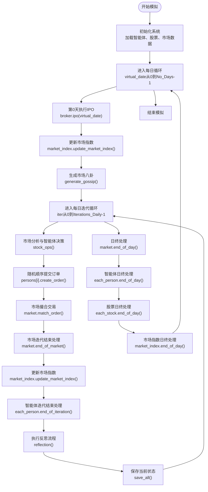
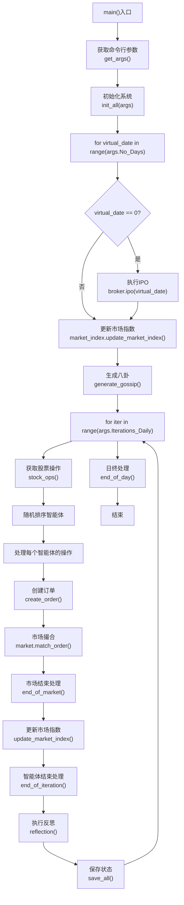
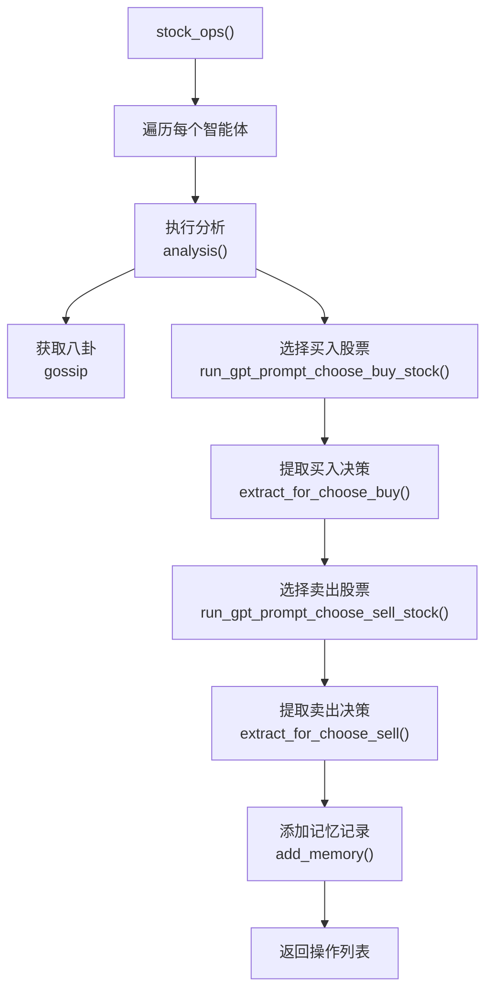
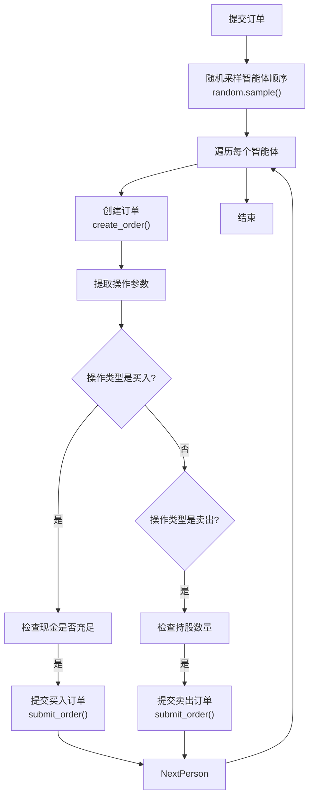
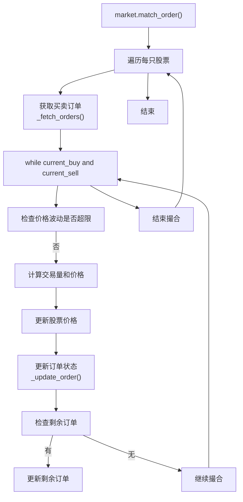
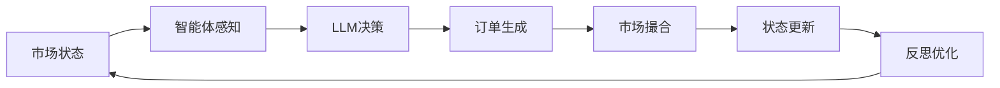
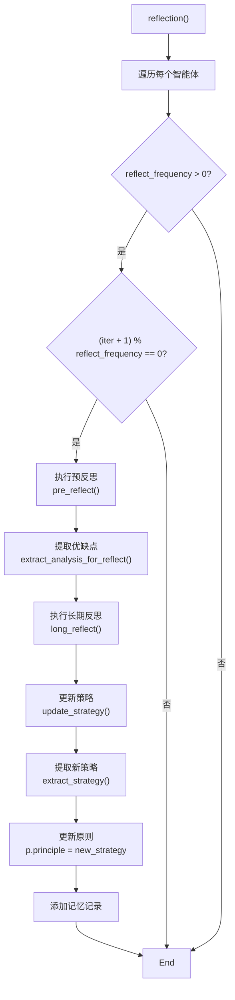

# 模拟流程与执行周期

<cite>
**本文档引用文件**  
- [main.py](file://main.py)
- [Market.py](file://Market.py)
- [Person.py](file://Person.py)
- [Stock.py](file://Stock.py)
- [behavior.py](file://behavior.py)
- [database_utils.py](file://database_utils.py)
- [load_json.py](file://load_json.py)
- [constant.py](file://constant.py)
</cite>

## 目录
1. [简介](#简介)
2. [模拟周期总体流程](#模拟周期总体流程)
3. [主控执行流程](#主控执行流程)
4. [每日迭代阶段分解](#每日迭代阶段分解)
5. [核心闭环流程](#核心闭环流程)
6. [迭代控制与终止条件](#迭代控制与终止条件)
7. [模拟周期配置方法](#模拟周期配置方法)

## 简介
本项目实现了一个基于智能体的股票交易模拟系统，通过LLM驱动的智能体进行市场分析、决策、交易和反思。系统从day0开始，按时间步长驱动每日迭代，完整模拟交易周期。本文档详细描述了整个执行流程，包括市场状态更新、智能体感知、LLM决策、订单生成、市场撮合、状态更新和反思优化的闭环过程。

## 模拟周期总体流程
系统模拟从虚拟日期day0开始，按照预设的交易天数和每日迭代次数执行完整的交易周期。每个交易日包含多个迭代步骤，每个步骤中智能体依次进行市场分析、决策、订单提交、交易执行、信息传播和反思优化。市场状态在每个迭代步骤中更新，形成一个完整的反馈闭环。



**Diagram sources**
- [main.py](file://main.py#L110-L147)

## 主控执行流程
系统通过`main.py`中的`overall_test`函数驱动整个模拟流程。该函数首先调用`init_all`初始化系统，然后进入双重循环：外层循环控制交易天数，内层循环控制每日的迭代次数。



**Section sources**
- [main.py](file://main.py#L99-L150)

## 每日迭代阶段分解
每个交易日的迭代过程包含多个关键阶段，按顺序执行：

### 市场分析与智能体决策
在每个迭代开始时，系统调用`stock_ops`函数，触发所有智能体进行市场分析和决策。该函数为每个智能体生成分析结果和八卦信息，并通过LLM生成买入和卖出决策。



**Section sources**
- [behavior.py](file://behavior.py#L82-L171)

### 订单提交与市场撮合
智能体决策后，系统按照随机顺序让智能体提交订单，然后由市场对象执行撮合。



**Section sources**
- [Person.py](file://Person.py#L212-L249)
- [database_utils.py](file://database_utils.py#L224-L243)

### 交易执行与状态更新
市场撮合完成后，系统更新交易状态和各方资产。



**Section sources**
- [Market.py](file://Market.py#L96-L198)

## 核心闭环流程
系统实现了"市场状态 → 智能体感知 → LLM决策 → 订单生成 → 市场撮合 → 状态更新 → 反思优化"的完整闭环。



该闭环在每个迭代步骤中执行，确保了模拟的连续性和反馈性。智能体通过`query_hold_stocks`、`query_account`等方法感知市场状态，通过LLM生成决策，提交订单后由市场撮合，更新状态后进行反思优化。

**Diagram sources**
- [Person.py](file://Person.py#L429-L439)
- [behavior.py](file://behavior.py#L82-L171)
- [Market.py](file://Market.py#L96-L198)

## 迭代控制与终止条件
系统的迭代控制通过双重循环实现，外层循环控制交易天数，内层循环控制每日迭代次数。

### 终止条件
1. **天数终止条件**：当`virtual_date`达到`args.No_Days`时，外层循环结束
2. **迭代终止条件**：当`iter`达到`args.Iterations_Daily`时，内层循环结束
3. **异常终止条件**：数据库操作异常或系统错误

### 反思频率控制
智能体的反思频率由`reflect_frequency`参数控制，只有当`(iter + 1) % p.reflect_frequency == 0`时才执行反思。



**Section sources**
- [behavior.py](file://behavior.py#L174-L198)

## 模拟周期配置方法
用户可以通过命令行参数自定义模拟周期长度和迭代频率。

### 配置参数
以下参数可在`get_args`函数中配置：

| 参数 | 默认值 | 说明 |
|------|--------|------|
| `--Iterations_Daily` | 3 | 每日迭代次数 |
| `--No_Days` | 3 | 交易天数 |
| `--Num_Person` | 9 | 智能体数量 |
| `--Num_Stock` | 3 | 股票数量 |
| `--SAVE_NAME` | None | 保存文件夹名称 |
| `--Daily_Price_Limit` | 0.7 | 每日价格变动限制 |
| `--expense_ratio` | 0.03 | 资本成本率 |
| `--Fluctuation_Constant` | 20.0 | 价格波动常数 |
| `--analysis_num` | 3 | 执行分析的智能体数量 |
| `--gossip_num_max` | 3 | 每轮八卦最大数量 |

### 配置示例
```bash
python main.py --No_Days 5 --Iterations_Daily 10 --Num_Person 5
```

此命令将模拟5个交易日，每天10次迭代，使用5个智能体。

**Section sources**
- [main.py](file://main.py#L17-L63)