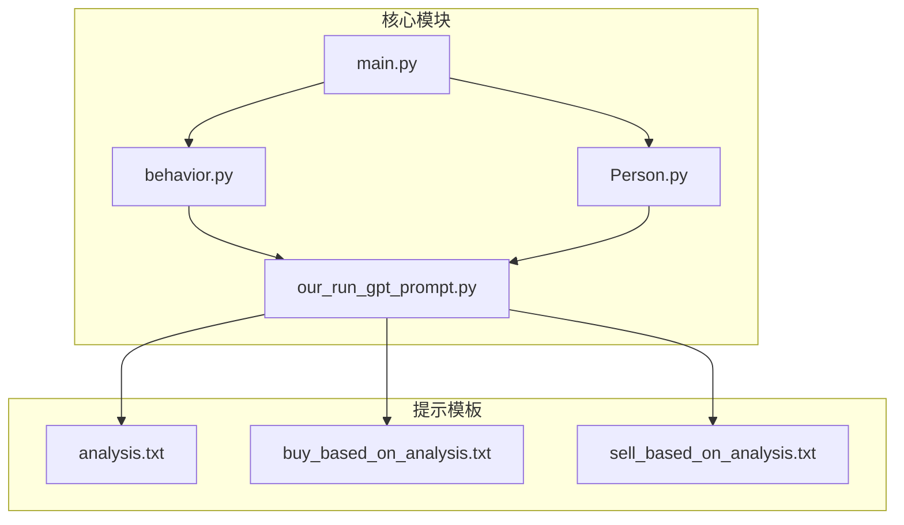
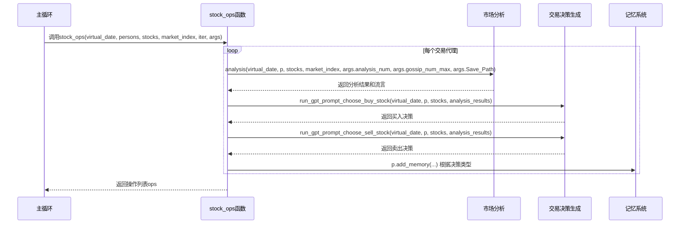
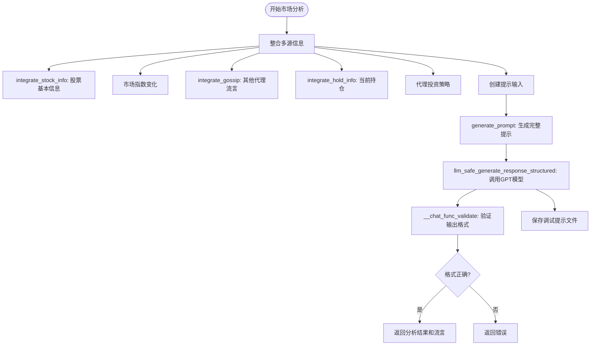
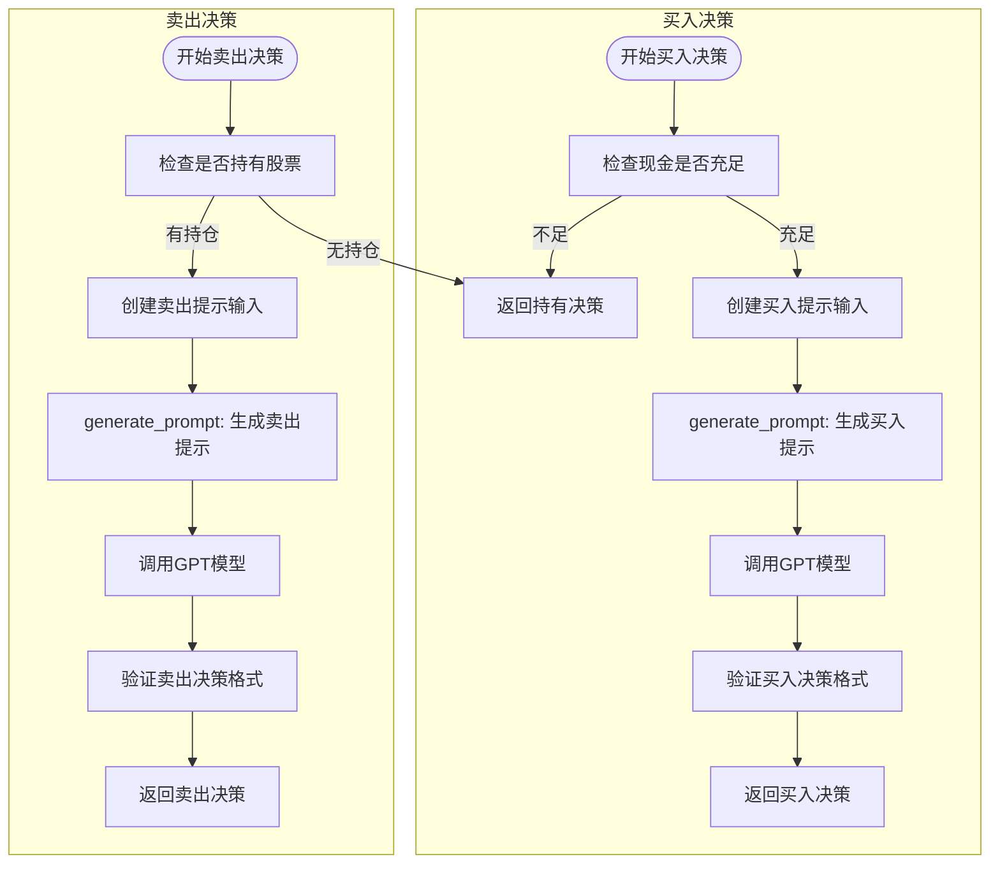
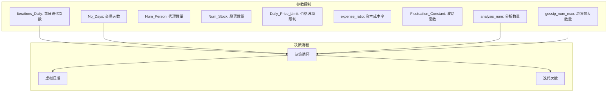

# 市场分析与决策

<cite>
**本文档中引用的文件**  
- [behavior.py](file://behavior.py)
- [our_run_gpt_prompt.py](file://content/our_run_gpt_prompt.py)
- [analysis.txt](file://content/our_prompt_template/analysis.txt)
- [buy_based_on_analysis.txt](file://content/our_prompt_template/buy_based_on_analysis.txt)
- [sell_based_on_analysis.txt](file://content/our_prompt_template/sell_based_on_analysis.txt)
- [Person.py](file://Person.py)
- [main.py](file://main.py)
</cite>

## 目录
1. [项目结构](#项目结构)
2. [核心决策流程](#核心决策流程)
3. [市场分析与情绪判断](#市场分析与情绪判断)
4. [交易信号生成](#交易信号生成)
5. [提示工程设计原理](#提示工程设计原理)
6. [决策频率与参数控制](#决策频率与参数控制)

## 项目结构

**图示来源**  
- [behavior.py](file://behavior.py#L82-L171)
- [our_run_gpt_prompt.py](file://content/our_run_gpt_prompt.py#L414-L618)
- [Person.py](file://Person.py#L143-L629)
- [main.py](file://main.py#L118-L134)

**本节来源**  
- [behavior.py](file://behavior.py)
- [our_run_gpt_prompt.py](file://content/our_run_gpt_prompt.py)
- [Person.py](file://Person.py)
- [main.py](file://main.py)

## 核心决策流程

在每日迭代循环中，`stock_ops` 函数驱动每个交易代理（Person）基于当前市场状态和LLM能力生成买卖决策。该函数遍历所有交易代理，为每个代理执行市场分析、生成买卖决策，并将决策结果存储在操作列表中。

决策流程从调用 `analysis` 函数开始，该函数整合股票信息、市场指数、流言和现有投资组合等多维度信息，生成市场分析结果。随后，系统分别调用 `run_gpt_prompt_choose_buy_stock` 和 `run_gpt_prompt_choose_sell_stock` 函数，基于分析结果和代理的投资策略，生成买入和卖出决策。

决策结果通过正则表达式提取函数（`extract_for_choose_buy` 和 `extract_for_choose_sell`）进行解析，转换为标准化的交易指令格式。如果买入和卖出决策均为"持有"，则记录持有操作；否则，分别记录买入或卖出操作，并更新代理的记忆系统。

**图示来源**  
- [behavior.py](file://behavior.py#L82-L171)
- [our_run_gpt_prompt.py](file://content/our_run_gpt_prompt.py#L414-L548)
- [Person.py](file://Person.py#L514-L546)

**本节来源**  
- [behavior.py](file://behavior.py#L82-L171)

## 市场分析与情绪判断

市场分析模块通过 `analysis` 函数实现，该函数整合了多源信息以生成全面的市场洞察。分析过程首先调用多个辅助函数来集成不同类型的信息：`integrate_stock_info` 整合股票基本信息，`integrate_gossip` 整合来自其他代理的流言，`integrate_hold_info` 整合代理当前持有的股票信息。

`analysis` 函数的输入参数包括虚拟日期、代理对象、股票列表、市场指数、分析数量、流言最大数量和保存路径。函数首先创建提示输入，包括股票信息、市场指数、流言、持有信息、投资策略和分析数量。然后，使用 `generate_prompt` 函数根据提示模板生成完整的提示，并通过 `llm_safe_generate_response_structured` 函数调用GPT模型生成分析结果。

分析结果的验证通过正则表达式实现，确保输出格式符合预期：以"The analysis results:"开头，后跟指定数量的分析项，每项以"-"开头。系统还实现了调试功能，可将生成的提示保存到调试目录中，便于后续分析和优化。

**图示来源**  
- [our_run_gpt_prompt.py](file://content/our_run_gpt_prompt.py#L414-L483)
- [our_run_gpt_prompt.py](file://content/our_run_gpt_prompt.py#L54-L78)
- [our_run_gpt_prompt.py](file://content/our_run_gpt_prompt.py#L81-L111)

**本节来源**  
- [our_run_gpt_prompt.py](file://content/our_run_gpt_prompt.py#L414-L483)

## 交易信号生成

交易信号生成分为买入和卖出两个独立的决策过程，分别由 `run_gpt_prompt_choose_buy_stock` 和 `run_gpt_prompt_choose_sell_stock` 函数实现。这两个函数采用相似的架构，但针对不同的交易类型进行了优化。

买入决策生成首先检查代理的现金是否足以维持最低生活开支，如果不足则直接返回"持有"决策。否则，系统创建提示输入，包括代理的现金、最低生活开支、股票信息、分析结果和投资策略。提示模板引导GPT模型根据这些信息决定购买哪只股票、投资金额和最佳买入价格。

卖出决策生成首先检查代理是否持有任何股票，如果没有则返回"持有"决策。否则，系统创建包含类似信息的提示，但重点关注现有投资组合。提示模板引导GPT模型决定卖出哪只股票、卖出数量和最佳卖出价格。

两个决策函数都实现了严格的输出验证机制，使用正则表达式确保GPT模型的响应符合预期格式。系统还实现了错误处理和调试功能，可将生成的提示保存到文件中，便于后续分析。

**图示来源**  
- [our_run_gpt_prompt.py](file://content/our_run_gpt_prompt.py#L486-L548)
- [our_run_gpt_prompt.py](file://content/our_run_gpt_prompt.py#L551-L618)

**本节来源**  
- [our_run_gpt_prompt.py](file://content/our_run_gpt_prompt.py#L486-L618)

## 提示工程设计原理

提示工程设计基于模块化和变量注入机制，通过预定义的提示模板和动态变量替换实现灵活的决策支持。系统使用 `!<INPUT n>!` 作为变量占位符，其中 `n` 表示输入参数的索引。在运行时，系统根据实际数据替换这些占位符，生成针对特定场景的个性化提示。

`analysis.txt` 模板设计了全面的市场分析框架，要求GPT模型综合考虑股票信息、市场动态、流言、现有投资和投资策略等多个维度。模板明确指出了分析的重点和目标，即生成指定数量的有价值分析结果，这些结果将用于后续的买卖决策。

`buy_based_on_analysis.txt` 和 `sell_based_on_analysis.txt` 模板分别针对买入和卖出决策进行了优化。买入模板强调财务状况和最低生活开支的约束，确保代理不会耗尽所有现金。卖出模板则重点关注现有投资组合的表现和资本收益。

```mermaid
classDiagram
class PromptTemplate {
+Variables : !<INPUT 0>!, !<INPUT 1>!, ...
+<commentblockmarker>###</commentblockmarker>
+Instructions : 指导GPT模型行为
+Facts/Information : 输入数据
+Task : 具体任务描述
}
class AnalysisTemplate {
+!<INPUT 0>! : 股票信息
+!<INPUT 1>! : 市场信息
+!<INPUT 2>! : 流言
+!<INPUT 3>! : 现有投资
+!<INPUT 4>! : 投资策略
+!<INPUT 5>! : 分析数量
}
class BuyTemplate {
+!<INPUT 0>! : 现金金额
+!<INPUT 1>! : 最低生活开支
+!<INPUT 2>! : 股票基本信息
+!<INPUT 3>! : 分析结果
+!<INPUT 4>! : 投资策略
}
class SellTemplate {
+!<INPUT 0>! : 现金金额
+!<INPUT 1>! : 最低生活开支
+!<INPUT 2>! : 现有投资
+!<INPUT 3>! : 分析结果
+!<INPUT 4>! : 投资策略
}
PromptTemplate <|-- AnalysisTemplate
PromptTemplate <|-- BuyTemplate
PromptTemplate <|-- SellTemplate
```

所有提示模板都包含 `<commentblockmarker>###</commentblockmarker>` 标记，用于分隔模板说明和实际内容，确保生成的提示清晰易读。系统还实现了特殊指令和示例输出，指导GPT模型生成符合预期格式的响应。

**图示来源**  
- [analysis.txt](file://content/our_prompt_template/analysis.txt)
- [buy_based_on_analysis.txt](file://content/our_prompt_template/buy_based_on_analysis.txt)
- [sell_based_on_analysis.txt](file://content/our_prompt_template/sell_based_on_analysis.txt)

**本节来源**  
- [analysis.txt](file://content/our_prompt_template/analysis.txt)
- [buy_based_on_analysis.txt](file://content/our_prompt_template/buy_based_on_analysis.txt)
- [sell_based_on_analysis.txt](file://content/our_prompt_template/sell_based_on_analysis.txt)

## 决策频率与参数控制

决策频率由主循环中的迭代次数控制，通过 `args.Iterations_Daily` 参数设置每日的迭代次数。在 `main.py` 文件的 `overall_test` 函数中，系统使用嵌套循环实现每日多次决策：外层循环遍历交易日，内层循环遍历每日的迭代次数。

虚拟日期和迭代次数共同决定了决策的时间粒度。每次迭代都会触发完整的决策流程，包括市场分析、交易决策生成和订单创建。这种设计允许代理在一天内根据市场变化做出多次调整，提高了系统的动态响应能力。

系统通过多个参数控制决策行为：`analysis_num` 控制分析结果的数量，`gossip_num_max` 控制流言的最大数量，`Daily_Price_Limit` 控制每日价格波动限制，`expense_ratio` 控制资本成本率。这些参数在 `get_args` 函数中定义，并通过命令行参数或默认值进行配置。

代理的个性化决策行为由其投资策略（principle）和反射频率（reflect_frequency）决定。投资策略在初始化时从 `persona.json` 文件加载，反射频率决定了代理进行策略反思的频率，实现了长期学习和适应。

**图示来源**  
- [main.py](file://main.py#L20-L38)
- [main.py](file://main.py#L117-L134)
- [behavior.py](file://behavior.py#L88-L89)

**本节来源**  
- [main.py](file://main.py#L17-L63)
- [behavior.py](file://behavior.py#L88-L89)