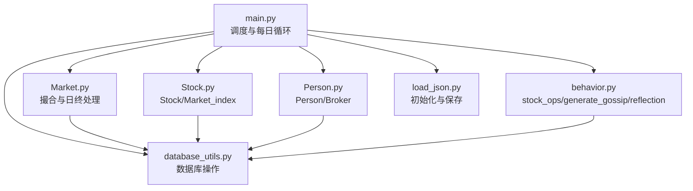
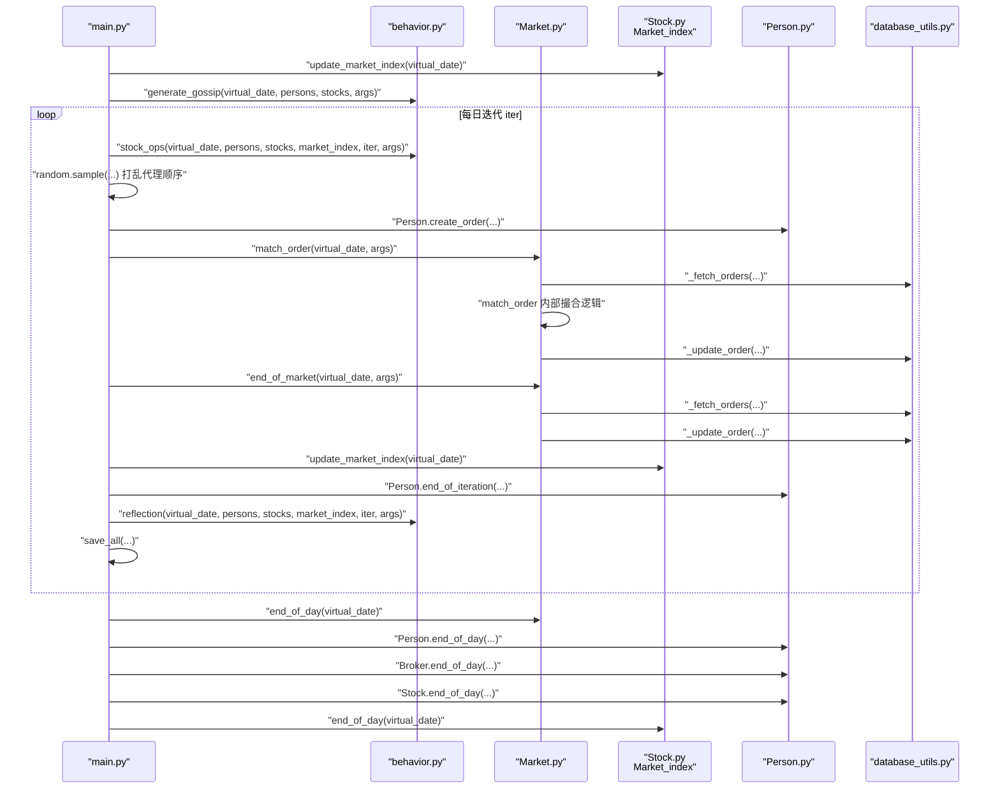
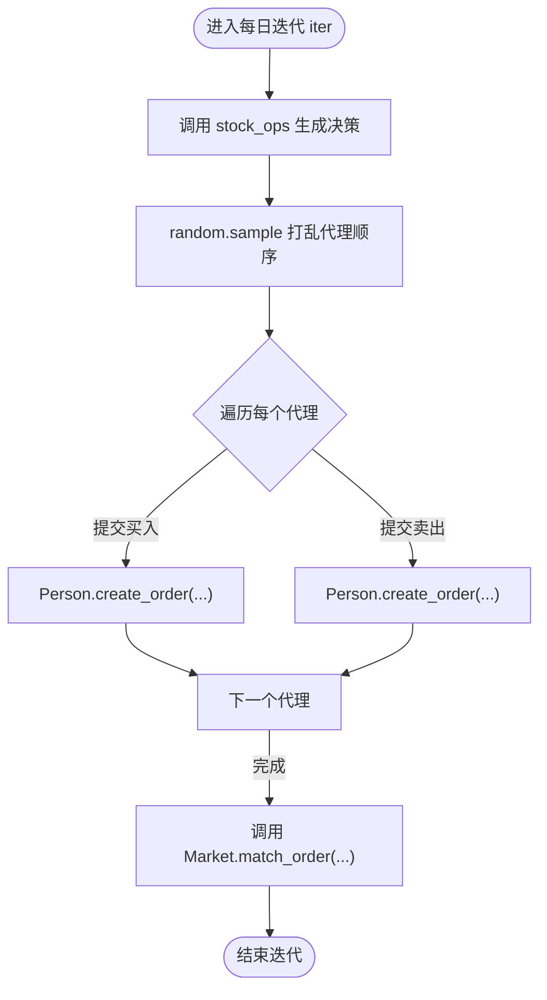
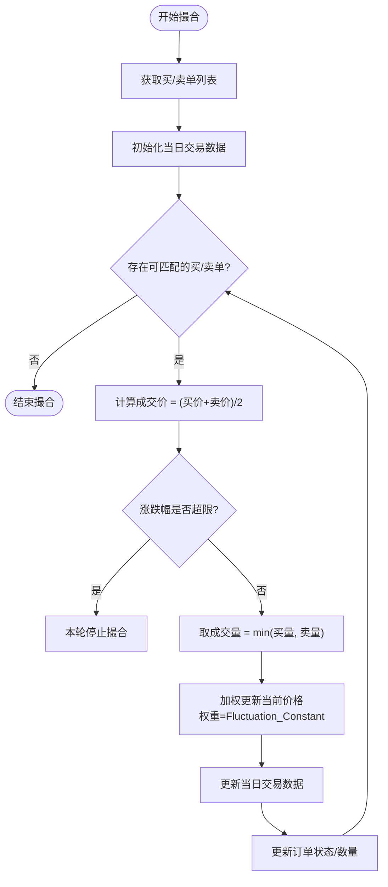
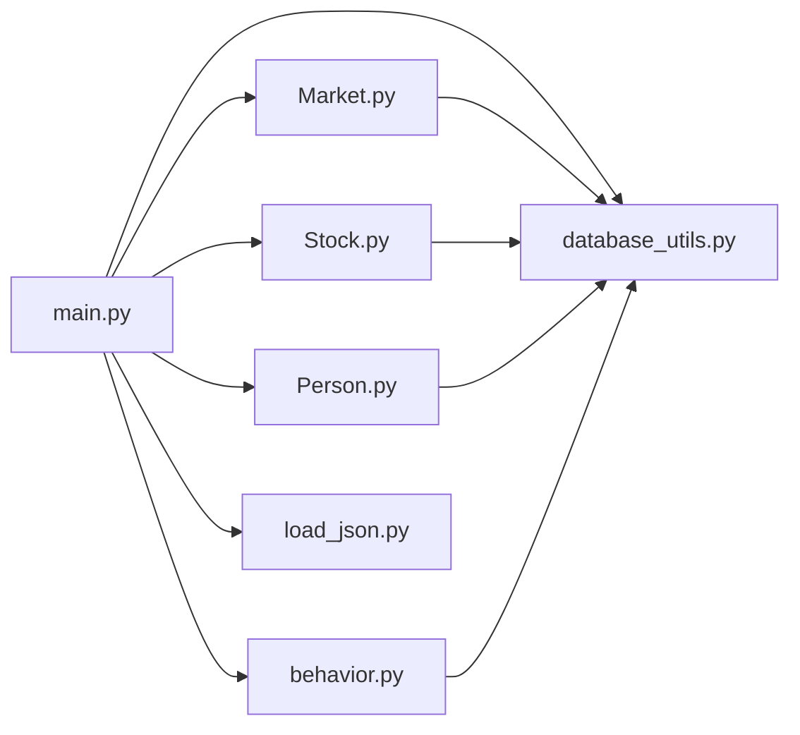

# 每日迭代循环

<cite>
**本文引用的文件**
- [main.py](file://Agent-Trading-Arena/Stock_Main/main.py)
- [behavior.py](file://Agent-Trading-Arena/Stock_Main/behavior.py)
- [Market.py](file://Agent-Trading-Arena/Stock_Main/Market.py)
- [Stock.py](file://Agent-Trading-Arena/Stock_Main/Stock.py)
- [Person.py](file://Agent-Trading-Arena/Stock_Main/Person.py)
- [database_utils.py](file://Agent-Trading-Arena/Stock_Main/database_utils.py)
- [load_json.py](file://Agent-Trading-Arena/Stock_Main/load_json.py)
- [test_market.py](file://Agent-Trading-Arena/Stock_Main/unit_test/test_market.py)
</cite>

## 目录
1. [引言](#引言)
2. [项目结构](#项目结构)
3. [核心组件](#核心组件)
4. [架构总览](#架构总览)
5. [详细组件分析](#详细组件分析)
6. [依赖关系分析](#依赖关系分析)
7. [性能考量](#性能考量)
8. [故障排除指南](#故障排除指南)
9. [结论](#结论)

## 引言
本文件围绕 `overall_test` 函数中的每日迭代循环展开，系统性阐述从虚拟交易日到日内多次迭代的完整流程。重点包括：
- 市场指数更新（Market_index.update_market_index）
- 信息传播（generate_gossip）
- 核心日内迭代循环（for iter in range(args.Iterations_Daily)）
- 每次迭代中代理买卖决策生成、订单提交顺序随机化、订单撮合（Market.match_order）、未成交订单处理（Market.end_of_market）、以及每次迭代后市场指数的再次更新
- 参数 Daily_Price_Limit 和 Fluctuation_Constant 在撮合过程中的作用机制

## 项目结构
该系统采用模块化设计，核心模块如下：
- 主入口与调度：main.py
- 行为与策略：behavior.py（stock_ops、generate_gossip、reflection）
- 市场引擎：Market.py（撮合、订单管理、日终处理）
- 股票与市场指数：Stock.py（Stock、Market_index）
- 个人与经纪人：Person.py（Person、Broker）
- 数据库与持久化：database_utils.py、load_json.py
- 单元测试：unit_test/test_market.py

图表来源
- [main.py](file://Agent-Trading-Arena/Stock_Main/main.py#L99-L146)
- [behavior.py](file://Agent-Trading-Arena/Stock_Main/behavior.py#L82-L210)
- [Market.py](file://Agent-Trading-Arena/Stock_Main/Market.py#L12-L278)
- [Stock.py](file://Agent-Trading-Arena/Stock_Main/Stock.py#L14-L307)
- [Person.py](file://Agent-Trading-Arena/Stock_Main/Person.py#L18-L629)
- [database_utils.py](file://Agent-Trading-Arena/Stock_Main/database_utils.py#L245-L322)
- [load_json.py](file://Agent-Trading-Arena/Stock_Main/load_json.py#L45-L122)

章节来源
- [main.py](file://Agent-Trading-Arena/Stock_Main/main.py#L1-L151)

## 核心组件
- overall_test：负责每日循环与日内迭代的主控制流
- stock_ops：为每个代理生成买卖决策，并记录记忆
- Market：负责撮合、订单状态更新、日终处理
- Market_index：维护市场指数并支持日终更新
- Person/Broker：代理与经纪人，负责下单、结算与日终处理
- database_utils：数据库连接、表结构定义、SQL执行与解析
- load_json：初始化数据加载与运行结果保存

章节来源
- [main.py](file://Agent-Trading-Arena/Stock_Main/main.py#L99-L146)
- [behavior.py](file://Agent-Trading-Arena/Stock_Main/behavior.py#L82-L210)
- [Market.py](file://Agent-Trading-Arena/Stock_Main/Market.py#L12-L278)
- [Stock.py](file://Agent-Trading-Arena/Stock_Main/Stock.py#L212-L296)
- [Person.py](file://Agent-Trading-Arena/Stock_Main/Person.py#L18-L629)
- [database_utils.py](file://Agent-Trading-Arena/Stock_Main/database_utils.py#L245-L322)
- [load_json.py](file://Agent-Trading-Arena/Stock_Main/load_json.py#L45-L122)

## 架构总览
下图展示每日循环与日内迭代的总体流程，包括市场指数更新、信息传播、订单生成、撮合、日终处理等关键步骤。

图表来源
- [main.py](file://Agent-Trading-Arena/Stock_Main/main.py#L99-L146)
- [behavior.py](file://Agent-Trading-Arena/Stock_Main/behavior.py#L82-L210)
- [Market.py](file://Agent-Trading-Arena/Stock_Main/Market.py#L30-L95)
- [Stock.py](file://Agent-Trading-Arena/Stock_Main/Stock.py#L224-L296)
- [Person.py](file://Agent-Trading-Arena/Stock_Main/Person.py#L310-L427)
- [database_utils.py](file://Agent-Trading-Arena/Stock_Main/database_utils.py#L224-L243)

## 详细组件分析

### 每日循环与信息传播
- 市场指数更新：在每个虚拟交易日开始时调用 Market_index.update_market_index，基于各股票当前价格与权重计算市场指数，并写入数据库。
- 信息传播：调用 generate_gossip 为每个代理生成或更新市场信息，供后续分析与策略使用。

章节来源
- [main.py](file://Agent-Trading-Arena/Stock_Main/main.py#L110-L116)
- [Stock.py](file://Agent-Trading-Arena/Stock_Main/Stock.py#L227-L277)
- [behavior.py](file://Agent-Trading-Arena/Stock_Main/behavior.py#L201-L210)

### 日内迭代循环与买卖决策生成
- stock_ops：为每个代理生成买卖决策列表，包含“买入”和“卖出”两条指令；同时记录内存（含策略、市场变化、分析结果等）。
- 随机化订单提交顺序：通过 random.sample 将代理索引打乱，确保每次迭代中订单提交顺序不同，提升模拟真实市场的随机性。

图表来源
- [main.py](file://Agent-Trading-Arena/Stock_Main/main.py#L117-L124)
- [behavior.py](file://Agent-Trading-Arena/Stock_Main/behavior.py#L82-L171)
- [Person.py](file://Agent-Trading-Arena/Stock_Main/Person.py#L212-L249)

章节来源
- [main.py](file://Agent-Trading-Arena/Stock_Main/main.py#L117-L124)
- [behavior.py](file://Agent-Trading-Arena/Stock_Main/behavior.py#L82-L171)
- [Person.py](file://Agent-Trading-Arena/Stock_Main/Person.py#L212-L249)

### 订单撮合与价格形成（Market.match_order）
撮合流程的关键点：
- 订单获取：按类型分别查询买单与卖单，买单按价格升序、时间升序排序；卖单先查询无主订单（Broker）再查询有主订单，均按价格降序、时间升序排序。
- 初始条件：对每只股票初始化当日交易数据，记录开盘价与成交量为0。
- 撮合算法：循环比较当前最高买价与最低卖价，若两者平均价与当前股价涨跌幅超过 Daily_Price_Limit，则停止本轮撮合。
- 成交量与价格更新：根据成交量取最小值，使用加权公式更新股票当前价格，权重由 Fluctuation_Constant 控制。
- 订单状态更新：完成或部分成交的订单通过 _update_order 更新状态与数量，剩余未成交订单保留至下一轮或日终处理。

图表来源
- [Market.py](file://Agent-Trading-Arena/Stock_Main/Market.py#L96-L199)

章节来源
- [Market.py](file://Agent-Trading-Arena/Stock_Main/Market.py#L96-L199)

### 未成交订单处理（Market.end_of_market）
- 获取所有活跃订单，逐个处理：
  - 若成交价与当前股价涨跌幅超过 Daily_Price_Limit，则跳过该订单。
  - 若 Broker 库存不足或订单无效，则跳过。
  - 对于部分成交的订单，更新状态为“部分完成”，并将剩余数量作为新订单插入。
  - 使用 Broker 进行结算，调整现金、资产与库存。
  - 更新股票价格与交易数据。

章节来源
- [Market.py](file://Agent-Trading-Arena/Stock_Main/Market.py#L30-L95)

### 市场指数的再次更新
- 每次迭代结束后，调用 Market_index.update_market_index，重新计算市场指数并写入数据库，以反映最新价格变化。

章节来源
- [main.py](file://Agent-Trading-Arena/Stock_Main/main.py#L127)
- [Stock.py](file://Agent-Trading-Arena/Stock_Main/Stock.py#L227-L277)

### 参数影响：Daily_Price_Limit 与 Fluctuation_Constant
- Daily_Price_Limit：用于限制撮合阶段的单笔成交价与当前股价的最大涨跌幅，防止价格异常波动。
- Fluctuation_Constant：用于加权平均计算新的当前价格，体现成交量对价格的影响程度，数值越大，成交量对价格变化越敏感。

章节来源
- [Market.py](file://Agent-Trading-Arena/Stock_Main/Market.py#L46-L47)
- [Market.py](file://Agent-Trading-Arena/Stock_Main/Market.py#L115-L117)
- [Market.py](file://Agent-Trading-Arena/Stock_Main/Market.py#L124-L127)
- [Market.py](file://Agent-Trading-Arena/Stock_Main/Market.py#L64-L67)

### 日终处理与结算
- Market.end_of_day：关闭当日所有活跃订单。
- Person.end_of_day：更新个人资产、财富、资本收益与日常支出，并将持有头寸转入次日。
- Broker.end_of_day：更新 Broker 的账户与资产。
- Stock.end_of_day：记录当日收盘价、最高价、最低价等。
- Market_index.end_of_day：更新市场指数。

章节来源
- [main.py](file://Agent-Trading-Arena/Stock_Main/main.py#L136-L145)
- [Market.py](file://Agent-Trading-Arena/Stock_Main/Market.py#L21-L29)
- [Person.py](file://Agent-Trading-Arena/Stock_Main/Person.py#L364-L427)
- [Person.py](file://Agent-Trading-Arena/Stock_Main/Person.py#L112-L141)
- [Stock.py](file://Agent-Trading-Arena/Stock_Main/Stock.py#L52-L65)
- [Stock.py](file://Agent-Trading-Arena/Stock_Main/Stock.py#L224-L225)

## 依赖关系分析
- main.py 依赖 behavior.py（stock_ops、generate_gossip、reflection）、Market.py、Stock.py、Person.py、database_utils.py、load_json.py。
- Market.py 依赖 database_utils.py 的数据库操作与订单解析。
- Stock.py 提供 Market_index 与 Stock 类，支撑价格与指数计算。
- Person.py/Broker 负责下单与结算，依赖数据库工具。
- database_utils.py 定义数据库表结构与 SQL 操作。

图表来源
- [main.py](file://Agent-Trading-Arena/Stock_Main/main.py#L1-L151)
- [behavior.py](file://Agent-Trading-Arena/Stock_Main/behavior.py#L1-L210)
- [Market.py](file://Agent-Trading-Arena/Stock_Main/Market.py#L1-L278)
- [Stock.py](file://Agent-Trading-Arena/Stock_Main/Stock.py#L1-L307)
- [Person.py](file://Agent-Trading-Arena/Stock_Main/Person.py#L1-L629)
- [database_utils.py](file://Agent-Trading-Arena/Stock_Main/database_utils.py#L1-L322)
- [load_json.py](file://Agent-Trading-Arena/Stock_Main/load_json.py#L1-L134)

## 性能考量
- 订单查询与排序：撮合前对订单进行排序，排序复杂度与订单数量相关，建议在大规模场景下优化数据库索引。
- 随机化顺序：random.sample 为 O(n)，在代理数量较多时需注意开销。
- 加权价格更新：每次撮合都会进行一次加权平均，Fluctuation_Constant 越大，价格对成交量越敏感，可能放大波动。
- 数据库写入：频繁的 SQL 插入与更新会影响性能，建议批量写入或事务优化。

## 故障排除指南
- 订单未成交：检查 Daily_Price_Limit 是否过小导致撮合提前终止；确认 Broker 库存是否充足。
- 价格异常波动：适当提高 Daily_Price_Limit 或降低 Fluctuation_Constant。
- 订单状态异常：核对 _update_order 的状态转换逻辑与数据库约束。
- 日终处理失败：确认 end_of_day/end_of_market 的调用顺序与数据库连接状态。

章节来源
- [Market.py](file://Agent-Trading-Arena/Stock_Main/Market.py#L30-L95)
- [Market.py](file://Agent-Trading-Arena/Stock_Main/Market.py#L96-L199)
- [test_market.py](file://Agent-Trading-Arena/Stock_Main/unit_test/test_market.py#L113-L145)

## 结论
每日迭代循环通过“市场指数更新—信息传播—日内多轮撮合—日终处理”的闭环，实现了从宏观市场到微观交易的全链路仿真。参数 Daily_Price_Limit 与 Fluctuation_Constant 在撮合阶段起到稳定与灵敏的双重作用，合理设置可平衡系统稳定性与市场活性。通过行为模块与数据库工具的配合，系统具备良好的扩展性与可维护性。