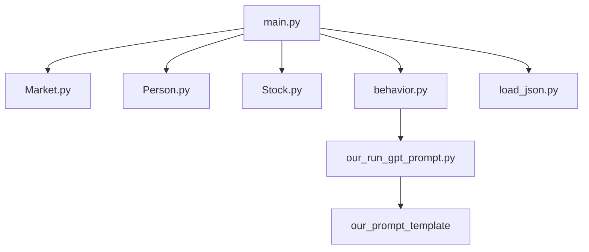
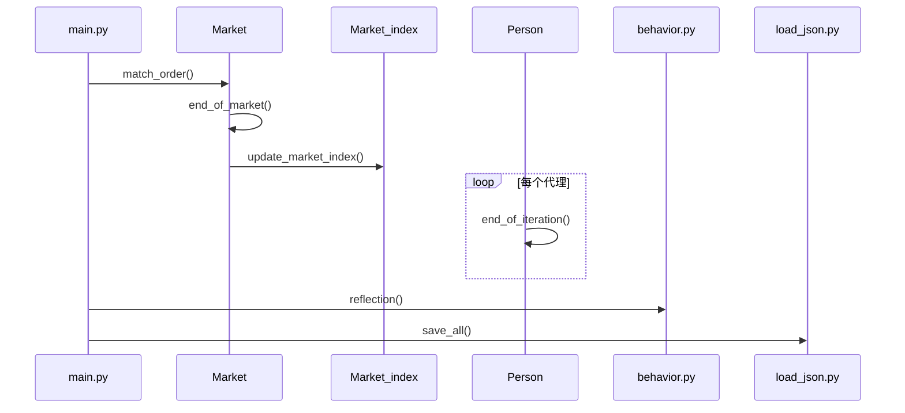
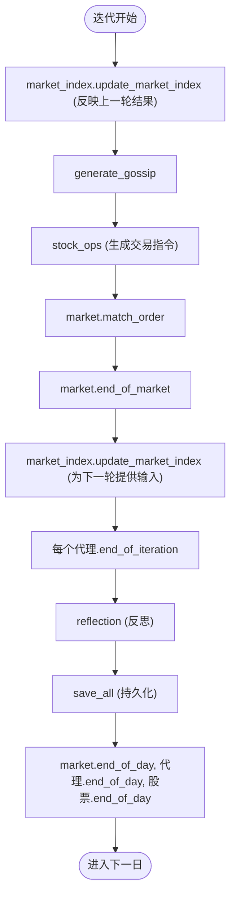
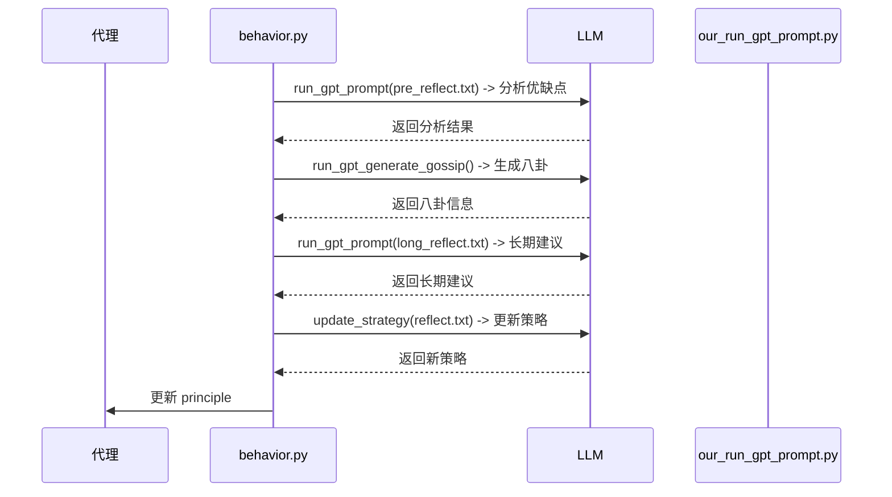
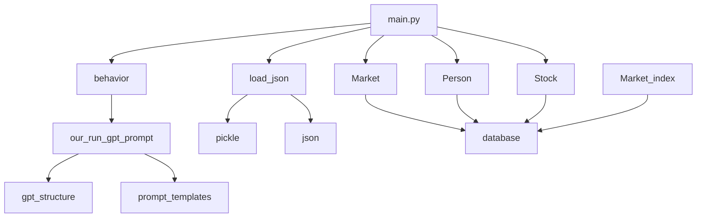

# 状态更新与反思机制

<cite>
**本文档引用的文件**
- [main.py](file://main.py)
- [Market.py](file://Market.py)
- [Person.py](file://Person.py)
- [Stock.py](file://Stock.py)
- [behavior.py](file://behavior.py)
- [load_json.py](file://load_json.py)
- [reflect.txt](file://content/our_prompt_template/reflect.txt)
- [long_reflect_infor.txt](file://content/our_prompt_template/long_reflect_infor.txt)
- [pre_reflect.txt](file://content/our_prompt_template/pre_reflect.txt)
- [pre_long_reflection.txt](file://content/our_prompt_template/pre_long_reflection.txt)
- [our_run_gpt_prompt.py](file://content/our_run_gpt_prompt.py)
</cite>

## 目录
1. [引言](#引言)
2. [项目结构](#项目结构)
3. [核心组件](#核心组件)
4. [架构概述](#架构概述)
5. [详细组件分析](#详细组件分析)
6. [依赖分析](#依赖分析)
7. [性能考虑](#性能考虑)
8. [故障排除指南](#故障排除指南)
9. [结论](#结论)

## 引言
本文档详细阐述了代理交易竞技场（Agent-Trading-Arena）中的状态更新与反思机制。该机制是系统实现智能体自适应学习的核心，通过精确的每日迭代循环，协调市场、代理和股票状态的更新，并驱动基于大语言模型（LLM）的策略优化。文档将重点解析`market_index.update_market_index`在迭代前后的调用目的、`end_of_iteration`和`end_of_day`等生命周期方法的内部状态更新逻辑，以及`reflection`函数如何触发短期与长期反思，最终通过`save_all`持久化关键状态。

## 项目结构
系统采用模块化设计，主要功能分散在`Stock_Main`目录下的多个Python文件中。`main.py`作为入口点，协调整个模拟流程。`Market.py`、`Person.py`和`Stock.py`分别封装了市场、代理（包括投资者和经纪人）和股票的核心逻辑。`behavior.py`定义了智能体的行为决策和反思流程。`load_json.py`负责状态的持久化与恢复。提示模板（prompt templates）位于`content/our_prompt_template/`目录下，用于指导LLM进行分析和反思。

**图示来源**
- [main.py](file://main.py#L1-L151)
- [Market.py](file://Market.py#L1-L278)
- [Person.py](file://Person.py#L1-L629)
- [Stock.py](file://Stock.py#L1-L307)
- [behavior.py](file://behavior.py#L1-L210)
- [load_json.py](file://load_json.py#L1-L134)
- [our_run_gpt_prompt.py](file://content/our_run_gpt_prompt.py#L1-L628)

**本节来源**
- [main.py](file://main.py#L1-L151)
- [project_structure](file://project_structure)

## 核心组件
本系统的核心组件包括`Market_index`、`Person`、`Stock`和`Market`。`Market_index`负责计算和维护市场指数，作为衡量整体市场表现的关键指标。`Person`类代表参与交易的智能体，每个代理都拥有独特的身份、财务状况和投资策略（`principle`），并能根据市场信息做出买卖决策。`Stock`类管理单个股票的价格、交易量和分红等信息。`Market`类则负责订单匹配和交易结算。这些组件通过`database`进行状态同步，确保数据一致性。

**本节来源**
- [Market.py](file://Market.py#L12-L278)
- [Person.py](file://Person.py#L18-L629)
- [Stock.py](file://Stock.py#L14-L307)

## 架构概述
系统采用基于迭代的模拟架构。每个交易日被划分为多个迭代（iterations），在每个迭代中，所有代理根据当前市场状态生成交易指令，市场执行订单匹配，然后更新所有相关实体的状态。在迭代结束时，系统会触发状态更新和反思流程。在每日结束时，系统会进行更全面的状态结算和持久化。这种分层的更新机制确保了模拟的实时性和智能体学习的连续性。

**图示来源**
- [main.py](file://main.py#L117-L134)
- [Market.py](file://Market.py#L96-L265)
- [Stock.py](file://Stock.py#L227-L277)
- [Person.py](file://Person.py#L309-L363)
- [behavior.py](file://behavior.py#L174-L197)
- [load_json.py](file://load_json.py#L45-L77)

## 详细组件分析

### 市场与代理状态更新流程
在每次迭代中，`market_index.update_market_index`被调用两次，其目的截然不同。在迭代开始前（第114行），首次调用是为了**反映上一轮交易的结果**，将最新的股票价格纳入市场指数的计算，为当前迭代提供一个准确的市场基准。在市场完成订单匹配和结算后（第127行），第二次调用是为了**为下一轮决策提供输入**，更新市场指数以反映本轮交易的最新动态。这确保了代理在做出决策时，能够基于最及时的市场信息。

**本节来源**
- [main.py](file://main.py#L114-L128)

### 生命周期方法分析
系统通过`end_of_iteration`和`end_of_day`等生命周期方法来同步更新代理、股票和市场的内部状态。

- **`end_of_iteration`**: 在每次迭代结束时，每个代理调用此方法。它会查询所有股票的最新价格，重新计算其持有的每只股票的当前价值和盈亏，并更新其总资产（`asset`）和总财富（`wealth`）。最后，这些更新后的财务数据会写入数据库，确保状态的持久化。
- **`end_of_day`**: 在每个交易日结束时，系统会调用此方法。对于代理而言，它会计算当日的股息收入，更新现金和资产，并根据新的资产规模计算次日的日常开销。对于股票和市场指数，此方法会重置日内价格列表，并为次日创建新的数据记录。

**图示来源**
- [main.py](file://main.py#L110-L146)
- [Person.py](file://Person.py#L309-L363)
- [Stock.py](file://Stock.py#L52-L66)
- [Market.py](file://Market.py#L21-L29)

**本节来源**
- [Person.py](file://Person.py#L309-L428)
- [Stock.py](file://Stock.py#L52-L66)
- [Market.py](file://Market.py#L21-L29)

### 反思函数与LLM驱动的策略优化
`reflection`函数是智能体实现自适应学习的核心。它根据代理的`reflect_frequency`属性，在特定的迭代后被触发。该函数首先调用`pre_reflect`，利用`pre_reflect.txt`模板生成一个分析提示，引导LLM评估最近投资策略的优缺点（strengths and weaknesses）。然后，它调用`long_reflect`，使用`pre_long_reflection.txt`和`long_reflect_infor.txt`模板，引导LLM基于多日的历史数据提供长期投资建议。最后，`update_strategy`函数结合这些分析结果，通过`reflect.txt`模板生成一个新的投资策略，并将其更新到代理的`principle`属性中。

**图示来源**
- [behavior.py](file://behavior.py#L174-L197)
- [our_run_gpt_prompt.py](file://content/our_run_gpt_prompt.py#L151-L200)
- [content/our_prompt_template/pre_reflect.txt](file://content/our_prompt_template/pre_reflect.txt)
- [content/our_prompt_template/long_reflect_infor.txt](file://content/our_prompt_template/long_reflect_infor.txt)
- [content/our_prompt_template/reflect.txt](file://content/our_prompt_template/reflect.txt)

**本节来源**
- [behavior.py](file://behavior.py#L174-L197)
- [our_run_gpt_prompt.py](file://content/our_run_gpt_prompt.py#L151-L200)
- [content/our_prompt_template/](file://content/our_prompt_template/)

## 依赖分析
系统各组件通过`database`对象紧密耦合。`Market`、`Person`、`Stock`和`Market_index`都持有对`Database_operate`实例的引用，用于读写状态。`main.py`是顶层协调者，它初始化所有组件并驱动主循环。`behavior.py`依赖于`our_run_gpt_prompt.py`来与LLM交互，而`our_run_gpt_prompt.py`又依赖于`gpt_structure.py`和各种提示模板。`load_json.py`提供了`save_all`和`load_all`功能，是实现状态持久化的关键。

**图示来源**
- [main.py](file://main.py#L9-L13)
- [Market.py](file://Market.py#L7-L8)
- [Person.py](file://Person.py#L2-L3)
- [Stock.py](file://Stock.py#L4-L5)
- [behavior.py](file://behavior.py#L3-L11)
- [our_run_gpt_prompt.py](file://content/our_run_gpt_prompt.py#L1-L2)
- [load_json.py](file://load_json.py#L1-L6)

**本节来源**
- [main.py](file://main.py#L9-L13)
- [Market.py](file://Market.py#L7-L8)
- [Person.py](file://Person.py#L2-L3)
- [Stock.py](file://Stock.py#L4-L5)
- [behavior.py](file://behavior.py#L3-L11)
- [our_run_gpt_prompt.py](file://content/our_run_gpt_prompt.py#L1-L2)
- [load_json.py](file://load_json.py#L1-L6)

## 性能考虑
系统的性能瓶颈主要在于LLM的调用延迟和数据库的I/O操作。`reflection`和`generate_gossip`函数会频繁调用LLM，这可能导致模拟速度变慢。此外，`end_of_iteration`和`end_of_day`方法中大量的数据库查询和更新操作也可能成为性能瓶颈。为了优化性能，可以考虑对LLM调用进行批处理，或对数据库访问进行缓存。

## 故障排除指南
- **状态未更新**: 检查`end_of_iteration`和`end_of_day`方法是否被正确调用，以及数据库的`execute_sql`和`fetchall`方法是否正常工作。
- **反思未触发**: 检查代理的`reflect_frequency`属性是否设置正确，以及`reflection`函数的调用条件是否满足。
- **持久化失败**: 检查`save_all`函数中`pickle`序列化是否成功，以及目标目录是否有写入权限。
- **LLM调用失败**: 检查`our_run_gpt_prompt.py`中的API密钥和网络连接，以及提示模板的格式是否正确。

**本节来源**
- [Person.py](file://Person.py#L309-L428)
- [Stock.py](file://Stock.py#L52-L66)
- [behavior.py](file://behavior.py#L174-L197)
- [load_json.py](file://load_json.py#L45-L77)

## 结论
状态更新与反思机制是Agent-Trading-Arena系统实现智能体自适应学习的基石。通过精心设计的迭代循环，系统能够精确地同步市场、代理和股票的状态。`market_index.update_market_index`的双重调用确保了信息的时效性。`end_of_iteration`和`end_of_day`方法维护了财务数据的准确性。而基于LLM的反思机制，则赋予了代理从经验中学习并优化策略的能力。`save_all`函数确保了整个模拟过程的可重现性。这一整套机制共同构建了一个动态、智能且可追踪的交易模拟环境。