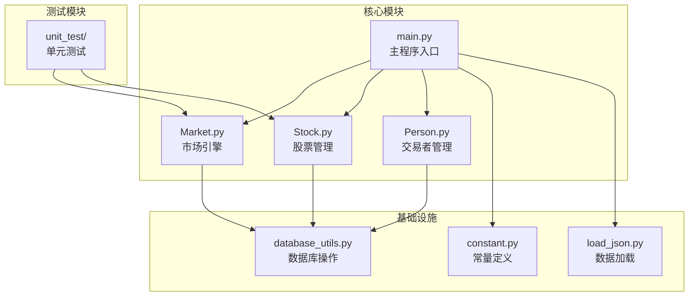
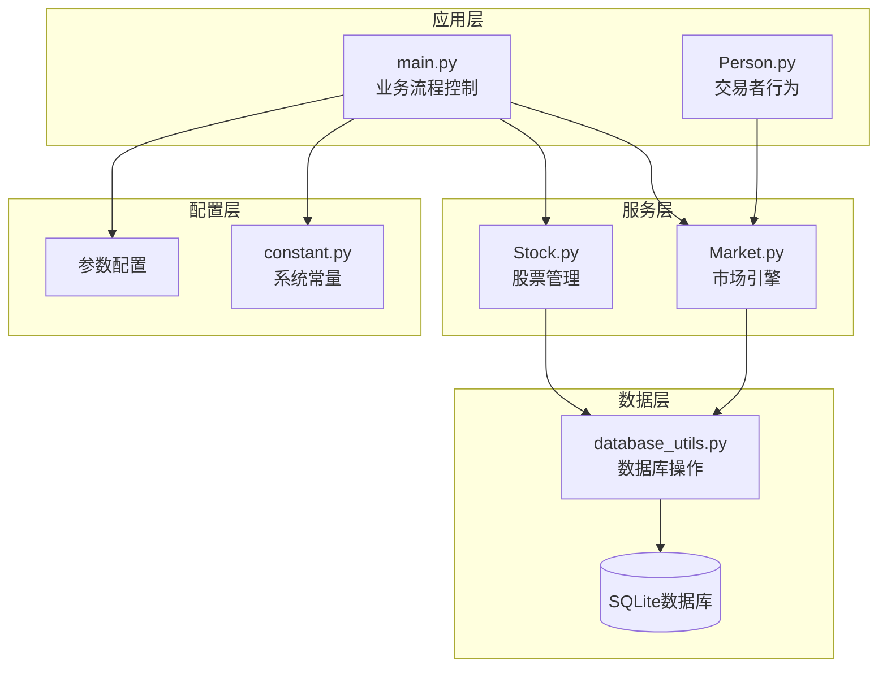
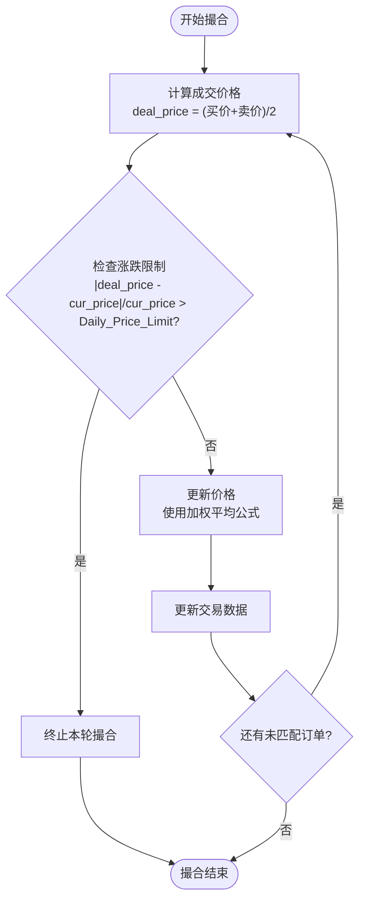
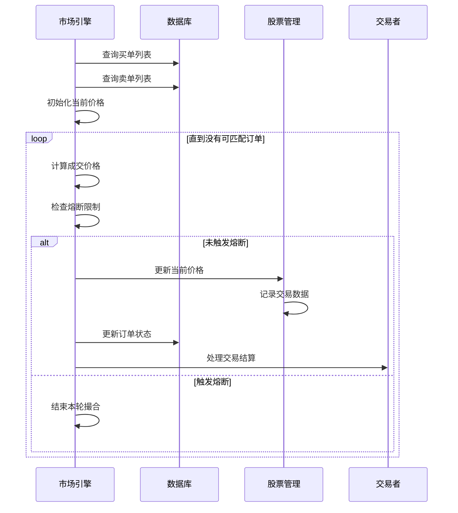
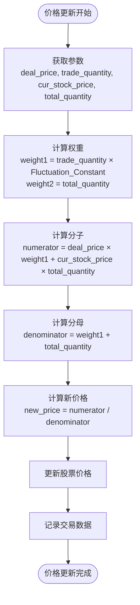
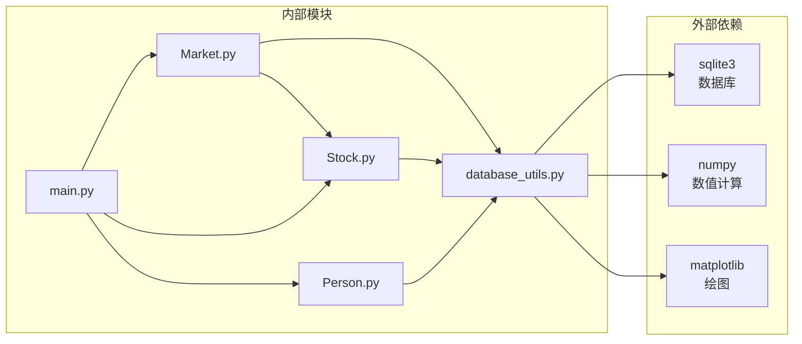

# 价格形成机制

<cite>
**本文档引用的文件**
- [main.py](file://Agent-Trading-Arena/Stock_Main/main.py)
- [Market.py](file://Agent-Trading-Arena/Stock_Main/Market.py)
- [Stock.py](file://Agent-Trading-Arena/Stock_Main/Stock.py)
- [database_utils.py](file://Agent-Trading-Arena/Stock_Main/database_utils.py)
- [test_market.py](file://Agent-Trading-Arena/Stock_Main/unit_test/test_market.py)
</cite>

## 目录
1. [引言](#引言)
2. [项目结构](#项目结构)
3. [核心组件](#核心组件)
4. [架构概览](#架构概览)
5. [详细组件分析](#详细组件分析)
6. [依赖关系分析](#依赖关系分析)
7. [性能考虑](#性能考虑)
8. [故障排除指南](#故障排除指南)
9. [结论](#结论)

## 引言

本文件深入分析了Agent Trading Arena模拟交易系统的价格形成机制，重点解释Market.match_order方法中的价格更新数学模型。该系统通过加权平均公式实现价格动态调整，同时利用Daily_Price_Limit参数实现每日涨跌幅限制的熔断机制。本文档详细阐述了两个关键参数Fluctuation_Constant和Daily_Price_Limit如何协同工作以维护市场价格稳定性和防止极端波动。

## 项目结构

Agent Trading Arena是一个基于Python的智能交易模拟系统，采用模块化设计，主要包含以下核心模块：



**图表来源**
- [main.py](file://Agent-Trading-Arena/Stock_Main/main.py#L1-L151)
- [Market.py](file://Agent-Trading-Arena/Stock_Main/Market.py#L1-L278)
- [Stock.py](file://Agent-Trading-Arena/Stock_Main/Stock.py#L1-L307)

**章节来源**
- [main.py](file://Agent-Trading-Arena/Stock_Main/main.py#L1-L151)
- [Market.py](file://Agent-Trading-Arena/Stock_Main/Market.py#L1-L278)
- [Stock.py](file://Agent-Trading-Arena/Stock_Main/Stock.py#L1-L307)

## 核心组件

### 市场引擎 (Market类)

Market类是整个系统的核心，负责订单撮合、价格形成和市场数据管理。其主要职责包括：

- **订单撮合**: 实现买卖订单的匹配算法
- **价格更新**: 基于加权平均公式的动态价格调整
- **熔断机制**: 实施每日涨跌幅限制
- **数据持久化**: 管理数据库中的市场数据

### 股票管理 (Stock类)

Stock类封装了单个股票的所有属性和行为：

- **价格管理**: 维护当前价格、历史价格序列
- **交易数据**: 记录成交量、最高价、最低价等
- **市场指标**: 计算日内涨跌幅、历史回报率等

### 数据库操作 (Database_operate类)

提供统一的数据库访问接口，支持：
- 订单查询和更新
- 股票数据管理
- 交易者信息维护

**章节来源**
- [Market.py](file://Agent-Trading-Arena/Stock_Main/Market.py#L12-L278)
- [Stock.py](file://Agent-Trading-Arena/Stock_Main/Stock.py#L14-L307)
- [database_utils.py](file://Agent-Trading-Arena/Stock_Main/database_utils.py#L245-L322)

## 架构概览

系统采用分层架构设计，各层职责明确：



**图表来源**
- [main.py](file://Agent-Trading-Arena/Stock_Main/main.py#L1-L151)
- [Market.py](file://Agent-Trading-Arena/Stock_Main/Market.py#L1-L278)
- [Stock.py](file://Agent-Trading-Arena/Stock_Main/Stock.py#L1-L307)
- [database_utils.py](file://Agent-Trading-Arena/Stock_Main/database_utils.py#L245-L322)

## 详细组件分析

### 价格形成数学模型

#### 加权平均公式详解

Market.match_order方法实现了核心的价格更新机制，使用以下加权平均公式：

```
新价格 = (成交价 × 成交数量 × 波动常数 + 当前价格 × 总流通股数) / (成交数量 × 波动常数 + 总流通股数)
```

这个公式的数学意义在于：
- **权重分配**: 成交价和当前价格按各自的重要性权重进行加权
- **流动性调节**: 波动常数Fluctuation_Constant作为流动性调节因子
- **价格收敛**: 随着交易量增加，价格向成交价收敛

#### 参数配置分析

系统通过命令行参数配置关键参数：

| 参数名称 | 默认值 | 类型 | 描述 |
|---------|--------|------|------|
| Daily_Price_Limit | 0.7 | float | 每日涨跌幅限制比例（70%） |
| Fluctuation_Constant | 20.0 | float | 价格波动调节常数 |

**章节来源**
- [main.py](file://Agent-Trading-Arena/Stock_Main/main.py#L30-L34)
- [Market.py](file://Agent-Trading-Arena/Stock_Main/Market.py#L64-L67)

### 熔断机制实现

#### Daily_Price_Limit熔断逻辑

系统实现了双重熔断保护机制：

1. **实时熔断**: 在订单撮合过程中实时检查
2. **收盘熔断**: 在市场收盘时进行最终检查



**图表来源**
- [Market.py](file://Agent-Trading-Arena/Stock_Main/Market.py#L111-L118)
- [Market.py](file://Agent-Trading-Arena/Stock_Main/Market.py#L44-L48)

#### 熔断机制的工作原理

熔断机制通过以下步骤实现：

1. **实时监控**: 每次成交后计算潜在价格变化幅度
2. **阈值比较**: 将价格变化与当前价格的比值与Daily_Price_Limit比较
3. **熔断触发**: 当超过阈值时立即停止撮合，防止进一步波动
4. **系统保护**: 保护市场免受极端价格波动影响

**章节来源**
- [Market.py](file://Agent-Trading-Arena/Stock_Main/Market.py#L111-L118)
- [Market.py](file://Agent-Trading-Arena/Stock_Main/Market.py#L44-L48)

### 订单撮合流程

#### 顺序图展示



**图表来源**
- [Market.py](file://Agent-Trading-Arena/Stock_Main/Market.py#L96-L200)
- [Market.py](file://Agent-Trading-Arena/Stock_Main/Market.py#L230-L265)

**章节来源**
- [Market.py](file://Agent-Trading-Arena/Stock_Main/Market.py#L96-L200)
- [Market.py](file://Agent-Trading-Arena/Stock_Main/Market.py#L230-L265)

### 价格更新算法

#### 算法流程图



**图表来源**
- [Market.py](file://Agent-Trading-Arena/Stock_Main/Market.py#L124-L128)
- [Market.py](file://Agent-Trading-Arena/Stock_Main/Market.py#L64-L67)

#### 数学模型分析

该加权平均模型具有以下特性：

1. **平滑效应**: 新价格既反映最新成交信息，也保留历史价格信息
2. **流动性敏感**: Fluctuation_Constant越大，价格对新成交越敏感
3. **稳定性保证**: 即使在大额交易下，价格也不会完全偏离历史水平

**章节来源**
- [Market.py](file://Agent-Trading-Arena/Stock_Main/Market.py#L124-L128)
- [Market.py](file://Agent-Trading-Arena/Stock_Main/Market.py#L64-L67)

### 参数配置与优化

#### Fluctuation_Constant的作用机制

| 值范围 | 流动性特征 | 价格响应速度 | 风险水平 |
|--------|------------|--------------|----------|
| 0 < x < 1 | 极低流动性 | 缓慢响应 | 低风险 |
| 1 ≤ x ≤ 10 | 低流动性 | 中等响应 | 中等风险 |
| 10 < x < 50 | 正常流动性 | 快速响应 | 中等风险 |
| x ≥ 50 | 高流动性 | 极快响应 | 高风险 |

#### Daily_Price_Limit的设置原则

熔断阈值的设置需要平衡：
- **市场效率**: 过严的限制可能阻碍正常交易
- **风险管理**: 过松的限制可能导致市场恐慌
- **监管要求**: 符合金融市场监管标准

**章节来源**
- [main.py](file://Agent-Trading-Arena/Stock_Main/main.py#L30-L34)
- [Market.py](file://Agent-Trading-Arena/Stock_Main/Market.py#L114-L116)

## 依赖关系分析

### 模块间依赖关系



**图表来源**
- [main.py](file://Agent-Trading-Arena/Stock_Main/main.py#L1-L151)
- [Market.py](file://Agent-Trading-Arena/Stock_Main/Market.py#L1-L278)
- [Stock.py](file://Agent-Trading-Arena/Stock_Main/Stock.py#L1-L307)
- [database_utils.py](file://Agent-Trading-Arena/Stock_Main/database_utils.py#L1-L322)

### 关键依赖分析

系统的关键依赖关系包括：

1. **数据库依赖**: 所有数据持久化操作依赖SQLite数据库
2. **数学计算依赖**: 使用numpy进行数值计算
3. **可视化依赖**: 支持matplotlib进行数据可视化
4. **时间管理依赖**: 使用datetime模块处理时间戳

**章节来源**
- [database_utils.py](file://Agent-Trading-Arena/Stock_Main/database_utils.py#L1-L322)
- [Stock.py](file://Agent-Trading-Arena/Stock_Main/Stock.py#L1-L307)

## 性能考虑

### 算法复杂度分析

1. **订单撮合复杂度**: O(n log n)，其中n为订单数量
2. **价格更新复杂度**: O(1)，常数时间操作
3. **数据库查询复杂度**: O(log n)，基于索引的查询

### 内存使用优化

- **订单缓存**: 使用内存中的订单列表减少数据库访问
- **批量操作**: 批量更新数据库记录提高效率
- **数据结构选择**: 使用高效的Python内置数据类型

### 并发处理

系统目前采用单线程处理模式，适合模拟环境。如需扩展到生产环境，建议：

1. **多线程架构**: 支持并发订单处理
2. **异步I/O**: 提高数据库操作效率
3. **负载均衡**: 支持多实例部署

## 故障排除指南

### 常见问题及解决方案

#### 1. 价格异常波动

**症状**: 价格出现不合理的大幅波动

**可能原因**:
- Fluctuation_Constant设置过高
- Daily_Price_Limit设置过松
- 数据库连接异常

**解决方法**:
- 调整Fluctuation_Constant到合理范围
- 设置更严格的熔断阈值
- 检查数据库连接状态

#### 2. 订单无法撮合

**症状**: 买单或卖单长时间无法成交

**可能原因**:
- 价格差距过大
- 流动性不足
- 熔断机制触发

**解决方法**:
- 调整订单价格
- 增加市场流动性
- 检查熔断设置

#### 3. 数据不一致

**症状**: 数据库中的订单状态与实际不符

**可能原因**:
- 数据库事务处理异常
- 程序异常退出
- 并发访问冲突

**解决方法**:
- 实现完善的错误处理机制
- 使用数据库事务确保一致性
- 添加数据完整性检查

**章节来源**
- [test_market.py](file://Agent-Trading-Arena/Stock_Main/unit_test/test_market.py#L1-L149)
- [Market.py](file://Agent-Trading-Arena/Stock_Main/Market.py#L230-L265)

## 结论

Agent Trading Arena的模拟交易系统通过精心设计的价格形成机制实现了市场的真实模拟。核心创新点包括：

1. **数学模型**: 使用加权平均公式实现平滑的价格更新
2. **熔断机制**: 通过Daily_Price_Limit参数有效防止极端波动
3. **参数调节**: Fluctuation_Constant提供灵活的流动性控制
4. **模块化设计**: 清晰的架构分离便于维护和扩展

该系统为金融市场的研究和教育提供了有价值的工具，其价格形成机制体现了现代金融市场的基本原理，同时通过参数调节实现了不同市场条件下的模拟效果。

通过合理配置参数，系统能够在保持市场活跃度的同时维护价格稳定性，为用户提供真实的交易体验。这种设计思路对于理解真实金融市场中的价格形成机制具有重要的参考价值。