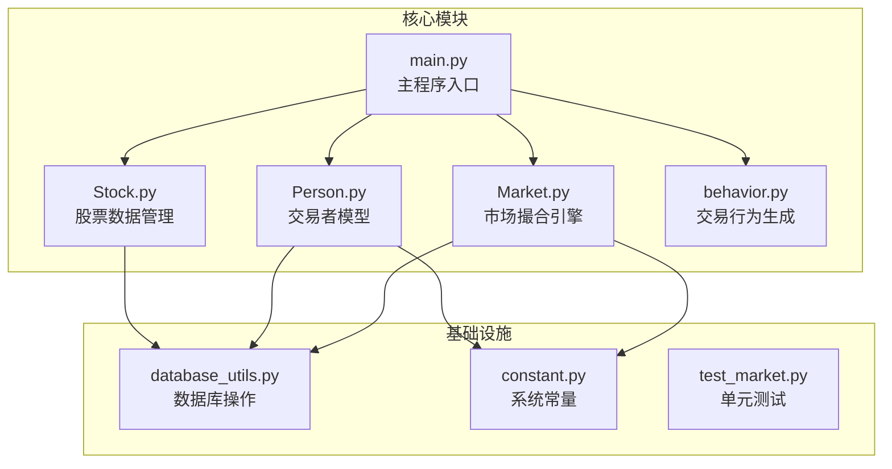
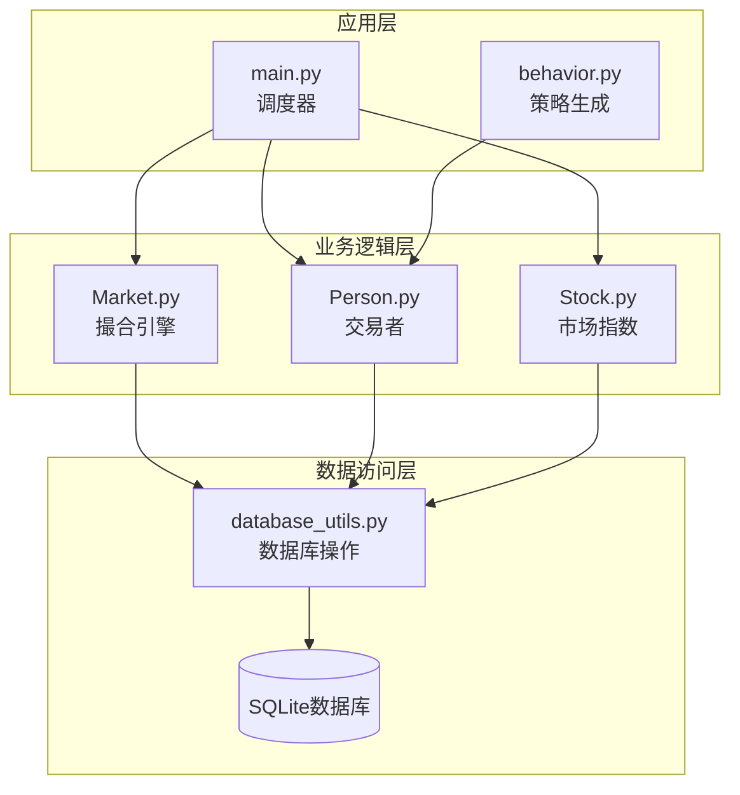
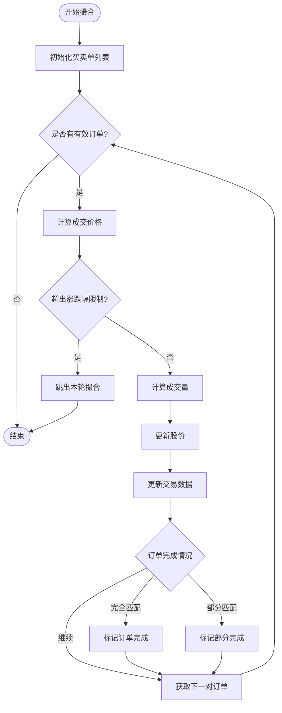
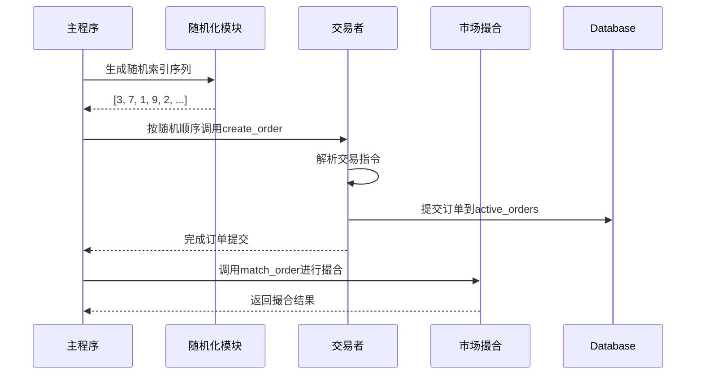
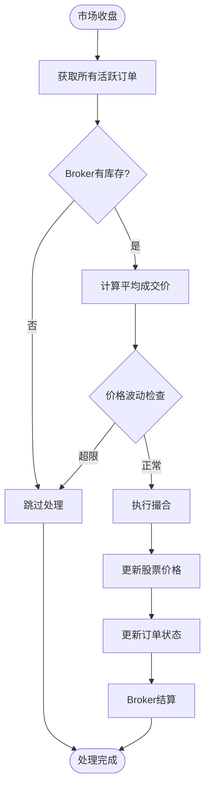
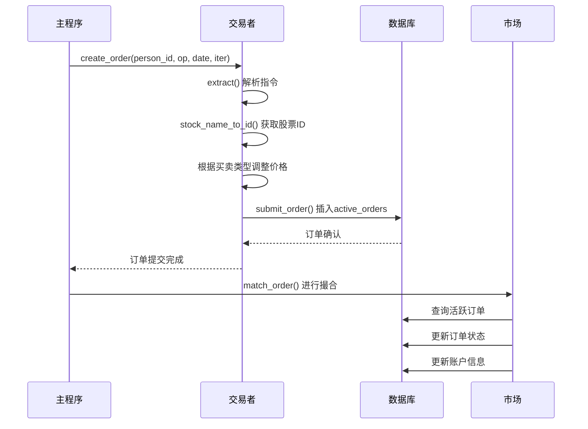
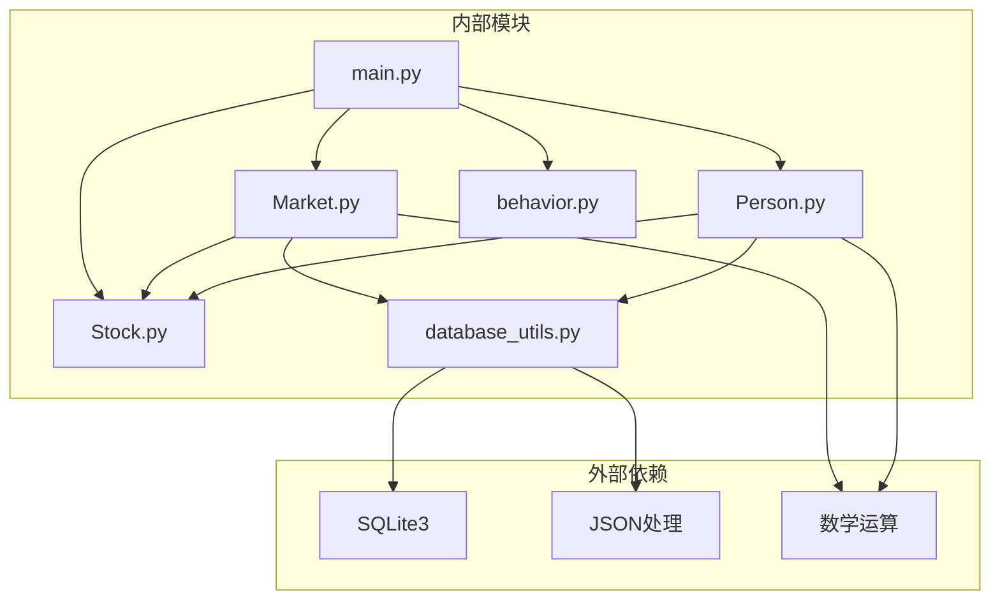

# 订单执行与撮合

<cite>
**本文档引用的文件**
- [main.py](file://Agent-Trading-Arena/Stock_Main/main.py)
- [Market.py](file://Agent-Trading-Arena/Stock_Main/Market.py)
- [Person.py](file://Agent-Trading-Arena/Stock_Main/Person.py)
- [database_utils.py](file://Agent-Trading-Arena/Stock_Main/database_utils.py)
- [Stock.py](file://Agent-Trading-Arena/Stock_Main/Stock.py)
- [behavior.py](file://Agent-Trading-Arena/Stock_Main/behavior.py)
- [constant.py](file://Agent-Trading-Arena/Stock_Main/constant.py)
- [test_market.py](file://Agent-Trading-Arena/Stock_Main/unit_test/test_market.py)
</cite>

## 目录
1. [简介](#简介)
2. [项目结构](#项目结构)
3. [核心组件](#核心组件)
4. [架构概览](#架构概览)
5. [详细组件分析](#详细组件分析)
6. [依赖关系分析](#依赖关系分析)
7. [性能考虑](#性能考虑)
8. [故障排除指南](#故障排除指南)
9. [结论](#结论)

## 简介

本文件深入解析Agent Trading Arena项目中的订单执行与撮合机制，重点分析`main.py`中`market.match_order(virtual_date, args)`的实现逻辑。该系统通过模拟真实市场的异步交易行为，实现了基于价格优先、时间优先原则的自动撮合机制，同时集成了每日涨跌幅限制和波动常数等市场约束条件。

## 项目结构

该项目采用模块化的架构设计，主要包含以下核心模块：



**图表来源**
- [main.py](file://Agent-Trading-Arena/Stock_Main/main.py#L1-L151)
- [Market.py](file://Agent-Trading-Arena/Stock_Main/Market.py#L1-L278)
- [Person.py](file://Agent-Trading-Arena/Stock_Main/Person.py#L1-L629)

**章节来源**
- [main.py](file://Agent-Trading-Arena/Stock_Main/main.py#L1-L151)
- [Market.py](file://Agent-Trading-Arena/Stock_Main/Market.py#L1-L278)

## 核心组件

### 市场撮合引擎 (Market)

Market类是整个系统的中枢，负责：
- 订单撮合匹配
- 价格动态调整
- 涨跌幅限制控制
- 成交记录更新

### 交易者模型 (Person/Broker)

Person代表普通交易者，Broker作为市场做市商：
- 生成交易指令
- 执行财务结算
- 管理个人资产

### 数据库层 (Database_operate)

提供完整的数据库操作接口：
- 订单存储与查询
- 账户状态管理
- 历史数据维护

**章节来源**
- [Market.py](file://Agent-Trading-Arena/Stock_Main/Market.py#L12-L278)
- [Person.py](file://Agent-Trading-Arena/Stock_Main/Person.py#L143-L629)
- [database_utils.py](file://Agent-Trading-Arena/Stock_Main/database_utils.py#L245-L322)

## 架构概览

系统采用分层架构，从上到下分别为应用层、业务逻辑层、数据访问层：



**图表来源**
- [main.py](file://Agent-Trading-Arena/Stock_Main/main.py#L99-L151)
- [Market.py](file://Agent-Trading-Arena/Stock_Main/Market.py#L96-L278)
- [database_utils.py](file://Agent-Trading-Arena/Stock_Main/database_utils.py#L245-L322)

## 详细组件分析

### Market.match_order 方法深度解析

#### 核心撮合算法流程



**图表来源**
- [Market.py](file://Agent-Trading-Arena/Stock_Main/Market.py#L96-L200)

#### 价格形成机制

Market使用加权平均法形成成交价格：

```
成交价格 = (成交价 × 成交量 × 波动常数 + 当前价 × 总量) / (成交量 × 波动常数 + 总量)
```

其中：
- **波动常数 (Fluctuation_Constant)**：控制新成交对价格影响程度
- **每日涨跌幅限制 (Daily_Price_Limit)**：防止价格异常波动

#### 订单排序规则

系统严格遵循"价格优先、时间优先"原则：

**买单排序**：按价格升序排列，价格相同按时间升序
**卖单排序**：按价格降序排列，价格相同按时间升序

**章节来源**
- [Market.py](file://Agent-Trading-Arena/Stock_Main/Market.py#L96-L200)

### 随机化机制与异步交易模拟

#### 随机化订单提交流程



**图表来源**
- [main.py](file://Agent-Trading-Arena/Stock_Main/main.py#L117-L126)

#### 异步行为模拟优势

1. **消除顺序偏差**：随机化避免了固定顺序带来的策略优势
2. **真实市场模拟**：反映现实市场中订单到达的不确定性
3. **公平竞争环境**：确保所有交易者在相同条件下竞争

**章节来源**
- [main.py](file://Agent-Trading-Arena/Stock_Main/main.py#L117-L126)

### end_of_market 处理机制

#### 未成交订单处理流程



**图表来源**
- [Market.py](file://Agent-Trading-Arena/Stock_Main/Market.py#L30-L95)

#### Broker角色与职责

Broker作为做市商，在市场收盘时承担以下职责：
- 接收剩余未成交订单
- 使用自身库存满足市场需求
- 平衡市场供需关系
- 实现价格稳定功能

**章节来源**
- [Market.py](file://Agent-Trading-Arena/Stock_Main/Market.py#L30-L95)

### Person.create_order 调用链路

#### 订单创建完整流程



**图表来源**
- [Person.py](file://Agent-Trading-Arena/Stock_Main/Person.py#L212-L249)
- [database_utils.py](file://Agent-Trading-Arena/Stock_Main/database_utils.py#L224-L243)

#### 价格调整机制

系统通过微小的价格调整模拟真实市场：
- **买入订单**：价格上调5%（bid_price × 1.05）
- **卖出订单**：价格下调5%（bid_price × 0.95）

这种机制确保了市场流动性，避免了完全无利可图的套利机会。

**章节来源**
- [Person.py](file://Agent-Trading-Arena/Stock_Main/Person.py#L212-L249)

### 实际交易场景示例

#### 场景一：多笔订单同时撮合

假设在一次迭代中有以下订单：

| 订单ID | 类型 | 价格 | 数量 | 时间戳 |
|--------|------|------|------|--------|
| 1001 | 买入 | 105 | 10 | 10:00:01 |
| 1002 | 卖出 | 103 | 8 | 10:00:02 |
| 1003 | 买入 | 104 | 5 | 10:00:03 |
| 1004 | 卖出 | 102 | 12 | 10:00:04 |

**撮合过程**：
1. **第一轮**：1001(105) vs 1004(102) → 成交8股，成交价=103.5
2. **第二轮**：1001剩余2股 vs 1003(104) → 成交2股，成交价=104.5
3. **最终结果**：1003剩余3股未成交

#### 场景二：涨跌幅限制触发

当新成交价格与前一日收盘价的波动超过每日涨跌幅限制时：
- 系统会跳过本轮撮合
- 订单保持活跃状态
- 等待后续交易日重新撮合

**章节来源**
- [Market.py](file://Agent-Trading-Arena/Stock_Main/Market.py#L111-L198)

## 依赖关系分析

### 组件间依赖关系



**图表来源**
- [main.py](file://Agent-Trading-Arena/Stock_Main/main.py#L1-L15)
- [Market.py](file://Agent-Trading-Arena/Stock_Main/Market.py#L1-L10)
- [database_utils.py](file://Agent-Trading-Arena/Stock_Main/database_utils.py#L1-L8)

### 关键依赖特性

1. **数据库依赖**：所有状态持久化依赖SQLite数据库
2. **配置依赖**：通过参数对象传递系统配置
3. **时间依赖**：严格的时间戳管理确保交易顺序正确
4. **数学依赖**：精确的价格计算和波动控制

**章节来源**
- [database_utils.py](file://Agent-Trading-Arena/Stock_Main/database_utils.py#L245-L322)
- [Market.py](file://Agent-Trading-Arena/Stock_Main/Market.py#L1-L278)

## 性能考虑

### 算法复杂度分析

1. **撮合算法复杂度**：O(n log n)，其中n为订单数量
2. **数据库查询复杂度**：O(log n)，使用索引优化
3. **内存使用**：O(n)，存储活跃订单和临时数据

### 优化建议

1. **索引优化**：为`active_orders`表建立复合索引
2. **批量操作**：合并多个数据库操作减少往返
3. **缓存机制**：缓存常用查询结果
4. **并发控制**：使用事务保证数据一致性

## 故障排除指南

### 常见问题及解决方案

#### 订单无法撮合
**可能原因**：
- 价格超出涨跌幅限制
- 买卖双方价格不匹配
- Broker库存不足

**解决方法**：
- 检查`Daily_Price_Limit`参数设置
- 验证订单价格是否合理
- 确认Broker库存状态

#### 数据库连接问题
**症状**：操作失败或数据不一致

**解决步骤**：
1. 检查数据库文件权限
2. 验证表结构完整性
3. 确认事务提交状态

**章节来源**
- [test_market.py](file://Agent-Trading-Arena/Stock_Main/unit_test/test_market.py#L128-L145)

### 调试技巧

1. **启用详细日志**：使用`--verbose`参数查看详细输出
2. **单元测试**：运行`test_market.py`验证核心功能
3. **数据验证**：定期检查数据库表状态

## 结论

Agent Trading Arena项目成功实现了复杂的订单执行与撮合机制。通过精心设计的随机化订单提交、严格的撮合规则和智能的价格控制，系统能够有效模拟真实市场的动态变化。

### 主要成就

1. **真实市场模拟**：通过随机化机制避免了固定顺序偏差
2. **严格的风控体系**：每日涨跌幅限制确保市场稳定性
3. **高效的撮合算法**：基于价格优先、时间优先的公平匹配
4. **完整的生命周期管理**：从订单提交到结算的全流程覆盖

### 技术亮点

- **灵活的参数配置**：支持自定义涨跌幅限制和波动常数
- **强大的扩展性**：模块化设计便于功能扩展
- **完善的测试体系**：单元测试确保代码质量
- **详细的文档记录**：便于理解和维护

该系统为金融仿真研究提供了坚实的技术基础，其设计理念和实现方式值得在类似项目中借鉴和参考。