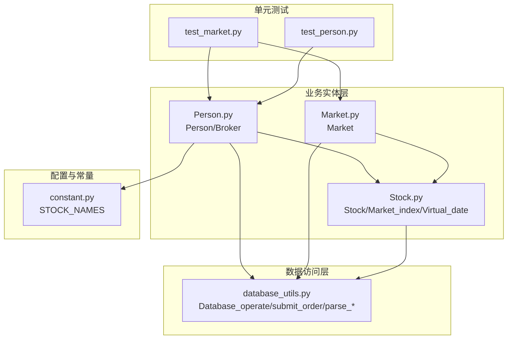
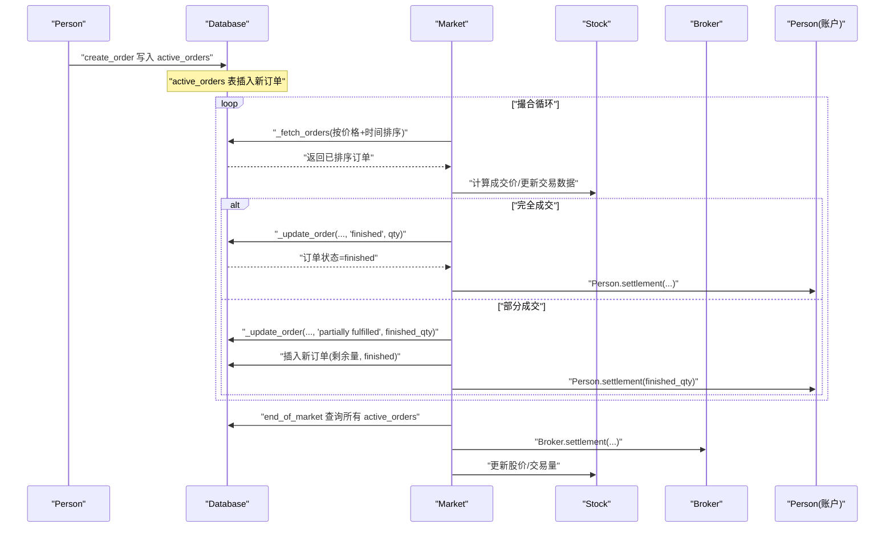
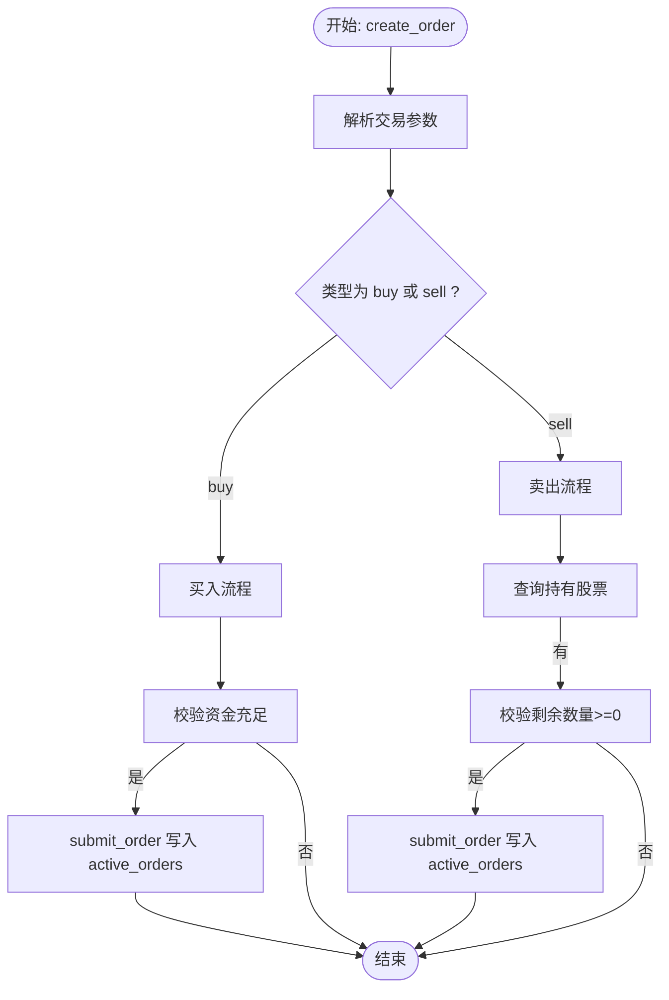
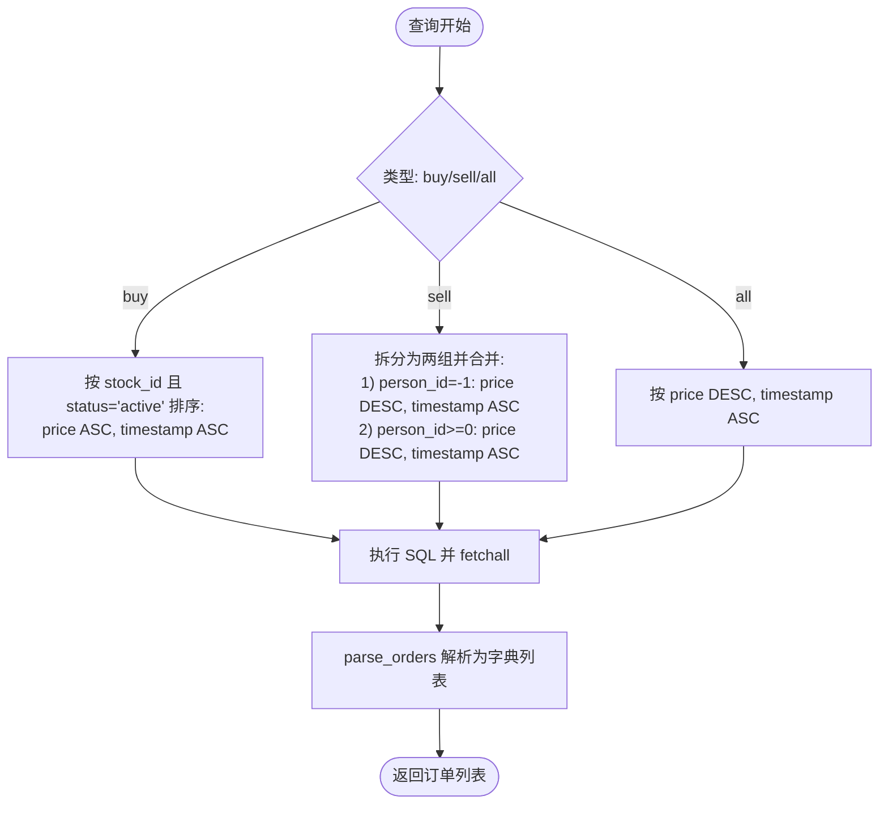
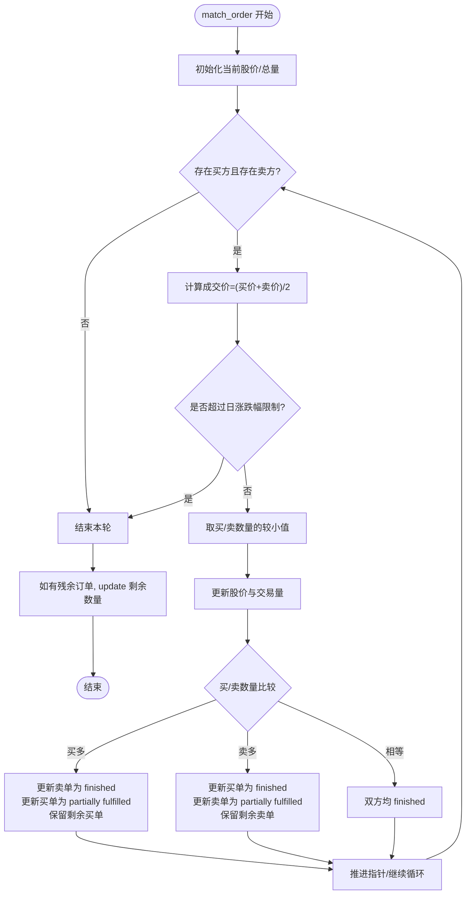
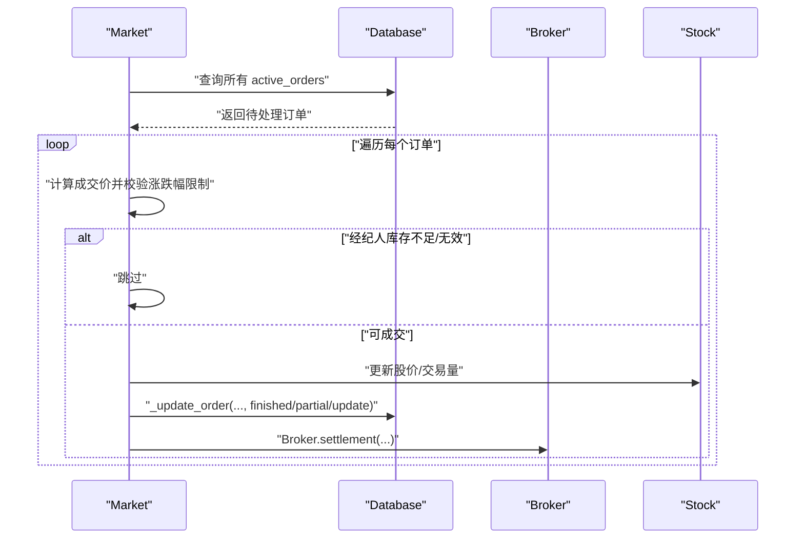
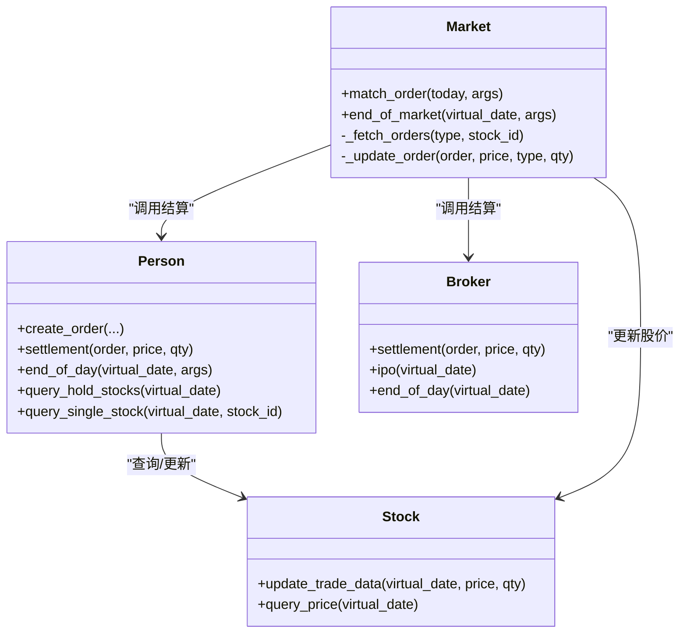
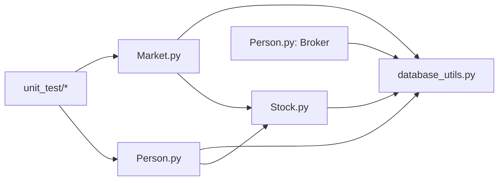

# 订单管理

<cite>
**本文引用的文件列表**
- [Person.py](file://Agent-Trading-Arena/Stock_Main/Person.py)
- [Market.py](file://Agent-Trading-Arena/Stock_Main/Market.py)
- [database_utils.py](file://Agent-Trading-Arena/Stock_Main/database_utils.py)
- [Stock.py](file://Agent-Trading-Arena/Stock_Main/Stock.py)
- [constant.py](file://Agent-Trading-Arena/Stock_Main/constant.py)
- [test_market.py](file://Agent-Trading-Arena/Stock_Main/unit_test/test_market.py)
- [test_person.py](file://Agent-Trading-Arena/Stock_Main/unit_test/test_person.py)
</cite>

## 目录
1. [简介](#简介)
2. [项目结构](#项目结构)
3. [核心组件](#核心组件)
4. [架构总览](#架构总览)
5. [详细组件分析](#详细组件分析)
6. [依赖关系分析](#依赖关系分析)
7. [性能考量](#性能考量)
8. [故障排查指南](#故障排查指南)
9. [结论](#结论)

## 简介
本文件系统性梳理“订单管理”机制，围绕以下目标展开：
- 解析 Person.create_order 如何基于交易决策生成订单并提交到数据库 active_orders 表
- 描述 Market._fetch_orders 如何按买卖方向与股票 ID 提取订单，并依据价格优先、时间优先规则排序（买单价升序、卖单价降序）
- 阐述 Market.match_order 中订单状态的三种更新方式：finished（完全成交）、partially fulfilled（部分成交）与 update（剩余数量更新）
- 说明 Market.end_of_market 如何处理当日未成交订单，由经纪人进行最终撮合
- 结合数据库操作，解释订单状态变更如何触发财务结算与账户更新

## 项目结构
该模块采用分层设计：
- 数据访问层：database_utils 提供数据库连接、表结构初始化、SQL 执行与结果解析
- 业务实体层：Stock 定义股票价格与交易数据；Person/Broker 定义交易者与经纪人；Market 定义撮合引擎
- 单元测试：验证撮合逻辑、订单查询与日终处理

图表来源
- [database_utils.py](file://Agent-Trading-Arena/Stock_Main/database_utils.py#L245-L322)
- [Person.py](file://Agent-Trading-Arena/Stock_Main/Person.py#L143-L629)
- [Market.py](file://Agent-Trading-Arena/Stock_Main/Market.py#L12-L278)
- [Stock.py](file://Agent-Trading-Arena/Stock_Main/Stock.py#L14-L307)
- [constant.py](file://Agent-Trading-Arena/Stock_Main/constant.py#L1-L2)
- [test_market.py](file://Agent-Trading-Arena/Stock_Main/unit_test/test_market.py#L1-L149)
- [test_person.py](file://Agent-Trading-Arena/Stock_Main/unit_test/test_person.py#L1-L205)

章节来源
- [database_utils.py](file://Agent-Trading-Arena/Stock_Main/database_utils.py#L245-L322)
- [Person.py](file://Agent-Trading-Arena/Stock_Main/Person.py#L143-L629)
- [Market.py](file://Agent-Trading-Arena/Stock_Main/Market.py#L12-L278)
- [Stock.py](file://Agent-Trading-Arena/Stock_Main/Stock.py#L14-L307)
- [constant.py](file://Agent-Trading-Arena/Stock_Main/constant.py#L1-L2)

## 核心组件
- Person.create_order：根据交易决策生成订单，写入 active_orders
- Market._fetch_orders：按买卖方向与股票 ID 查询并排序
- Market.match_order：执行撮合，更新订单状态与股价
- Market.end_of_market：日终未成交订单由经纪人撮合
- Broker.settlement：经纪人层面的财务结算
- Person.settlement：个人层面的财务结算与账户更新

章节来源
- [Person.py](file://Agent-Trading-Arena/Stock_Main/Person.py#L212-L248)
- [Market.py](file://Agent-Trading-Arena/Stock_Main/Market.py#L202-L228)
- [Market.py](file://Agent-Trading-Arena/Stock_Main/Market.py#L96-L199)
- [Market.py](file://Agent-Trading-Arena/Stock_Main/Market.py#L30-L95)
- [Person.py](file://Agent-Trading-Arena/Stock_Main/Person.py#L250-L308)

## 架构总览
订单生命周期的关键流程如下：
- 交易决策生成订单 → 写入 active_orders
- 撮合引擎按价格优先、时间优先匹配
- 成交后更新订单状态并触发结算
- 日终未成交订单由经纪人撮合
- 财务结算影响账户与资产

图表来源
- [Person.py](file://Agent-Trading-Arena/Stock_Main/Person.py#L212-L248)
- [database_utils.py](file://Agent-Trading-Arena/Stock_Main/database_utils.py#L224-L242)
- [Market.py](file://Agent-Trading-Arena/Stock_Main/Market.py#L96-L199)
- [Market.py](file://Agent-Trading-Arena/Stock_Main/Market.py#L202-L228)
- [Market.py](file://Agent-Trading-Arena/Stock_Main/Market.py#L230-L264)
- [Stock.py](file://Agent-Trading-Arena/Stock_Main/Stock.py#L67-L112)
- [Person.py](file://Agent-Trading-Arena/Stock_Main/Person.py#L250-L308)

## 详细组件分析

### Person.create_order：订单生成与提交
- 输入：交易类型、股票名称、报价、数量
- 处理：
  - 将报价按方向调整（买入上浮、卖出下浮）
  - 校验资金或持仓是否足够
  - 调用 submit_order 写入 active_orders
- 输出：订单进入 active_orders 表，等待撮合

图表来源
- [Person.py](file://Agent-Trading-Arena/Stock_Main/Person.py#L212-L248)
- [database_utils.py](file://Agent-Trading-Arena/Stock_Main/database_utils.py#L224-L242)

章节来源
- [Person.py](file://Agent-Trading-Arena/Stock_Main/Person.py#L212-L248)
- [database_utils.py](file://Agent-Trading-Arena/Stock_Main/database_utils.py#L224-L242)

### Market._fetch_orders：订单提取与排序
- 功能：按买卖方向与股票 ID 提取 active_orders，并按价格优先、时间优先排序
- 买入订单：price ASC, timestamp ASC
- 卖出订单：分为两类
  - 来自经纪人（person_id=-1）：price DESC, timestamp ASC
  - 来自普通交易者（person_id>=0）：price DESC, timestamp ASC
- 全部订单：price DESC, timestamp ASC

图表来源
- [Market.py](file://Agent-Trading-Arena/Stock_Main/Market.py#L202-L228)
- [database_utils.py](file://Agent-Trading-Arena/Stock_Main/database_utils.py#L73-L93)

章节来源
- [Market.py](file://Agent-Trading-Arena/Stock_Main/Market.py#L202-L228)
- [database_utils.py](file://Agent-Trading-Arena/Stock_Main/database_utils.py#L73-L93)

### Market.match_order：撮合与状态更新
- 流程要点：
  - 对每只股票，分别取出已排序的买方与卖方订单
  - 计算成交价（买卖报价均值），并与当前股价比较，超出日涨跌幅限制则停止本轮
  - 根据成交量取最小值，更新股价与交易量
  - 更新订单状态：
    - finished：完全成交
    - partially fulfilled：部分成交，同时插入一条“已完成”的新记录
    - update：仅更新剩余数量
  - 触发个人结算（Person.settlement）

图表来源
- [Market.py](file://Agent-Trading-Arena/Stock_Main/Market.py#L96-L199)
- [Market.py](file://Agent-Trading-Arena/Stock_Main/Market.py#L230-L264)
- [Stock.py](file://Agent-Trading-Arena/Stock_Main/Stock.py#L67-L112)

章节来源
- [Market.py](file://Agent-Trading-Arena/Stock_Main/Market.py#L96-L199)
- [Market.py](file://Agent-Trading-Arena/Stock_Main/Market.py#L230-L264)
- [Stock.py](file://Agent-Trading-Arena/Stock_Main/Stock.py#L67-L112)

### Market.end_of_market：日终未成交订单处理
- 行为：
  - 查询所有 active_orders
  - 对每个订单，计算成交价并检查是否超过日涨跌幅限制
  - 若经纪人库存不足或订单无效，则跳过
  - 否则按“部分成交/完全成交”策略更新订单状态，并由经纪人完成结算
  - 更新股价与交易数据

图表来源
- [Market.py](file://Agent-Trading-Arena/Stock_Main/Market.py#L30-L95)
- [Market.py](file://Agent-Trading-Arena/Stock_Main/Market.py#L230-L264)
- [Stock.py](file://Agent-Trading-Arena/Stock_Main/Stock.py#L67-L112)

章节来源
- [Market.py](file://Agent-Trading-Arena/Stock_Main/Market.py#L30-L95)
- [Market.py](file://Agent-Trading-Arena/Stock_Main/Market.py#L230-L264)
- [Stock.py](file://Agent-Trading-Arena/Stock_Main/Stock.py#L67-L112)

### 财务结算与账户更新
- 个人结算（Person.settlement）：
  - 买入：扣减现金、增加持有份额与成本均价、更新利润
  - 卖出：增加现金、减少持有份额、计算利润
  - 更新账户表与个人资产/财富
- 经纪人结算（Broker.settlement）：
  - 买入：收到卖出订单，增加现金与库存
  - 卖出：支付买入订单，减少现金与库存
- 日终处理（Person.end_of_day）：
  - 更新持有股票的当前价与利润
  - 计算当日股息与支出，生成次日账户快照

图表来源
- [Person.py](file://Agent-Trading-Arena/Stock_Main/Person.py#L250-L427)
- [Person.py](file://Agent-Trading-Arena/Stock_Main/Person.py#L65-L141)
- [Market.py](file://Agent-Trading-Arena/Stock_Main/Market.py#L96-L199)
- [Stock.py](file://Agent-Trading-Arena/Stock_Main/Stock.py#L67-L112)

章节来源
- [Person.py](file://Agent-Trading-Arena/Stock_Main/Person.py#L250-L427)
- [Person.py](file://Agent-Trading-Arena/Stock_Main/Person.py#L65-L141)
- [Market.py](file://Agent-Trading-Arena/Stock_Main/Market.py#L96-L199)
- [Stock.py](file://Agent-Trading-Arena/Stock_Main/Stock.py#L67-L112)

## 依赖关系分析
- Person 依赖 database_utils.submit_order 与数据库工具函数
- Market 依赖 database_utils.Database_operate 与 parse_orders
- Stock 提供股价与交易数据的读写接口
- Broker 与 Person 共同维护账户与资产
- 单元测试覆盖撮合、查询与日终处理

图表来源
- [Person.py](file://Agent-Trading-Arena/Stock_Main/Person.py#L1-L16)
- [Market.py](file://Agent-Trading-Arena/Stock_Main/Market.py#L7-L8)
- [database_utils.py](file://Agent-Trading-Arena/Stock_Main/database_utils.py#L1-L10)
- [Stock.py](file://Agent-Trading-Arena/Stock_Main/Stock.py#L1-L10)
- [test_market.py](file://Agent-Trading-Arena/Stock_Main/unit_test/test_market.py#L12-L15)
- [test_person.py](file://Agent-Trading-Arena/Stock_Main/unit_test/test_person.py#L12-L14)

章节来源
- [Person.py](file://Agent-Trading-Arena/Stock_Main/Person.py#L1-L16)
- [Market.py](file://Agent-Trading-Arena/Stock_Main/Market.py#L7-L8)
- [database_utils.py](file://Agent-Trading-Arena/Stock_Main/database_utils.py#L1-L10)
- [Stock.py](file://Agent-Trading-Arena/Stock_Main/Stock.py#L1-L10)
- [test_market.py](file://Agent-Trading-Arena/Stock_Main/unit_test/test_market.py#L12-L15)
- [test_person.py](file://Agent-Trading-Arena/Stock_Main/unit_test/test_person.py#L12-L14)

## 性能考量
- 订单查询使用索引列（type、stock_id、status、price、timestamp）进行排序，建议在数据库层建立相应索引以提升 _fetch_orders 的效率
- 撮合循环按已排序队列进行，避免重复扫描，时间复杂度近似 O(N)
- 日终处理对所有 active_orders 进行遍历，建议在大规模并发时考虑分批处理或异步结算
- 股价更新采用加权平均公式，注意数值稳定性与边界条件（如交易量为 0）

## 故障排查指南
- 订单未被撮合
  - 检查 _fetch_orders 返回的排序是否正确（价格与时间优先）
  - 确认订单状态为 active 且未超日涨跌幅限制
- 订单状态异常
  - 检查 _update_order 的分支逻辑（finished/partially fulfilled/update）
  - 核对插入“已完成”新订单的逻辑与字段一致性
- 资金/持仓不一致
  - 核对 Person.settlement 与 Broker.settlement 的增减方向
  - 检查账户表与个人表的更新顺序与事务一致性
- 日终处理失败
  - 确认 end_of_day/end_of_market 是否正确关闭/处理订单
  - 检查次日账户快照的插入与资产重置逻辑

章节来源
- [Market.py](file://Agent-Trading-Arena/Stock_Main/Market.py#L202-L228)
- [Market.py](file://Agent-Trading-Arena/Stock_Main/Market.py#L230-L264)
- [Person.py](file://Agent-Trading-Arena/Stock_Main/Person.py#L250-L427)

## 结论
本文档系统化阐述了订单管理的全生命周期：从交易决策生成订单、数据库写入，到撮合引擎的价格优先与时间优先匹配，再到日终未成交订单的经纪人撮合与财务结算。通过明确的状态更新策略与严格的账户更新流程，实现了交易系统的闭环。建议在生产环境中进一步完善索引、事务与异常处理，确保高并发下的稳定性与一致性。