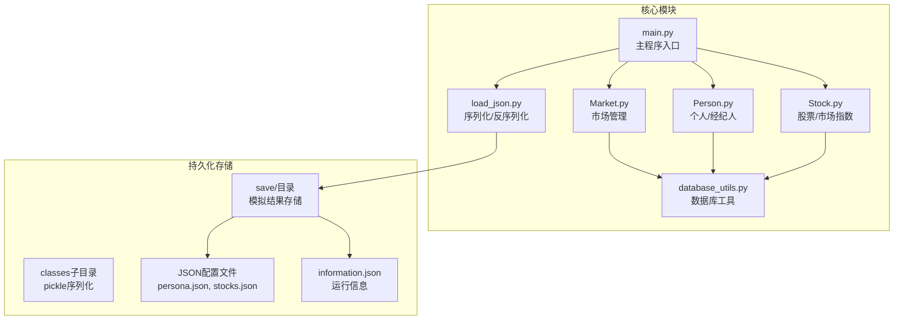
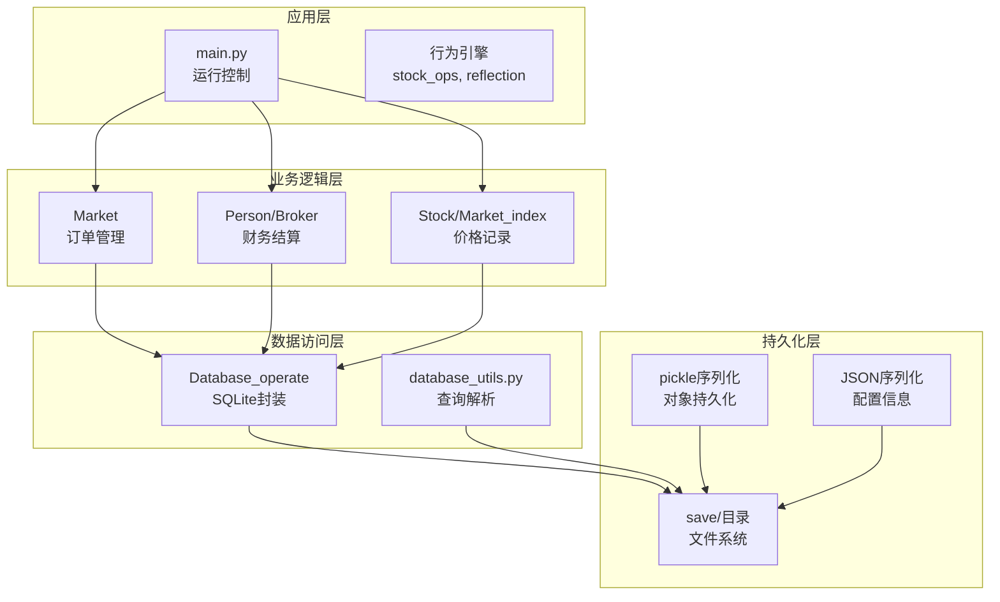
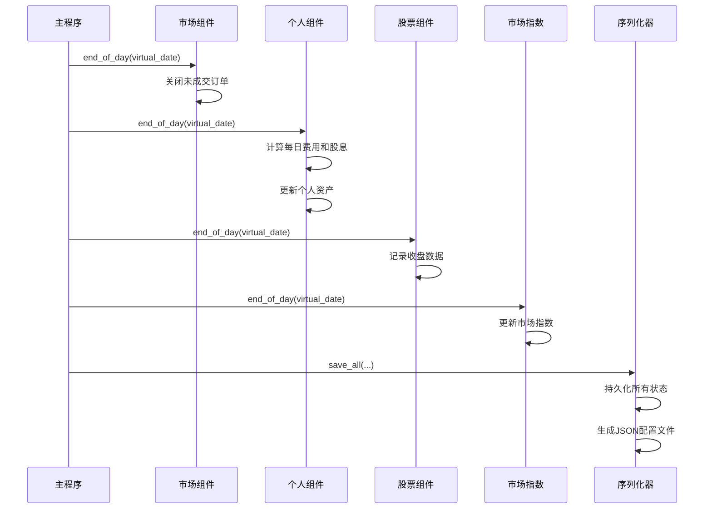
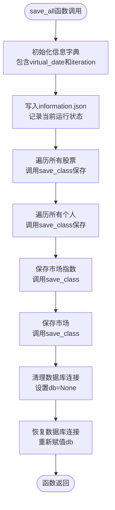
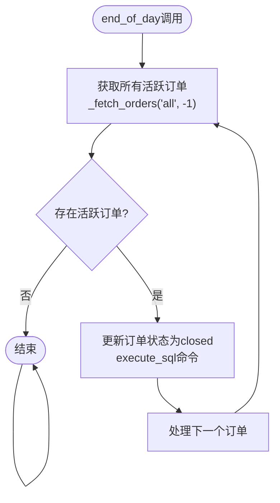
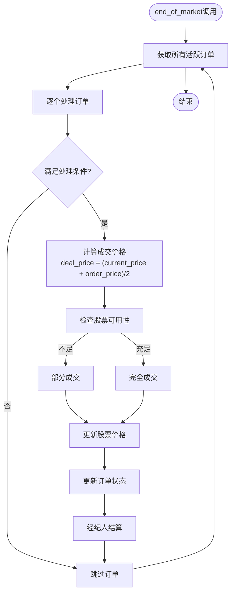
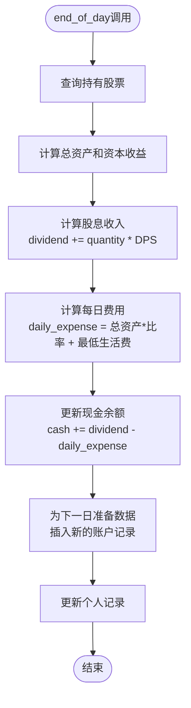
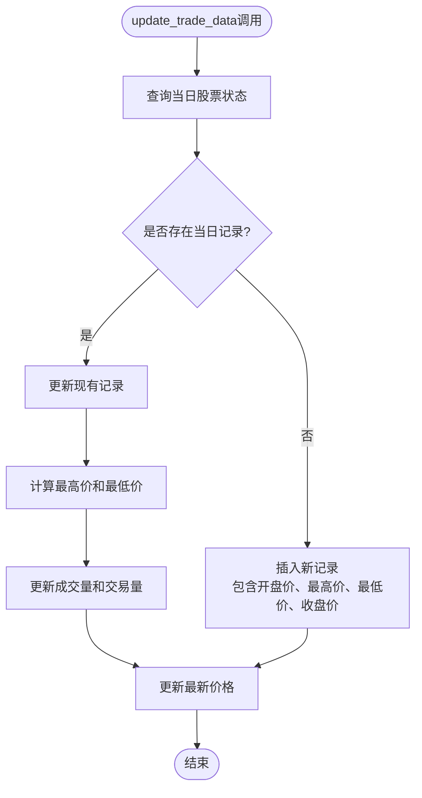
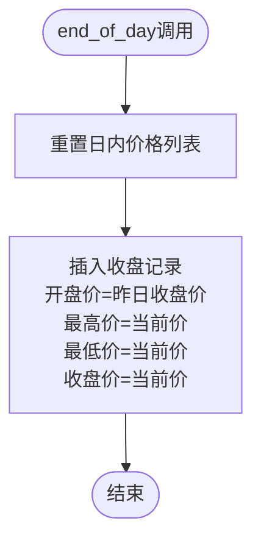
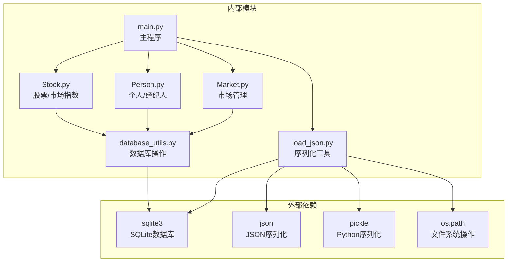

# 终止与输出

<cite>
**本文档引用的文件**
- [load_json.py](file://Agent-Trading-Arena/Stock_Main/load_json.py)
- [main.py](file://Agent-Trading-Arena/Stock_Main/main.py)
- [Market.py](file://Agent-Trading-Arena/Stock_Main/Market.py)
- [Person.py](file://Agent-Trading-Arena/Stock_Main/Person.py)
- [Stock.py](file://Agent-Trading-Arena/Stock_Main/Stock.py)
- [database_utils.py](file://Agent-Trading-Arena/Stock_Main/database_utils.py)
- [test_load_json.py](file://Agent-Trading-Arena/Stock_Main/unit_test/test_load_json.py)
- [persona.json](file://Agent-Trading-Arena/Stock_Main/save/sim_test01/persona.json)
- [stocks.json](file://Agent-Trading-Arena/Stock_Main/save/sim_test01/stocks.json)
- [information.json](file://Agent-Trading-Arena/Stock_Main/save/sim_test01/information.json)
</cite>

## 目录
1. [引言](#引言)
2. [项目结构](#项目结构)
3. [核心组件](#核心组件)
4. [架构概览](#架构概览)
5. [详细组件分析](#详细组件分析)
6. [依赖关系分析](#依赖关系分析)
7. [性能考虑](#性能考虑)
8. [故障排除指南](#故障排除指南)
9. [结论](#结论)

## 引言

本文件详细阐述Agent Trading Arena系统在模拟周期结束后的终止与输出流程。该系统通过每日循环执行完整的交易市场模拟，包括订单匹配、结算、数据记录和状态持久化。本文重点关注每日循环结束后系统的收尾工作，特别是`save_all`函数如何将核心对象状态序列化并持久化到指定目录中，以及各组件如何协同完成市场关闭、个人费用结算和股价记录等终止操作。

## 项目结构

Agent Trading Arena采用模块化的架构设计，主要包含以下核心模块：



**图表来源**
- [main.py](file://Agent-Trading-Arena/Stock_Main/main.py#L1-L151)
- [load_json.py](file://Agent-Trading-Arena/Stock_Main/load_json.py#L1-L134)

**章节来源**
- [main.py](file://Agent-Trading-Arena/Stock_Main/main.py#L1-L151)
- [load_json.py](file://Agent-Trading-Arena/Stock_Main/load_json.py#L1-L134)

## 核心组件

系统的核心组件包括：

### 1. 市场组件 (Market)
负责处理订单匹配、市场关闭和交易结算：
- `end_of_day()`: 关闭所有未成交订单
- `end_of_market()`: 完成剩余活跃订单的交易
- `_fetch_orders()`: 获取活跃订单列表
- `_update_order()`: 更新订单状态

### 2. 个人组件 (Person/Broker)
处理个人财务结算和每日费用计算：
- `end_of_day()`: 计算每日费用和股息，更新个人资产
- `settlement()`: 处理单笔交易的财务结算
- `end_of_iteration()`: 迭代结束时的资产更新

### 3. 股票组件 (Stock/Market_index)
记录每日收盘数据并维护OHLCV信息：
- `update_trade_data()`: 更新交易数据
- `end_of_day()`: 记录收盘价
- `query_price()`: 查询历史价格数据

### 4. 序列化组件 (load_json)
提供完整的状态持久化机制：
- `save_all()`: 主要的序列化函数
- `save_class()`: 对象序列化
- `load_all()`: 状态恢复

**章节来源**
- [Market.py](file://Agent-Trading-Arena/Stock_Main/Market.py#L21-L265)
- [Person.py](file://Agent-Trading-Arena/Stock_Main/Person.py#L112-L427)
- [Stock.py](file://Agent-Trading-Arena/Stock_Main/Stock.py#L52-L295)
- [load_json.py](file://Agent-Trading-Arena/Stock_Main/load_json.py#L45-L76)

## 架构概览

系统采用分层架构，从上到下分别为应用层、业务逻辑层、数据访问层和持久化层：



**图表来源**
- [main.py](file://Agent-Trading-Arena/Stock_Main/main.py#L99-L146)
- [database_utils.py](file://Agent-Trading-Arena/Stock_Main/database_utils.py#L245-L322)

## 详细组件分析

### 终止流程序列图



**图表来源**
- [main.py](file://Agent-Trading-Arena/Stock_Main/main.py#L136-L145)
- [load_json.py](file://Agent-Trading-Arena/Stock_Main/load_json.py#L45-L76)

### save_all函数详细分析

`save_all`函数是系统终止流程的核心，负责将所有核心对象的状态持久化到指定目录：

#### 函数调用流程



**图表来源**
- [load_json.py](file://Agent-Trading-Arena/Stock_Main/load_json.py#L45-L76)

#### 持久化机制详解

1. **信息文件生成** (`information.json`)
   - 记录当前虚拟日期和迭代次数
   - 用于后续状态恢复和进度跟踪

2. **对象序列化** (`save_class`)
   - 使用pickle模块进行深度序列化
   - 将数据库连接临时置空以避免序列化问题
   - 保存到`classes`子目录

3. **文件组织结构**
   - 每个股票保存为`STOCK_i.pkl`
   - 每个个人保存为`PERSON_i.pkl`
   - 市场指数保存为`Market_index.pkl`
   - 市场保存为`MARKET.pkl`

**章节来源**
- [load_json.py](file://Agent-Trading-Arena/Stock_Main/load_json.py#L45-L76)

### 市场关闭流程

市场在每日结束时执行严格的订单处理：

#### end_of_day方法实现



**图表来源**
- [Market.py](file://Agent-Trading-Arena/Stock_Main/Market.py#L21-L28)

#### end_of_market方法实现

该方法处理剩余活跃订单，确保所有未完成交易得到妥善处理：



**图表来源**
- [Market.py](file://Agent-Trading-Arena/Stock_Main/Market.py#L30-L95)

**章节来源**
- [Market.py](file://Agent-Trading-Arena/Stock_Main/Market.py#L21-L95)

### 个人结算流程

个人在每日结束时执行复杂的财务结算：

#### end_of_day方法实现



**图表来源**
- [Person.py](file://Agent-Trading-Arena/Stock_Main/Person.py#L364-L427)

#### 费用计算机制

个人每日费用计算公式：
```
daily_expense = (总资产 + 现金) × 费用比率 + 最低生活费
```

其中：
- 资产包括持有的股票价值和现金
- 费用比率可通过参数调整
- 最低生活费来自个人配置文件

**章节来源**
- [Person.py](file://Agent-Trading-Arena/Stock_Main/Person.py#L364-L427)

### 股价记录与OHLCV维护

股票组件负责维护完整的OHLCV数据：

#### update_trade_data方法

该方法在每次交易后更新股价数据：



**图表来源**
- [Stock.py](file://Agent-Trading-Arena/Stock_Main/Stock.py#L67-L112)

#### end_of_day方法

每日结束时记录收盘数据：



**图表来源**
- [Stock.py](file://Agent-Trading-Arena/Stock_Main/Stock.py#L52-L65)

**章节来源**
- [Stock.py](file://Agent-Trading-Arena/Stock_Main/Stock.py#L52-L112)

## 依赖关系分析

系统组件间的依赖关系如下：



**图表来源**
- [load_json.py](file://Agent-Trading-Arena/Stock_Main/load_json.py#L1-L6)
- [database_utils.py](file://Agent-Trading-Arena/Stock_Main/database_utils.py#L245-L322)

**章节来源**
- [load_json.py](file://Agent-Trading-Arena/Stock_Main/load_json.py#L1-L134)
- [database_utils.py](file://Agent-Trading-Arena/Stock_Main/database_utils.py#L245-L322)

## 性能考虑

### 序列化性能优化

1. **数据库连接管理**
   - 在序列化前临时移除数据库连接，避免pickle序列化失败
   - 序列化完成后重新建立连接

2. **批量操作**
   - 使用SQL语句批量处理订单更新
   - 减少数据库往返操作次数

3. **内存管理**
   - 及时清理临时数据结构
   - 避免重复计算相同的数据

### 存储策略

1. **文件组织**
   - 将pickle文件和JSON配置文件分离
   - 使用子目录结构避免文件过多

2. **增量保存**
   - 支持部分保存和恢复
   - 允许中断后继续运行

## 故障排除指南

### 常见问题及解决方案

#### 1. 序列化错误
**症状**: `TypeError: can't pickle _thread.RLock objects`
**原因**: 数据库连接对象包含不可序列化属性
**解决**: 在序列化前设置`obj.db = None`

#### 2. 文件权限问题
**症状**: 无法写入保存目录
**原因**: 目录权限不足或磁盘空间不足
**解决**: 检查目录权限和磁盘空间

#### 3. 数据库连接问题
**症状**: SQLite连接异常
**原因**: 数据库文件被其他进程占用
**解决**: 关闭其他数据库客户端或重启服务

#### 4. 内存溢出
**症状**: 大量数据导致内存不足
**原因**: 同时加载所有历史数据
**解决**: 实施数据分页加载和缓存策略

**章节来源**
- [load_json.py](file://Agent-Trading-Arena/Stock_Main/load_json.py#L25-L35)
- [database_utils.py](file://Agent-Trading-Arena/Stock_Main/database_utils.py#L302-L310)

## 结论

Agent Trading Arena系统的终止与输出流程设计精良，通过以下关键机制确保模拟周期的完整收尾：

1. **完整的市场关闭**: 确保所有未成交订单得到妥善处理，维护市场的完整性

2. **精确的财务结算**: 个人组件准确计算每日费用和股息，维护财务数据的准确性

3. **全面的数据记录**: 股票和市场指数组件完整记录OHLCV数据，为分析提供基础

4. **可靠的持久化机制**: `save_all`函数提供完整的状态序列化，支持模拟结果的分析和复现

5. **灵活的恢复能力**: 通过`load_all`函数支持从任意时间点恢复模拟

这套机制不仅保证了模拟过程的严谨性，还为后续的数据分析、结果复现和系统调试提供了强有力的支持。通过合理的文件组织和序列化策略，系统能够在保证性能的同时提供完整的状态持久化能力。