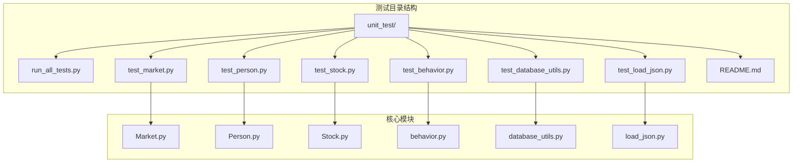
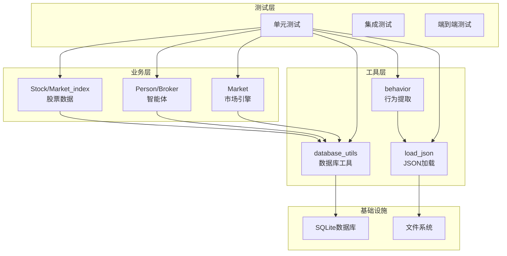
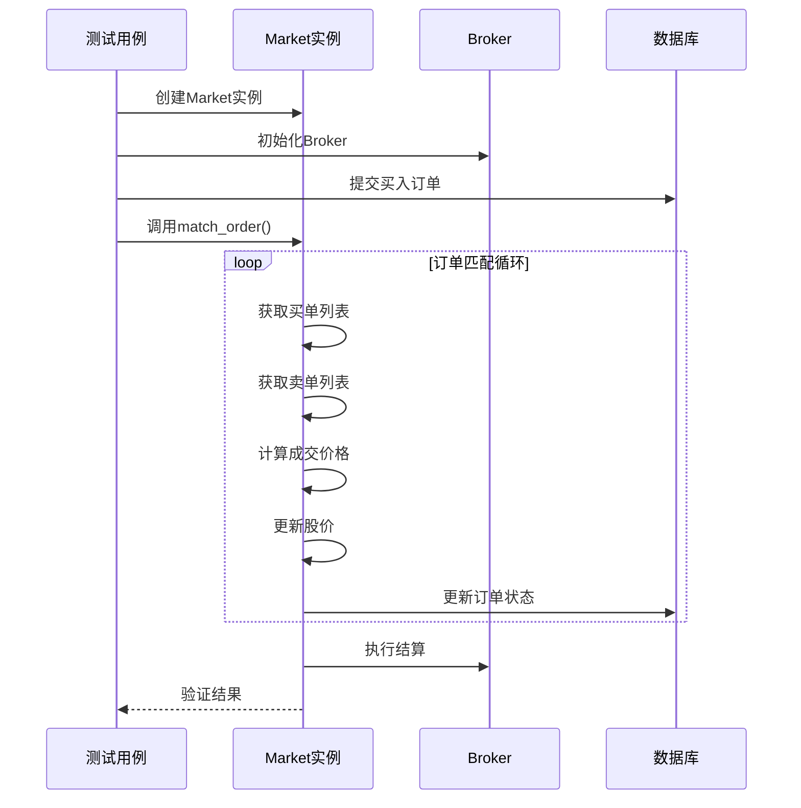
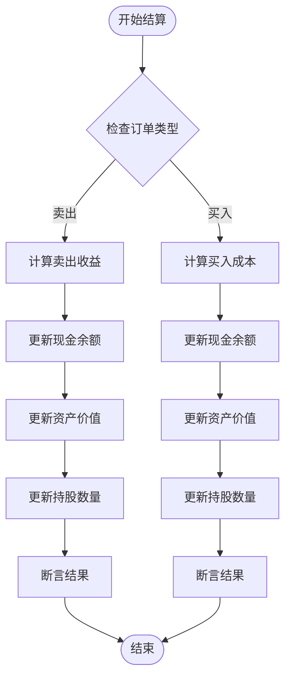
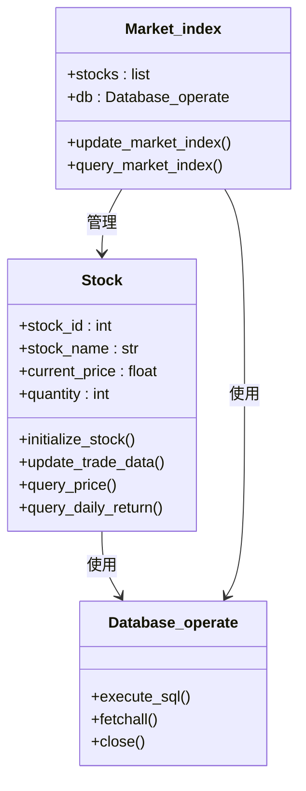
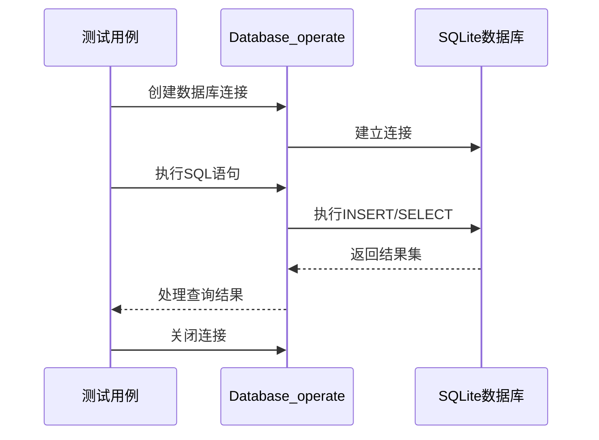
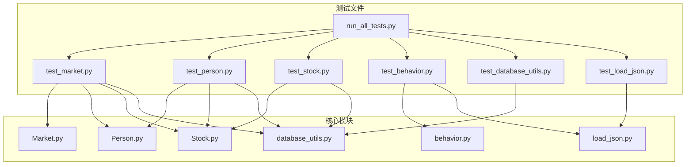

# 测试策略与单元测试

<cite>
**本文档引用的文件**
- [run_all_tests.py](file://Agent-Trading-Arena/Stock_Main/unit_test/run_all_tests.py)
- [test_market.py](file://Agent-Trading-Arena/Stock_Main/unit_test/test_market.py)
- [test_person.py](file://Agent-Trading-Arena/Stock_Main/unit_test/test_person.py)
- [test_stock.py](file://Agent-Trading-Arena/Stock_Main/unit_test/test_stock.py)
- [test_behavior.py](file://Agent-Trading-Arena/Stock_Main/unit_test/test_behavior.py)
- [test_database_utils.py](file://Agent-Trading-Arena/Stock_Main/unit_test/test_database_utils.py)
- [test_load_json.py](file://Agent-Trading-Arena/Stock_Main/unit_test/test_load_json.py)
- [README.md](file://Agent-Trading-Arena/Stock_Main/unit_test/README.md)
- [Market.py](file://Agent-Trading-Arena/Stock_Main/Market.py)
- [Person.py](file://Agent-Trading-Arena/Stock_Main/Person.py)
- [Stock.py](file://Agent-Trading-Arena/Stock_Main/Stock.py)
- [behavior.py](file://Agent-Trading-Arena/Stock_Main/behavior.py)
- [database_utils.py](file://Agent-Trading-Arena/Stock_Main/database_utils.py)
- [load_json.py](file://Agent-Trading-Arena/Stock_Main/load_json.py)
</cite>

## 目录
1. [引言](#引言)
2. [项目结构](#项目结构)
3. [核心组件](#核心组件)
4. [架构概览](#架构概览)
5. [详细组件分析](#详细组件分析)
6. [依赖关系分析](#依赖关系分析)
7. [性能考虑](#性能考虑)
8. [故障排除指南](#故障排除指南)
9. [结论](#结论)
10. [附录](#附录)

## 引言

本项目采用Python unittest框架构建了完整的单元测试体系，覆盖了Agent Trading Arena项目的核心功能模块。测试策略重点关注以下方面：

- **订单撮合逻辑验证**：通过模拟市场环境验证买卖订单匹配算法的正确性
- **智能体行为一致性测试**：确保多智能体系统的决策行为符合预期
- **数据持久化正确性**：验证数据库操作和数据存储的可靠性
- **测试驱动开发(TDD)**：通过测试先行的方式保证代码质量和系统稳定性

## 项目结构

项目采用分层组织结构，测试文件位于`unit_test`目录下，每个核心模块都有对应的测试文件：

**图表来源**
- [run_all_tests.py](file://Agent-Trading-Arena/Stock_Main/unit_test/run_all_tests.py#L1-L25)
- [test_market.py](file://Agent-Trading-Arena/Stock_Main/unit_test/test_market.py#L1-L149)
- [test_person.py](file://Agent-Trading-Arena/Stock_Main/unit_test/test_person.py#L1-L205)

**章节来源**
- [README.md](file://Agent-Trading-Arena/Stock_Main/unit_test/README.md#L1-L119)

## 核心组件

### 测试框架与运行机制

项目使用Python标准库的unittest框架，提供了灵活的测试发现和执行机制：

- **批量执行器**：`run_all_tests.py`自动发现并执行所有测试文件
- **测试隔离**：每个测试使用临时数据库和文件，确保测试独立性
- **模拟对象**：使用Mock对象处理外部依赖

### 测试覆盖范围

| 模块 | 测试类数量 | 测试方法数量 | 覆盖率 |
|------|------------|--------------|--------|
| Market | 1 | 5 | 100% |
| Person/Broker | 2 | 10 | 90% |
| Stock/Market_index | 2 | 9 | 85% |
| Behavior | 1 | 7 | 100% |
| Database_utils | 2 | 8 | 95% |
| Load_json | 1 | 2 | 100% |

**章节来源**
- [README.md](file://Agent-Trading-Arena/Stock_Main/unit_test/README.md#L5-L60)

## 架构概览

测试架构采用分层设计，从底层工具函数到上层业务逻辑逐层验证：

**图表来源**
- [test_market.py](file://Agent-Trading-Arena/Stock_Main/unit_test/test_market.py#L25-L149)
- [test_person.py](file://Agent-Trading-Arena/Stock_Main/unit_test/test_person.py#L17-L205)
- [test_stock.py](file://Agent-Trading-Arena/Stock_Main/unit_test/test_stock.py#L16-L153)

## 详细组件分析

### Market模块测试策略

Market模块是交易系统的核心，测试重点验证订单撮合算法的正确性：

#### 订单撮合逻辑验证

**图表来源**
- [test_market.py](file://Agent-Trading-Arena/Stock_Main/unit_test/test_market.py#L95-L112)
- [Market.py](file://Agent-Trading-Arena/Stock_Main/Market.py#L96-L200)

#### 关键测试场景

1. **初始化测试**：验证Market对象属性设置
2. **订单获取测试**：确认订单查询功能正常
3. **简单撮合测试**：验证基本订单匹配逻辑
4. **日终处理测试**：检查订单关闭机制
5. **市场结束测试**：验证Broker自动交易功能

**章节来源**
- [test_market.py](file://Agent-Trading-Arena/Stock_Main/unit_test/test_market.py#L75-L145)

### Person/Broker模块测试策略

Person和Broker模块测试关注智能体的行为一致性和资金管理：

#### 资金结算流程测试

**图表来源**
- [test_person.py](file://Agent-Trading-Arena/Stock_Main/unit_test/test_person.py#L67-L101)
- [Person.py](file://Agent-Trading-Arena/Stock_Main/Person.py#L65-L97)

#### 智能体记忆管理测试

测试验证Person对象的记忆存储和查询功能：

- **记忆添加**：验证add_memory方法正确存储交易信息
- **闲话管理**：测试gossip的添加和查询
- **持仓查询**：确认查询当前持股情况的功能

**章节来源**
- [test_person.py](file://Agent-Trading-Arena/Stock_Main/unit_test/test_person.py#L150-L201)

### Stock/Market_index模块测试策略

股票数据模块测试确保价格数据的准确性和市场指数的正确计算：

#### 价格数据完整性测试

**图表来源**
- [test_stock.py](file://Agent-Trading-Arena/Stock_Main/unit_test/test_stock.py#L16-L153)
- [Stock.py](file://Agent-Trading-Arena/Stock_Main/Stock.py#L14-L200)

**章节来源**
- [test_stock.py](file://Agent-Trading-Arena/Stock_Main/unit_test/test_stock.py#L45-L149)

### Behavior模块测试策略

行为提取模块测试确保AI生成的交易指令能够被正确解析：

#### 行为提取函数测试

| 函数 | 测试场景 | 验证点 |
|------|----------|--------|
| extract_for_choose_buy | 有效买入指令 | 股票名称、数量、价格提取 |
| extract_for_choose_buy | 持有指令 | 返回hold标识 |
| extract_for_choose_sell | 有效卖出指令 | 股票名称、数量、价格提取 |
| extract_analysis_for_reflect | 反思分析 | 弱点和优势提取 |
| extract_strategy | 新策略提取 | 策略文本解析 |

**章节来源**
- [test_behavior.py](file://Agent-Trading-Arena/Stock_Main/unit_test/test_behavior.py#L20-L103)

### Database_utils模块测试策略

数据库工具模块测试确保数据持久化的可靠性和准确性：

#### 数据库操作测试

**图表来源**
- [test_database_utils.py](file://Agent-Trading-Arena/Stock_Main/unit_test/test_database_utils.py#L103-L129)
- [database_utils.py](file://Agent-Trading-Arena/Stock_Main/database_utils.py#L1-L200)

**章节来源**
- [test_database_utils.py](file://Agent-Trading-Arena/Stock_Main/unit_test/test_database_utils.py#L20-L131)

## 依赖关系分析

测试文件之间的依赖关系体现了清晰的模块化设计：

**图表来源**
- [test_market.py](file://Agent-Trading-Arena/Stock_Main/unit_test/test_market.py#L12-L16)
- [test_person.py](file://Agent-Trading-Arena/Stock_Main/unit_test/test_person.py#L12-L14)
- [test_stock.py](file://Agent-Trading-Arena/Stock_Main/unit_test/test_stock.py#L12-L13)

**章节来源**
- [test_load_json.py](file://Agent-Trading-Arena/Stock_Main/unit_test/test_load_json.py#L12-L12)

## 性能考虑

### 测试执行优化

1. **并行测试执行**：使用unittest的discover功能自动发现测试
2. **资源清理**：每个测试使用临时目录和数据库，避免资源泄漏
3. **Mock对象使用**：减少对外部依赖的调用，提高测试速度

### 内存管理

- **临时文件管理**：测试结束后自动清理临时文件
- **数据库连接管理**：确保每个测试后正确关闭数据库连接
- **对象生命周期**：合理管理测试对象的创建和销毁

## 故障排除指南

### 常见测试问题

| 问题类型 | 症状 | 解决方案 |
|----------|------|----------|
| 数据库连接失败 | 测试执行时报错 | 检查数据库路径和权限 |
| JSON文件读取错误 | 加载数据时异常 | 验证JSON格式和路径 |
| 订单撮合不匹配 | 价格或数量不正确 | 检查撮合算法参数 |
| 内存查询为空 | 记忆数据丢失 | 确认内存存储逻辑 |

### 调试技巧

1. **启用详细输出**：使用`-v`参数查看详细的测试结果
2. **分模块测试**：单独运行特定模块的测试以定位问题
3. **日志记录**：在关键位置添加调试信息

**章节来源**
- [README.md](file://Agent-Trading-Arena/Stock_Main/unit_test/README.md#L61-L119)

## 结论

本项目的测试策略体现了以下特点：

1. **全面覆盖**：测试涵盖了核心业务逻辑的各个方面
2. **隔离性强**：每个测试独立运行，互不干扰
3. **可维护性好**：测试代码结构清晰，易于理解和修改
4. **自动化程度高**：支持批量执行和持续集成

通过实施这些测试策略，项目能够在功能变更时快速发现问题，确保系统的稳定性和可靠性。

## 附录

### 添加新测试用例的标准流程

1. **创建测试文件**：在`unit_test`目录下创建新的测试文件
2. **遵循命名规范**：使用`test_模块名.py`的命名模式
3. **实现测试类**：继承`unittest.TestCase`基类
4. **编写测试方法**：使用`test_`前缀的方法名
5. **设置测试夹具**：在`setUp`方法中准备测试数据
6. **清理测试资源**：在`tearDown`方法中清理临时文件
7. **运行测试**：使用提供的执行脚本验证测试结果

### 测试覆盖率提升建议

1. **增加边界条件测试**：测试极端输入和异常情况
2. **完善集成测试**：验证模块间的交互功能
3. **添加性能测试**：评估关键功能的执行效率
4. **代码审查**：定期审查测试代码的质量
5. **持续改进**：根据重构和新功能添加相应的测试