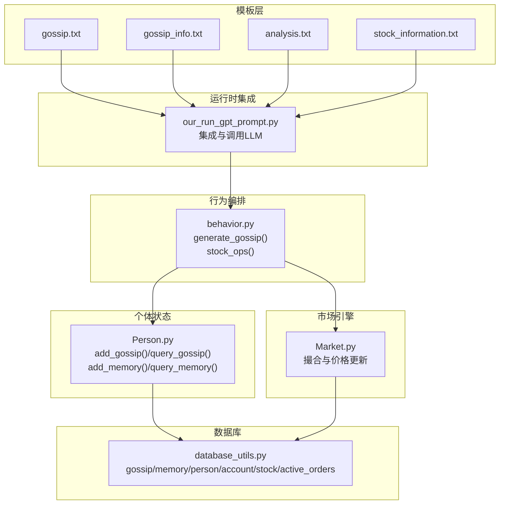
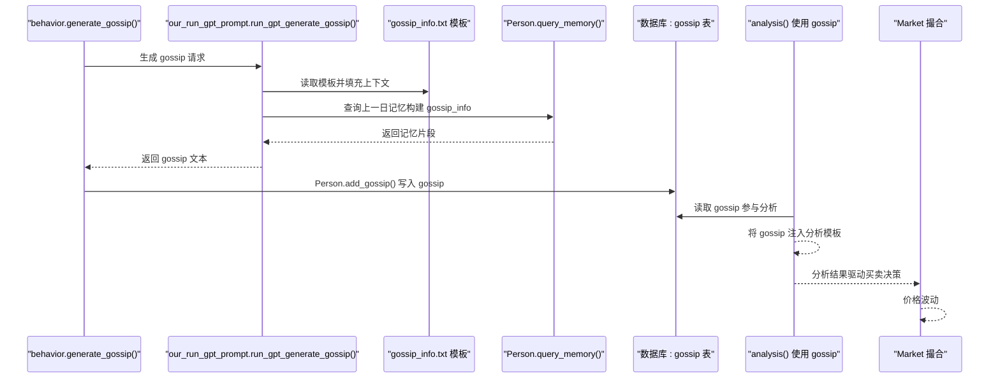
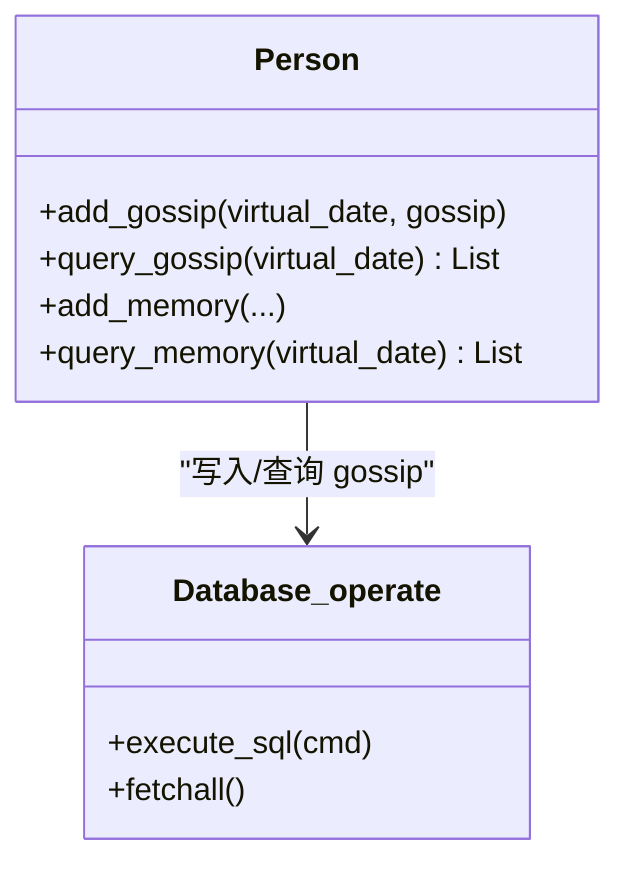
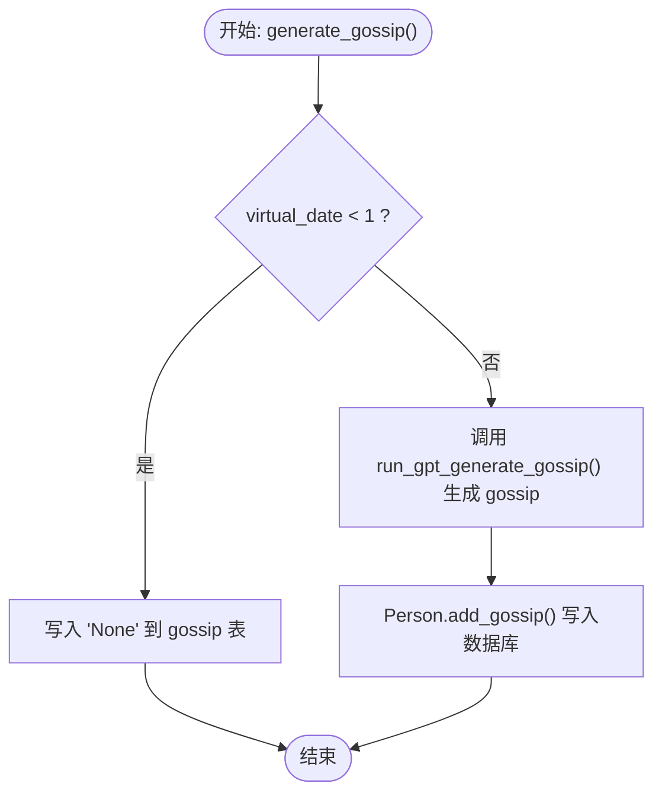
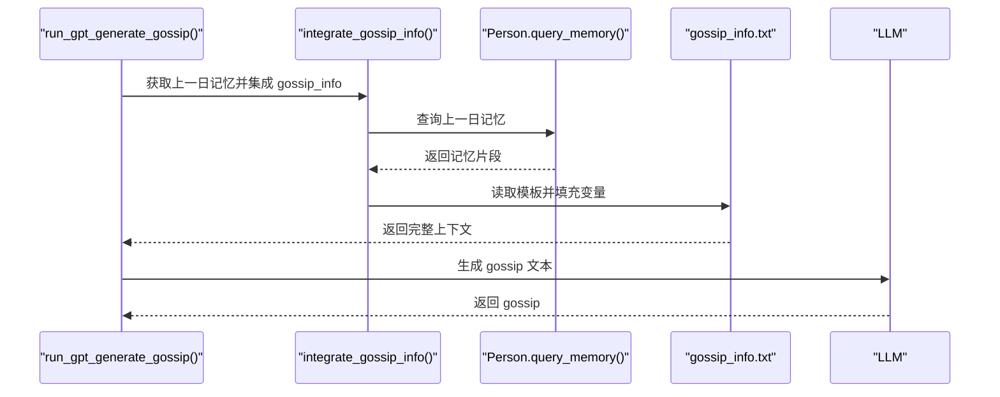
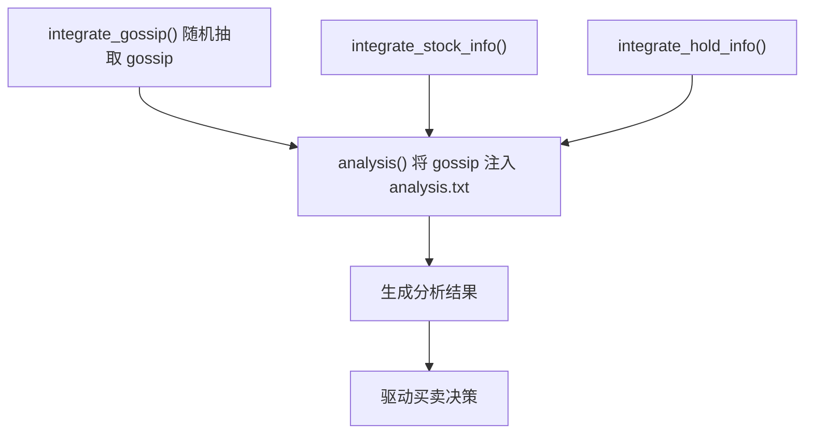
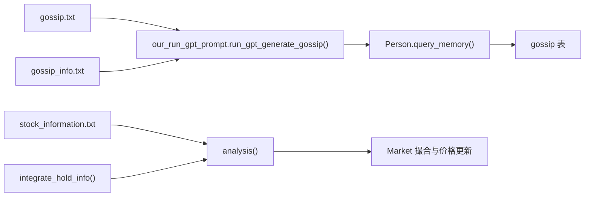

# 信息传播

<cite>
**本文引用的文件列表**
- [gossip.txt](file://Agent-Trading-Arena/Stock_Main/content/our_prompt_template/gossip.txt)
- [gossip_info.txt](file://Agent-Trading-Arena/Stock_Main/content/our_prompt_template/gossip_info.txt)
- [Person.py](file://Agent-Trading-Arena/Stock_Main/Person.py)
- [behavior.py](file://Agent-Trading-Arena/Stock_Main/behavior.py)
- [our_run_gpt_prompt.py](file://Agent-Trading-Arena/Stock_Main/content/our_run_gpt_prompt.py)
- [Market.py](file://Agent-Trading-Arena/Stock_Main/Market.py)
- [database_utils.py](file://Agent-Trading-Arena/Stock_Main/database_utils.py)
- [analysis.txt](file://Agent-Trading-Arena/Stock_Main/content/our_prompt_template/analysis.txt)
- [stock_information.txt](file://Agent-Trading-Arena/Stock_Main/content/our_prompt_template/stock_information.txt)
- [day0_iter0_market_analysis_prompt.txt](file://Agent-Trading-Arena/Stock_Main/save/sim_test01/debug_prompts/day0_iter0_market_analysis_prompt.txt)
</cite>

## 目录
1. [引言](#引言)
2. [项目结构](#项目结构)
3. [核心组件](#核心组件)
4. [架构总览](#架构总览)
5. [详细组件分析](#详细组件分析)
6. [依赖关系分析](#依赖关系分析)
7. [性能考量](#性能考量)
8. [故障排查指南](#故障排查指南)
9. [结论](#结论)
10. [附录](#附录)

## 引言
本文件围绕多智能体交易系统中的“信息传播”机制展开，重点解释两个模板文件的作用与交互流程：
- gossip.txt：用于生成市场传闻内容（可为真实或虚假），作为其他智能体决策的输入之一。
- gossip_info.txt：用于构建智能体间信息交换的上下文，整合前一日的交易操作、财务状况、股票信息、分析结果与投资策略等，作为生成传闻的输入。

文档将说明这些模板在 Person.py 中如何被触发，以及它们如何影响其他代理的决策行为；同时分析模板结构中的情绪倾向控制、信息可信度参数、传播范围设定等关键要素，并给出通过 sim_test01/debug_prompts 中的 gossip 记录评估扩散效果的方法，结合 Market.py 观察价格波动关联性。

## 项目结构
该系统采用“模板驱动 + LLM 推理”的模式，通过多个提示模板拼装上下文，驱动智能体进行分析、买卖与反思等行为。关键路径如下：
- 模板层：content/our_prompt_template 下包含各类提示模板，如 gossip.txt、gossip_info.txt、analysis.txt 等。
- 运行时集成：content/our_run_gpt_prompt.py 负责读取模板、填充变量、调用 LLM 并返回结构化输出。
- 行为编排：behavior.py 控制每日迭代中的分析、买卖、反思与传闻生成流程。
- 个体状态：Person.py 提供智能体的账户、记忆、传闻存储与查询接口。
- 市场匹配：Market.py 实现订单撮合与价格更新，驱动价格波动。
- 数据库：database_utils.py 定义 gossip、memory、person、account、stock、active_orders 等表结构。

图表来源
- [gossip.txt](file://Agent-Trading-Arena/Stock_Main/content/our_prompt_template/gossip.txt#L1-L16)
- [gossip_info.txt](file://Agent-Trading-Arena/Stock_Main/content/our_prompt_template/gossip_info.txt#L1-L28)
- [analysis.txt](file://Agent-Trading-Arena/Stock_Main/content/our_prompt_template/analysis.txt#L1-L37)
- [stock_information.txt](file://Agent-Trading-Arena/Stock_Main/content/our_prompt_template/stock_information.txt#L1-L19)
- [our_run_gpt_prompt.py](file://Agent-Trading-Arena/Stock_Main/content/our_run_gpt_prompt.py#L364-L411)
- [behavior.py](file://Agent-Trading-Arena/Stock_Main/behavior.py#L201-L209)
- [Person.py](file://Agent-Trading-Arena/Stock_Main/Person.py#L514-L628)
- [Market.py](file://Agent-Trading-Arena/Stock_Main/Market.py#L12-L278)
- [database_utils.py](file://Agent-Trading-Arena/Stock_Main/database_utils.py#L297-L300)

章节来源
- [gossip.txt](file://Agent-Trading-Arena/Stock_Main/content/our_prompt_template/gossip.txt#L1-L16)
- [gossip_info.txt](file://Agent-Trading-Arena/Stock_Main/content/our_prompt_template/gossip_info.txt#L1-L28)
- [our_run_gpt_prompt.py](file://Agent-Trading-Arena/Stock_Main/content/our_run_gpt_prompt.py#L364-L411)
- [behavior.py](file://Agent-Trading-Arena/Stock_Main/behavior.py#L201-L209)
- [Person.py](file://Agent-Trading-Arena/Stock_Main/Person.py#L514-L628)
- [Market.py](file://Agent-Trading-Arena/Stock_Main/Market.py#L12-L278)
- [database_utils.py](file://Agent-Trading-Arena/Stock_Main/database_utils.py#L297-L300)

## 核心组件
- gossip.txt：定义生成传闻的指令与任务，强调基于已有信息生成对市场或个股有影响的传闻，允许真实或虚假，但不能与已知信息冲突。
- gossip_info.txt：定义生成传闻所需的上下文模板，包含虚拟日期、迭代次数、当日交易操作、财务状况、可交易股票列表、股票分析、投资策略等字段，用于构建“智能体间信息交换”的背景。
- Person 类：提供 add_gossip()/query_gossip() 存储与查询 gossip 的能力；提供 add_memory()/query_memory() 存储与查询记忆（含 gossip 字段）的能力。
- behavior.generate_gossip()：在每日迭代中触发 gossip 生成，调用 our_run_gpt_prompt.run_gpt_generate_gossip() 生成 gossip，并写入数据库。
- our_run_gpt_prompt.run_gpt_generate_gossip()：读取 gossip_info.txt 模板，从上一日记忆中集成 gossip_info，生成 prompt 后调用 LLM 返回 gossip 文本。
- Market：负责订单撮合与价格更新，是价格波动的直接驱动者，间接反映 gossip 对市场的影响。

章节来源
- [gossip.txt](file://Agent-Trading-Arena/Stock_Main/content/our_prompt_template/gossip.txt#L6-L16)
- [gossip_info.txt](file://Agent-Trading-Arena/Stock_Main/content/our_prompt_template/gossip_info.txt#L1-L28)
- [Person.py](file://Agent-Trading-Arena/Stock_Main/Person.py#L514-L628)
- [behavior.py](file://Agent-Trading-Arena/Stock_Main/behavior.py#L201-L209)
- [our_run_gpt_prompt.py](file://Agent-Trading-Arena/Stock_Main/content/our_run_gpt_prompt.py#L364-L411)
- [Market.py](file://Agent-Trading-Arena/Stock_Main/Market.py#L96-L200)

## 架构总览
下图展示了 gossip 生成与传播的关键流程：从行为编排到模板集成，再到数据库存储与后续分析使用，最终影响市场交易与价格波动。

图表来源
- [behavior.py](file://Agent-Trading-Arena/Stock_Main/behavior.py#L201-L209)
- [our_run_gpt_prompt.py](file://Agent-Trading-Arena/Stock_Main/content/our_run_gpt_prompt.py#L364-L411)
- [Person.py](file://Agent-Trading-Arena/Stock_Main/Person.py#L514-L628)
- [database_utils.py](file://Agent-Trading-Arena/Stock_Main/database_utils.py#L297-L300)
- [analysis.txt](file://Agent-Trading-Arena/Stock_Main/content/our_prompt_template/analysis.txt#L1-L37)

## 详细组件分析

### gossip.txt 模板结构与职责
- 变量占位符：!<INPUT 0>! 作为输入占位符，表示由上一日记忆集成后的 gossip_info 内容。
- 指令与目标：强调基于已有信息生成对市场或个股有影响的传闻，允许真实或虚假，但不能与已知信息冲突。
- 任务约束：生成的 gossip 将被其他参与者接收并影响其股票操作。

该模板不直接控制情绪倾向、可信度与传播范围，而是通过上下文模板 gossip_info.txt 间接影响这些参数。

章节来源
- [gossip.txt](file://Agent-Trading-Arena/Stock_Main/content/our_prompt_template/gossip.txt#L1-L16)

### gossip_info.txt 模板结构与上下文构建
- 输入变量：
  - 虚拟日期、迭代次数、当日交易操作、财务状况、可交易股票列表、股票分析、投资策略。
- 时间与事实：明确标注“当日迭代”、“财务状况”、“可交易股票”、“股票分析”、“投资策略”等。
- 结构化输出：以分隔线结束，便于后续解析。

该模板是 gossip 生成的“上下文输入”，直接影响 gossip 的真实性、相关性与可信度。

章节来源
- [gossip_info.txt](file://Agent-Trading-Arena/Stock_Main/content/our_prompt_template/gossip_info.txt#L1-L28)

### Person 类中的 gossip 存储与查询
- add_gossip(virtual_date, gossip)：将生成的 gossip 写入 gossip 表。
- query_gossip(virtual_date)：查询除自身外其他智能体在同一天生成的 gossip，用于集成到分析阶段。

图表来源
- [Person.py](file://Agent-Trading-Arena/Stock_Main/Person.py#L615-L628)
- [database_utils.py](file://Agent-Trading-Arena/Stock_Main/database_utils.py#L297-L300)

章节来源
- [Person.py](file://Agent-Trading-Arena/Stock_Main/Person.py#L514-L628)
- [database_utils.py](file://Agent-Trading-Arena/Stock_Main/database_utils.py#L297-L300)

### behavior.generate_gossip() 的触发与执行
- 在每日迭代中，遍历所有智能体，调用 run_gpt_generate_gossip() 生成 gossip。
- 当 virtual_date < 1 时，直接写入 "None"。
- 将生成的 gossip 通过 Person.add_gossip() 写入数据库。

图表来源
- [behavior.py](file://Agent-Trading-Arena/Stock_Main/behavior.py#L201-L209)
- [Person.py](file://Agent-Trading-Arena/Stock_Main/Person.py#L615-L628)

章节来源
- [behavior.py](file://Agent-Trading-Arena/Stock_Main/behavior.py#L201-L209)
- [Person.py](file://Agent-Trading-Arena/Stock_Main/Person.py#L615-L628)

### our_run_gpt_prompt.run_gpt_generate_gossip() 的工作流
- 从上一日记忆中集成 gossip_info（调用 integrate_gossip_info()）。
- 读取 gossip_info.txt 模板，将占位符替换为实际值。
- 生成 prompt 后调用 LLM，返回 gossip 文本。
- 可选保存调试 prompt 文件至 debug_prompts。

图表来源
- [our_run_gpt_prompt.py](file://Agent-Trading-Arena/Stock_Main/content/our_run_gpt_prompt.py#L22-L51)
- [our_run_gpt_prompt.py](file://Agent-Trading-Arena/Stock_Main/content/our_run_gpt_prompt.py#L364-L411)
- [Person.py](file://Agent-Trading-Arena/Stock_Main/Person.py#L547-L580)

章节来源
- [our_run_gpt_prompt.py](file://Agent-Trading-Arena/Stock_Main/content/our_run_gpt_prompt.py#L22-L51)
- [our_run_gpt_prompt.py](file://Agent-Trading-Arena/Stock_Main/content/our_run_gpt_prompt.py#L364-L411)
- [Person.py](file://Agent-Trading-Arena/Stock_Main/Person.py#L547-L580)

### 模板集成与分析阶段的联动
- integrate_gossip(virtual_date, persona, gossip_num_max)：随机选择若干 gossip，用于 analysis() 的输入。
- analysis()：将 gossip 注入 analysis.txt 模板，形成最终分析 prompt，驱动买卖决策。
- stock_information.txt：为 analysis() 提供各股票的历史与实时指标，增强分析的客观性。

图表来源
- [our_run_gpt_prompt.py](file://Agent-Trading-Arena/Stock_Main/content/our_run_gpt_prompt.py#L9-L19)
- [our_run_gpt_prompt.py](file://Agent-Trading-Arena/Stock_Main/content/our_run_gpt_prompt.py#L414-L483)
- [analysis.txt](file://Agent-Trading-Arena/Stock_Main/content/our_prompt_template/analysis.txt#L1-L37)
- [stock_information.txt](file://Agent-Trading-Arena/Stock_Main/content/our_prompt_template/stock_information.txt#L1-L19)

章节来源
- [our_run_gpt_prompt.py](file://Agent-Trading-Arena/Stock_Main/content/our_run_gpt_prompt.py#L9-L19)
- [our_run_gpt_prompt.py](file://Agent-Trading-Arena/Stock_Main/content/our_run_gpt_prompt.py#L414-L483)
- [analysis.txt](file://Agent-Trading-Arena/Stock_Main/content/our_prompt_template/analysis.txt#L1-L37)
- [stock_information.txt](file://Agent-Trading-Arena/Stock_Main/content/our_prompt_template/stock_information.txt#L1-L19)

### 情绪倾向控制、可信度参数与传播范围
- 情绪倾向控制：gossip.txt 明确允许“真实或虚假”，但要求“不能与已知信息冲突”。这为情绪倾向提供了“可控的不确定性”边界。
- 信息可信度参数：通过 integrate_gossip() 的随机采样数量 gossip_num_max 控制可信度权重；gossip_num_max 越大，引入的传闻越多，潜在噪声越大。
- 传播范围设定：Person.query_gossip(virtual_date) 查询除自身外其他智能体在同一日期生成的 gossip，实现“跨智能体传播”。

章节来源
- [gossip.txt](file://Agent-Trading-Arena/Stock_Main/content/our_prompt_template/gossip.txt#L14-L16)
- [our_run_gpt_prompt.py](file://Agent-Trading-Arena/Stock_Main/content/our_run_gpt_prompt.py#L9-L19)
- [Person.py](file://Agent-Trading-Arena/Stock_Main/Person.py#L621-L628)

### 实际案例：调整 gossip 模板以模拟市场恐慌或炒作情绪
- 市场恐慌场景：在 gossip_info.txt 中增加负面财务状况、下跌股票列表与悲观市场指数；gossip.txt 允许生成负面传闻，从而放大恐慌情绪。
- 炒作场景：在 gossip_info.txt 中突出利好消息、强势股票与乐观市场预期；gossip.txt 允许生成正面传闻，推动市场过热。
- 评估方法：通过 sim_test01/debug_prompts 中的 dayX_gossip_generation_prompt.txt 与 dayX_iterY_market_analysis_prompt.txt 观察生成的 gossip 是否符合预期，并结合 Market.py 的价格波动进行关联性分析。

章节来源
- [gossip.txt](file://Agent-Trading-Arena/Stock_Main/content/our_prompt_template/gossip.txt#L6-L16)
- [gossip_info.txt](file://Agent-Trading-Arena/Stock_Main/content/our_prompt_template/gossip_info.txt#L17-L26)
- [day0_iter0_market_analysis_prompt.txt](file://Agent-Trading-Arena/Stock_Main/save/sim_test01/debug_prompts/day0_iter0_market_analysis_prompt.txt#L44-L61)
- [Market.py](file://Agent-Trading-Arena/Stock_Main/Market.py#L96-L200)

## 依赖关系分析
- 模板依赖：gossip.txt 依赖 gossip_info.txt 的上下文；analysis.txt 依赖 stock_information.txt 与 integrate_hold_info() 的输出。
- 运行时依赖：behavior.generate_gossip() 依赖 our_run_gpt_prompt.run_gpt_generate_gossip()；后者依赖 Person.query_memory() 与数据库。
- 数据库依赖：gossip 表与 memory 表分别存储 gossip 与分析记忆；Market 通过 active_orders 与 stock 表驱动价格变化。

图表来源
- [gossip.txt](file://Agent-Trading-Arena/Stock_Main/content/our_prompt_template/gossip.txt#L1-L16)
- [gossip_info.txt](file://Agent-Trading-Arena/Stock_Main/content/our_prompt_template/gossip_info.txt#L1-L28)
- [analysis.txt](file://Agent-Trading-Arena/Stock_Main/content/our_prompt_template/analysis.txt#L1-L37)
- [stock_information.txt](file://Agent-Trading-Arena/Stock_Main/content/our_prompt_template/stock_information.txt#L1-L19)
- [our_run_gpt_prompt.py](file://Agent-Trading-Arena/Stock_Main/content/our_run_gpt_prompt.py#L364-L411)
- [Person.py](file://Agent-Trading-Arena/Stock_Main/Person.py#L547-L580)
- [database_utils.py](file://Agent-Trading-Arena/Stock_Main/database_utils.py#L297-L300)
- [Market.py](file://Agent-Trading-Arena/Stock_Main/Market.py#L96-L200)

章节来源
- [our_run_gpt_prompt.py](file://Agent-Trading-Arena/Stock_Main/content/our_run_gpt_prompt.py#L364-L411)
- [Person.py](file://Agent-Trading-Arena/Stock_Main/Person.py#L547-L580)
- [database_utils.py](file://Agent-Trading-Arena/Stock_Main/database_utils.py#L297-L300)
- [Market.py](file://Agent-Trading-Arena/Stock_Main/Market.py#L96-L200)

## 性能考量
- 模板读取与字符串替换：gossip_info.txt 与 analysis.txt 的占位符替换为 O(n) 操作，n 为模板长度；整体开销较小。
- 随机采样 gossip：integrate_gossip() 使用随机采样，复杂度近似 O(k)，k 为 gossip 数量上限。
- 数据库访问：Person.query_gossip() 与 Person.query_memory() 为单次查询，SQLite 查询效率高。
- LLM 调用：run_gpt_generate_gossip() 与 analysis() 会触发 LLM，是主要性能瓶颈，建议在调试阶段开启保存并限制迭代次数。

## 故障排查指南
- 无法生成 gossip：检查 behavior.generate_gossip() 是否正确调用 run_gpt_generate_gossip()，确认 virtual_date 条件分支。
- gossip 为空：检查 integrate_gossip() 的 gossip_num_max 设置与数据库 gossip 表是否写入成功。
- 上下文缺失：检查 integrate_gossip_info() 是否能正确读取上一日 memory 并填充 gossip_info.txt。
- 价格无波动：检查 Market 撮合逻辑与 daily price limit 参数，确认订单是否被正常成交。

章节来源
- [behavior.py](file://Agent-Trading-Arena/Stock_Main/behavior.py#L201-L209)
- [our_run_gpt_prompt.py](file://Agent-Trading-Arena/Stock_Main/content/our_run_gpt_prompt.py#L9-L19)
- [Person.py](file://Agent-Trading-Arena/Stock_Main/Person.py#L615-L628)
- [Market.py](file://Agent-Trading-Arena/Stock_Main/Market.py#L44-L47)

## 结论
gossip.txt 与 gossip_info.txt 在该多智能体系统中承担了“信息生成与上下文构建”的双重角色：前者决定传闻的生成方向与约束，后者决定传闻的背景与可信度。通过 Person 的 gossip 存储与查询、behavior 的周期性生成、our_run_gpt_prompt 的模板集成与 LLM 调用，以及 Market 的价格反馈，形成了完整的“信息传播—决策—市场反应”闭环。合理调整 gossip_info 的输入与 gossip_num_max，可有效模拟市场恐慌或炒作情绪，并通过 debug_prompts 与 Market 的价格波动进行效果评估。

## 附录
- 数据库表结构概览（gossip 表）
  - 字段：person_id、virtual_date、gossip
  - 用途：存储每个智能体在特定虚拟日期生成的 gossip 文本，供其他智能体查询使用。

章节来源
- [database_utils.py](file://Agent-Trading-Arena/Stock_Main/database_utils.py#L297-L300)