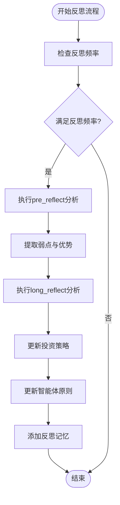

# 反思与策略更新

<cite>
**本文档引用的文件**  
- [reflect.txt](file://Stock_Main/content/our_prompt_template/reflect.txt)
- [pre_reflect.txt](file://Stock_Main/content/our_prompt_template/pre_reflect.txt)
- [long_reflect_infor.txt](file://Stock_Main/content/our_prompt_template/long_reflect_infor.txt)
- [pre_long_reflection.txt](file://Stock_Main/content/our_prompt_template/pre_long_reflection.txt)
- [reflect_info.txt](file://Stock_Main/content/our_prompt_template/reflect_info.txt)
- [behavior.py](file://Stock_Main/behavior.py)
- [our_run_gpt_prompt.py](file://Stock_Main/content/our_run_gpt_prompt.py)
- [Person.py](file://Stock_Main/Person.py)
- [debug_prompts/day0_long_reflection_result.txt](file://Stock_Main/save/sim_test01/debug_prompts/day0_long_reflection_result.txt)
- [debug_prompts/day0_short_reflection_result.txt](file://Stock_Main/save/sim_test01/debug_prompts/day0_short_reflection_result.txt)
</cite>

## 目录
1. [简介](#简介)
2. [短期反思机制](#短期反思机制)
3. [长期策略更新机制](#长期策略更新机制)
4. [状态传递与reflect_info.txt的作用](#状态传递与reflect_infotxt的作用)
5. [模板中的引导性指令设计](#模板中的引导性指令设计)
6. [行为调用流程分析](#行为调用流程分析)
7. [优化策略建议](#优化策略建议)
8. [验证与调试机制](#验证与调试机制)

## 简介
本系统通过多层次的反思机制，使智能体能够在模拟股票交易挑战中持续学习和优化投资策略。核心机制包括短期反思和长期策略更新，通过结构化模板引导智能体进行失败归因分析、成功模式归纳和风险暴露评估，从而实现从历史交易中学习的目标。

## 短期反思机制

短期反思机制通过`pre_reflect.txt`和`reflect.txt`两个模板实现，用于在每个交易周期结束后对最新投资策略进行即时评估和改进。

`pre_reflect.txt`模板要求智能体基于当前迭代的股票操作、财务状况、市场指数、可用股票状态、持有股票状态和投资策略等信息，评估最新投资策略的弱点和优势。该模板强调必须基于投资回报或损失的具体证据进行分析。

`reflect.txt`模板则在此基础上，要求智能体改进当前投资策略并总结新的投资策略。更新后的策略不应关注特定股票，而应作为宏观指导原则，涵盖股票操作、财务状况、市场指数、所有可用股票状态、所有持有股票状态、投资策略以及对最新投资策略的反思。

**文件来源**
- [pre_reflect.txt](file://Stock_Main/content/our_prompt_template/pre_reflect.txt#L1-L22)
- [reflect.txt](file://Stock_Main/content/our_prompt_template/reflect.txt#L1-L35)

## 长期策略更新机制

长期策略更新机制通过`pre_long_reflection.txt`和`long_reflect_infor.txt`模板实现，用于基于过去几天的交易活动提供股票交易建议，以最大化投资回报。

`pre_long_reflection.txt`模板要求智能体基于连续几天的交易数据，包括财务状况、市场指数、可用股票、持有股票和投资策略，评估并得出关于最新投资策略建议的结论。与短期反思不同，长期反思关注跨周期的趋势和模式。

`long_reflect_infor.txt`模板提供了长期反思所需的关键信息结构，包括虚拟日期、现金金额、财富金额、现有投资、市场信息、股票信息和当日投资策略。这些信息被整合用于生成长期投资建议。

**文件来源**
- [pre_long_reflection.txt](file://Stock_Main/content/our_prompt_template/pre_long_reflection.txt#L1-L21)
- [long_reflect_infor.txt](file://Stock_Main/content/our_prompt_template/long_reflect_infor.txt#L1-L25)

## 状态传递与reflect_info.txt的作用

`reflect_info.txt`在智能体的状态传递中扮演着关键角色，它定义了短期反思所需的历史信息结构。该模板包含了虚拟日期、迭代次数、股票操作、现有投资、市场信息、股票信息、八卦信息和投资策略等变量。

在代码实现中，`integrate_reflect_info`函数通过查询过去最多3天的记忆数据，将`reflect_info.txt`模板实例化并整合成连续的历史记录。这种设计确保了智能体在反思时能够访问足够的历史上下文，同时避免了信息过载。

该机制通过限制历史追溯的天数（最多3天），实现了记忆的时效性管理，使智能体既能从历史中学习，又能及时适应市场变化。

**文件来源**
- [reflect_info.txt](file://Stock_Main/content/our_prompt_template/reflect_info.txt#L1-L30)
- [our_run_gpt_prompt.py](file://Stock_Main/content/our_run_gpt_prompt.py#L114-L148)

## 模板中的引导性指令设计

系统模板中的引导性指令设计体现了多层次的认知引导策略：

1. **失败归因分析**：通过要求"所有对最新投资策略的评估必须显示从投资回报或损失中获得的具体相应证据"，强制智能体进行基于数据的因果分析，而非主观臆断。

2. **成功模式归纳**：在strength分析中，引导智能体识别哪些策略带来了正向回报，从而提炼可复制的成功模式。

3. **风险暴露评估**：通过要求分析财务状况、市场指数和股票状态，促使智能体全面评估当前的风险敞口。

4. **宏观策略指导**：强调更新后的策略应作为"宏观指导"而非关注特定股票，防止过度拟合短期市场波动。

5. **证据驱动决策**：所有评估都必须基于具体证据，这培养了智能体的实证思维模式。

这些指令共同构建了一个结构化的反思框架，引导智能体进行系统性、证据驱动的决策优化。

**文件来源**
- [pre_reflect.txt](file://Stock_Main/content/our_prompt_template/pre_reflect.txt#L16-L21)
- [reflect.txt](file://Stock_Main/content/our_prompt_template/reflect.txt#L28-L35)

## 行为调用流程分析

`behavior.py`文件中的`reflection`函数定义了反思机制的调用流程：

1. 当迭代次数满足`reflect_frequency`条件时，触发反思过程。
2. 首先调用`pre_reflect`函数生成策略分析，提取弱点和优势。
3. 然后调用`long_reflect`函数生成长期建议。
4. 最后调用`update_strategy`函数整合短期分析和长期建议，生成新的投资策略。
5. 更新智能体的`principle`属性，并将反思结果添加到记忆中。

这一流程确保了反思机制在每个交易周期结束后的系统性执行，实现了从经验中学习的闭环。

**图表来源**
- [behavior.py](file://Stock_Main/behavior.py#L174-L198)

**文件来源**
- [behavior.py](file://Stock_Main/behavior.py#L174-L198)

## 优化策略建议

基于对现有机制的分析，提出以下优化策略：

1. **引入强化学习反馈信号**：在反思过程中加入量化绩效指标作为强化信号，如夏普比率、最大回撤等，使策略优化更具目标导向性。

2. **设置策略漂移约束**：为防止策略过度调整，可引入策略变化的平滑约束，确保新策略与旧策略保持一定程度的连续性。

3. **增强跨周期记忆连贯性**：当前系统仅追溯3天历史，可考虑引入注意力机制，让智能体自主决定哪些历史信息更重要，而非固定时间窗口。

4. **多时间尺度反思**：除了当前的短期和长期反思，可增加中期反思（如每周反思），形成多时间尺度的学习体系。

5. **风险调整后的反思**：在反思过程中显式考虑风险因素，避免单纯追求收益而忽视风险控制。

6. **社交学习机制**：利用八卦信息（gossip）作为外部反馈，让智能体不仅能从自身经验学习，还能从其他智能体的行为中学习。

这些优化策略将使智能体的学习机制更加稳健和高效。

## 验证与调试机制

系统提供了完善的验证与调试机制，便于追踪策略的演进路径：

1. **调试文件输出**：在`update_strategy`、`long_reflect`和`pre_reflect`函数中，系统会自动生成调试文件，包括：
   - 策略更新提示：`day{virtual_date}_strategy_update_prompt.txt`
   - 策略更新结果：`day{virtual_date}_strategy_update_result.txt`
   - 长期反思提示：`day{virtual_date}_long_reflection_prompt.txt`
   - 长期反思结果：`day{virtual_date}_long_reflection_result.txt`
   - 短期反思提示：`day{virtual_date}_short_reflection_prompt.txt`
   - 短期反思结果：`day{virtual_date}_short_reflection_result.txt`

2. **策略演进验证**：通过分析`debug_prompts`目录下的`long_reflection_result.txt`文件，可以验证策略的演进路径。例如，系统会生成具体的策略建议，而非泛泛而谈。

3. **输入验证机制**：各反思函数都包含输入验证逻辑，确保GPT响应符合预期格式，如`__chat_func_validate`函数会检查响应是否包含必要的结构化信息。

这些机制为系统调试和性能分析提供了有力支持。

**文件来源**
- [our_run_gpt_prompt.py](file://Stock_Main/content/our_run_gpt_prompt.py#L182-L186)
- [debug_prompts/day0_long_reflection_result.txt](file://Stock_Main/save/sim_test01/debug_prompts/day0_long_reflection_result.txt#L1-L1)
- [debug_prompts/day0_short_reflection_result.txt](file://Stock_Main/save/sim_test01/debug_prompts/day0_short_reflection_result.txt#L1-L1)