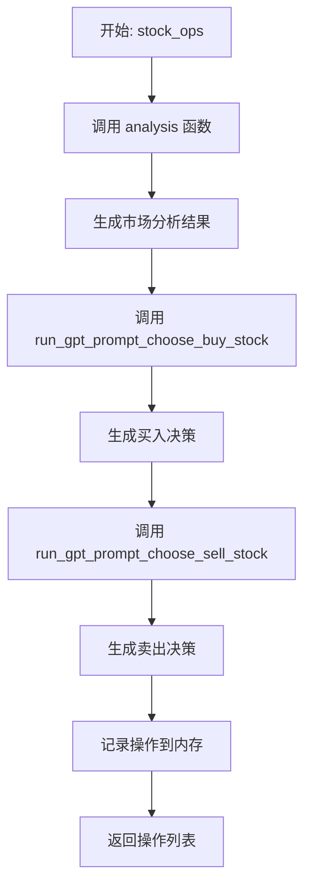

# 市场分析与交易决策

<cite>
**本文档引用的文件**  
- [analysis.txt](file://Agent-Trading-Arena/Stock_Main/content/our_prompt_template/analysis.txt)
- [stock_information.txt](file://Agent-Trading-Arena/Stock_Main/content/our_prompt_template/stock_information.txt)
- [buy_based_on_analysis.txt](file://Agent-Trading-Arena/Stock_Main/content/our_prompt_template/buy_based_on_analysis.txt)
- [sell_based_on_analysis.txt](file://Agent-Trading-Arena/Stock_Main/content/our_prompt_template/sell_based_on_analysis.txt)
- [behavior.py](file://Agent-Trading-Arena/Stock_Main/behavior.py)
- [gpt_structure.py](file://Agent-Trading-Arena/Stock_Main/content/gpt_structure.py)
- [our_run_gpt_prompt.py](file://Agent-Trading-Arena/Stock_Main/content/our_run_gpt_prompt.py)
- [main.py](file://Agent-Trading-Arena/Stock_Main/main.py)
- [Person.py](file://Agent-Trading-Arena/Stock_Main/Person.py)
- [Stock.py](file://Agent-Trading-Arena/Stock_Main/Stock.py)
</cite>

## 目录
1. [引言](#引言)
2. [提示模板详解](#提示模板详解)
3. [行为模块与模板调用流程](#行为模块与模板调用流程)
4. [变量占位符与数据来源](#变量占位符与数据来源)
5. [实际用例与模板修改](#实际用例与模板修改)
6. [优化建议](#优化建议)
7. [调试与验证](#调试与验证)
8. [结论](#结论)

## 引言

本项目是一个模拟股票交易挑战系统，其中多个智能体（参与者）通过大语言模型（LLM）进行市场分析并做出买卖决策。系统的核心是基于文本的提示模板，这些模板定义了LLM的输入格式和任务指令。智能体的行为由`behavior.py`模块驱动，该模块调用`gpt_structure.py`中的函数来生成实际的LLM请求。本文档将深入解析这些提示模板，阐明其工作流程、数据来源，并提供优化建议。

## 提示模板详解

系统使用多个文本模板来引导LLM完成不同的任务。这些模板位于`our_prompt_template/`目录下，通过`!<INPUT N>!`占位符注入动态数据。

### 市场整体趋势分析 (analysis.txt)

`analysis.txt`模板用于生成对当前市场状况的综合分析。它整合了股票信息、市场指数、流言、现有投资和投资策略，要求LLM总结出最重要的分析结果。

**核心指令**：
- 你是一个参与模拟股票交易挑战的玩家。
- 你的总体目标是尽可能多地盈利。
- 基于提供的信息，总结出`!<INPUT 5>!`个最重要和最有价值的分析结果。
- 每个分析结果必须描述其内容与投资策略的关系。

该模板是后续买卖决策的基础。

**文档来源**
- [analysis.txt](file://Agent-Trading-Arena/Stock_Main/content/our_prompt_template/analysis.txt)

### 个股信息查询 (stock_information.txt)

`stock_information.txt`模板用于格式化单个股票的详细信息。它被多次调用，为每个市场中的股票生成信息块，然后拼接成`analysis.txt`中“Stock information”部分的完整内容。

**包含的数据**：
- 股票名称
- 过去5天的收盘价
- 每股股息
- 当前价格变动百分比和当前价格
- 盘中最高价、最低价和均价

**文档来源**
- [stock_information.txt](file://Agent-Trading-Arena/Stock_Main/content/our_prompt_template/stock_information.txt)

### 基于分析的买入决策 (buy_based_on_analysis.txt)

`buy_based_on_analysis.txt`模板用于决定是否买入某只股票。它接收智能体的财务状况、可用股票、分析结果和投资策略作为输入。

**核心指令**：
- 决定应买入哪只股票的多少数量和最佳买入价格，或选择持有（hold）。
- 考虑因素包括：当前财务状况（需保留最低生活费）、股票信息、附加信息（分析结果）和投资策略。
- 目标是最大化利润，同时不耗尽所有现金。

**文档来源**
- [buy_based_on_analysis.txt](file://Agent-Trading-Arena/Stock_Main/content/our_prompt_template/buy_based_on_analysis.txt)

### 基于分析的卖出决策 (sell_based_on_analysis.txt)

`sell_based_on_analysis.txt`模板用于决定是否卖出持有的股票。

**核心指令**：
- 决定应卖出哪只股票的多少数量和最佳卖出价格，或选择持有（hold）。
- 考虑因素包括：当前财务状况、现有投资、附加信息（分析结果）和投资策略。

**文档来源**
- [sell_based_on_analysis.txt](file://Agent-Trading-Arena/Stock_Main/content/our_prompt_template/sell_based_on_analysis.txt)

## 行为模块与模板调用流程

`behavior.py`模块是整个决策流程的控制中心。`stock_ops`函数是核心，它为每个智能体执行一个完整的决策周期。



**流程详解**：

1.  **市场分析**：`stock_ops`首先调用`analysis`函数。该函数位于`our_run_gpt_prompt.py`中，它会：
    *   调用`integrate_stock_info`等辅助函数，从`Stock`和`Market_index`对象中收集数据。
    *   将收集到的数据填入`analysis.txt`模板的`!<INPUT N>!`占位符。
    *   调用`gpt_structure.py`中的`llm_safe_generate_response_structured`函数，向LLM发送请求并获取分析结果。

2.  **买入决策**：获得分析结果后，`stock_ops`调用`run_gpt_prompt_choose_buy_stock`。该函数：
    *   将智能体的现金、最低生活费、股票信息和分析结果等数据填入`buy_based_on_analysis.txt`模板。
    *   向LLM发送请求，获取买入决策。

3.  **卖出决策**：类似地，调用`run_gpt_prompt_choose_sell_stock`，使用`sell_based_on_analysis.txt`模板生成卖出决策。

4.  **结果处理**：`extract_for_choose_buy`和`extract_for_choose_sell`函数使用正则表达式解析LLM的响应，将其转换为程序可处理的格式（如股票名称、数量、价格）。

**文档来源**
- [behavior.py](file://Agent-Trading-Arena/Stock_Main/behavior.py)
- [our_run_gpt_prompt.py](file://Agent-Trading-Arena/Stock_Main/content/our_run_gpt_prompt.py)

## 变量占位符与数据来源

提示模板中的`!<INPUT N>!`占位符在运行时被具体的数据填充。这些数据来源于系统的各个组件。

| 占位符 | 数据来源 | 说明 |
| :--- | :--- | :--- |
| `!<INPUT 0>!` in `analysis.txt` | `integrate_stock_info` 函数 | 调用`Stock.query_prompt_values()`获取所有股票的详细信息，并格式化为`stock_information.txt`模板的输出。 |
| `!<INPUT 1>!` in `analysis.txt` | `market_index.query_market_index_intraday_percentage()` | 获取当前市场指数的盘中变动百分比。 |
| `!<INPUT 2>!` in `analysis.txt` | `integrate_gossip` 函数 | 从数据库中随机选取其他智能体的流言（gossip）。 |
| `!<INPUT 3>!` in `analysis.txt` | `integrate_hold_info` 函数 | 查询智能体当前持有的股票，并计算总价值。 |
| `!<INPUT 4>!` in `analysis.txt` | `persona.principle` | 智能体的投资策略，存储在`persona.json`文件中。 |
| `!<INPUT 5>!` in `analysis.txt` | `args.analysis_num` | 从命令行参数中获取，决定需要生成多少条分析结果。 |
| `!<INPUT 0>!` in `buy_based_on_analysis.txt` | `persona.cash` | 智能体当前的现金余额。 |
| `!<INPUT 1>!` in `buy_based_on_analysis.txt` | `persona.identity["minimum_living_expense"] * 10` | 计算智能体需要保留的最低现金。 |
| `!<INPUT 2>!` in `buy_based_on_analysis.txt` | `integrate_stock_info` 函数 | 与`analysis.txt`中的相同，提供可用股票信息。 |
| `!<INPUT 3>!` in `buy_based_on_analysis.txt` | `analysis_results` | 上一步`analysis`函数的输出。 |
| `!<INPUT 4>!` in `buy_based_on_analysis.txt` | `persona.principle` | 智能体的投资策略。 |

**文档来源**
- [Stock.py](file://Agent-Trading-Arena/Stock_Main/Stock.py)
- [Person.py](file://Agent-Trading-Arena/Stock_Main/Person.py)
- [our_run_gpt_prompt.py](file://Agent-Trading-Arena/Stock_Main/content/our_run_gpt_prompt.py)
- [main.py](file://Agent-Trading-Arena/Stock_Main/main.py)

## 实际用例与模板修改

### 用例：引入技术指标

可以修改`stock_information.txt`模板，引入简单的技术指标，如5日移动平均线（MA5）。

**修改前**：
```
- The closing prices in the past 5 days are: !<INPUT 1>!
```

**修改后**：
```
- The closing prices in the past 5 days are: !<INPUT 1>!
- 5-day Moving Average (MA5): $!<INPUT 8>!
```

**实现**：
在`Stock.query_prompt_values()`函数中，增加计算MA5的逻辑，并将其作为新的`!<INPUT 8>!`传入。

### 用例：引入宏观经济因子

可以创建一个新的`macro_economic.txt`模板，并将其输出作为`!<INPUT 6>!`注入到`analysis.txt`中。

**新模板 `macro_economic.txt`**：
```
Global Economic Indicator:
- Interest Rate: !<INPUT 0>!%
- Inflation Rate: !<INPUT 1>!%
```

**修改 `analysis.txt`**：
在“Gossip from other people”之后添加：
```
Macro Economic Information:
!<INPUT 6>!
```

**实现**：
在`analysis`函数的`create_prompt_input`中，增加一个获取宏观经济数据的步骤，并将其加入`prompt_input`列表。

## 优化建议

1.  **增强逻辑链推理**：
    *   在`analysis.txt`的指令中，明确要求LLM进行多步推理。例如：“首先分析市场趋势，然后评估个股表现，最后结合你的投资策略得出结论。”
    *   使用`gpt_structure.py`中的`llm_safe_generate_response_structured`函数，通过`special_instruction`参数强制要求结构化输出，确保推理过程的完整性。

2.  **加入仓位管理规则**：
    *   在`buy_based_on_analysis.txt`中，修改财务状况描述，加入仓位限制。例如：“你最多只能将总资金的20%投资于单只股票。”
    *   在`run_gpt_prompt_choose_buy_stock`函数中，可以在调用LLM前进行预检查，如果现金不足或超过仓位上限，则直接返回“hold”。

3.  **防止过度交易**：
    *   **增加交易成本**：在`buy_based_on_analysis.txt`和`sell_based_on_analysis.txt`中明确告知LLM存在交易手续费（例如1%），使其在微小利润时倾向于持有。
    *   **引入最小盈利目标**：在买入指令中加入：“只有当预期盈利超过5%时，才考虑买入。”
    *   **利用`reflect_frequency`**：让智能体定期（如每2天）进行反思（reflection），根据历史交易表现调整策略，避免频繁的无效交易。

## 调试与验证

系统提供了强大的调试功能，通过`debug_prompts`目录下的日志文件验证输出一致性。

*   **日志文件**：`our_run_gpt_prompt.py`中的`analysis`、`run_gpt_prompt_choose_buy_stock`等函数会将生成的完整提示（prompt）写入`save/[run_name]/debug_prompts/`目录下的文件，如`day0_iter0_market_analysis_prompt.txt`。
*   **验证方法**：
    1.  检查`debug_prompts`目录中的文件，确认所有`!<INPUT N>!`占位符都已被正确替换为实际数据。
    2.  检查LLM的响应是否符合`__chat_func_validate`函数中定义的正则表达式模式（如`Operation: buy, ...`）。
    3.  通过比较不同迭代的分析结果，验证智能体的决策逻辑是否一致且合理。

**文档来源**
- [our_run_gpt_prompt.py](file://Agent-Trading-Arena/Stock_Main/content/our_run_gpt_prompt.py)
- [save/sim_test01/debug_prompts/](file://Agent-Trading-Arena/Stock_Main/save/sim_test01/debug_prompts/)

## 结论

该系统通过精心设计的提示模板，将复杂的市场分析和交易决策任务分解为LLM可处理的子任务。`behavior.py`模块作为协调者，通过`gpt_structure.py`与LLM进行交互，实现了从数据收集、分析到决策的完整闭环。通过理解变量占位符的数据来源和调用流程，可以对系统进行有效的修改和优化。利用`debug_prompts`日志进行验证，是确保系统行为符合预期的关键步骤。未来可通过引入更复杂的指标、强化推理指令和精细化的仓位管理，进一步提升智能体的交易表现。