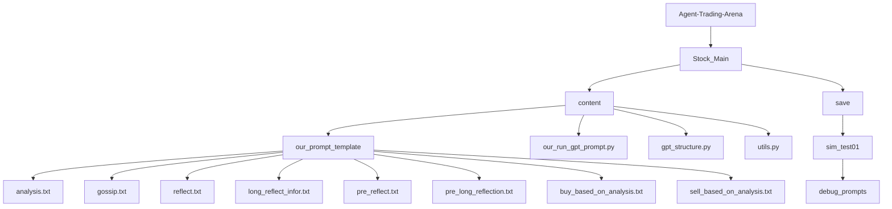
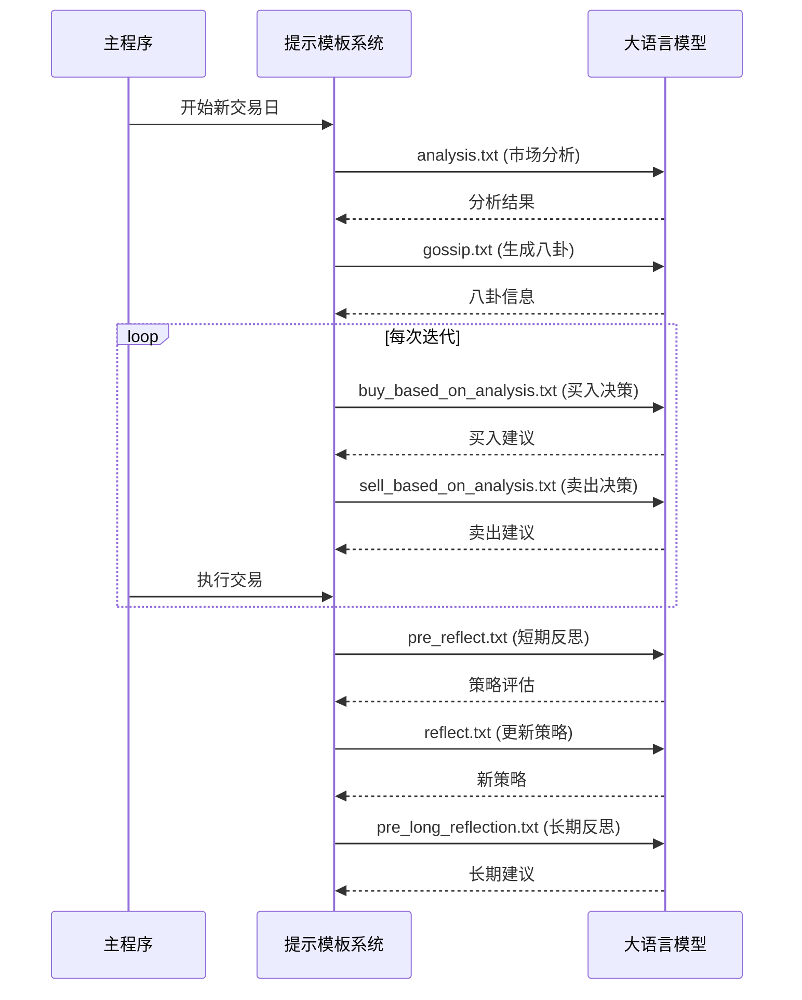
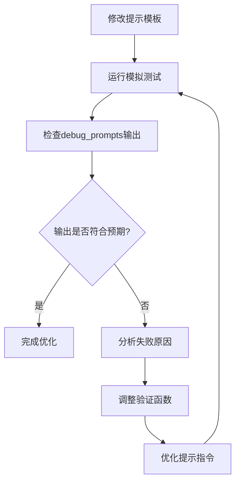

# 提示模板定制

<cite>
**本文档引用的文件**  
- [analysis.txt](file://Agent-Trading-Arena/Stock_Main/content/our_prompt_template/analysis.txt)
- [gossip.txt](file://Agent-Trading-Arena/Stock_Main/content/our_prompt_template/gossip.txt)
- [reflect.txt](file://Agent-Trading-Arena/Stock_Main/content/our_prompt_template/reflect.txt)
- [long_reflect_infor.txt](file://Agent-Trading-Arena/Stock_Main/content/our_prompt_template/long_reflect_infor.txt)
- [pre_reflect.txt](file://Agent-Trading-Arena/Stock_Main/content/our_prompt_template/pre_reflect.txt)
- [pre_long_reflection.txt](file://Agent-Trading-Arena/Stock_Main/content/our_prompt_template/pre_long_reflection.txt)
- [buy_based_on_analysis.txt](file://Agent-Trading-Arena/Stock_Main/content/our_prompt_template/buy_based_on_analysis.txt)
- [sell_based_on_analysis.txt](file://Agent-Trading-Arena/Stock_Main/content/our_prompt_template/sell_based_on_analysis.txt)
- [gossip_info.txt](file://Agent-Trading-Arena/Stock_Main/content/our_prompt_template/gossip_info.txt)
- [hold_information.txt](file://Agent-Trading-Arena/Stock_Main/content/our_prompt_template/hold_information.txt)
- [stock_information.txt](file://Agent-Trading-Arena/Stock_Main/content/our_prompt_template/stock_information.txt)
- [our_run_gpt_prompt.py](file://Agent-Trading-Arena/Stock_Main/content/our_run_gpt_prompt.py)
- [gpt_structure.py](file://Agent-Trading-Arena/Stock_Main/content/gpt_structure.py)
- [utils.py](file://Agent-Trading-Arena/Stock_Main/content/utils.py)
- [Person.py](file://Agent-Trading-Arena/Stock_Main/Person.py)
- [Stock.py](file://Agent-Trading-Arena/Stock_Main/Stock.py)
- [sim_test01/debug_prompts/day0_iter0_market_analysis_prompt.txt](file://Agent-Trading-Arena/Stock_Main/save/sim_test01/debug_prompts/day0_iter0_market_analysis_prompt.txt)
- [sim_test01/debug_prompts/day0_short_reflection_prompt.txt](file://Agent-Trading-Arena/Stock_Main/save/sim_test01/debug_prompts/day0_short_reflection_prompt.txt)
- [sim_test01/debug_prompts/day0_long_reflection_prompt.txt](file://Agent-Trading-Arena/Stock_Main/save/sim_test01/debug_prompts/day0_long_reflection_prompt.txt)
</cite>

## 目录
1. [项目结构](#项目结构)
2. [核心提示模板功能解析](#核心提示模板功能解析)
3. [模板语法规范](#模板语法规范)
4. [调用时机与执行流程](#调用时机与执行流程)
5. [优化建议](#优化建议)
6. [调试与验证方法](#调试与验证方法)

## 项目结构



**图示来源**  
- [analysis.txt](file://Agent-Trading-Arena/Stock_Main/content/our_prompt_template/analysis.txt)
- [gossip.txt](file://Agent-Trading-Arena/Stock_Main/content/our_prompt_template/gossip.txt)
- [reflect.txt](file://Agent-Trading-Arena/Stock_Main/content/our_prompt_template/reflect.txt)
- [our_run_gpt_prompt.py](file://Agent-Trading-Arena/Stock_Main/content/our_run_gpt_prompt.py)

## 核心提示模板功能解析

### 市场分析模板 (analysis.txt)

该模板用于生成市场整体分析，整合股票信息、市场指数、已有投资、投资策略和八卦信息，输出最重要的分析结果。这些结果将作为后续买卖决策的依据。

**功能特点**：
- 接收多源输入：股票信息、市场信息、八卦、现有投资和投资策略
- 生成指定数量的分析结果（由`!<INPUT 5>!`控制）
- 每个分析结果必须与投资策略相关联
- 分析结果将用于后续的买卖决策

**调用时机**：每个交易日的每次迭代开始时调用，为当日的交易决策提供分析基础。

**节来源**  
- [analysis.txt](file://Agent-Trading-Arena/Stock_Main/content/our_prompt_template/analysis.txt)
- [our_run_gpt_prompt.py](file://Agent-Trading-Arena/Stock_Main/content/our_run_gpt_prompt.py#L414-L484)

### 信息传播模板 (gossip.txt)

该模板驱动信息传播行为，允许参与者生成关于特定股票或整个市场的八卦信息，这些信息将被其他参与者接收并可能影响他们的交易行为。

**功能特点**：
- 允许生成真实或虚假的八卦信息
- 虚假信息不能与已知的股票和市场信息冲突
- 旨在影响其他参与者的交易决策
- 生成的八卦信息将被存储并在后续分析中使用

**调用时机**：在每个交易日的特定迭代中调用，用于生成影响市场的信息。

**节来源**  
- [gossip.txt](file://Agent-Trading-Arena/Stock_Main/content/our_prompt_template/gossip.txt)
- [our_run_gpt_prompt.py](file://Agent-Trading-Arena/Stock_Main/content/our_run_gpt_prompt.py#L364-L412)

### 短期反思模板 (reflect.txt)

该模板触发短期反思过程，用于评估当前投资策略的优缺点，并根据分析结果更新投资策略。

**功能特点**：
- 接收当前投资策略的分析结果
- 评估策略的弱点和优势
- 生成新的投资策略建议
- 更新后的策略应作为宏观指导而非具体股票建议

**调用时机**：在每个交易日的特定迭代后调用，用于调整和优化投资策略。

**节来源**  
- [reflect.txt](file://Agent-Trading-Arena/Stock_Main/content/our_prompt_template/reflect.txt)
- [our_run_gpt_prompt.py](file://Agent-Trading-Arena/Stock_Main/content/our_run_gpt_prompt.py#L151-L212)

### 长期策略更新模板 (long_reflect_infor.txt 和 pre_long_reflection.txt)

该模板支持长期策略更新，基于过去几天的交易活动提供投资建议，以最大化投资回报。

**功能特点**：
- 综合多日的交易数据进行分析
- 评估长期投资策略的有效性
- 提供改进投资策略的建议
- 考虑财务状况、市场指数、所有可用股票状态等因素

**调用时机**：在多个交易日结束后调用，用于进行长期策略调整。

**节来源**  
- [long_reflect_infor.txt](file://Agent-Trading-Arena/Stock_Main/content/our_prompt_template/long_reflect_infor.txt)
- [pre_long_reflection.txt](file://Agent-Trading-Arena/Stock_Main/content/our_prompt_template/pre_long_reflection.txt)
- [our_run_gpt_prompt.py](file://Agent-Trading-Arena/Stock_Main/content/our_run_gpt_prompt.py#L251-L304)

## 模板语法规范

### 变量占位符系统

所有提示模板使用统一的变量占位符系统，格式为`!<INPUT X>!`，其中X为从0开始的整数索引。

#### 常用变量类型

| 变量类型 | 描述 | 示例 |
|---------|------|------|
| `!<INPUT 0>!` | 主要信息输入 | 股票信息、操作信息等 |
| `!<INPUT 1>!` | 次要信息输入 | 市场信息、财务状况等 |
| `!<INPUT 2>!` | 第三方信息 | 八卦信息、他人观点等 |
| `!<INPUT 3>!` | 状态信息 | 现有投资、持仓情况等 |
| `!<INPUT 4>!` | 策略信息 | 投资策略、原则等 |
| `!<INPUT 5>!` | 控制参数 | 分析数量、迭代次数等 |

### 模板结构规范

所有模板遵循统一的结构：

1. **Variables部分**：定义所有输入变量及其描述
2. **分隔符**：`<commentblockmarker>###</commentblockmarker>`用于分隔元数据和实际内容
3. **Instructions部分**：提供角色设定和基本指导
4. **具体内容**：包含变量替换后的实际信息
5. **Task部分**：明确具体的任务要求

### 特殊语法元素

- **注释分隔符**：`<commentblockmarker>###</commentblockmarker>`用于标记模板元数据的结束，实际使用时会移除该标记之前的内容
- **变量替换**：在运行时通过`generate_prompt`函数将`!<INPUT X>!`替换为实际值
- **条件输出**：某些模板会根据输入数据的特殊值（如空值）生成不同的输出格式

**节来源**  
- [analysis.txt](file://Agent-Trading-Arena/Stock_Main/content/our_prompt_template/analysis.txt)
- [gossip.txt](file://Agent-Trading-Arena/Stock_Main/content/our_prompt_template/gossip.txt)
- [gpt_structure.py](file://Agent-Trading-Arena/Stock_Main/content/gpt_structure.py#L283-L308)

## 调用时机与执行流程

### 执行流程图



**图示来源**  
- [our_run_gpt_prompt.py](file://Agent-Trading-Arena/Stock_Main/content/our_run_gpt_prompt.py)
- [analysis.txt](file://Agent-Trading-Arena/Stock_Main/content/our_prompt_template/analysis.txt)
- [gossip.txt](file://Agent-Trading-Arena/Stock_Main/content/our_prompt_template/gossip.txt)

### 调用顺序与依赖关系

1. **初始化阶段**：
   - 加载参与者和股票信息
   - 初始化财务状况和持仓

2. **每日开始**：
   - 调用`analysis.txt`进行市场分析
   - 调用`gossip.txt`生成市场八卦

3. **迭代交易**：
   - 调用`buy_based_on_analysis.txt`决定买入
   - 调用`sell_based_on_analysis.txt`决定卖出

4. **反思阶段**：
   - 调用`pre_reflect.txt`评估策略
   - 调用`reflect.txt`更新投资策略
   - 调用`pre_long_reflection.txt`进行长期策略评估

### 条件调用逻辑

某些模板的调用受特定条件限制：

- **持有股票检查**：`sell_based_on_analysis.txt`仅在持有股票时调用
- **现金检查**：`buy_based_on_analysis.txt`仅在现金充足时调用
- **反思频率**：`reflect.txt`根据参与者的`reflect_frequency`属性决定调用时机

**节来源**  
- [our_run_gpt_prompt.py](file://Agent-Trading-Arena/Stock_Main/content/our_run_gpt_prompt.py)
- [Person.py](file://Agent-Trading-Arena/Stock_Main/Person.py#L170-L182)

## 优化建议

### 增强逻辑推理指令

1. **添加推理步骤要求**：
   - 在`analysis.txt`中明确要求"请逐步推理，先分析市场趋势，再评估个股表现，最后结合投资策略得出结论"
   - 在`reflect.txt`中要求"请先列举证据，再得出结论，最后提出改进建议"

2. **引入思维链（Chain-of-Thought）**：
   ```text
   请按照以下步骤进行分析：
   1. 观察：描述你观察到的关键数据点
   2. 推理：解释这些数据点之间的关系和可能的影响
   3. 结论：基于推理得出明确的结论
   4. 建议：提出具体的行动建议
   ```

### 引入风险控制约束

1. **在买卖决策模板中添加风险控制**：
   - 在`buy_based_on_analysis.txt`中增加"请确保买入后仍保留至少X%的现金作为应急资金"
   - 在`sell_based_on_analysis.txt`中增加"当单只股票持仓超过总投资的Y%时，必须考虑减持"

2. **设置止损止盈规则**：
   - 在`reflect.txt`中添加"当某只股票亏损超过Z%时，应重新评估持有理由"
   - 在`analysis.txt`中加入"识别潜在的高风险投资机会"

### 调整语气风格以影响决策倾向

1. **保守型语气**：
   - 使用"建议谨慎操作"、"考虑风险因素"等表述
   - 强调"本金安全"和"稳定收益"

2. **激进型语气**：
   - 使用"抓住机会"、"大胆布局"等表述
   - 强调"高收益潜力"和"市场领先"

3. **中性平衡型语气**：
   - 使用"权衡利弊"、"综合考虑"等表述
   - 强调"风险收益比"和"投资组合平衡"

### 模板内容优化示例

```text
原指令：
"基于以上信息，总结最重要的分析结果"

优化后：
"请采用以下分析框架：
1. 市场层面：当前市场整体趋势如何？有哪些关键驱动因素？
2. 行业层面：各股票所在行业的表现有何差异？原因是什么？
3. 个股层面：哪些个股表现突出？其背后的基本面和技术面因素是什么？
4. 策略匹配：上述发现如何与您的投资策略相匹配？应如何调整策略？
请按此框架提供3个最重要的分析结果"
```

**节来源**  
- [analysis.txt](file://Agent-Trading-Arena/Stock_Main/content/our_prompt_template/analysis.txt)
- [reflect.txt](file://Agent-Trading-Arena/Stock_Main/content/our_prompt_template/reflect.txt)
- [buy_based_on_analysis.txt](file://Agent-Trading-Arena/Stock_Main/content/our_prompt_template/buy_based_on_analysis.txt)

## 调试与验证方法

### 实际生成记录验证

通过`save/sim_test01/debug_prompts`目录中的实际生成记录验证修改效果：

1. **市场分析验证**：
   - 检查`day0_iter0_market_analysis_prompt.txt`中的输入数据是否完整
   - 验证分析结果是否符合投资策略要求

2. **反思过程验证**：
   - 检查`day0_short_reflection_prompt.txt`中的历史数据是否准确
   - 验证策略更新是否基于充分的证据

3. **长期策略验证**：
   - 检查`day0_long_reflection_prompt.txt`中的多日数据整合是否正确
   - 验证长期建议是否具有连贯性

### 使用gpt_structure.py调试提示输出一致性

1. **输出格式验证**：
   - 利用`__chat_func_validate`函数确保输出符合预期格式
   - 例如，在`analysis.txt`中验证输出是否以"-"开头并以换行符结束

2. **清理函数优化**：
   - 使用`__chat_func_clean_up`函数去除无关内容
   - 确保输出的纯净性和一致性

3. **失败安全机制**：
   - 设置合理的重试次数（repeat参数）
   - 定义清晰的失败安全响应（fail_safe_response）

### 调试流程



**图示来源**  
- [sim_test01/debug_prompts/day0_iter0_market_analysis_prompt.txt](file://Agent-Trading-Arena/Stock_Main/save/sim_test01/debug_prompts/day0_iter0_market_analysis_prompt.txt)
- [sim_test01/debug_prompts/day0_short_reflection_prompt.txt](file://Agent-Trading-Arena/Stock_Main/save/sim_test01/debug_prompts/day0_short_reflection_prompt.txt)
- [sim_test01/debug_prompts/day0_long_reflection_prompt.txt](file://Agent-Trading-Arena/Stock_Main/save/sim_test01/debug_prompts/day0_long_reflection_prompt.txt)

**节来源**  
- [our_run_gpt_prompt.py](file://Agent-Trading-Arena/Stock_Main/content/our_run_gpt_prompt.py)
- [gpt_structure.py](file://Agent-Trading-Arena/Stock_Main/content/gpt_structure.py)