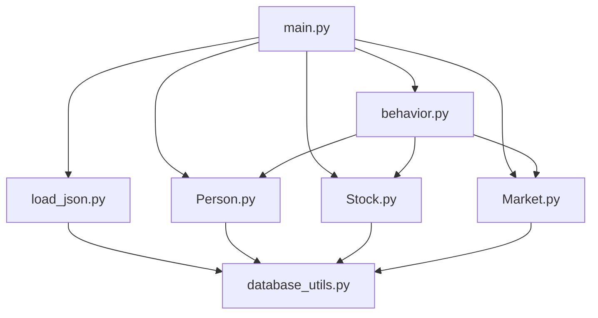
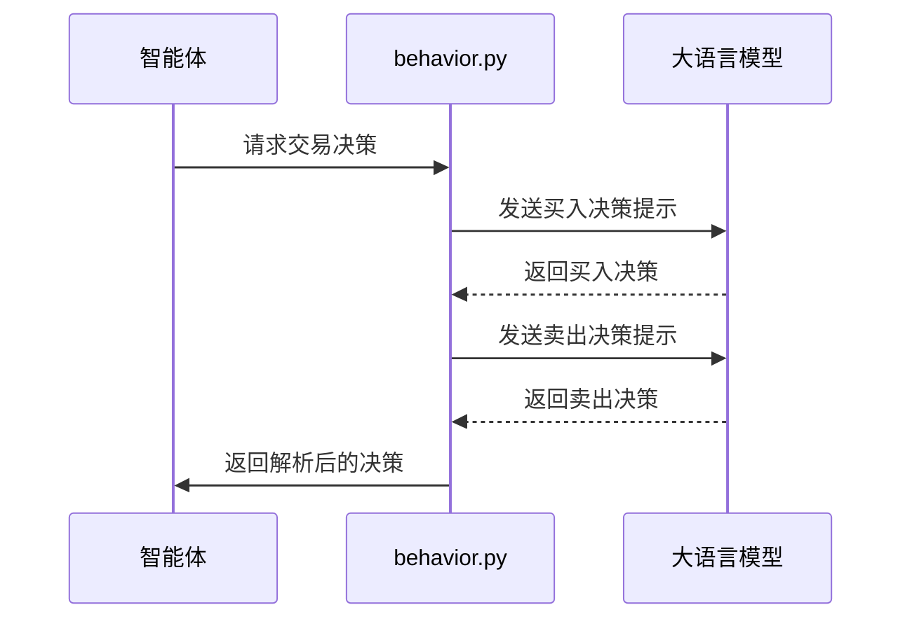
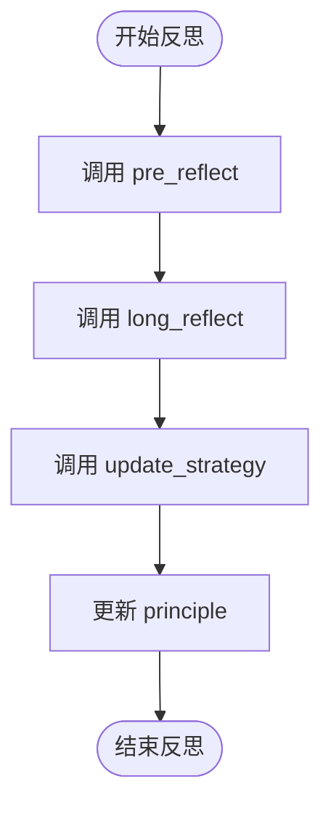
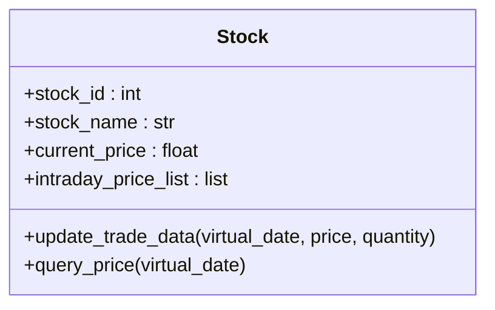

# 智能体与资产配置

<cite>
**本文档引用文件**  
- [persona.json](file://Agent-Trading-Arena/Stock_Main/save/init/persona.json)
- [stocks.json](file://Agent-Trading-Arena/Stock_Main/save/init/stocks.json)
- [load_json.py](file://Agent-Trading-Arena/Stock_Main/load_json.py)
- [main.py](file://Agent-Trading-Arena/Stock_Main/main.py)
- [Person.py](file://Agent-Trading-Arena/Stock_Main/Person.py)
- [Stock.py](file://Agent-Trading-Arena/Stock_Main/Stock.py)
- [behavior.py](file://Agent-Trading-Arena/Stock_Main/behavior.py)
- [database_utils.py](file://Agent-Trading-Arena/Stock_Main/database_utils.py)
- [test_load_json.py](file://Agent-Trading-Arena/Stock_Main/unit_test/test_load_json.py)
- [test_person.py](file://Agent-Trading-Arena/Stock_Main/unit_test/test_person.py)
- [test_stock.py](file://Agent-Trading-Arena/Stock_Main/unit_test/test_stock.py)
- [reflect.txt](file://Agent-Trading-Arena/Stock_Main/content/our_prompt_template/reflect.txt)
- [buy_based_on_analysis.txt](file://Agent-Trading-Arena/Stock_Main/content/our_prompt_template/buy_based_on_analysis.txt)
- [sell_based_on_analysis.txt](file://Agent-Trading-Arena/Stock_Main/content/our_prompt_template/sell_based_on_analysis.txt)
</cite>

## 目录
1. [简介](#简介)
2. [智能体配置（persona.json）](#智能体配置personajson)
3. [资产配置（stocks.json）](#资产配置stocksjson)
4. [配置示例](#配置示例)
5. [配置验证与模拟启动](#配置验证与模拟启动)
6. [系统架构与数据流](#系统架构与数据流)
7. [智能体行为逻辑](#智能体行为逻辑)
8. [资产价格动态](#资产价格动态)
9. [市场行为影响分析](#市场行为影响分析)
10. [故障排除](#故障排除)

## 简介

本系统是一个基于智能体的股票交易模拟环境，通过定义智能体（Agent）的初始属性和股票资产信息，模拟金融市场中的交易行为。用户可以通过编辑 `persona.json` 文件来配置智能体的初始资金、风险偏好、投资风格和社交活跃度等属性，通过 `stocks.json` 文件来配置股票的初始价格、波动性、所属行业和市值规模等信息。系统通过 `main.py` 启动模拟，`load_json.py` 负责加载和验证配置文件。

**Section sources**
- [main.py](file://Agent-Trading-Arena/Stock_Main/main.py#L1-L151)
- [load_json.py](file://Agent-Trading-Arena/Stock_Main/load_json.py#L1-L134)

## 智能体配置（persona.json）

`persona.json` 文件定义了系统中所有智能体的初始属性。每个智能体由一个 JSON 对象表示，包含以下字段：

- **person_id**: 智能体的唯一标识符，整数类型。
- **name**: 智能体的名称，字符串类型。
- **occupation**: 智能体的职业，字符串类型。
- **principle**: 智能体的投资原则或策略，字符串类型。
- **investment_duration**: 智能体的投资期限，字符串类型。
- **daily_income_from_job**: 智能体每日从工作中获得的收入，整数类型。
- **cash**: 智能体的初始现金，整数类型。
- **minimum_living_expense**: 智能体的最低生活开支，整数类型。
- **reflect_frequency**: 智能体进行反思的频率，整数类型。0 表示不反思，其他值表示每隔多少次迭代进行一次反思。

```json
[
  {
    "person_id": 0,
    "name": "amy",
    "occupation": "AI researcher",
    "principle": "try to maximize profit.",
    "investment_duration": "one year",
    "daily_income_from_job": 500,
    "cash": 40000,
    "minimum_living_expense": 200,
    "reflect_frequency": 0
  },
  ...
]
```

**Section sources**
- [persona.json](file://Agent-Trading-Arena/Stock_Main/save/init/persona.json#L1-L131)
- [Person.py](file://Agent-Trading-Arena/Stock_Main/Person.py#L144-L200)
- [load_json.py](file://Agent-Trading-Arena/Stock_Main/load_json.py#L9-L14)

## 资产配置（stocks.json）

`stocks.json` 文件定义了系统中所有股票资产的初始信息。每个股票由一个 JSON 对象表示，包含以下字段：

- **stock_id**: 股票的唯一标识符，整数类型。
- **stock_name**: 股票的名称，字符串类型。
- **DPS**: 股票的每股分红（Dividend Per Share），整数类型。
- **past_stock_last_prices**: 股票过去的价格序列，浮点数数组，用于初始化价格。
- **quantity**: 股票的初始数量，整数类型。

```json
[
  {
    "stock_id": 0,
    "stock_name": "A",
    "DPS": 22,
    "past_stock_last_prices": [454.17, 446.64, 425.54, 423.88, 408.55, 437.53, 439.40, 441.20, 437.80, 445.60],
    "quantity": 300
  },
  ...
]
```

**Section sources**
- [stocks.json](file://Agent-Trading-Arena/Stock_Main/save/init/stocks.json#L1-L31)
- [Stock.py](file://Agent-Trading-Arena/Stock_Main/Stock.py#L15-L38)
- [load_json.py](file://Agent-Trading-Arena/Stock_Main/load_json.py#L17-L22)

## 配置示例

### 高风险投机型智能体

```json
{
  "person_id": 12,
  "name": "Zoe",
  "occupation": "Day Trader",
  "principle": "Maximize short-term gains through aggressive trading.",
  "investment_duration": "one month",
  "daily_income_from_job": 0,
  "cash": 50000,
  "minimum_living_expense": 100,
  "reflect_frequency": 1
}
```

该智能体具有高风险偏好，不依赖工资收入，频繁进行交易和反思，追求短期高收益。

### 保守价值型智能体

```json
{
  "person_id": 13,
  "name": "Walter",
  "occupation": "Retired Professor",
  "principle": "Invest in undervalued stocks with strong fundamentals for long-term growth.",
  "investment_duration": "ten years",
  "daily_income_from_job": 200,
  "cash": 100000,
  "minimum_living_expense": 300,
  "reflect_frequency": 10
}
```

该智能体具有低风险偏好，依赖稳定收入，进行长期投资，反思频率较低。

### 信息中介型智能体

```json
{
  "person_id": 14,
  "name": "Nora",
  "occupation": "Financial Journalist",
  "principle": "Spread market information and influence other agents' decisions.",
  "investment_duration": "ongoing",
  "daily_income_from_job": 400,
  "cash": 30000,
  "minimum_living_expense": 200,
  "reflect_frequency": 2
}
```

该智能体通过生成和传播市场八卦（gossip）来影响其他智能体的决策，扮演信息中介的角色。

**Section sources**
- [persona.json](file://Agent-Trading-Arena/Stock_Main/save/init/persona.json#L1-L131)
- [behavior.py](file://Agent-Trading-Arena/Stock_Main/behavior.py#L201-L210)
- [content/our_prompt_template/gossip_info.txt](file://Agent-Trading-Arena/Stock_Main/content/our_prompt_template/gossip_info.txt#L1-L28)

## 配置验证与模拟启动

在修改 `persona.json` 和 `stocks.json` 文件后，建议使用 `load_json.py` 验证数据格式的正确性。可以通过运行以下命令来验证：

```bash
python load_json.py
```

如果文件格式正确，程序将成功加载数据并打印相关信息。如果文件格式有误，程序将抛出异常。

验证通过后，可以通过 `main.py` 启动模拟。`main.py` 提供了多个命令行参数来控制模拟行为，例如：

- `--Iterations_Daily`: 每日迭代次数。
- `--No_Days`: 模拟天数。
- `--Num_Person`: 智能体数量。
- `--Num_Stock`: 股票数量。
- `--SAVE_NAME`: 保存文件夹名称。

启动模拟的命令如下：

```bash
python main.py --Iterations_Daily 3 --No_Days 5 --Num_Person 12 --Num_Stock 4 --SAVE_NAME sim_test01
```

该命令将启动一个为期5天、每天3次迭代、包含12个智能体和4只股票的模拟，并将结果保存在 `save/sim_test01` 目录中。

**Section sources**
- [load_json.py](file://Agent-Trading-Arena/Stock_Main/load_json.py#L131-L134)
- [main.py](file://Agent-Trading-Arena/Stock_Main/main.py#L17-L63)

## 系统架构与数据流

系统由多个核心组件构成，包括智能体（Person）、股票（Stock）、市场（Market）和数据库（Database）。这些组件通过 `main.py` 协调工作，形成一个完整的模拟环境。



**Diagram sources**
- [main.py](file://Agent-Trading-Arena/Stock_Main/main.py#L1-L151)
- [load_json.py](file://Agent-Trading-Arena/Stock_Main/load_json.py#L1-L134)
- [Person.py](file://Agent-Trading-Arena/Stock_Main/Person.py#L1-L629)
- [Stock.py](file://Agent-Trading-Arena/Stock_Main/Stock.py#L1-L307)
- [Market.py](file://Agent-Trading-Arena/Stock_Main/Market.py#L1-L200)
- [behavior.py](file://Agent-Trading-Arena/Stock_Main/behavior.py#L1-L210)
- [database_utils.py](file://Agent-Trading-Arena/Stock_Main/database_utils.py#L1-L322)

## 智能体行为逻辑

智能体的行为由 `Person` 类定义，其核心逻辑包括交易决策、反思和记忆。智能体根据当前的市场信息、自身财务状况和投资策略，决定买入、卖出或持有股票。

### 交易决策

智能体的交易决策由 `behavior.py` 中的 `stock_ops` 函数驱动。该函数调用大语言模型（LLM）生成买入和卖出决策。决策过程如下：

1. 调用 `analysis` 函数获取市场分析结果。
2. 调用 `run_gpt_prompt_choose_buy_stock` 函数生成买入决策。
3. 调用 `run_gpt_prompt_choose_sell_stock` 函数生成卖出决策。
4. 将决策结果解析为标准格式，并记录到智能体的记忆中。



**Diagram sources**
- [behavior.py](file://Agent-Trading-Arena/Stock_Main/behavior.py#L82-L171)
- [content/our_prompt_template/buy_based_on_analysis.txt](file://Agent-Trading-Arena/Stock_Main/content/our_prompt_template/buy_based_on_analysis.txt#L1-L33)
- [content/our_prompt_template/sell_based_on_analysis.txt](file://Agent-Trading-Arena/Stock_Main/content/our_prompt_template/sell_based_on_analysis.txt#L1-L31)

### 反思机制

智能体的反思机制由 `reflection` 函数驱动。当智能体的迭代次数达到其 `reflect_frequency` 时，将触发反思过程。反思过程如下：

1. 调用 `pre_reflect` 函数获取对当前投资策略的分析。
2. 调用 `long_reflect` 函数获取长期反思建议。
3. 调用 `update_strategy` 函数生成新的投资策略。
4. 更新智能体的 `principle` 字段，并记录到记忆中。



**Diagram sources**
- [behavior.py](file://Agent-Trading-Arena/Stock_Main/behavior.py#L174-L198)
- [content/our_prompt_template/reflect.txt](file://Agent-Trading-Arena/Stock_Main/content/our_prompt_template/reflect.txt#L1-L35)

## 资产价格动态

股票的价格由市场供需关系决定。当智能体提交买入或卖出订单时，订单将被记录到数据库中。市场匹配引擎根据订单价格和数量进行撮合，形成新的交易价格。

### 价格更新

股票的价格更新由 `Stock` 类的 `update_trade_data` 方法处理。该方法接收交易价格和数量，更新股票的最高价、最低价和最新价，并将数据写入数据库。



**Diagram sources**
- [Stock.py](file://Agent-Trading-Arena/Stock_Main/Stock.py#L14-L113)

## 市场行为影响分析

通过配置不同的智能体和资产，可以模拟不同的市场行为。例如，通过增加高风险投机型智能体的数量，可以模拟市场波动性增加的情况；通过配置行业集中的股票，可以模拟板块轮动的效果。

### 行业集中度与板块轮动

当 `stocks.json` 中的股票集中在少数几个行业时，智能体的交易行为将更容易形成板块效应。例如，如果所有股票都属于科技行业，当市场出现利好消息时，所有股票价格可能同时上涨，形成板块轮动。

### 智能体配置对市场的影响

- **高风险投机型智能体**: 增加市场交易量和波动性，可能导致价格泡沫。
- **保守价值型智能体**: 提供市场稳定性，减缓价格波动。
- **信息中介型智能体**: 影响市场情绪，可能导致羊群效应。

**Section sources**
- [stocks.json](file://Agent-Trading-Arena/Stock_Main/save/init/stocks.json#L1-L31)
- [persona.json](file://Agent-Trading-Arena/Stock_Main/save/init/persona.json#L1-L131)
- [behavior.py](file://Agent-Trading-Arena/Stock_Main/behavior.py#L201-L210)

## 故障排除

### 配置文件格式错误

如果 `persona.json` 或 `stocks.json` 文件格式不正确，`load_json.py` 将抛出 `json.JSONDecodeError` 异常。请检查文件的语法，确保所有括号和引号都正确匹配。

### 智能体无法交易

如果智能体无法进行交易，请检查以下几点：
- 智能体的 `cash` 是否足够支付买入订单。
- 智能体是否持有足够的股票数量以满足卖出订单。
- `reflect_frequency` 是否设置为0，导致智能体无法进行交易决策。

### 数据库连接失败

如果程序无法连接到数据库，请检查 `database_utils.py` 中的数据库路径是否正确，并确保 `save` 目录存在且有写入权限。

**Section sources**
- [load_json.py](file://Agent-Trading-Arena/Stock_Main/load_json.py#L9-L22)
- [database_utils.py](file://Agent-Trading-Arena/Stock_Main/database_utils.py#L245-L322)
- [test_load_json.py](file://Agent-Trading-Arena/Stock_Main/unit_test/test_load_json.py#L1-L95)
- [test_person.py](file://Agent-Trading-Arena/Stock_Main/unit_test/test_person.py#L1-L205)
- [test_stock.py](file://Agent-Trading-Arena/Stock_Main/unit_test/test_stock.py#L1-L153)