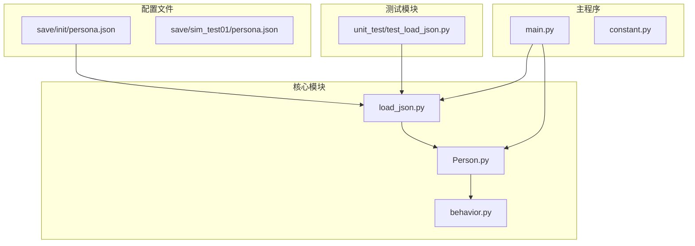
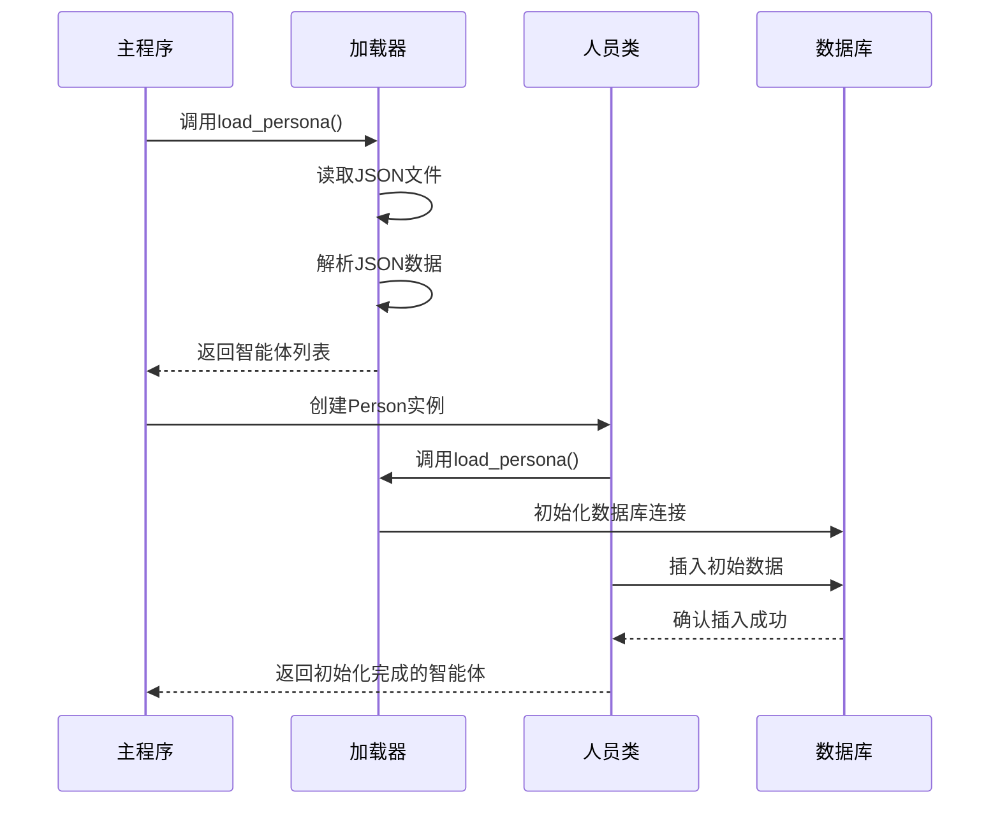
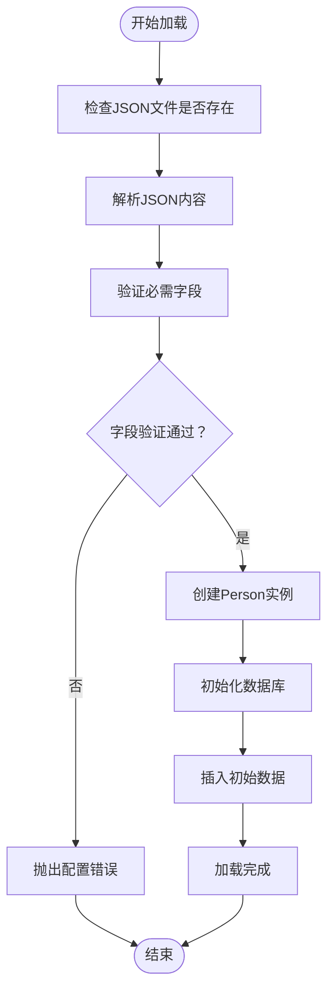
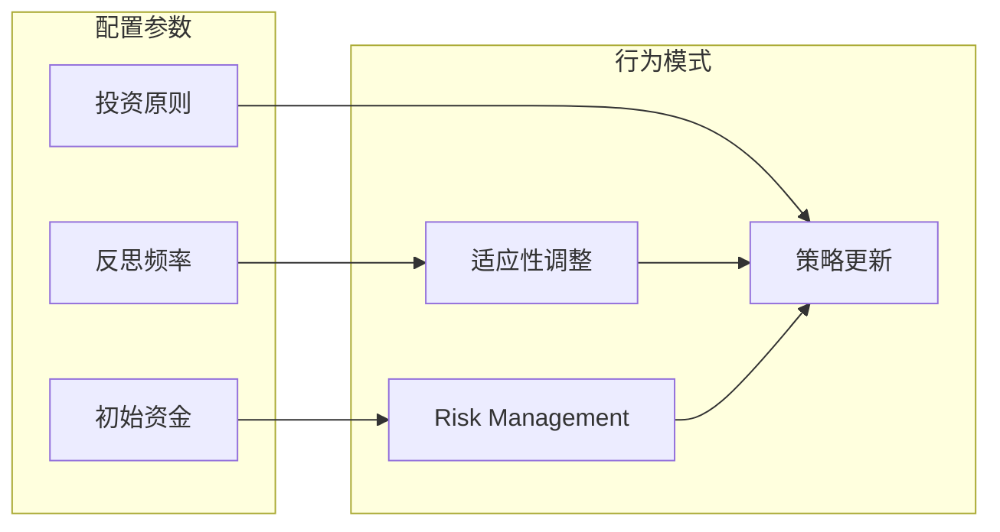
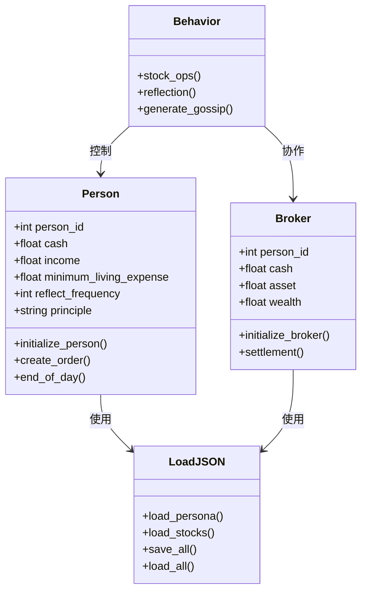

# 智能体初始配置

<cite>
**本文档引用的文件**
- [persona.json](file://Agent-Trading-Arena/Stock_Main/save/init/persona.json)
- [load_json.py](file://Agent-Trading-Arena/Stock_Main/load_json.py)
- [test_load_json.py](file://Agent-Trading-Arena/Stock_Main/unit_test/test_load_json.py)
- [Person.py](file://Agent-Trading-Arena/Stock_Main/Person.py)
- [behavior.py](file://Agent-Trading-Arena/Stock_Main/behavior.py)
- [main.py](file://Agent-Trading-Arena/Stock_Main/main.py)
- [constant.py](file://Agent-Trading-Arena/Stock_Main/constant.py)
</cite>

## 目录
1. [简介](#简介)
2. [项目结构](#项目结构)
3. [核心组件](#核心组件)
4. [架构概览](#架构概览)
5. [详细组件分析](#详细组件分析)
6. [依赖关系分析](#依赖关系分析)
7. [性能考虑](#性能考虑)
8. [故障排除指南](#故障排除指南)
9. [结论](#结论)

## 简介

本文件详细说明了如何通过编辑`persona.json`文件来定义交易智能体的初始属性。该系统是一个基于代理的股票交易模拟环境，智能体通过分析市场信息、八卦消息和自身策略来做出买卖决策。本文档将解释每个JSON字段的含义与约束条件，提供典型配置示例，并分析不同配置对交易行为的影响模式。

## 项目结构

智能体配置主要涉及以下关键文件和目录结构：



**图表来源**
- [persona.json](file://Agent-Trading-Arena/Stock_Main/save/init/persona.json#L1-L131)
- [load_json.py](file://Agent-Trading-Arena/Stock_Main/load_json.py#L1-L134)
- [Person.py](file://Agent-Trading-Arena/Stock_Main/Person.py#L173-L183)

**章节来源**
- [main.py](file://Agent-Trading-Arena/Stock_Main/main.py#L46-L63)
- [constant.py](file://Agent-Trading-Arena/Stock_Main/constant.py#L1-L2)

## 核心组件

### 智能体配置文件结构

智能体配置采用JSON数组格式，每个元素代表一个智能体的完整配置。配置文件支持多种字段，用于定义智能体的行为特征和初始状态。

### 字段定义与约束

#### 必需字段

| 字段名 | 类型 | 描述 | 约束条件 |
|--------|------|------|----------|
| `person_id` | 整数 | 智能体唯一标识符 | 唯一且非负整数 |
| `name` | 字符串 | 智能体名称 | 非空字符串 |
| `cash` | 数字 | 初始现金余额 | 大于等于0的数值 |
| `daily_income_from_job` | 数字 | 日常工作收入 | 大于等于0的数值 |
| `minimum_living_expense` | 数字 | 最低生活费用 | 大于等于0的数值 |
| `reflect_frequency` | 整数 | 反思频率 | 非负整数（0表示不反思） |

#### 可选字段

| 字段名 | 类型 | 描述 | 约束条件 |
|--------|------|------|----------|
| `principle` | 字符串 | 投资原则 | 描述性文本 |
| `occupation` | 字符串 | 职业 | 描述性文本 |
| `investment_duration` | 字符串 | 投资期限 | 描述性文本 |
| `reflect_frequency` | 整数 | 反思频率 | 非负整数 |

**章节来源**
- [persona.json](file://Agent-Trading-Arena/Stock_Main/save/init/persona.json#L1-L131)
- [Person.py](file://Agent-Trading-Arena/Stock_Main/Person.py#L173-L183)

## 架构概览

智能体配置系统采用分层架构设计，确保配置数据的正确加载和验证：



**图表来源**
- [main.py](file://Agent-Trading-Arena/Stock_Main/main.py#L91-L96)
- [load_json.py](file://Agent-Trading-Arena/Stock_Main/load_json.py#L9-L14)
- [Person.py](file://Agent-Trading-Arena/Stock_Main/Person.py#L173-L199)

## 详细组件分析

### 配置加载机制

智能体配置通过专门的加载器进行处理，确保数据格式的正确性和完整性。

#### 加载流程



**图表来源**
- [load_json.py](file://Agent-Trading-Arena/Stock_Main/load_json.py#L9-L14)
- [Person.py](file://Agent-Trading-Arena/Stock_Main/Person.py#L173-L199)

#### 典型配置示例

##### 高风险投机型智能体

```json
{
    "person_id": 100,
    "name": "Speculator",
    "cash": 100000,
    "daily_income_from_job": 5000,
    "minimum_living_expense": 2000,
    "principle": "追求高风险高回报",
    "reflect_frequency": 1
}
```

**影响模式分析**：
- 高风险偏好：更倾向于激进的投资策略
- 高反思频率：频繁调整投资策略
- 充裕的资金：可以承受更大的波动

##### 保守价值型智能体

```json
{
    "person_id": 101,
    "name": "Value Investor",
    "cash": 50000,
    "daily_income_from_job": 3000,
    "minimum_living_expense": 1500,
    "principle": "长期价值投资",
    "reflect_frequency": 3
}
```

**影响模式分析**：
- 价值投资理念：关注基本面分析
- 中等反思频率：定期但不过度调整
- 稳定资金状况：注重风险控制

##### 信息中介型智能体

```json
{
    "person_id": 102,
    "name": "Information Broker",
    "cash": 75000,
    "daily_income_from_job": 4000,
    "minimum_living_expense": 1800,
    "principle": "基于信息优势的交易",
    "reflect_frequency": 2
}
```

**影响模式分析**：
- 信息驱动：重视市场信息和八卦传播
- 中等风险：平衡信息价值与风险
- 适中反思：根据信息变化调整策略

**章节来源**
- [persona.json](file://Agent-Trading-Arena/Stock_Main/save/init/persona.json#L1-L131)
- [behavior.py](file://Agent-Trading-Arena/Stock_Main/behavior.py#L201-L210)

### 行为模式与配置关系

智能体的交易行为与其配置参数密切相关：

#### 反思频率对行为的影响



**图表来源**
- [behavior.py](file://Agent-Trading-Arena/Stock_Main/behavior.py#L174-L199)
- [Person.py](file://Agent-Trading-Arena/Stock_Main/Person.py#L169-L170)

#### 不同配置类型的行为特征

| 配置类型 | 反思频率 | 风险偏好 | 投资风格 | 典型行为 |
|----------|----------|----------|----------|----------|
| 高风险投机型 | 1-2 | 高 | Growth | 频繁交易，追求短期收益 |
| 保守价值型 | 3-6 | 低 | Value | 稳健持有，长期投资 |
| 信息中介型 | 1-3 | 中等 | Mixed | 基于信息调整，平衡风险 |
| 平衡型 | 2-4 | 中等 | Balanced | 稳定增长，适度风险 |

**章节来源**
- [behavior.py](file://Agent-Trading-Arena/Stock_Main/behavior.py#L174-L199)
- [Person.py](file://Agent-Trading-Arena/Stock_Main/Person.py#L169-L170)

## 依赖关系分析

智能体配置系统涉及多个组件之间的复杂依赖关系：



**图表来源**
- [Person.py](file://Agent-Trading-Arena/Stock_Main/Person.py#L143-L200)
- [load_json.py](file://Agent-Trading-Arena/Stock_Main/load_json.py#L9-L22)
- [behavior.py](file://Agent-Trading-Arena/Stock_Main/behavior.py#L82-L171)

**章节来源**
- [main.py](file://Agent-Trading-Arena/Stock_Main/main.py#L9-L14)
- [Person.py](file://Agent-Trading-Arena/Stock_Main/Person.py#L143-L200)

## 性能考虑

### 配置优化建议

1. **字段选择优化**：只包含必要的配置字段，减少内存占用
2. **数据类型优化**：确保数值字段使用适当的精度
3. **批量加载**：利用现有的批量加载机制提高效率
4. **缓存策略**：合理设置反思频率，避免过度计算

### 内存管理

智能体配置数据在内存中的存储和访问需要考虑以下因素：
- JSON解析的内存开销
- 数据库连接的资源管理
- 批量操作的事务处理

## 故障排除指南

### 常见配置错误及修复方法

#### 错误1：字段类型不匹配

**问题描述**：数值字段使用字符串类型
**修复方法**：确保所有数值字段使用数字类型

**错误示例**：
```json
{
    "cash": "40000",  // 错误：字符串类型
    "daily_income_from_job": "500"  // 错误：字符串类型
}
```

**正确示例**：
```json
{
    "cash": 40000,  // 正确：数字类型
    "daily_income_from_job": 500  // 正确：数字类型
}
```

#### 错误2：必需字段缺失

**问题描述**：缺少`person_id`或`name`等必需字段
**修复方法**：添加所有必需字段

**错误示例**：
```json
{
    "name": "Test Agent"
    // 缺少 person_id
}
```

**正确示例**：
```json
{
    "person_id": 100,
    "name": "Test Agent",
    "cash": 50000,
    "daily_income_from_job": 3000,
    "minimum_living_expense": 1500
}
```

#### 错误3：反思频率设置不当

**问题描述**：反思频率设置为0导致无法学习
**修复方法**：设置合理的反思频率值

**错误示例**：
```json
{
    "reflect_frequency": 0  // 错误：不会反思
}
```

**正确示例**：
```json
{
    "reflect_frequency": 3  // 正确：每3个迭代反思一次
}
```

**章节来源**
- [test_load_json.py](file://Agent-Trading-Arena/Stock_Main/unit_test/test_load_json.py#L57-L91)
- [load_json.py](file://Agent-Trading-Arena/Stock_Main/load_json.py#L9-L14)

### 测试验证方法

#### 使用单元测试验证配置

```python
# 运行测试命令
python -m unit_test.test_load_json

# 或者直接运行测试文件
python unit_test/test_load_json.py
```

#### 自定义验证脚本

```python
import json
from load_json import load_persona

def validate_persona_config(file_path):
    """验证智能体配置文件的正确性"""
    try:
        with open(file_path, 'r') as file:
            data = json.load(file)
        
        # 验证必需字段
        required_fields = ['person_id', 'name', 'cash', 'daily_income_from_job', 'minimum_living_expense']
        
        for i, person in enumerate(data):
            for field in required_fields:
                if field not in person:
                    raise ValueError(f"智能体 {i} 缺少必需字段: {field}")
            
            # 验证数据类型
            if not isinstance(person['person_id'], int):
                raise TypeError(f"智能体 {i} 的 person_id 必须是整数")
            
            if not isinstance(person['cash'], (int, float)):
                raise TypeError(f"智能体 {i} 的 cash 必须是数字")
        
        return True
    except Exception as e:
        print(f"配置验证失败: {e}")
        return False
```

**章节来源**
- [test_load_json.py](file://Agent-Trading-Arena/Stock_Main/unit_test/test_load_json.py#L15-L91)

## 结论

智能体初始配置是交易模拟系统的核心要素，直接影响智能体的行为模式和交易表现。通过合理配置各项参数，可以实现不同类型的交易策略和行为模式。

### 关键要点总结

1. **配置完整性**：确保所有必需字段都已正确定义
2. **数据类型正确性**：数值字段必须使用正确的数据类型
3. **逻辑一致性**：各配置参数之间应保持逻辑一致性
4. **可测试性**：配置应便于验证和测试
5. **可维护性**：配置结构应清晰易懂，便于维护

### 最佳实践建议

1. **渐进式配置**：从简单的配置开始，逐步增加复杂性
2. **版本控制**：对配置文件进行版本管理
3. **文档记录**：为每种配置类型编写详细的说明文档
4. **自动化测试**：建立自动化的配置验证机制
5. **性能监控**：监控不同配置下的系统性能表现

通过遵循这些指导原则，可以构建出高效、稳定且可扩展的智能体配置系统，为交易模拟提供可靠的基础支撑。