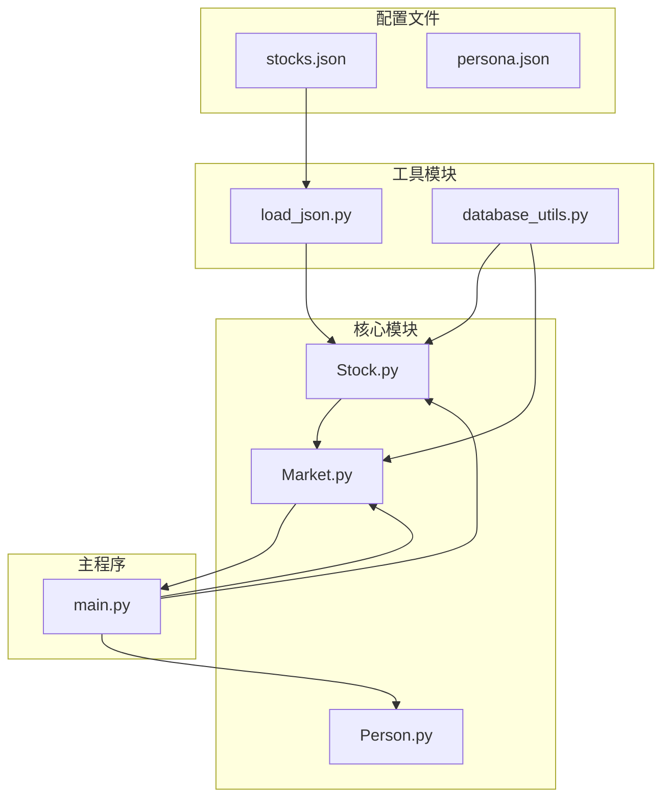
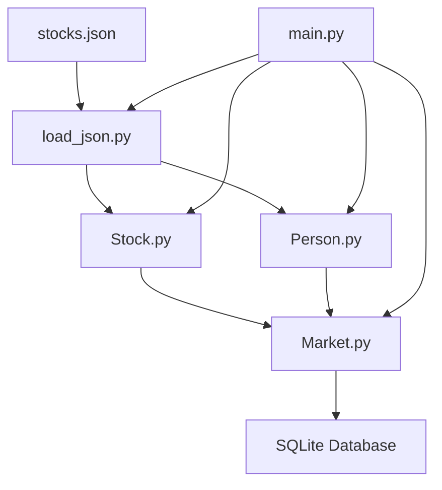
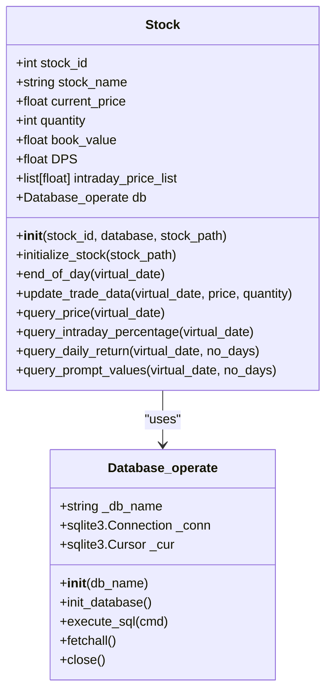
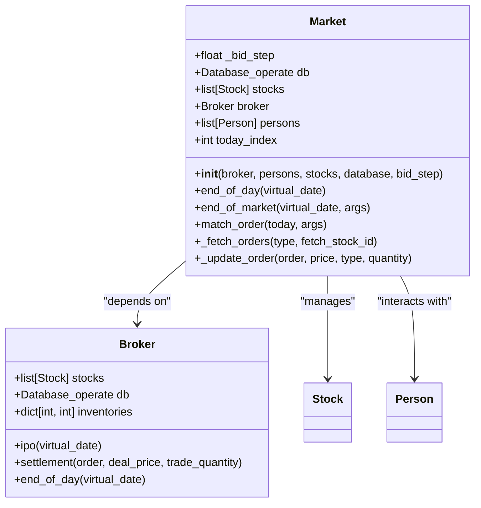
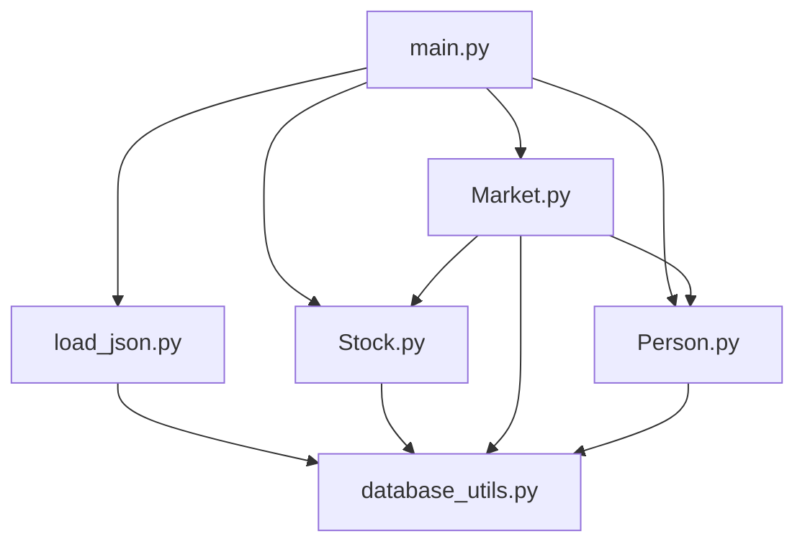

# 资产初始配置

<cite>
**本文档中引用的文件**   
- [stocks.json](file://Stock_Main/save/init/stocks.json)
- [load_json.py](file://Stock_Main/load_json.py)
- [Stock.py](file://Stock_Main/Stock.py)
- [Market.py](file://Stock_Main/Market.py)
- [database_utils.py](file://Stock_Main/database_utils.py)
- [main.py](file://Stock_Main/main.py)
</cite>

## 目录
1. [简介](#简介)
2. [项目结构](#项目结构)
3. [核心组件](#核心组件)
4. [架构概述](#架构概述)
5. [详细组件分析](#详细组件分析)
6. [依赖分析](#依赖分析)
7. [性能考虑](#性能考虑)
8. [故障排除指南](#故障排除指南)
9. [结论](#结论)

## 简介
本文档详细说明如何通过编辑 `stocks.json` 文件配置模拟市场中的股票资产信息。文档解释了每个 JSON 字段的技术定义与业务含义，包括 `stock_id`、`name`、`initial_price`（初始价格）、`volatility`（波动率系数）、`industry`（所属行业）、`market_cap`（市值规模等级）等关键参数。阐述这些参数如何影响股价动态演化和市场整体行为，例如高波动性股票更易引发投机行为，行业集中度影响板块轮动效应。提供科技、金融、消费等不同行业的配置示例，并说明如何通过调整参数组合构建多样化的市场环境。指导用户在修改后使用 `load_json.py` 进行数据加载验证，确保字段类型和结构符合预期，防止模拟启动失败。

## 项目结构
本项目采用模块化设计，主要包含股票市场模拟的核心组件、数据加载工具、数据库操作工具和主程序入口。资产配置的核心文件 `stocks.json` 存放在 `save/init/` 目录下，作为所有模拟运行的初始模板。

**图表来源**
- [stocks.json](file://Stock_Main/save/init/stocks.json)
- [load_json.py](file://Stock_Main/load_json.py)
- [Stock.py](file://Stock_Main/Stock.py)
- [Market.py](file://Stock_Main/Market.py)
- [main.py](file://Stock_Main/main.py)

**章节来源**
- [stocks.json](file://Stock_Main/save/init/stocks.json)
- [main.py](file://Stock_Main/main.py)

## 核心组件
核心组件包括 `Stock` 类、`Market` 类和 `load_json.py` 模块。`Stock` 类负责管理单个股票的状态和行为，`Market` 类负责处理市场交易和价格匹配，`load_json.py` 模块负责从 JSON 文件加载初始配置数据。

**章节来源**
- [Stock.py](file://Stock_Main/Stock.py#L14-L307)
- [Market.py](file://Stock_Main/Market.py#L12-L278)
- [load_json.py](file://Stock_Main/load_json.py#L1-L134)

## 架构概述
系统架构采用分层设计，从数据层到业务逻辑层再到应用层。数据层由 `stocks.json` 文件和 SQLite 数据库组成，业务逻辑层由 `Stock`、`Market` 和 `Person` 类实现，应用层由 `main.py` 主程序协调。

**图表来源**
- [load_json.py](file://Stock_Main/load_json.py#L1-L134)
- [Stock.py](file://Stock_Main/Stock.py#L14-L307)
- [Market.py](file://Stock_Main/Market.py#L12-L278)
- [main.py](file://Stock_Main/main.py#L1-L151)

## 详细组件分析
### 股票配置分析
`stocks.json` 文件定义了模拟市场中所有股票的初始状态。每个股票对象包含多个关键属性，这些属性共同决定了股票在模拟市场中的行为特征。

#### 股票类结构

**图表来源**
- [Stock.py](file://Stock_Main/Stock.py#L14-L307)
- [database_utils.py](file://Stock_Main/database_utils.py#L245-L322)

#### 股票配置字段说明
以下表格详细说明了 `stocks.json` 文件中每个字段的技术定义与业务含义。

| 字段名 | 技术类型 | 必填 | 业务含义 | 示例值 | 影响 |
|-------|--------|-----|--------|-------|------|
| **stock_id** | 整数 | 是 | 股票的唯一标识符，用于在系统内部引用特定股票 | 0 | 用于数据库查询和交易匹配 |
| **stock_name** | 字符串 | 是 | 股票的名称或代码，用于用户识别 | "A" | 在日志和报告中显示 |
| **DPS** | 浮点数 | 是 | 每股分红（Dividend Per Share），代表公司向股东分配的利润 | 22 | 影响投资者的长期持有意愿 |
| **past_stock_last_prices** | 浮点数数组 | 是 | 过去若干个交易日的收盘价序列，用于初始化股价趋势 | [454.17, 446.64, ...] | 决定股票的初始价格和历史波动特征 |
| **quantity** | 整数 | 是 | 股票的总发行量或流通量 | 300 | 影响股票的流动性和价格波动幅度 |

**章节来源**
- [stocks.json](file://Stock_Main/save/init/stocks.json)
- [Stock.py](file://Stock_Main/Stock.py#L26-L37)
- [load_json.py](file://Stock_Main/load_json.py#L17-L22)

### 市场交易分析
市场交易组件负责处理买卖订单的匹配和价格更新。`Market` 类实现了订单匹配算法，确保市场交易的公平性和效率。

#### 市场类结构

**图表来源**
- [Market.py](file://Stock_Main/Market.py#L12-L278)
- [Stock.py](file://Stock_Main/Stock.py#L14-L307)
- [Person.py](file://Stock_Main/Person.py)

## 依赖分析
系统各组件之间存在明确的依赖关系。`main.py` 作为主程序入口，依赖于所有核心模块。`Stock` 类依赖于 `database_utils.py` 进行数据库操作，`Market` 类依赖于 `Stock` 和 `Person` 类进行交易处理。

**图表来源**
- [main.py](file://Stock_Main/main.py#L1-L151)
- [load_json.py](file://Stock_Main/load_json.py#L1-L134)
- [Stock.py](file://Stock_Main/Stock.py#L14-L307)
- [Market.py](file://Stock_Main/Market.py#L12-L278)
- [Person.py](file://Stock_Main/Person.py)
- [database_utils.py](file://Stock_Main/database_utils.py#L1-L322)

**章节来源**
- [main.py](file://Stock_Main/main.py#L1-L151)
- [load_json.py](file://Stock_Main/load_json.py#L1-L134)
- [database_utils.py](file://Stock_Main/database_utils.py#L1-L322)

## 性能考虑
在配置股票资产时，需要注意以下性能考虑：
- **初始价格序列长度**：`past_stock_last_prices` 数组的长度会影响系统初始化时间，建议保持在合理范围内（如10个数据点）。
- **股票数量**：过多的股票会增加市场匹配算法的计算复杂度，影响模拟速度。
- **数据库操作**：频繁的数据库读写操作可能成为性能瓶颈，系统通过批量操作和缓存机制进行优化。

## 故障排除指南
在配置和运行模拟市场时，可能会遇到以下常见问题：

1. **JSON 解析错误**：确保 `stocks.json` 文件格式正确，所有字段类型符合要求。
2. **数据库连接失败**：检查数据库文件路径和权限设置。
3. **模拟启动失败**：验证 `stocks.json` 文件中的股票 ID 是否连续且无重复。

**章节来源**
- [load_json.py](file://Stock_Main/load_json.py#L17-L22)
- [test_load_json.py](file://Stock_Main/unit_test/test_load_json.py#L1-L95)
- [main.py](file://Stock_Main/main.py#L66-L96)

## 结论
通过本文档，用户可以全面了解如何配置模拟市场中的股票资产。正确配置 `stocks.json` 文件是成功运行市场模拟的关键步骤。建议用户在修改配置后，使用 `test_load_json.py` 进行单元测试，确保数据加载正常。通过调整不同参数组合，可以构建多样化的市场环境，用于测试和验证不同的投资策略。