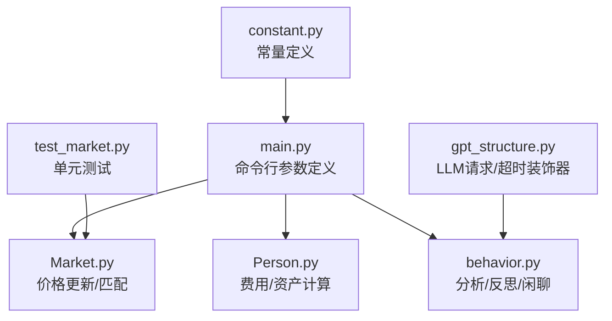
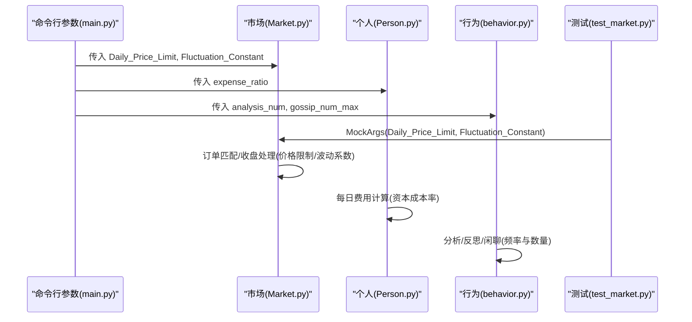
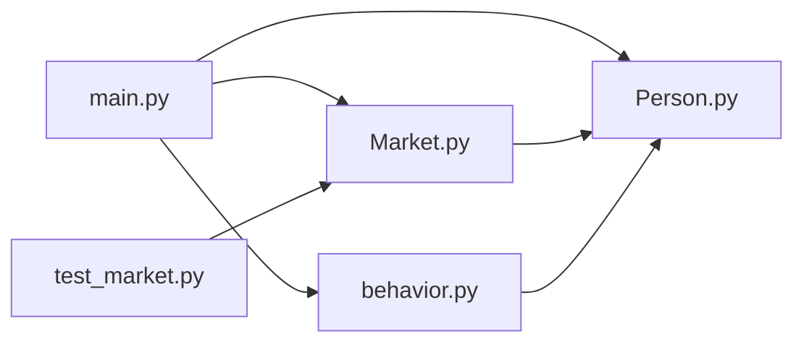

# 系统常量配置

<cite>
**本文档引用的文件**
- [constant.py](file://Agent-Trading-Arena/Stock_Main/constant.py)
- [main.py](file://Agent-Trading-Arena/Stock_Main/main.py)
- [Market.py](file://Agent-Trading-Arena/Stock_Main/Market.py)
- [Person.py](file://Agent-Trading-Arena/Stock_Main/Person.py)
- [behavior.py](file://Agent-Trading-Arena/Stock_Main/behavior.py)
- [test_market.py](file://Agent-Trading-Arena/Stock_Main/unit_test/test_market.py)
- [gpt_structure.py](file://Agent-Trading-Arena/Stock_Main/content/gpt_structure.py)
</cite>

## 目录
1. [简介](#简介)
2. [项目结构](#项目结构)
3. [核心组件](#核心组件)
4. [架构总览](#架构总览)
5. [详细组件分析](#详细组件分析)
6. [依赖关系分析](#依赖关系分析)
7. [性能考量](#性能考量)
8. [故障排查指南](#故障排查指南)
9. [结论](#结论)
10. [附录](#附录)

## 简介
本文件系统性梳理 Agent Trading Arena 中与“系统常量配置”相关的参数，重点覆盖以下方面：
- 交易相关：每日价格限制、波动系数、买卖价差（隐含在买卖报价处理中）
- 市场与资金：资本成本率、每日交易时段（由迭代次数与日循环控制）
- 信息传播与反思：分析数量、闲聊最大条目数、反思触发频率
- LLM 调用：请求超时策略（注：当前代码中存在注释化的超时装饰器，实际使用需结合运行环境）
- 参数对模拟行为的影响机制与修改建议
- 验证方法与回归测试建议

## 项目结构
与常量配置直接相关的文件分布如下：
- 命令行参数定义与默认值：main.py
- 市场价格更新与匹配逻辑：Market.py
- 个人与经纪人财务结算：Person.py
- 行为与反思流程：behavior.py
- 单元测试（包含部分参数示例）：unit_test/test_market.py
- LLM 请求与超时装饰器：content/gpt_structure.py
- 常量模块：constant.py（当前仅包含股票名称列表）

图表来源
- [main.py](file://Agent-Trading-Arena/Stock_Main/main.py#L17-L63)
- [Market.py](file://Agent-Trading-Arena/Stock_Main/Market.py#L30-L128)
- [Person.py](file://Agent-Trading-Arena/Stock_Main/Person.py#L409-L427)
- [behavior.py](file://Agent-Trading-Arena/Stock_Main/behavior.py#L82-L198)
- [test_market.py](file://Agent-Trading-Arena/Stock_Main/unit_test/test_market.py#L18-L23)
- [gpt_structure.py](file://Agent-Trading-Arena/Stock_Main/content/gpt_structure.py#L71-L118)
- [constant.py](file://Agent-Trading-Arena/Stock_Main/constant.py#L1-L2)

章节来源
- [main.py](file://Agent-Trading-Arena/Stock_Main/main.py#L17-L63)
- [Market.py](file://Agent-Trading-Arena/Stock_Main/Market.py#L30-L128)
- [Person.py](file://Agent-Trading-Arena/Stock_Main/Person.py#L409-L427)
- [behavior.py](file://Agent-Trading-Arena/Stock_Main/behavior.py#L82-L198)
- [test_market.py](file://Agent-Trading-Arena/Stock_Main/unit_test/test_market.py#L18-L23)
- [gpt_structure.py](file://Agent-Trading-Arena/Stock_Main/content/gpt_structure.py#L71-L118)
- [constant.py](file://Agent-Trading-Arena/Stock_Main/constant.py#L1-L2)

## 核心组件
本节汇总系统中与“可配置参数”直接相关的变量及其默认值、取值范围与作用域。

- 基础运行参数
  - Iterations_Daily：每日迭代次数，默认 3；作用域：主循环迭代次数，决定每日交易轮次与反思/闲聊频率
  - No_Days：交易天数，默认 3；作用域：模拟总天数
  - Num_Person：交易者人数，默认 9；作用域：Agent 数量
  - Num_Stock：股票数量，默认 3；作用域：市场内股票种类
  - SAVE_NAME：保存目录名，默认自动生成；作用域：输出路径
  - STOCK_NAMES：股票名称列表，默认 ["0", "1", "2", "3", "4"]；作用域：显示与提示

- 交易与市场参数
  - Daily_Price_Limit：每日价格变动上限比例，默认 0.7；作用域：订单匹配与收盘时的价格跳动限制
  - expense_ratio：资本成本率，默认 0.03；作用域：每日生活支出计算中的资产折旧成本
  - Fluctuation_Constant：价格波动常数，默认 20.0；作用域：成交价与成交量对股价的加权影响

- 行为与信息传播参数
  - analysis_num：执行分析的 Agent 数量，默认 3；作用域：每日分析阶段参与人数
  - gossip_num_max：每轮闲聊最大条目数，默认 3；作用域：信息传播广度

- LLM 超时参数（注释化）
  - llm_chat_request：注释掉的超时装饰器（@timeout(150)），send_llm_request：注释掉的超时装饰器（@timeout(50)）
  - 说明：当前代码未启用超时装饰器，实际超时行为取决于运行环境与网络配置

章节来源
- [main.py](file://Agent-Trading-Arena/Stock_Main/main.py#L20-L37)
- [Person.py](file://Agent-Trading-Arena/Stock_Main/Person.py#L409-L427)
- [Market.py](file://Agent-Trading-Arena/Stock_Main/Market.py#L44-L67)
- [gpt_structure.py](file://Agent-Trading-Arena/Stock_Main/content/gpt_structure.py#L71-L118)

## 架构总览
下图展示参数在系统中的传递与使用路径，以及它们对模拟行为的影响。

图表来源
- [main.py](file://Agent-Trading-Arena/Stock_Main/main.py#L17-L63)
- [Market.py](file://Agent-Trading-Arena/Stock_Main/Market.py#L44-L67)
- [Person.py](file://Agent-Trading-Arena/Stock_Main/Person.py#L409-L427)
- [behavior.py](file://Agent-Trading-Arena/Stock_Main/behavior.py#L82-L198)
- [test_market.py](file://Agent-Trading-Arena/Stock_Main/unit_test/test_market.py#L18-L23)

## 详细组件分析

### 交易相关参数
- Daily_Price_Limit（每日价格变动上限比例）
  - 默认值：0.7
  - 取值范围：建议大于 0 的浮点数，典型范围 0.1~2.0
  - 作用机制：在订单匹配与收盘处理中，若成交价与当前价的相对变化超过该阈值，则跳过该轮匹配或忽略该订单
  - 对模拟行为的影响：数值越小，市场越“稳”，订单更难成交；数值越大，市场越“活跃”，订单易成交但可能产生更大波动
  - 修改示例：降低到 0.3 以模拟“严格涨跌停”场景；提高到 1.0 以模拟“宽松市场”

- Fluctuation_Constant（价格波动常数）
  - 默认值：20.0
  - 取值范围：建议大于 0 的浮点数，典型范围 1~100
  - 作用机制：在订单匹配与收盘处理中，成交价与现有库存按成交量加权平均，该常数决定新成交对股价的影响力
  - 对模拟行为的影响：数值越大，新交易对股价影响越显著；数值越小，股价越平滑，趋势不明显
  - 修改示例：提高到 50.0 以增强市场敏感度；降低到 5.0 以抑制短期波动

- 买卖价差（隐含在报价处理中）
  - 买入报价乘以 1.05，卖出报价乘以 0.95，体现交易成本与流动性差异
  - 影响：抑制频繁交易，增加交易成本，降低短期套利机会

章节来源
- [Market.py](file://Agent-Trading-Arena/Stock_Main/Market.py#L44-L67)
- [Market.py](file://Agent-Trading-Arena/Stock_Main/Market.py#L113-L127)
- [Person.py](file://Agent-Trading-Arena/Stock_Main/Person.py#L219-L248)

### 市场与资金参数
- expense_ratio（资本成本率）
  - 默认值：0.03
  - 取值范围：建议 0~1 的浮点数，典型范围 0~0.1
  - 作用机制：每日从总资产中按该比率计算“日常开销”，并从现金中扣除
  - 对模拟行为的影响：数值越高，Agent 资产折旧越快，生存压力越大；数值越低，资金压力较小
  - 修改示例：提高到 0.05 以模拟“高通胀/高成本”环境；降低到 0.01 以模拟“低运营成本”环境

章节来源
- [Person.py](file://Agent-Trading-Arena/Stock_Main/Person.py#L409-L427)

### 信息传播与反思参数
- analysis_num（分析 Agent 数量）
  - 默认值：3
  - 取值范围：1~Num_Person
  - 作用机制：每日分析阶段参与分析的 Agent 数量，影响信息处理与策略生成规模
  - 对模拟行为的影响：数量越多，信息处理越充分，但计算开销越大；数量越少，模拟越“轻量化”
  - 修改示例：提高到 5 以增强市场洞察；降低到 1 以简化流程

- gossip_num_max（闲聊最大条目数）
  - 默认值：3
  - 取值范围：1~若干（受 Agent 数量与上下文限制）
  - 作用机制：每轮闲聊最多生成的条目数，控制信息传播广度
  - 对模拟行为的影响：条目越多，信息传播越广，Agent 间相互影响越大
  - 修改示例：提高到 5 以增强信息扩散；降低到 1 以减少噪声

- reflect_frequency（反思触发频率）
  - 来源：Persona 数据中的 reflect_frequency 字段
  - 作用机制：每 (reflect_frequency) 次迭代触发一次反思，更新投资策略
  - 对模拟行为的影响：频率越高，策略调整越频繁；频率越低，策略越稳定
  - 修改示例：设置为 2 以“高频反思模式”；设置为 5 以“稳定策略模式”

章节来源
- [behavior.py](file://Agent-Trading-Arena/Stock_Main/behavior.py#L174-L198)
- [Person.py](file://Agent-Trading-Arena/Stock_Main/Person.py#L168-L182)

### LLM 调用超时参数
- 当前状态：存在注释化的超时装饰器（@timeout），但未启用
- 建议：根据运行环境与网络状况，选择启用相应装饰器或在外部配置超时策略
- 注意：LLM 调用超时与系统其他参数（如 Iterations_Daily、analysis_num）共同影响整体模拟时长

章节来源
- [gpt_structure.py](file://Agent-Trading-Arena/Stock_Main/content/gpt_structure.py#L71-L118)

### 常量模块现状
- constant.py 当前仅包含 STOCK_NAMES 列表，未定义交易相关常量
- 建议：将交易相关常量迁移至该模块，便于集中管理与版本控制

章节来源
- [constant.py](file://Agent-Trading-Arena/Stock_Main/constant.py#L1-L2)

## 依赖关系分析
- 参数在 main.py 中定义并传入各模块
- Market 使用 Daily_Price_Limit 与 Fluctuation_Constant 控制价格更新
- Person 使用 expense_ratio 计算每日费用
- behavior 使用 analysis_num、gossip_num_max、reflect_frequency 控制信息传播与反思
- 测试通过 MockArgs 提供参数示例，验证 Market 行为

图表来源
- [main.py](file://Agent-Trading-Arena/Stock_Main/main.py#L17-L63)
- [Market.py](file://Agent-Trading-Arena/Stock_Main/Market.py#L30-L128)
- [Person.py](file://Agent-Trading-Arena/Stock_Main/Person.py#L409-L427)
- [behavior.py](file://Agent-Trading-Arena/Stock_Main/behavior.py#L82-L198)
- [test_market.py](file://Agent-Trading-Arena/Stock_Main/unit_test/test_market.py#L18-L23)

## 性能考量
- 参数对性能的影响
  - Fluctuation_Constant：数值越大，价格更新计算越“重”，迭代次数多时需关注 CPU 占用
  - analysis_num/gossip_num_max：数值越大，LLM 调用次数越多，I/O 与网络成为瓶颈
  - Iterations_Daily：迭代越多，整体运行时间越长
- 建议
  - 在开发/调试阶段使用较小数值（如 analysis_num=1, gossip_num_max=1, Iterations_Daily=1）
  - 在稳定运行阶段逐步增大以观察系统行为变化

## 故障排查指南
- 常见问题与定位
  - 市场价格异常波动：检查 Daily_Price_Limit 与 Fluctuation_Constant 设置是否过高
  - Agent 资产快速下降：检查 expense_ratio 是否偏高
  - 反思不生效：确认 Persona 中 reflect_frequency 是否正确加载
  - LLM 超时：确认是否启用超时装饰器或外部超时配置
- 验证方法
  - 使用 unit_test/test_market.py 进行回归测试，验证订单匹配与收盘处理逻辑
  - 通过不同参数组合运行短周期模拟，观察价格走势与 Agent 收益曲线

章节来源
- [test_market.py](file://Agent-Trading-Arena/Stock_Main/unit_test/test_market.py#L75-L144)

## 结论
- 交易相关参数（Daily_Price_Limit、Fluctuation_Constant、买卖价差）是影响市场流动性和价格行为的关键因素
- 资金相关参数（expense_ratio）直接影响 Agent 生存压力与长期收益
- 信息传播与反思参数（analysis_num、gossip_num_max、reflect_frequency）决定 Agent 的学习与适应能力
- LLM 超时参数当前处于注释化状态，建议结合运行环境启用或外置配置
- 建议将交易相关常量迁移至 constant.py，统一管理与版本控制

## 附录

### 推荐配置组合
- 高频交易模式
  - Daily_Price_Limit：0.7
  - Fluctuation_Constant：50.0
  - analysis_num：5
  - gossip_num_max：5
  - reflect_frequency：2
  - 说明：增强市场敏感度与信息传播，适合研究高频策略

- 稳定市场模式
  - Daily_Price_Limit：0.3
  - Fluctuation_Constant：5.0
  - analysis_num：1
  - gossip_num_max：1
  - reflect_frequency：5
  - 说明：抑制波动与噪声，适合稳健策略与长期持有

- 低运营成本模式
  - expense_ratio：0.01
  - 其他参数保持默认
  - 说明：降低资金压力，延长模拟周期

### 修改示例与验证步骤
- 修改方式
  - 在命令行传参：python main.py --Daily_Price_Limit 0.5 --Fluctuation_Constant 30.0 --expense_ratio 0.02
  - 或在测试中通过 MockArgs 提供参数示例
- 验证方法
  - 运行 unit_test/test_market.py，观察订单匹配与收盘处理结果
  - 对比不同参数组合下的价格走势与 Agent 收益曲线，确保系统稳定性

章节来源
- [main.py](file://Agent-Trading-Arena/Stock_Main/main.py#L31-L37)
- [test_market.py](file://Agent-Trading-Arena/Stock_Main/unit_test/test_market.py#L18-L23)