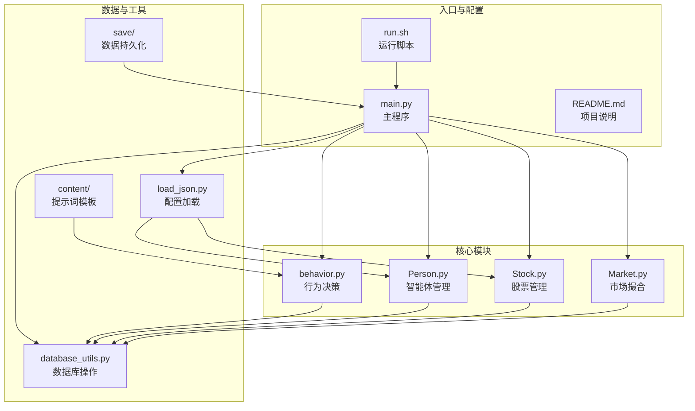
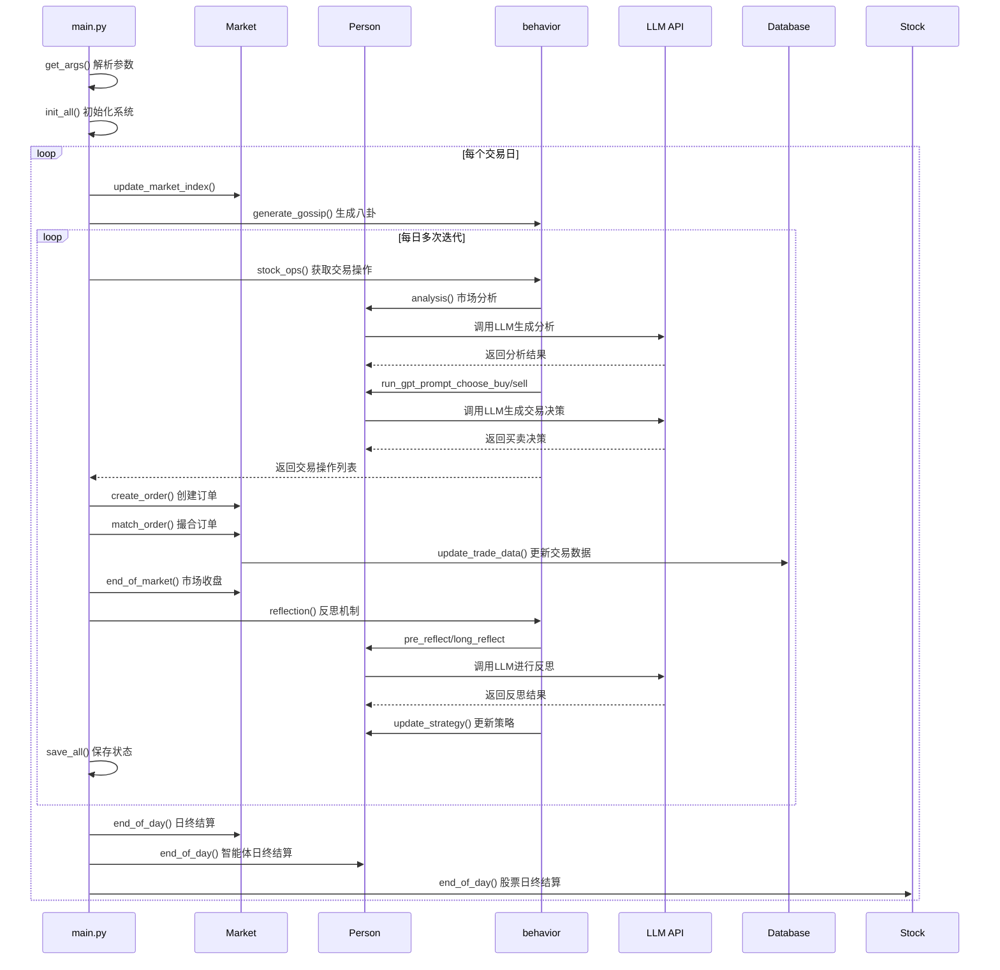
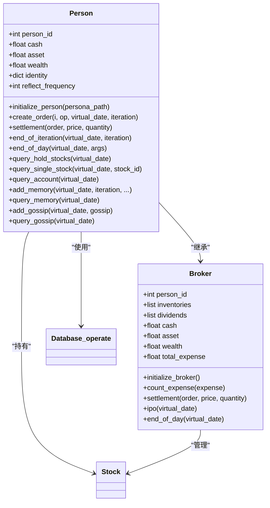
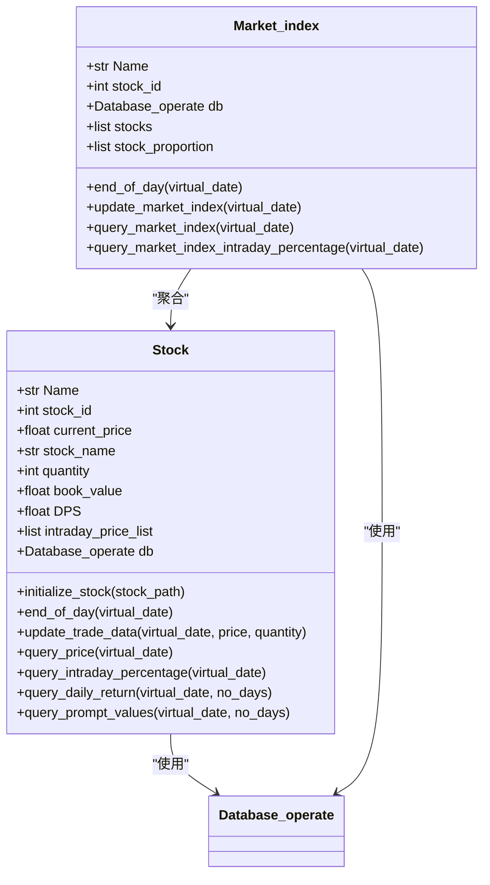
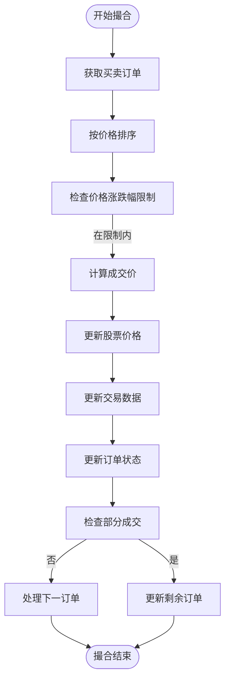
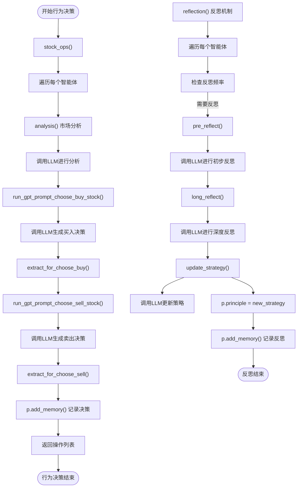
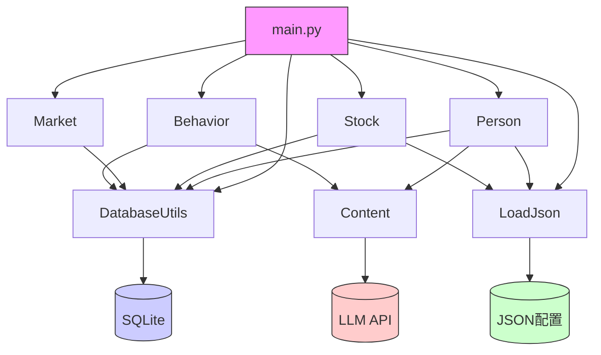
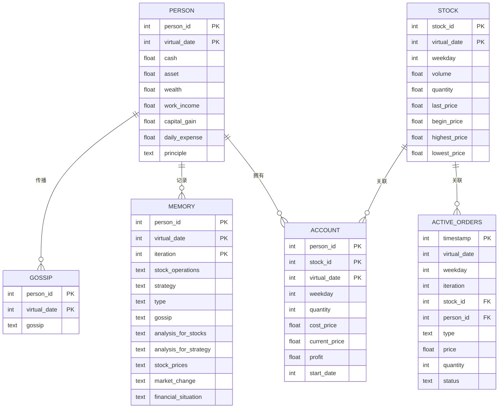
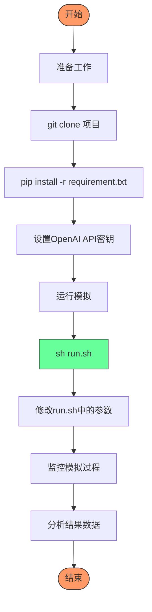

# 项目概述

<cite>
**本文档引用的文件**
- [README.md](file://README.md)
- [main.py](file://Agent-Trading-Arena/Stock_Main/main.py)
- [Person.py](file://Agent-Trading-Arena/Stock_Main/Person.py)
- [Stock.py](file://Agent-Trading-Arena/Stock_Main/Stock.py)
- [Market.py](file://Agent-Trading-Arena/Stock_Main/Market.py)
- [behavior.py](file://Agent-Trading-Arena/Stock_Main/behavior.py)
- [database_utils.py](file://Agent-Trading-Arena/Stock_Main/database_utils.py)
- [load_json.py](file://Agent-Trading-Arena/Stock_Main/load_json.py)
- [run.sh](file://Agent-Trading-Arena/run.sh)
</cite>

## 目录
1. [简介](#简介)
2. [项目结构](#项目结构)
3. [核心组件](#核心组件)
4. [系统架构与工作流程](#系统架构与工作流程)
5. [详细组件分析](#详细组件分析)
6. [依赖关系分析](#依赖关系分析)
7. [性能与持久化](#性能与持久化)
8. [使用与实验](#使用与实验)
9. [结论](#结论)

## 简介

Agent-Trading-Arena 是一个基于大语言模型（LLM）的多智能体股票交易模拟系统，旨在创建一个闭环、无先验知识的人类化交易环境，用于评估和推进具备自我博弈能力的金融智能体。该项目通过LLM驱动的智能体模拟真实市场行为，包括市场分析、交易决策、信息传播（八卦）和策略反思机制。

系统通过多个LLM智能体（Person）在模拟股票市场中进行交互，每个智能体具有独特的身份、财务状况和投资原则。智能体基于市场数据、个人记忆和从其他智能体获得的八卦信息，通过调用LLM生成交易决策。系统还实现了智能体的反思机制，使其能够根据交易结果调整投资策略，从而模拟真实投资者的学习过程。

该项目为金融行为研究、算法交易策略测试和LLM在复杂决策环境中的应用提供了强大的实验平台。

**Section sources**
- [README.md](file://README.md#L1-L52)

## 项目结构

Agent-Trading-Arena 项目采用模块化设计，主要组件包括智能体（Person）、股票（Stock）、市场（Market）和行为逻辑（behavior）。系统使用SQLite数据库进行数据持久化，并通过JSON文件初始化智能体和股票的配置。

**Diagram sources**
- [main.py](file://Agent-Trading-Arena/Stock_Main/main.py#L1-L151)
- [Person.py](file://Agent-Trading-Arena/Stock_Main/Person.py#L1-L629)
- [Stock.py](file://Agent-Trading-Arena/Stock_Main/Stock.py#L1-L307)
- [Market.py](file://Agent-Trading-Arena/Stock_Main/Market.py#L1-L278)
- [behavior.py](file://Agent-Trading-Arena/Stock_Main/behavior.py#L1-L210)

**Section sources**
- [main.py](file://Agent-Trading-Arena/Stock_Main/main.py#L1-L151)
- [Person.py](file://Agent-Trading-Arena/Stock_Main/Person.py#L1-L629)
- [Stock.py](file://Agent-Trading-Arena/Stock_Main/Stock.py#L1-L307)
- [Market.py](file://Agent-Trading-Arena/Stock_Main/Market.py#L1-L278)
- [behavior.py](file://Agent-Trading-Arena/Stock_Main/behavior.py#L1-L210)
- [database_utils.py](file://Agent-Trading-Arena/Stock_Main/database_utils.py#L1-L322)
- [load_json.py](file://Agent-Trading-Arena/Stock_Main/load_json.py#L1-L134)

## 核心组件

项目的核心组件包括智能体（Person）、股票（Stock）、市场（Market）和行为逻辑（behavior），它们协同工作以模拟真实的股票交易环境。

**Section sources**
- [Person.py](file://Agent-Trading-Arena/Stock_Main/Person.py#L1-L629)
- [Stock.py](file://Agent-Trading-Arena/Stock_Main/Stock.py#L1-L307)
- [Market.py](file://Agent-Trading-Arena/Stock_Main/Market.py#L1-L278)
- [behavior.py](file://Agent-Trading-Arena/Stock_Main/behavior.py#L1-L210)

## 系统架构与工作流程

该系统采用基于LLM的多智能体架构，通过模拟每日多次迭代的交易过程来重现市场动态。工作流程从初始化市场环境开始，经过智能体决策、订单撮合、交易结算到数据持久化。

**Diagram sources**
- [main.py](file://Agent-Trading-Arena/Stock_Main/main.py#L99-L147)
- [behavior.py](file://Agent-Trading-Arena/Stock_Main/behavior.py#L82-L171)
- [Market.py](file://Agent-Trading-Arena/Stock_Main/Market.py#L96-L199)

**Section sources**
- [main.py](file://Agent-Trading-Arena/Stock_Main/main.py#L1-L151)
- [behavior.py](file://Agent-Trading-Arena/Stock_Main/behavior.py#L82-L210)
- [Market.py](file://Agent-Trading-Arena/Stock_Main/Market.py#L1-L278)

## 详细组件分析

### 智能体（Person）分析

智能体是系统的核心决策单元，每个智能体都是一个LLM驱动的实体，具有独立的身份、财务状况和投资策略。智能体通过与环境交互，基于市场信息和个人记忆做出交易决策。

**Diagram sources**
- [Person.py](file://Agent-Trading-Arena/Stock_Main/Person.py#L18-L629)

**Section sources**
- [Person.py](file://Agent-Trading-Arena/Stock_Main/Person.py#L1-L629)

### 股票（Stock）分析

股票组件负责管理单个股票的状态和交易数据，包括价格、成交量、市值等关键指标。每个股票实例维护其价格历史和日内交易数据。

**Diagram sources**
- [Stock.py](file://Agent-Trading-Arena/Stock_Main/Stock.py#L14-L307)

**Section sources**
- [Stock.py](file://Agent-Trading-Arena/Stock_Main/Stock.py#L1-L307)

### 市场（Market）分析

市场组件负责订单撮合和价格形成，是整个交易系统的核心引擎。它实现了限价订单簿的撮合逻辑，并根据交易量和价格更新市场状态。

**Diagram sources**
- [Market.py](file://Agent-Trading-Arena/Stock_Main/Market.py#L96-L199)

**Section sources**
- [Market.py](file://Agent-Trading-Arena/Stock_Main/Market.py#L1-L278)

### 行为逻辑（behavior）分析

行为逻辑组件是连接智能体与LLM的桥梁，负责将市场信息转化为LLM可理解的提示词，并解析LLM的输出为具体的交易操作。

**Diagram sources**
- [behavior.py](file://Agent-Trading-Arena/Stock_Main/behavior.py#L82-L210)

**Section sources**
- [behavior.py](file://Agent-Trading-Arena/Stock_Main/behavior.py#L1-L210)

## 依赖关系分析

系统各组件之间存在紧密的依赖关系，形成了一个完整的交易模拟闭环。通过依赖分析可以清晰地看到数据流和控制流的走向。

**Diagram sources**
- [main.py](file://Agent-Trading-Arena/Stock_Main/main.py#L1-L151)
- [database_utils.py](file://Agent-Trading-Arena/Stock_Main/database_utils.py#L246-L322)
- [load_json.py](file://Agent-Trading-Arena/Stock_Main/load_json.py#L1-L134)

**Section sources**
- [main.py](file://Agent-Trading-Arena/Stock_Main/main.py#L1-L151)
- [database_utils.py](file://Agent-Trading-Arena/Stock_Main/database_utils.py#L1-L322)
- [load_json.py](file://Agent-Trading-Arena/Stock_Main/load_json.py#L1-L134)

## 性能与持久化

系统通过SQLite数据库实现数据持久化，确保模拟过程中的所有状态可以被保存和恢复。数据持久化机制覆盖了智能体状态、股票价格、交易记录和市场信息。

**Diagram sources**
- [database_utils.py](file://Agent-Trading-Arena/Stock_Main/database_utils.py#L254-L300)
- [main.py](file://Agent-Trading-Arena/Stock_Main/main.py#L78-L85)
- [load_json.py](file://Agent-Trading-Arena/Stock_Main/load_json.py#L45-L69)

**Section sources**
- [database_utils.py](file://Agent-Trading-Arena/Stock_Main/database_utils.py#L1-L322)
- [main.py](file://Agent-Trading-Arena/Stock_Main/main.py#L1-L151)
- [load_json.py](file://Agent-Trading-Arena/Stock_Main/load_json.py#L1-L134)

## 使用与实验

项目提供了清晰的使用指南，用户可以通过运行脚本快速启动模拟实验。系统支持多种参数配置，以适应不同的实验需求。

**Diagram sources**
- [run.sh](file://Agent-Trading-Arena/run.sh#L1-L24)
- [README.md](file://README.md#L18-L40)

**Section sources**
- [run.sh](file://Agent-Trading-Arena/run.sh#L1-L24)
- [README.md](file://README.md#L1-L52)

## 结论

Agent-Trading-Arena 项目成功构建了一个基于LLM的多智能体股票交易模拟系统，通过智能体的自主决策、信息传播和策略反思，有效模拟了真实市场的复杂动态。系统架构清晰，组件职责分明，为金融行为研究和算法交易策略测试提供了强大的实验平台。

该项目的创新之处在于将LLM作为智能体的决策核心，使其能够理解复杂的市场信息并生成合理的交易策略。同时，系统实现了完整的交易生命周期管理，包括订单撮合、价格形成、日终结算和数据持久化。

未来的研究方向可以包括引入更多市场参与者类型、增加市场事件模拟、优化LLM提示词设计以提高决策质量，以及扩展系统以支持更复杂的金融产品。