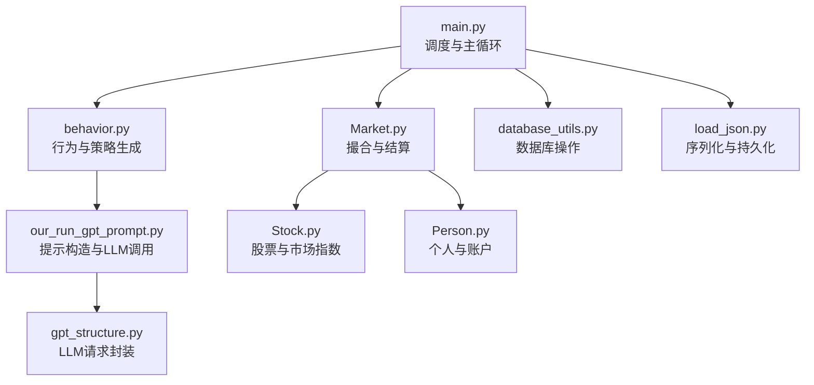
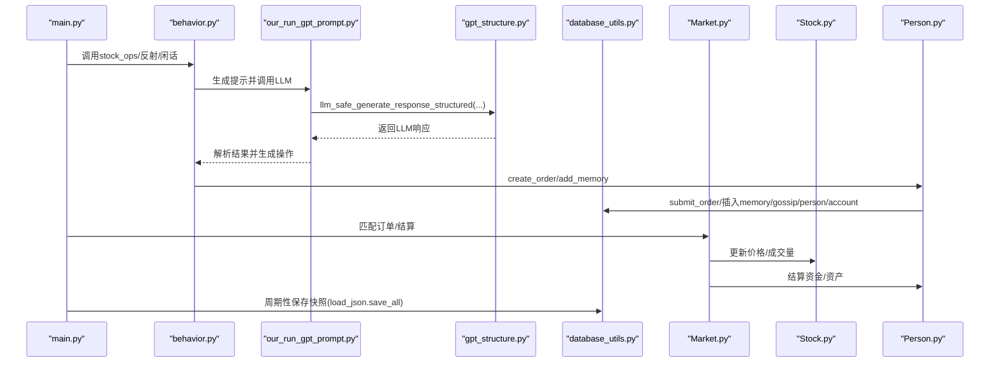
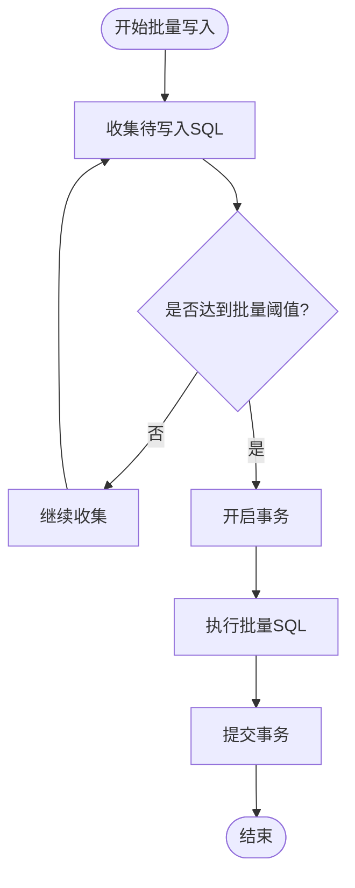
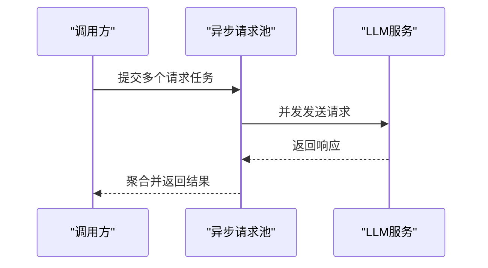
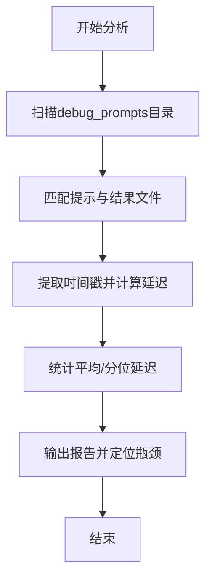
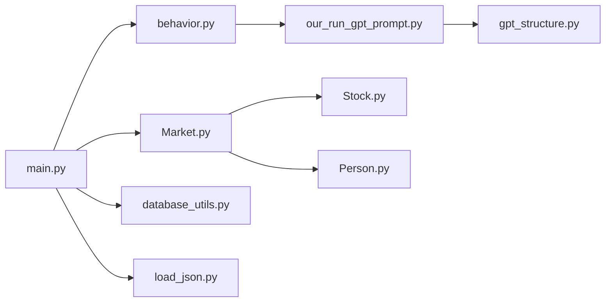

# 性能优化

<cite>
**本文引用的文件**
- [database_utils.py](file://Agent-Trading-Arena/Stock_Main/database_utils.py)
- [gpt_structure.py](file://Agent-Trading-Arena/Stock_Main/content/gpt_structure.py)
- [main.py](file://Agent-Trading-Arena/Stock_Main/main.py)
- [load_json.py](file://Agent-Trading-Arena/Stock_Main/load_json.py)
- [behavior.py](file://Agent-Trading-Arena/Stock_Main/behavior.py)
- [Person.py](file://Agent-Trading-Arena/Stock_Main/Person.py)
- [Stock.py](file://Agent-Trading-Arena/Stock_Main/Stock.py)
- [Market.py](file://Agent-Trading-Arena/Stock_Main/Market.py)
- [our_run_gpt_prompt.py](file://Agent-Trading-Arena/Stock_Main/content/our_run_gpt_prompt.py)
- [test_database_utils.py](file://Agent-Trading-Arena/Stock_Main/unit_test/test_database_utils.py)
</cite>

## 目录
1. [简介](#简介)
2. [项目结构](#项目结构)
3. [核心组件](#核心组件)
4. [架构总览](#架构总览)
5. [详细组件分析](#详细组件分析)
6. [依赖关系分析](#依赖关系分析)
7. [性能考量](#性能考量)
8. [故障排查指南](#故障排查指南)
9. [结论](#结论)
10. [附录](#附录)

## 简介
本指南面向大规模模拟场景，聚焦以下性能优化目标：
- 数据持久化：识别数据库写入瓶颈，提出批量写入、索引优化、SQLite连接池等方案。
- LLM调用：对LLM请求进行异步化改造，支持并发请求以降低等待时间。
- 决策延迟分析：利用保存在save/debug_prompts下的历史提示日志，构建端到端延迟分析流程，定位高耗时环节。
- 运行效率：提供内存使用监控、缓存策略设计、日志级别控制等最佳实践，确保在保持模拟精度的同时提升运行效率。

## 项目结构
该项目采用模块化组织，围绕“市场仿真 + 代理交易 + LLM决策 + 数据持久化”四条主线展开。主要模块包括：
- 核心调度与执行：main.py
- 数据库与持久化：database_utils.py、load_json.py
- 市场与交易：Market.py、Stock.py、Person.py
- 行为与策略：behavior.py、our_run_gpt_prompt.py
- LLM接口封装：content/gpt_structure.py

图表来源
- [main.py](file://Agent-Trading-Arena/Stock_Main/main.py#L99-L151)
- [behavior.py](file://Agent-Trading-Arena/Stock_Main/behavior.py#L82-L171)
- [our_run_gpt_prompt.py](file://Agent-Trading-Arena/Stock_Main/content/our_run_gpt_prompt.py#L414-L484)
- [gpt_structure.py](file://Agent-Trading-Arena/Stock_Main/content/gpt_structure.py#L25-L92)
- [Market.py](file://Agent-Trading-Arena/Stock_Main/Market.py#L12-L278)
- [Stock.py](file://Agent-Trading-Arena/Stock_Main/Stock.py#L14-L307)
- [Person.py](file://Agent-Trading-Arena/Stock_Main/Person.py#L18-L629)
- [database_utils.py](file://Agent-Trading-Arena/Stock_Main/database_utils.py#L245-L322)
- [load_json.py](file://Agent-Trading-Arena/Stock_Main/load_json.py#L45-L122)

章节来源
- [main.py](file://Agent-Trading-Arena/Stock_Main/main.py#L1-L151)

## 核心组件
- 数据库层（database_utils.py）：封装SQLite连接、表初始化、SQL执行、查询解析与订单提交。
- LLM层（gpt_structure.py）：统一管理LLM客户端、请求封装、错误处理与超时控制。
- 市场层（Market.py、Stock.py、Person.py）：负责撮合、价格更新、账户结算与状态维护。
- 行为层（behavior.py、our_run_gpt_prompt.py）：生成提示、调用LLM、记录记忆与闲话。
- 持久化层（load_json.py）：周期性保存对象快照，便于断点续跑与调试。

章节来源
- [database_utils.py](file://Agent-Trading-Arena/Stock_Main/database_utils.py#L245-L322)
- [gpt_structure.py](file://Agent-Trading-Arena/Stock_Main/content/gpt_structure.py#L25-L92)
- [Market.py](file://Agent-Trading-Arena/Stock_Main/Market.py#L12-L278)
- [Stock.py](file://Agent-Trading-Arena/Stock_Main/Stock.py#L14-L307)
- [Person.py](file://Agent-Trading-Arena/Stock_Main/Person.py#L18-L629)
- [behavior.py](file://Agent-Trading-Arena/Stock_Main/behavior.py#L82-L171)
- [our_run_gpt_prompt.py](file://Agent-Trading-Arena/Stock_Main/content/our_run_gpt_prompt.py#L414-L484)
- [load_json.py](file://Agent-Trading-Arena/Stock_Main/load_json.py#L45-L122)

## 架构总览
下图展示从主循环到数据库与LLM的关键交互路径，以及潜在的性能瓶颈位置。

图表来源
- [main.py](file://Agent-Trading-Arena/Stock_Main/main.py#L110-L146)
- [behavior.py](file://Agent-Trading-Arena/Stock_Main/behavior.py#L82-L171)
- [our_run_gpt_prompt.py](file://Agent-Trading-Arena/Stock_Main/content/our_run_gpt_prompt.py#L414-L484)
- [gpt_structure.py](file://Agent-Trading-Arena/Stock_Main/content/gpt_structure.py#L125-L225)
- [database_utils.py](file://Agent-Trading-Arena/Stock_Main/database_utils.py#L224-L243)
- [Market.py](file://Agent-Trading-Arena/Stock_Main/Market.py#L96-L228)
- [Stock.py](file://Agent-Trading-Arena/Stock_Main/Stock.py#L67-L112)
- [Person.py](file://Agent-Trading-Arena/Stock_Main/Person.py#L212-L248)
- [load_json.py](file://Agent-Trading-Arena/Stock_Main/load_json.py#L45-L77)

## 详细组件分析

### 数据库层（database_utils.py）性能瓶颈与优化
- 现状与问题
  - 单连接单线程写入：每次SQL执行后立即commit，频繁IO导致吞吐受限。
  - 无事务批处理：逐条插入/更新，缺乏批量合并。
  - 无索引：查询活跃订单、账户、记忆表时可能全表扫描。
  - 无连接池：每次创建新连接，开销大且资源竞争。
  - 存在人工sleep：用于限流或模拟延迟，影响整体并发。
- 改进建议
  - 批量写入：将多条INSERT/UPDATE收集到缓冲区，定时或达到阈值后一次性提交。
  - 事务批处理：显式BEGIN/COMMIT包裹多个写操作，减少磁盘同步次数。
  - 索引优化：为常用查询字段建立索引（如active_orders(stock_id, status, price)，person(person_id, virtual_date)等）。
  - SQLite连接池：复用连接，避免频繁打开/关闭；可考虑使用更高并发的数据库（如PostgreSQL）替代SQLite。
  - 异步写入：在不影响一致性前提下，将非关键路径写入异步化，降低主线程阻塞。
  - 移除或参数化sleep：通过速率限制器替代硬编码sleep，动态调整并发度。
- 关键函数与位置
  - 提交订单：submit_order
  - 数据库类：Database_operate.execute_sql、init_database
  - 查询解析：parse_*系列函数
  - 示例路径
    - [submit_order](file://Agent-Trading-Arena/Stock_Main/database_utils.py#L224-L243)
    - [Database_operate.execute_sql](file://Agent-Trading-Arena/Stock_Main/database_utils.py#L302-L310)
    - [Database_operate.init_database](file://Agent-Trading-Arena/Stock_Main/database_utils.py#L253-L301)

图表来源
- [database_utils.py](file://Agent-Trading-Arena/Stock_Main/database_utils.py#L224-L243)
- [database_utils.py](file://Agent-Trading-Arena/Stock_Main/database_utils.py#L302-L310)

章节来源
- [database_utils.py](file://Agent-Trading-Arena/Stock_Main/database_utils.py#L224-L322)

### LLM调用异步化改造
- 现状与问题
  - 同步阻塞：llm_request/llm_chat_request内部存在sleep与逐个请求，无法并发。
  - 错误重试：重复尝试与异常捕获逻辑在主线程内，增加等待时间。
  - 资源竞争：OpenAI客户端在每次请求中创建，存在额外开销。
- 改进建议
  - 异步并发：使用asyncio与aiohttp（或OpenAI官方异步SDK）并发发送请求，显著降低等待时间。
  - 请求池与队列：维护请求队列与并发上限，结合速率限制器控制QPS。
  - 结果聚合：异步收集完成后统一解析与校验，减少主线程阻塞。
  - 客户端复用：在进程内复用OpenAI客户端实例，避免重复初始化。
  - 超时与重试：为每个请求设置合理超时，失败重试策略与指数退避。
- 关键函数与位置
  - 请求封装：llm_request、llm_chat_request、llm_safe_generate_response_structured
  - 示例路径
    - [llm_request](file://Agent-Trading-Arena/Stock_Main/content/gpt_structure.py#L48-L69)
    - [llm_chat_request](file://Agent-Trading-Arena/Stock_Main/content/gpt_structure.py#L72-L91)
    - [llm_safe_generate_response_structured](file://Agent-Trading-Arena/Stock_Main/content/gpt_structure.py#L169-L225)

图表来源
- [gpt_structure.py](file://Agent-Trading-Arena/Stock_Main/content/gpt_structure.py#L48-L91)
- [gpt_structure.py](file://Agent-Trading-Arena/Stock_Main/content/gpt_structure.py#L169-L225)

章节来源
- [gpt_structure.py](file://Agent-Trading-Arena/Stock_Main/content/gpt_structure.py#L25-L225)

### 决策延迟分析流程（基于历史提示日志）
- 目标：量化从“生成提示”到“得到LLM响应”的端到端延迟，识别高耗时环节。
- 数据来源：save/debug_prompts目录下的历史提示与结果文件（如dayX_iterY_*.txt）。
- 分析步骤
  1. 日志采集：遍历指定运行目录的debug_prompts，提取提示与结果文件名及修改时间。
  2. 时间戳映射：将提示文件与对应结果文件按命名规则关联，计算每轮迭代的延迟。
  3. 统计分析：统计平均/分位延迟、失败率、重试次数分布。
  4. 瓶颈定位：对比不同阶段（提示构造、LLM请求、结果解析）的耗时占比。
- 实施建议
  - 在提示生成处埋点：记录生成提示的时间戳。
  - 在LLM请求处埋点：记录请求开始与完成时间戳。
  - 在结果解析处埋点：记录解析完成时间戳。
  - 输出汇总报告：包含每轮延迟、失败原因、重试次数等。
- 示例路径
  - [our_run_gpt_prompt.py（提示生成与保存）](file://Agent-Trading-Arena/Stock_Main/content/our_run_gpt_prompt.py#L182-L211)
  - [our_run_gpt_prompt.py（长反思提示保存）](file://Agent-Trading-Arena/Stock_Main/content/our_run_gpt_prompt.py#L275-L303)
  - [our_run_gpt_prompt.py（短反思提示保存）](file://Agent-Trading-Arena/Stock_Main/content/our_run_gpt_prompt.py#L333-L361)
  - [our_run_gpt_prompt.py（闲话生成提示保存）](file://Agent-Trading-Arena/Stock_Main/content/our_run_gpt_prompt.py#L388-L411)
  - [our_run_gpt_prompt.py（市场分析提示保存）](file://Agent-Trading-Arena/Stock_Main/content/our_run_gpt_prompt.py#L459-L464)

图表来源
- [our_run_gpt_prompt.py](file://Agent-Trading-Arena/Stock_Main/content/our_run_gpt_prompt.py#L182-L211)
- [our_run_gpt_prompt.py](file://Agent-Trading-Arena/Stock_Main/content/our_run_gpt_prompt.py#L275-L303)
- [our_run_gpt_prompt.py](file://Agent-Trading-Arena/Stock_Main/content/our_run_gpt_prompt.py#L333-L361)
- [our_run_gpt_prompt.py](file://Agent-Trading-Arena/Stock_Main/content/our_run_gpt_prompt.py#L388-L411)
- [our_run_gpt_prompt.py](file://Agent-Trading-Arena/Stock_Main/content/our_run_gpt_prompt.py#L459-L464)

章节来源
- [our_run_gpt_prompt.py](file://Agent-Trading-Arena/Stock_Main/content/our_run_gpt_prompt.py#L182-L464)

### 市场与交易层（Market/Stock/Person）性能要点
- 现状与问题
  - 订单匹配：逐笔撮合，买卖队列排序与比较频繁，存在O(n^2)风险。
  - 价格更新：每次成交后更新价格，涉及多次SQL与状态变更。
  - 账户结算：多处更新person/account表，未见批量处理。
- 优化建议
  - 订单匹配：优先队列（heapq）或数据库排序优化，减少重复比较。
  - 价格更新：批量更新策略，合并多次update为一次update。
  - 账户结算：批量写入person/account，事务包裹。
  - 缓存热点数据：缓存当前价格、持有数量等高频访问数据，减少查询。
- 关键函数与位置
  - 订单匹配：match_order
  - 价格更新：update_trade_data
  - 账户结算：settlement
  - 示例路径
    - [Market.match_order](file://Agent-Trading-Arena/Stock_Main/Market.py#L96-L199)
    - [Stock.update_trade_data](file://Agent-Trading-Arena/Stock_Main/Stock.py#L67-L112)
    - [Person.settlement](file://Agent-Trading-Arena/Stock_Main/Person.py#L250-L308)

章节来源
- [Market.py](file://Agent-Trading-Arena/Stock_Main/Market.py#L96-L278)
- [Stock.py](file://Agent-Trading-Arena/Stock_Main/Stock.py#L67-L210)
- [Person.py](file://Agent-Trading-Arena/Stock_Main/Person.py#L250-L363)

### 持久化与断点续跑（load_json）
- 现状与问题
  - 序列化：使用pickle保存对象，体积较大，加载较慢。
  - 频繁写入：每轮迭代都保存一次，IO压力大。
- 优化建议
  - 增量保存：仅保存变化部分或定期批量保存。
  - 多级缓存：内存中维护最近N轮状态，定期落盘。
  - 压缩与格式：考虑更高效的序列化格式（如msgpack）或压缩存储。
- 关键函数与位置
  - 保存：save_all
  - 加载：load_all
  - 示例路径
    - [load_json.save_all](file://Agent-Trading-Arena/Stock_Main/load_json.py#L45-L77)
    - [load_json.load_all](file://Agent-Trading-Arena/Stock_Main/load_json.py#L81-L122)

章节来源
- [load_json.py](file://Agent-Trading-Arena/Stock_Main/load_json.py#L45-L122)

## 依赖关系分析
- 模块耦合
  - main.py依赖behavior.py、Market.py、Person.py、Stock.py、database_utils.py、load_json.py。
  - behavior.py依赖our_run_gpt_prompt.py与gpt_structure.py。
  - Market.py依赖Stock.py与database_utils.py。
  - Person.py/Stock.py依赖database_utils.py。
- 潜在风险
  - 数据库连接在多个模块中直接使用，易造成连接泄漏与竞争。
  - LLM请求在多处被调用，缺乏统一的并发与限流控制。
- 优化方向
  - 将数据库连接集中管理，提供统一的会话/连接池接口。
  - 将LLM请求抽象为服务层，统一并发、重试与超时策略。

图表来源
- [main.py](file://Agent-Trading-Arena/Stock_Main/main.py#L9-L14)
- [behavior.py](file://Agent-Trading-Arena/Stock_Main/behavior.py#L3-L12)
- [our_run_gpt_prompt.py](file://Agent-Trading-Arena/Stock_Main/content/our_run_gpt_prompt.py#L1-L7)
- [gpt_structure.py](file://Agent-Trading-Arena/Stock_Main/content/gpt_structure.py#L1-L12)
- [Market.py](file://Agent-Trading-Arena/Stock_Main/Market.py#L7-L9)
- [Stock.py](file://Agent-Trading-Arena/Stock_Main/Stock.py#L4-L10)
- [Person.py](file://Agent-Trading-Arena/Stock_Main/Person.py#L2-L15)
- [database_utils.py](file://Agent-Trading-Arena/Stock_Main/database_utils.py#L1-L8)
- [load_json.py](file://Agent-Trading-Arena/Stock_Main/load_json.py#L1-L6)

章节来源
- [main.py](file://Agent-Trading-Arena/Stock_Main/main.py#L9-L14)
- [behavior.py](file://Agent-Trading-Arena/Stock_Main/behavior.py#L3-L12)
- [our_run_gpt_prompt.py](file://Agent-Trading-Arena/Stock_Main/content/our_run_gpt_prompt.py#L1-L7)
- [gpt_structure.py](file://Agent-Trading-Arena/Stock_Main/content/gpt_structure.py#L1-L12)
- [Market.py](file://Agent-Trading-Arena/Stock_Main/Market.py#L7-L9)
- [Stock.py](file://Agent-Trading-Arena/Stock_Main/Stock.py#L4-L10)
- [Person.py](file://Agent-Trading-Arena/Stock_Main/Person.py#L2-L15)
- [database_utils.py](file://Agent-Trading-Arena/Stock_Main/database_utils.py#L1-L8)
- [load_json.py](file://Agent-Trading-Arena/Stock_Main/load_json.py#L1-L6)

## 性能考量
- 数据库写入
  - 批量写入与事务批处理可显著降低磁盘写放大。
  - 索引覆盖常见查询字段，避免全表扫描。
  - 连接池与复用连接减少上下文切换与锁竞争。
- LLM调用
  - 异步并发与请求池可大幅缩短端到端延迟。
  - 速率限制与指数退避避免触发平台限流。
  - 客户端复用与超时配置提升稳定性。
- 内存与缓存
  - 缓存热点数据（当前价格、持有列表、活跃订单），减少数据库查询。
  - 增量保存与压缩序列化降低IO与内存占用。
- 日志与可观测性
  - 采样日志与分级日志，避免高频信息污染。
  - 埋点与指标上报，持续监控关键路径延迟。

## 故障排查指南
- 数据库错误
  - 症状：SQL执行失败、连接异常。
  - 排查：检查execute_sql异常捕获与回滚逻辑；确认表结构与索引是否存在。
  - 参考路径
    - [Database_operate.execute_sql](file://Agent-Trading-Arena/Stock_Main/database_utils.py#L302-L310)
    - [test_database_utils.py（单元测试）](file://Agent-Trading-Arena/Stock_Main/unit_test/test_database_utils.py#L103-L129)
- LLM调用失败
  - 症状：超时、连接错误、解析失败。
  - 排查：检查llm_request/llm_chat_request的异常分支；验证API密钥与模型配置。
  - 参考路径
    - [gpt_structure.py（异常处理）](file://Agent-Trading-Arena/Stock_Main/content/gpt_structure.py#L66-L91)
- 订单匹配异常
  - 症状：价格越界、订单未成交。
  - 排查：检查match_order的价格限制与成交量逻辑；核对active_orders状态。
  - 参考路径
    - [Market.match_order](file://Agent-Trading-Arena/Stock_Main/Market.py#L96-L199)
- 持久化问题
  - 症状：保存失败、加载异常。
  - 排查：检查pickle文件完整性与路径权限；确认save_all/load_all流程。
  - 参考路径
    - [load_json.save_all](file://Agent-Trading-Arena/Stock_Main/load_json.py#L45-L77)
    - [load_json.load_all](file://Agent-Trading-Arena/Stock_Main/load_json.py#L81-L122)

章节来源
- [database_utils.py](file://Agent-Trading-Arena/Stock_Main/database_utils.py#L302-L310)
- [test_database_utils.py](file://Agent-Trading-Arena/Stock_Main/unit_test/test_database_utils.py#L103-L129)
- [gpt_structure.py](file://Agent-Trading-Arena/Stock_Main/content/gpt_structure.py#L66-L91)
- [Market.py](file://Agent-Trading-Arena/Stock_Main/Market.py#L96-L199)
- [load_json.py](file://Agent-Trading-Arena/Stock_Main/load_json.py#L45-L122)

## 结论
通过批量写入、索引优化、SQLite连接池与LLM异步化改造，可在不牺牲模拟精度的前提下显著提升系统吞吐与延迟表现。结合历史提示日志的延迟分析，可精准定位瓶颈并持续优化。建议优先实施数据库批处理与连接池、LLM并发与限流、以及缓存与增量保存策略，以获得最大收益。

## 附录
- 快速清单
  - 数据库：启用事务批处理、建立必要索引、引入连接池。
  - LLM：实现异步并发、统一客户端、超时与重试策略。
  - 缓存：热点数据缓存、增量保存、压缩序列化。
  - 观测：埋点与采样日志、延迟统计与告警。
- 参考实现位置
  - [database_utils.py（批量与事务）](file://Agent-Trading-Arena/Stock_Main/database_utils.py#L224-L310)
  - [gpt_structure.py（异步与并发）](file://Agent-Trading-Arena/Stock_Main/content/gpt_structure.py#L48-L91)
  - [load_json.py（增量与压缩）](file://Agent-Trading-Arena/Stock_Main/load_json.py#L45-L77)
  - [Market.py（订单匹配优化）](file://Agent-Trading-Arena/Stock_Main/Market.py#L96-L199)