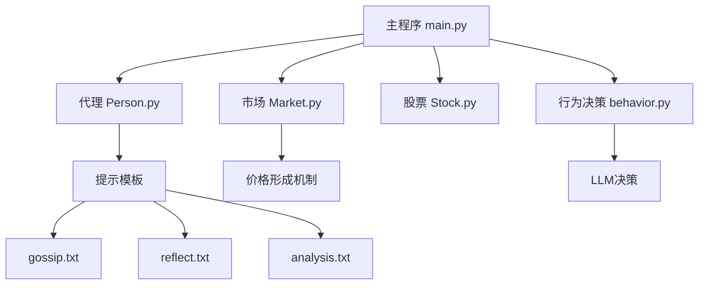

# 研究应用场景

<cite>
**本文档中引用的文件**  
- [Person.py](file://Agent-Trading-Arena/Stock_Main/Person.py)
- [Market.py](file://Agent-Trading-Arena/Stock_Main/Market.py)
- [gossip.txt](file://Agent-Trading-Arena/Stock_Main/content/our_prompt_template/gossip.txt)
- [behavior.py](file://Agent-Trading-Arena/Stock_Main/behavior.py)
- [main.py](file://Agent-Trading-Arena/Stock_Main/main.py)
- [our_run_gpt_prompt.py](file://Agent-Trading-Arena/Stock_Main/content/our_run_gpt_prompt.py)
</cite>

## 目录
1. [引言](#引言)
2. [系统架构与核心组件](#系统架构与核心组件)
3. [金融行为学研究应用](#金融行为学研究应用)
4. [信息传播动力学研究应用](#信息传播动力学研究应用)
5. [多智能体博弈研究应用](#多智能体博弈研究应用)
6. [市场冲击变量引入方法](#市场冲击变量引入方法)
7. [实验设计建议](#实验设计建议)
8. [变量控制与结果评估](#变量控制与结果评估)
9. [结论](#结论)

## 引言

Agent Trading Arena 是一个封闭循环、无需先验知识的类人交易环境，旨在评估和推进具备自博弈能力的金融智能体。该系统通过多智能体模拟股票市场，允许研究者在受控环境中探索金融行为学、信息传播动力学和多智能体博弈等复杂现象。本文档面向学术研究用户，详细说明如何利用该系统进行科学研究，包括修改代理交互逻辑以模拟信息级联效应、调整提示模板以研究谣言传播对市场波动的影响，以及引入外部经济指标作为市场冲击变量。

## 系统架构与核心组件

该系统由多个核心组件构成，包括代理（Person）、市场（Market）、股票（Stock）和经纪人（Broker）。这些组件通过数据库进行交互，形成一个完整的交易模拟环境。系统通过LLM（大语言模型）驱动代理的决策过程，使其能够根据市场信息、个人财务状况和社交信息（如谣言）做出交易决策。



**图示来源**  
- [main.py](file://Agent-Trading-Arena/Stock_Main/main.py#L1-L151)
- [Person.py](file://Agent-Trading-Arena/Stock_Main/Person.py#L1-L629)
- [Market.py](file://Agent-Trading-Arena/Stock_Main/Market.py#L1-L278)

## 金融行为学研究应用

在金融行为学领域，该系统可用于研究投资者心理、风险偏好和决策偏差。通过修改 `Person.py` 中的代理行为逻辑，可以模拟不同类型的投资者，如风险规避型、风险偏好型或从众型投资者。例如，可以通过调整代理的 `principle`（投资策略）和 `reflect_frequency`（反思频率）来研究不同投资策略对长期收益的影响。

代理的财务状况更新逻辑在 `Person.py` 的 `end_of_day` 方法中实现，该方法考虑了每日支出、股息收入和资本收益。研究者可以通过调整 `args.expense_ratio` 参数来研究消费行为对投资决策的影响。

**本节来源**  
- [Person.py](file://Agent-Trading-Arena/Stock_Main/Person.py#L364-L428)
- [main.py](file://Agent-Trading-Arena/Stock_Main/main.py#L17-L63)

## 信息传播动力学研究应用

该系统提供了研究信息传播动力学的强大框架，特别是通过 `gossip.txt` 提示模板来模拟谣言传播。每个代理在每日交易结束后可以生成一条谣言，该谣言将被其他代理接收并影响其交易决策。

### 修改代理交互逻辑以模拟信息级联效应

要模拟信息级联效应，可以修改 `Person.py` 中的 `add_gossip` 和 `query_gossip` 方法。`add_gossip` 方法负责将代理生成的谣言存储到数据库中，而 `query_gossip` 方法则负责从数据库中检索其他代理的谣言。

```python
def add_gossip(self, virtual_date, gossip):
    cmd = ("""insert into gossip values({},{},"{}")""").format(
        self.person_id, virtual_date, gossip
    )
    self.db.execute_sql(cmd)

def query_gossip(self, virtual_date):
    cmd = "select * from gossip where virtual_date ={} and person_id !={}".format(
        virtual_date, self.person_id
    )
    self.db.execute_sql(cmd)
    results = self.db.fetchall()
    results = parse_gossip(results)
    return results
```

通过调整 `generate_gossip` 函数中的 `gossip_num_max` 参数，可以控制每日传播的谣言数量，从而研究信息传播速度和范围对市场波动的影响。

### 调整gossip.txt提示模板以研究谣言传播

`gossip.txt` 提示模板定义了代理生成谣言的规则。通过修改该模板，可以研究不同类型谣言（真实或虚假）对市场的影响。

```
Variables:  
!<INPUT 0>! -- Input

<commentblockmarker>###</commentblockmarker>

Instructions:
- You are a player participating in a Simulated Stock Trading Challenge where the prices of stocks are determined mainly by the bids made by the participants in the challenge.
- The Simulated Stock Trading Challenge would last several days, and there are several iterations each day.
- You will be given some related information about you from the previous day to help you generate gossip. The information is in the next. 
- You overall objective is to make as much profit as possible.

!<INPUT 0>!

Task: 
- Based on (but is not limit to) the above information, you need to generate gossip only for the above mentioned stocks or the whole market, which will be received by other people and influence their stock operations.
- The gossip can be real or fake. If you want to make up fake gossip to mislead other people, it cannot be conflicted with the mentioned stock and market information.
```

研究者可以修改该模板，例如增加对谣言可信度的描述，或限制谣言只能基于特定类型的信息生成，从而研究不同类型的谣言对市场情绪和价格波动的影响。

**本节来源**  
- [Person.py](file://Agent-Trading-Arena/Stock_Main/Person.py#L615-L628)
- [behavior.py](file://Agent-Trading-Arena/Stock_Main/behavior.py#L200-L210)
- [gossip.txt](file://Agent-Trading-Arena/Stock_Main/content/our_prompt_template/gossip.txt)

## 多智能体博弈研究应用

该系统本质上是一个多智能体博弈环境，其中每个代理都试图通过交易最大化自身利润。代理之间的博弈体现在价格竞争、信息竞争和资源竞争等多个层面。

### 价格形成机制分析

`Market.py` 中的 `match_order` 方法实现了订单匹配机制，这是价格形成的核心。该方法根据买卖订单的价格和时间优先级进行匹配，从而决定成交价格。

```python
def match_order(self, today, args):
    for stock_iter in range(len(self.stocks)):
        buy_orders = self._fetch_orders("buy", stock_iter)
        sell_orders = self._fetch_orders("sell", stock_iter)
        # start to match order
        cur_stock_price = self.stocks[stock_iter].current_price
        total_quantity = self.stocks[stock_iter].quantity
        trade_quantity = 0
        current_buy = buy_orders.pop() if buy_orders else None
        current_sell = sell_orders.pop() if sell_orders else None
        residual_order = None

        # initialize each stock of the day
        self.stocks[stock_iter].update_trade_data(today, cur_stock_price, 0)

        while current_buy is not None and current_sell is not None:
            deal_price = (current_buy["price"] + current_sell["price"]) / 2
            if (
                abs(deal_price - cur_stock_price) / cur_stock_price
            ) > args.Daily_Price_Limit:
                break

            # update the prices of stocks
            trade_quantity = min(
                [current_buy["quantity"], current_sell["quantity"]]
            )
           
            self.stocks[stock_iter].current_price = (
                deal_price * trade_quantity * args.Fluctuation_Constant
                + cur_stock_price * total_quantity
            ) / (trade_quantity * args.Fluctuation_Constant + total_quantity)
            cur_stock_price = self.stocks[stock_iter].current_price
            self.stocks[stock_iter].update_trade_data(
                today, cur_stock_price, trade_quantity
            )
            deal_price = cur_stock_price
```

该机制允许研究者研究不同市场参数（如 `Daily_Price_Limit` 和 `Fluctuation_Constant`）对价格稳定性和市场效率的影响。

**本节来源**  
- [Market.py](file://Agent-Trading-Arena/Stock_Main/Market.py#L96-L198)
- [main.py](file://Agent-Trading-Arena/Stock_Main/main.py#L31-L33)

## 市场冲击变量引入方法

要研究外部经济指标（如利率、通胀数据）对市场的影响，可以通过修改 `main.py` 中的参数或扩展 `Market.py` 的功能来实现。

### 引入外部经济指标作为市场冲击变量

一种方法是在每日交易开始前，向所有代理广播一个包含外部经济指标的市场公告。这可以通过修改 `overall_test` 函数来实现：

```python
def overall_test(args):
    (
        current_date,
        current_iteration,
        broker,
        market_index,
        market,
        stocks,
        persons,
    ) = init_all(args, load=False)

    # 定义外部经济指标序列
    interest_rates = [0.02, 0.025, 0.03, 0.028, 0.022]  # 利率
    inflation_rates = [0.015, 0.018, 0.021, 0.023, 0.020]  # 通胀率

    for virtual_date in range(args.No_Days):
        if virtual_date == 0:
            broker.ipo(virtual_date)

        # 广播外部经济指标
        if virtual_date < len(interest_rates):
            market_index.broadcast_economic_indicator(
                interest_rates[virtual_date], 
                inflation_rates[virtual_date]
            )

        market_index.update_market_index(virtual_date)
        generate_gossip(virtual_date, persons, stocks, args)
```

然后在 `Market_index` 类中添加 `broadcast_economic_indicator` 方法，将这些指标整合到市场信息中，并通过 `analysis` 函数传递给代理。

**本节来源**  
- [main.py](file://Agent-Trading-Arena/Stock_Main/main.py#L99-L147)
- [Market.py](file://Agent-Trading-Arena/Stock_Main/Market.py#L212-L295)

## 实验设计建议

为了开展可重复的科学研究，建议采用以下实验设计：

1. **控制变量法**：每次实验只改变一个变量（如谣言数量、价格限制或外部经济指标），以隔离其对市场行为的影响。
2. **多次重复实验**：由于LLM的输出具有随机性，建议对同一实验设置进行多次重复，以获得统计上显著的结果。
3. **基线对比**：设置一个无谣言传播或无外部冲击的基线场景，与其他实验场景进行对比。
4. **参数敏感性分析**：系统地改变关键参数（如 `Fluctuation_Constant`、`Daily_Price_Limit`）并观察其对市场稳定性和效率的影响。

## 变量控制与结果评估

### 变量控制方法

- **独立变量**：谣言传播强度、外部经济指标值、市场参数（价格限制、波动常数）。
- **因变量**：市场波动率、交易量、价格发现效率、代理收益分布。
- **控制变量**：代理数量、股票数量、初始资金、交易天数。

### 结果评估指标

| 指标 | 描述 | 计算方法 |
|------|------|---------|
| 市场波动率 | 市场价格的波动程度 | 市场指数日收益率的标准差 |
| 信息效率 | 价格反映信息的速度 | 价格对谣言或外部冲击的响应时间 |
| 交易活跃度 | 市场交易的频繁程度 | 日均交易量 |
| 收益集中度 | 收益在代理间的分布 | 收益的基尼系数或标准差 |
| 策略多样性 | 代理投资策略的差异 | 不同投资策略的熵值 |

这些指标可以从系统生成的数据库文件（如 `data.db`）中提取，并通过统计分析软件进行处理。

**本节来源**  
- [database_utils.py](file://Agent-Trading-Arena/Stock_Main/database_utils.py)
- [main.py](file://Agent-Trading-Arena/Stock_Main/main.py#L17-L63)

## 结论

Agent Trading Arena 为研究金融行为学、信息传播动力学和多智能体博弈提供了高度可配置的实验平台。通过修改 `Person.py` 中的代理交互逻辑和 `gossip.txt` 提示模板，研究者可以模拟复杂的信息传播过程和市场行为。结合 `Market.py` 的价格形成机制，该系统能够真实地再现金融市场中的动态过程。通过引入外部经济指标作为市场冲击变量，可以进一步研究宏观经济因素对微观市场行为的影响。建议研究者采用严格的实验设计和统计方法，以确保研究结果的科学性和可重复性。