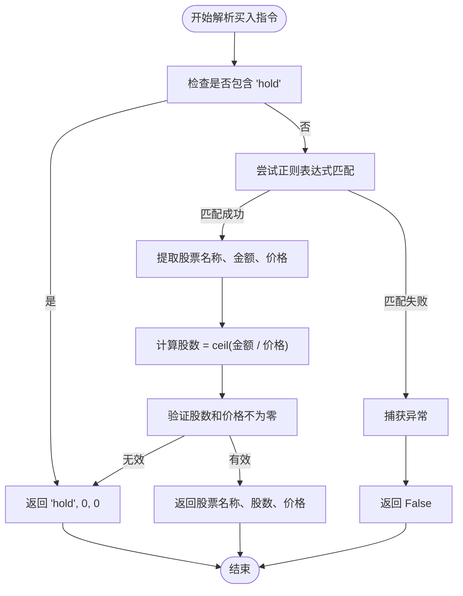
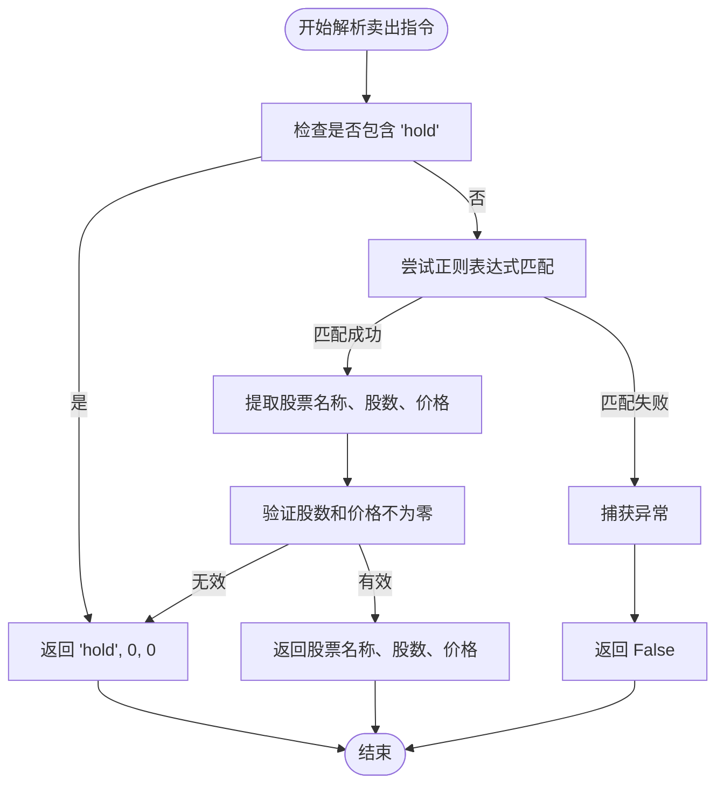
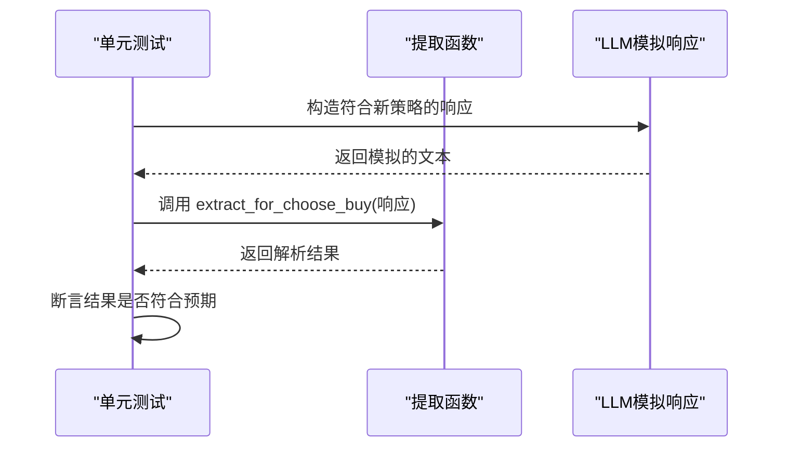
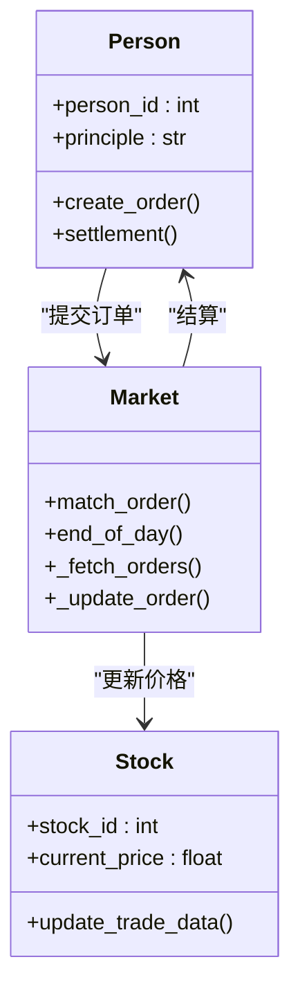

# 策略扩展

<cite>
**本文档中引用的文件**  
- [behavior.py](file://Agent-Trading-Arena/Stock_Main/behavior.py)
- [test_behavior.py](file://Agent-Trading-Arena/Stock_Main/unit_test/test_behavior.py)
- [Person.py](file://Agent-Trading-Arena/Stock_Main/Person.py)
- [Market.py](file://Agent-Trading-Arena/Stock_Main/Market.py)
- [Stock.py](file://Agent-Trading-Arena/Stock_Main/Stock.py)
- [our_run_gpt_prompt.py](file://Agent-Trading-Arena/Stock_Main/content/our_run_gpt_prompt.py)
- [reflect.txt](file://Agent-Trading-Arena/Stock_Main/content/our_prompt_template/reflect.txt)
- [pre_reflect.txt](file://Agent-Trading-Arena/Stock_Main/content/our_prompt_template/pre_reflect.txt)
- [buy_based_on_analysis.txt](file://Agent-Trading-Arena/Stock_Main/content/our_prompt_template/buy_based_on_analysis.txt)
- [sell_based_on_analysis.txt](file://Agent-Trading-Arena/Stock_Main/content/our_prompt_template/sell_based_on_analysis.txt)
- [analysis.txt](file://Agent-Trading-Arena/Stock_Main/content/our_prompt_template/analysis.txt)
- [database_utils.py](file://Agent-Trading-Arena/Stock_Main/database_utils.py)
- [load_json.py](file://Agent-Trading-Arena/Stock_Main/load_json.py)
- [constant.py](file://Agent-Trading-Arena/Stock_Main/constant.py)
</cite>

## 目录
1. [引言](#引言)
2. [核心行为提取机制](#核心行为提取机制)
3. [策略扩展接口与规范](#策略扩展接口与规范)
4. [新增策略模式实现示例](#新增策略模式实现示例)
5. [策略验证与单元测试](#策略验证与单元测试)
6. [提示模板引导机制](#提示模板引导机制)
7. [系统集成与兼容性](#系统集成与兼容性)
8. [调试与异常处理](#调试与异常处理)
9. [总结](#总结)

## 引言

本项目是一个模拟股票交易挑战系统，其中股票价格主要由参与者出价决定。系统通过大语言模型（LLM）驱动的智能体（Person）进行交易决策，这些决策基于市场信息、财务状况、投资策略和历史表现。核心机制包括市场操作（买入/卖出）、策略反思与更新、市场分析和信息传播（八卦）。

本文档深入探讨如何基于`behavior.py`文件扩展自定义交易策略。我们将详细分析现有行为提取函数的实现机制，提供新增策略模式（如动量交易、均值回归、套利策略）的代码示例，并结合单元测试`test_behavior.py`展示如何验证新策略的解析正确性。此外，文档将解释如何通过修改提示模板（如`reflect.txt`、`pre_reflect.txt`）引导LLM生成符合特定策略逻辑的决策输出。

**本节不分析具体源文件，因此不提供来源**

## 核心行为提取机制

系统通过正则表达式从LLM生成的文本响应中提取结构化交易指令。这一过程在`behavior.py`中定义，是连接LLM非结构化输出与系统结构化操作的关键桥梁。

### 买入操作提取

`extract_for_choose_buy`函数负责解析LLM生成的买入决策。其工作机制如下：
1.  **持有判断**：首先检查响应中是否包含"hold"或"Hold"，若是则返回持有状态。
2.  **正则匹配**：使用正则表达式匹配标准的买入指令格式，该格式包含操作类型、股票名称、投资金额和最佳买入价格。
3.  **数据提取与计算**：从匹配结果中提取股票名称、投资金额和价格。投资金额除以价格得到应购买的股数（向上取整）。
4.  **异常处理**：任何解析过程中的异常都会被捕获，并返回`False`表示解析失败。



**Diagram sources**
- [behavior.py](file://Agent-Trading-Arena/Stock_Main/behavior.py#L15-L34)

### 卖出操作提取

`extract_for_choose_sell`函数的逻辑与买入提取类似，但其匹配的指令格式不同，包含要卖出的股票名称、股数和最佳卖出价格。其核心流程是：
1.  同样首先判断是否为持有操作。
2.  使用针对卖出指令的正则表达式进行匹配。
3.  提取股票名称、股数和价格，并进行有效性验证。
4.  在发生异常时返回`False`。



**Diagram sources**
- [behavior.py](file://Agent-Trading-Arena/Stock_Main/behavior.py#L37-L55)

### 策略反思与更新提取

系统还支持策略的自我反思和更新，这通过另外两个提取函数实现：
-   `extract_analysis_for_reflect`：从LLM对当前策略的弱点和优势分析中提取信息。
-   `extract_strategy`：从LLM建议的“新投资策略”中提取文本内容。

这两个函数共同支持了`reflection`函数，该函数允许智能体根据历史表现调整其核心投资原则（`principle`）。

**Section sources**
- [behavior.py](file://Agent-Trading-Arena/Stock_Main/behavior.py#L58-L79)
- [our_run_gpt_prompt.py](file://Agent-Trading-Arena/Stock_Main/content/our_run_gpt_prompt.py#L151-L362)

## 策略扩展接口与规范

为了成功扩展自定义交易策略，开发者必须理解并遵守系统定义的接口和返回值规范。

### 接口定义

自定义策略的核心是修改智能体（`Person`）的`principle`属性。该属性是一个字符串，代表了智能体的宏观投资指导方针。这个字符串通过`update_strategy`函数被LLM生成，并通过`extract_strategy`函数被提取。

策略的执行是间接的：`principle`作为输入传递给`run_gpt_prompt_choose_buy_stock`和`run_gpt_prompt_choose_sell_stock`等函数，这些函数生成的提示（prompt）会引导LLM在做出买入/卖出决策时遵循该策略。

### 返回值规范

所有行为提取函数都必须遵循严格的返回值规范：
-   **成功解析**：返回一个包含三个元素的元组 `(operation, quantity, price)`。
    -   `operation`: 字符串，可以是股票名称（如"A"）或特殊值"hold"。
    -   `quantity`: 整数，表示股数。
    -   `price`: 浮点数，表示每股价格。
-   **持有操作**：当决定不进行交易时，返回 `("hold", 0, 0)`。
-   **解析失败**：当响应格式无效或无法解析时，返回 `False`。

### 异常处理方式

系统采用“失败静默”（fail-silent）的异常处理策略。在`extract_for_choose_buy`和`extract_for_choose_sell`函数中，任何`Exception`都会被捕获，函数返回`False`。调用者（如`stock_ops`函数）需要检查这个返回值，并采取相应的默认行为（通常是视为持有操作）。

**Section sources**
- [behavior.py](file://Agent-Trading-Arena/Stock_Main/behavior.py#L15-L55)
- [our_run_gpt_prompt.py](file://Agent-Trading-Arena/Stock_Main/content/our_run_gpt_prompt.py#L486-L618)

## 新增策略模式实现示例

本节提供三种常见交易策略的实现示例，重点在于如何通过修改`principle`来引导LLM。

### 动量交易策略

动量策略假设“强者恒强”，即近期表现良好的股票将继续上涨。

```python
# 示例：设置动量交易策略
person.principle = "Focus on stocks with strong upward momentum in the last 3 days. Buy stocks that have shown consistent price increases and sell those showing signs of reversal."
```

该策略会引导LLM在分析阶段关注近期价格持续上涨的股票，并在决策时倾向于买入这些股票。

### 均值回归策略

均值回归策略认为价格会围绕其长期均值波动，当价格偏离均值过远时，有回归的趋势。

```python
# 示例：设置均值回归策略
person.principle = "Invest based on mean reversion. Identify stocks whose current price is significantly below their 5-day moving average as potential buys, and those significantly above as potential sells."
```

此策略会促使LLM寻找价格低于其历史平均水平的股票作为买入机会。

### 套利策略

套利策略利用不同资产之间的价格差异来获利。在此模拟环境中，可以设计为在相关股票之间进行配对交易。

```python
# 示例：设置简单的配对交易策略
person.principle = "Execute pairs trading. Monitor stocks A and B which historically move together. When the price ratio of A/B deviates significantly from its historical norm, short the outperforming stock and go long on the underperforming one to profit from the convergence."
```

该策略引导LLM关注特定股票对的价格比率，并在比率偏离时进行反向操作。

**Section sources**
- [behavior.py](file://Agent-Trading-Arena/Stock_Main/behavior.py#L183-L185)
- [our_run_gpt_prompt.py](file://Agent-Trading-Arena/Stock_Main/content/our_run_gpt_prompt.py#L151-L212)

## 策略验证与单元测试

系统的健壮性依赖于完善的单元测试。`test_behavior.py`文件提供了对所有核心提取函数的测试用例，是验证新策略解析正确性的最佳实践。

### 测试用例分析

`test_behavior.py`中的测试用例遵循典型的单元测试模式：

1.  **有效输入测试**：`test_extract_for_choose_buy_valid`和`test_extract_for_choose_sell_valid`使用符合规范的字符串，验证函数能正确提取数据。
2.  **持有操作测试**：`test_extract_for_choose_buy_hold`和`test_extract_for_choose_sell_hold`测试了"hold"指令的解析。
3.  **无效输入测试**：`test_extract_for_choose_buy_invalid`等测试用例使用格式错误的字符串，验证函数能正确返回`False`。

### 验证新策略

要验证一个新策略，开发者应：
1.  模拟LLM生成一个符合新策略逻辑的响应。
2.  将该响应输入到相应的提取函数中。
3.  使用`unittest`框架断言函数的返回值是否符合预期。

例如，如果新策略要求LLM输出包含特定关键词，可以编写一个测试来验证`extract_for_choose_buy`能否正确处理这种新格式。



**Diagram sources**
- [test_behavior.py](file://Agent-Trading-Arena/Stock_Main/unit_test/test_behavior.py#L20-L103)

**Section sources**
- [test_behavior.py](file://Agent-Trading-Arena/Stock_Main/unit_test/test_behavior.py#L17-L107)
- [behavior.py](file://Agent-Trading-Arena/Stock_Main/behavior.py#L15-L55)

## 提示模板引导机制

提示模板是引导LLM生成符合特定策略逻辑输出的核心工具。通过修改`our_prompt_template`目录下的`.txt`文件，可以精确控制LLM的思考过程和输出格式。

### 买入决策提示模板

`buy_based_on_analysis.txt`模板定义了LLM在决定买入时的思考框架。它提供了以下关键信息：
-   **财务状况**：当前现金和最低生活开销。
-   **市场信息**：所有可用股票的基本信息（价格、股息等）。
-   **额外信息**：来自其他智能体的八卦和市场分析。
-   **投资策略**：智能体当前的`principle`。

模板的“任务”部分明确要求LLM基于这些信息决定买入哪只股票、数量和价格，或选择持有。

### 反思与策略更新模板

策略的动态更新依赖于两个关键模板：
-   `pre_reflect.txt`：引导LLM评估当前策略的弱点和优势。
-   `reflect.txt`：引导LLM基于反思结果，生成一个新的、更具体的“新投资策略”。

通过修改`reflect.txt`中的“任务”描述，可以强制LLM生成更符合特定模式（如动量、均值回归）的策略。例如，可以将任务修改为：“新投资策略必须明确指出是基于动量突破、均值回归还是其他技术指标。”

**Section sources**
- [our_run_gpt_prompt.py](file://Agent-Trading-Arena/Stock_Main/content/our_run_gpt_prompt.py#L486-L549)
- [buy_based_on_analysis.txt](file://Agent-Trading-Arena/Stock_Main/content/our_prompt_template/buy_based_on_analysis.txt)
- [reflect.txt](file://Agent-Trading-Arena/Stock_Main/content/our_prompt_template/reflect.txt)
- [pre_reflect.txt](file://Agent-Trading-Arena/Stock_Main/content/our_prompt_template/pre_reflect.txt)

## 系统集成与兼容性

扩展的策略必须与系统的其他核心模块无缝集成，确保数据流和控制流的正确性。

### 与Market模块的交互

`Market`模块负责撮合买卖订单。`Person`模块生成的买入/卖出指令最终会通过`create_order`函数提交给市场。`Market`模块的`match_order`函数会根据价格优先、时间优先的原则进行撮合。



**Diagram sources**
- [Person.py](file://Agent-Trading-Arena/Stock_Main/Person.py#L212-L249)
- [Market.py](file://Agent-Trading-Arena/Stock_Main/Market.py#L96-L199)
- [Stock.py](file://Agent-Trading-Arena/Stock_Main/Stock.py#L67-L112)

### 与Person模块的交互

`Person`类是策略的载体。其`principle`属性存储了当前策略，而`query_prompt`、`query_memory`等方法为LLM提供了生成决策所需的历史和当前状态信息。扩展策略时，必须确保新策略不会破坏`Person`的状态管理逻辑。

**Section sources**
- [Person.py](file://Agent-Trading-Arena/Stock_Main/Person.py#L143-L629)
- [Market.py](file://Agent-Trading-Arena/Stock_Main/Market.py#L12-L278)

## 调试与异常处理

### 调试建议

1.  **启用调试日志**：`our_run_gpt_prompt.py`中的函数（如`run_gpt_prompt_choose_buy_stock`）会将生成的提示和LLM的响应保存到`debug_prompts`目录。这是调试策略逻辑的首要工具。
2.  **检查数据库**：使用SQLite浏览器查看`data.db`中的`memory`、`active_orders`和`person`表，可以验证指令是否被正确记录和执行。
3.  **单元测试驱动**：在实现新策略前，先编写对应的单元测试，确保提取函数的解析逻辑是正确的。

### 异常处理最佳实践

-   **输入验证**：在调用提取函数前，检查LLM的响应是否为`None`或空字符串。
-   **优雅降级**：当提取函数返回`False`时，系统应默认执行“持有”操作，而不是中断整个交易流程。
-   **日志记录**：在捕获异常时，记录详细的错误信息和原始响应，便于后续分析。

**Section sources**
- [our_run_gpt_prompt.py](file://Agent-Trading-Arena/Stock_Main/content/our_run_gpt_prompt.py#L182-L210)
- [behavior.py](file://Agent-Trading-Arena/Stock_Main/behavior.py#L33-L34)

## 总结

本文档详细阐述了如何在Agent Trading Arena系统中扩展自定义交易策略。核心在于理解`behavior.py`中的行为提取机制，它通过正则表达式将LLM的非结构化输出转化为系统可执行的指令。通过修改`Person`的`principle`属性，并利用`our_prompt_template`中的模板文件，可以有效地引导LLM生成符合动量交易、均值回归或套利等复杂策略的决策。

成功的策略扩展需要遵循严格的接口和返回值规范，并通过`test_behavior.py`中的单元测试进行验证。同时，必须确保新策略与`Market`和`Person`等核心模块的兼容性。利用系统内置的调试功能（如保存提示和响应）是开发和优化策略的关键。通过遵循本文档的指导，开发者可以创建出强大且稳健的自定义交易智能体。

**本节不分析具体源文件，因此不提供来源**