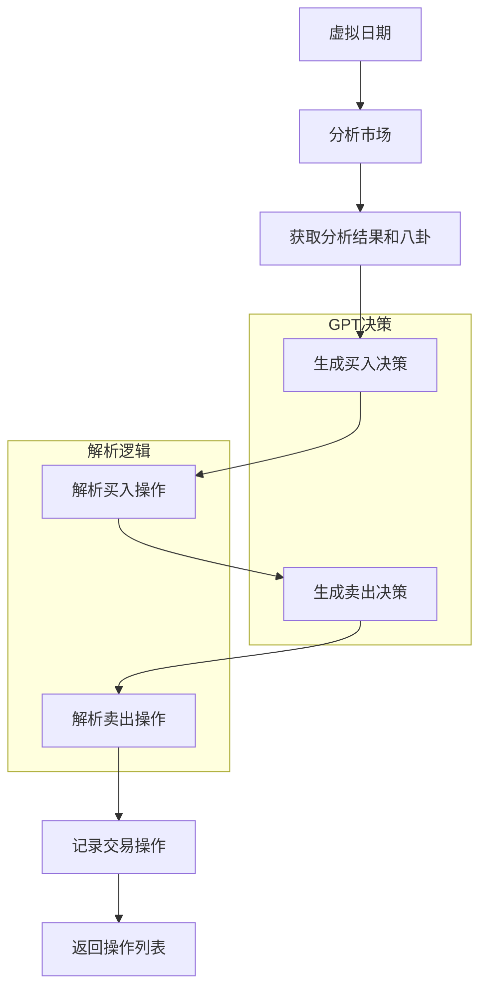
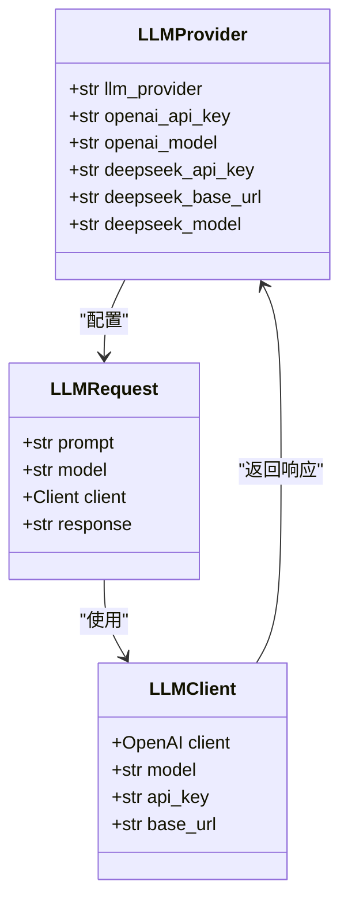
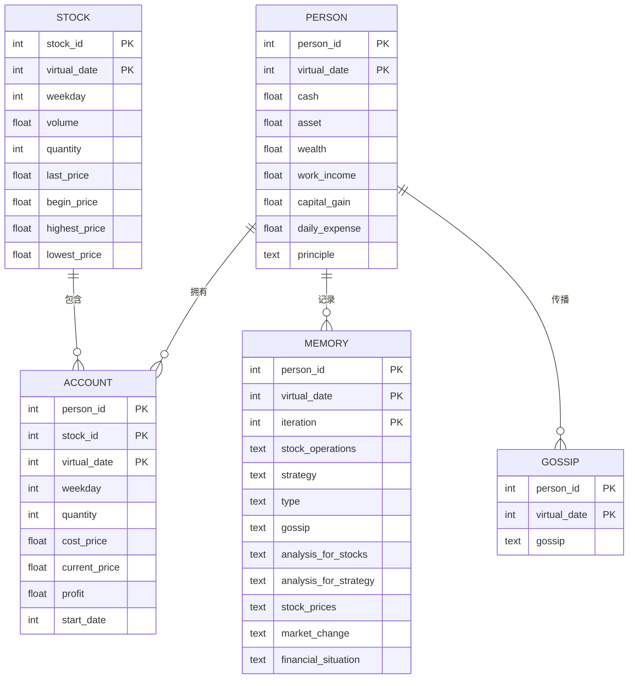
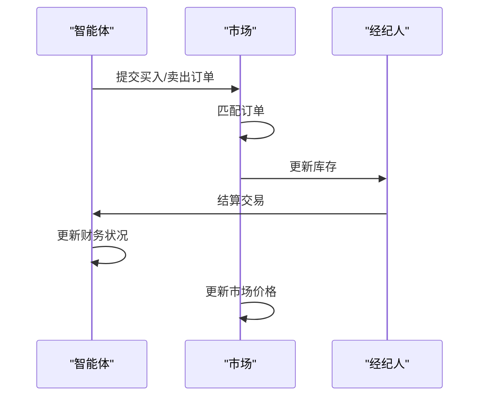
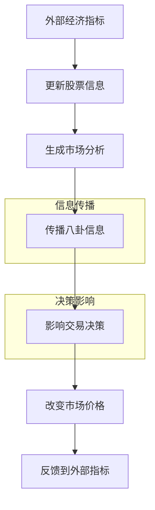
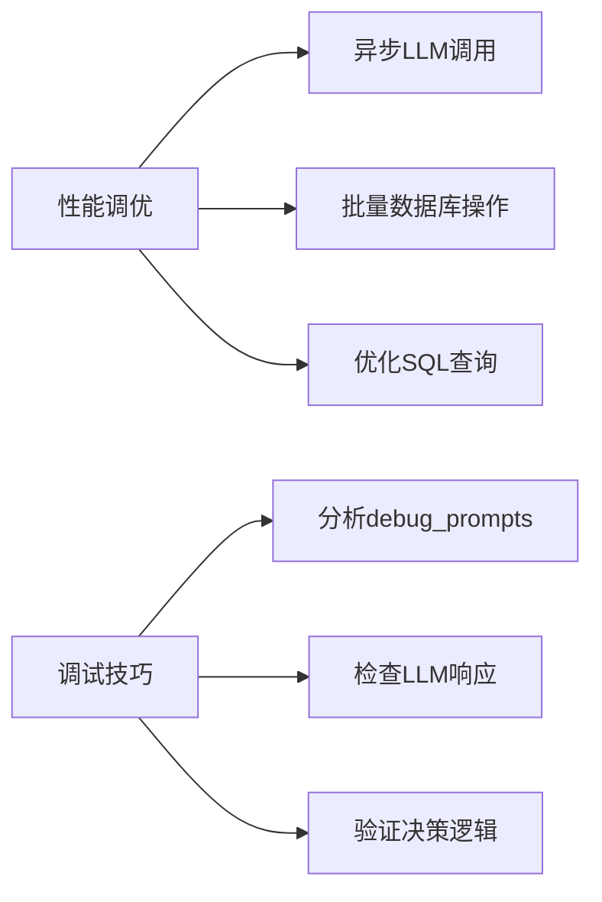
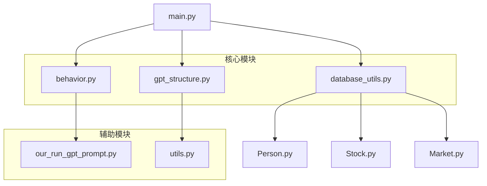

# 高级主题与扩展

<cite>
**本文档中引用的文件**   
- [behavior.py](file://Agent-Trading-Arena/Stock_Main/behavior.py)
- [gpt_structure.py](file://Agent-Trading-Arena/Stock_Main/content/gpt_structure.py)
- [database_utils.py](file://Agent-Trading-Arena/Stock_Main/database_utils.py)
- [our_run_gpt_prompt.py](file://Agent-Trading-Arena/Stock_Main/content/our_run_gpt_prompt.py)
- [Person.py](file://Agent-Trading-Arena/Stock_Main/Person.py)
- [Stock.py](file://Agent-Trading-Arena/Stock_Main/Stock.py)
- [Market.py](file://Agent-Trading-Arena/Stock_Main/Market.py)
- [main.py](file://Agent-Trading-Arena/Stock_Main/main.py)
- [utils.py](file://Agent-Trading-Arena/Stock_Main/content/utils.py)
- [our_prompt_template/analysis.txt](file://Agent-Trading-Arena/Stock_Main/content/our_prompt_template/analysis.txt)
- [our_prompt_template/buy_based_on_analysis.txt](file://Agent-Trading-Arena/Stock_Main/content/our_prompt_template/buy_based_on_analysis.txt)
- [our_prompt_template/sell_based_on_analysis.txt](file://Agent-Trading-Arena/Stock_Main/content/our_prompt_template/sell_based_on_analysis.txt)
- [our_prompt_template/reflect.txt](file://Agent-Trading-Arena/Stock_Main/content/our_prompt_template/reflect.txt)
- [our_prompt_template/pre_reflect.txt](file://Agent-Trading-Arena/Stock_Main/content/our_prompt_template/pre_reflect.txt)
- [our_prompt_template/pre_long_reflection.txt](file://Agent-Trading-Arena/Stock_Main/content/our_prompt_template/pre_long_reflection.txt)
- [debug_prompts](file://Agent-Trading-Arena/Stock_Main/save/sim_test01/debug_prompts/)
</cite>

## 目录
1. [引言](#引言)
2. [交易策略扩展](#交易策略扩展)
3. [多LLM供应商支持](#多llm供应商支持)
4. [大规模模拟数据性能优化](#大规模模拟数据性能优化)
5. [多智能体交互与博弈论](#多智能体交互与博弈论)
6. [信息级联效应与外部经济指标](#信息级联效应与外部经济指标)
7. [性能调优与调试技巧](#性能调优与调试技巧)
8. [可扩展性设计原则](#可扩展性设计原则)

## 引言
本高级主题与扩展文档面向希望深度定制或研究系统行为的高级用户。文档深入探讨了如何扩展系统的核心组件以实现更复杂的交易策略、支持多LLM供应商、优化大规模模拟的数据性能，并从博弈论视角分析多智能体交互。通过分析`behavior.py`、`gpt_structure.py`和`database_utils.py`等核心文件，本文档提供了实现动量策略、均值回归策略、多LLM切换、异步调用等高级功能的详细指导，以及利用`debug_prompts`目录进行决策过程分析的调试技巧。

## 交易策略扩展

本节探讨如何通过扩展`behavior.py`文件来实现新的交易策略模式，如动量策略和均值回归策略。`behavior.py`文件中的`stock_ops`函数是交易决策的核心，它通过调用GPT模型生成买入和卖出操作。通过修改或扩展该文件中的正则表达式解析逻辑和决策流程，可以实现更复杂的交易策略。

**图表来源**
- [behavior.py](file://Agent-Trading-Arena/Stock_Main/behavior.py#L82-L171)

**本节来源**
- [behavior.py](file://Agent-Trading-Arena/Stock_Main/behavior.py#L1-L171)
- [our_run_gpt_prompt.py](file://Agent-Trading-Arena/Stock_Main/content/our_run_gpt_prompt.py#L486-L619)

## 多LLM供应商支持

本节探讨如何通过增强`gpt_structure.py`文件来支持多LLM供应商切换，如Anthropic或本地部署模型。`gpt_structure.py`文件中的`llm_provider`变量和条件语句是实现多供应商支持的关键。通过在`utils.py`中配置不同的环境变量，并在`gpt_structure.py`中添加相应的API调用逻辑，可以轻松实现LLM供应商的切换。

**图表来源**
- [gpt_structure.py](file://Agent-Trading-Arena/Stock_Main/content/gpt_structure.py#L13-L91)
- [utils.py](file://Agent-Trading-Arena/Stock_Main/content/utils.py#L1-L31)

**本节来源**
- [gpt_structure.py](file://Agent-Trading-Arena/Stock_Main/content/gpt_structure.py#L1-L91)
- [utils.py](file://Agent-Trading-Arena/Stock_Main/content/utils.py#L1-L31)

## 大规模模拟数据性能优化

本节探讨如何通过优化`database_utils.py`文件来支持大规模模拟的数据性能。`database_utils.py`文件中的`Database_operate`类负责所有数据库操作，包括创建表、执行SQL命令和获取结果。通过优化SQL查询、使用索引和批量操作，可以显著提高大规模模拟的数据性能。

**图表来源**
- [database_utils.py](file://Agent-Trading-Arena/Stock_Main/database_utils.py#L245-L322)

**本节来源**
- [database_utils.py](file://Agent-Trading-Arena/Stock_Main/database_utils.py#L1-L322)
- [main.py](file://Agent-Trading-Arena/Stock_Main/main.py#L78-L85)

## 多智能体交互与博弈论

本节从博弈论视角探讨多智能体交互。系统中的每个`Person`实例都是一个智能体，它们通过`Market`类进行交互。`Market`类中的`match_order`方法实现了订单匹配算法，该算法决定了交易的价格和数量。通过分析`Market.py`和`Person.py`文件，可以理解智能体之间的博弈关系。

**图表来源**
- [Market.py](file://Agent-Trading-Arena/Stock_Main/Market.py#L96-L193)
- [Person.py](file://Agent-Trading-Arena/Stock_Main/Person.py#L212-L249)

**本节来源**
- [Market.py](file://Agent-Trading-Arena/Stock_Main/Market.py#L1-L193)
- [Person.py](file://Agent-Trading-Arena/Stock_Main/Person.py#L143-L249)

## 信息级联效应与外部经济指标

本节探讨信息级联效应的建模改进和引入外部经济指标的可能性。`our_run_gpt_prompt.py`文件中的`integrate_gossip`和`integrate_gossip_info`函数负责处理八卦信息，这些信息在智能体之间传播，形成信息级联。通过修改这些函数，可以引入更复杂的传播模型。此外，通过扩展`Stock.py`文件，可以引入外部经济指标，如GDP、CPI等。

**图表来源**
- [our_run_gpt_prompt.py](file://Agent-Trading-Arena/Stock_Main/content/our_run_gpt_prompt.py#L9-L19)
- [Stock.py](file://Agent-Trading-Arena/Stock_Main/Stock.py#L14-L25)

**本节来源**
- [our_run_gpt_prompt.py](file://Agent-Trading-Arena/Stock_Main/content/our_run_gpt_prompt.py#L9-L52)
- [Stock.py](file://Agent-Trading-Arena/Stock_Main/Stock.py#L14-L38)

## 性能调优与调试技巧

本节提供性能调优建议和调试技巧。性能调优方面，建议使用异步LLM调用以减少等待时间。调试技巧方面，可以利用`debug_prompts`目录分析决策过程。`our_run_gpt_prompt.py`文件中的`save_path`参数控制调试信息的保存位置。

**图表来源**
- [our_run_gpt_prompt.py](file://Agent-Trading-Arena/Stock_Main/content/our_run_gpt_prompt.py#L182-L186)
- [gpt_structure.py](file://Agent-Trading-Arena/Stock_Main/content/gpt_structure.py#L25-L41)

**本节来源**
- [our_run_gpt_prompt.py](file://Agent-Trading-Arena/Stock_Main/content/our_run_gpt_prompt.py#L182-L186)
- [gpt_structure.py](file://Agent-Trading-Arena/Stock_Main/content/gpt_structure.py#L25-L41)

## 可扩展性设计原则

本节讨论系统的可扩展性设计原则。系统采用模块化设计，各组件职责分明。`main.py`文件作为入口点，协调各个模块的运行。通过遵循单一职责原则和依赖注入，系统具有良好的可扩展性。例如，可以通过继承`Person`类来创建新的智能体类型，或通过扩展`Stock`类来支持新的金融产品。

**图表来源**
- [main.py](file://Agent-Trading-Arena/Stock_Main/main.py#L1-L151)
- [behavior.py](file://Agent-Trading-Arena/Stock_Main/behavior.py#L1-L210)

**本节来源**
- [main.py](file://Agent-Trading-Arena/Stock_Main/main.py#L1-L151)
- [behavior.py](file://Agent-Trading-Arena/Stock_Main/behavior.py#L1-L210)